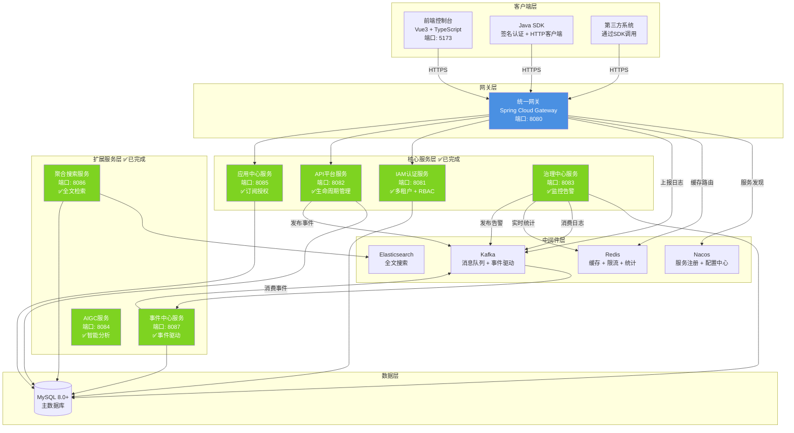
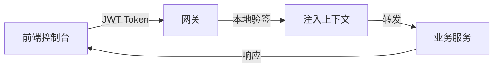
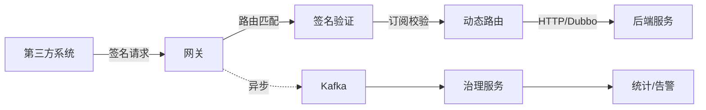
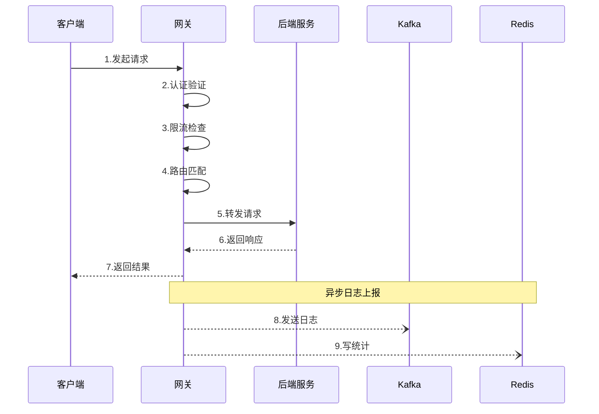
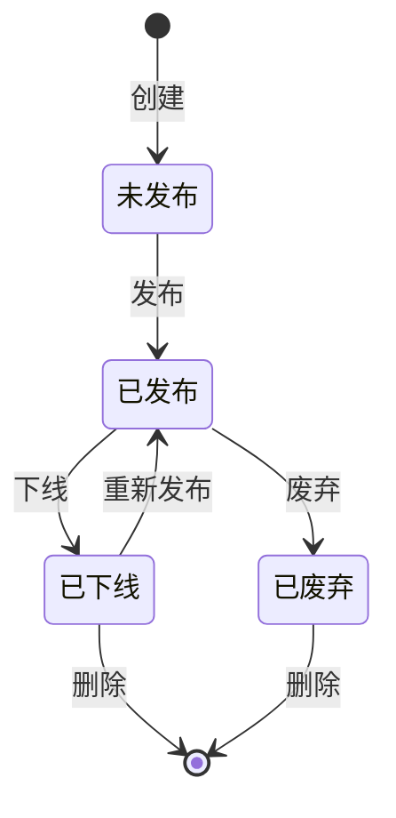
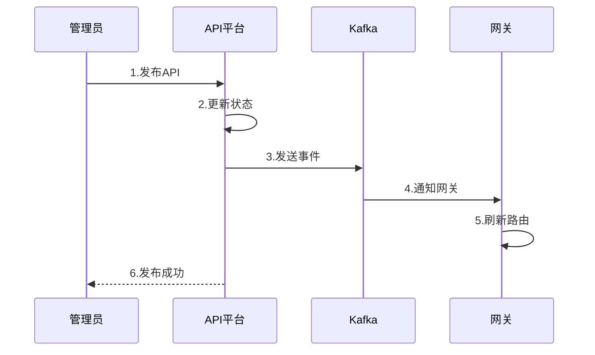
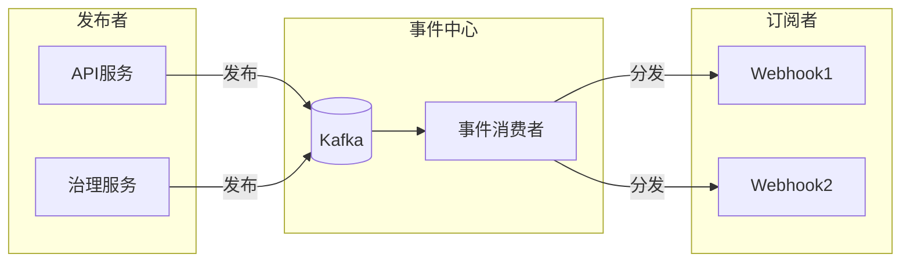

<div align="center">

# 🚀 IntelliHub

**企业级 API 开放平台 - 统一入口 · 统一安全 · 统一治理**

[](LICENSE)
[](https://spring.io/projects/spring-boot)
[](https://vuejs.org/)
[](https://github.com/yourusername/intelli_hub/pulls)

[简体中文](README.md) | [English](README_EN.md) | [系统架构图](系统架构图.drawio)

</div>

---

## 📖 项目简介

IntelliHub 是一个面向企业与开发者的**智能 API 开放平台**，旨在以 **统一入口、统一安全、统一治理** 的方式对外开放企业内部微服务能力。


### 🎯 核心价值

**解决的问题**
- ✅ 各系统烟囱式建设，API 管理混乱
- ✅ 第三方接入困难，每次都要单独开发
- ✅ 安全性参差不齐，缺乏统一鉴权
- ✅ 调用情况不清楚，问题难以排查

**提供的能力**
- 🎯 完整的 API 生命周期管理
- 🎯 多租户体系与权限控制
- 🎯 智能治理与实时监控
- 🎯 开箱即用的 SDK 支持

### ✨ 核心特性

| 特性 | 说明 |
|------|------|
| 🌐 **统一网关治理** | JWT/AppKey 双认证 · 滑动窗口限流 · 动态路由 · IP白名单 · 配额管理 |
| 🔐 **IAM 多租户** | 租户隔离 · RBAC 权限 · 用户/角色管理 |
| 📊 **生命周期管理** | API 创建/发布/下线 · 版本管理 · 文档自动生成 |
| 🔑 **应用中心** | AppKey/Secret 管理 · API 订阅授权 · 配额控制 · 回调通知 |
| 📈 **智能治理** | 调用统计 · 实时告警 · 性能分析 · 日志追踪 |
| 🎯 **多协议支持** | HTTP 转发 · Dubbo 泛化调用 · Mock 响应 |
| 🔒 **企业级安全** | 签名验证 · 防重放攻击 · 租户级隔离 · IP白名单 |
| 📱 **现代化前端** | Vue3 · TypeScript · Element Plus · 响应式设计 |

### 🏢 适用场景

- **企业内部**：微服务能力统一对外开放
- **开放平台**：API 集市与生态建设
- **SaaS 服务**：多租户 API 管理与治理
- **内部治理**：统一 API 管理与监控

> 📚 **了解更多**：[项目架构文档](docs/10-架构设计-项目架构文档.md) · [系统架构图](系统架构图.drawio)

---

## 🏗️ 系统架构

### 架构总览




### 📦 模块架构

#### 核心服务（✅ 已完成）

| 模块 | 端口 | 状态 | 核心能力 |
|------|:----:|:----:|----------|
| **intelli-gateway-service** | 8080 | ✅ | 🌐 统一网关：双认证机制、滑动窗口限流、动态路由、IP白名单、配额管理、异步日志上报 |
| **intelli-auth-iam-service** | 8081 | ✅ | 🔐 身份认证：多租户隔离、JWT本地验签、RBAC权限体系 |
| **intelli-api-platform-service** | 8082 | ✅ | 📊 API平台：完整生命周期、版本管理、事件驱动下发、公告与配置管理 |
| **intelli-app-center-service** | 8085 | ✅ | 🔑 应用中心：AppKey生成、订阅授权、配额管理、IP白名单、回调通知、定时任务 |
| **intelli-governance-service** | 8083 | ✅ | 📈 治理中心：Kafka日志消费、实时统计、智能告警、多维度分析 |

#### 扩展服务（✅ 已完成）

| 模块 | 端口 | 状态 | 核心能力 |
|------|:----:|:----:|----------|
| **intelli-search-service** | 8086 | ✅ | 🔍 聚合搜索：Elasticsearch全文检索、多索引聚合、高亮显示、租户隔离 |
| **intelli-event-service** | 8087 | ✅ | 📡 事件中心：Kafka事件消费、Webhook订阅、失败重试、事件溯源 |
| intelli-aigc-service | 8084 | ✅ | 🤖 AI辅助API设计、智能文档生成、异常诊断 |


#### 客户端 SDK（✅ 已完成）

| 模块 | 状态 | 说明 |
|------|:----:|------|
| **intelli-sdk** | ✅ | ☕ Java SDK：HMAC-SHA256签名、HTTP客户端封装、统一异常处理、Builder模式配置 |
| **intellihub-frontend** | ✅ | 🖥️ 管理控制台：Vue3 + TypeScript + Element Plus，完整的API管理、统计监控、告警配置、系统设置等功能 |

### 🔄 核心流程

#### 1️⃣ 管理后台流量（JWT 认证）



**流程说明**：
1. 用户登录获取 JWT Token
2. 网关本地验签（性能更优）
3. 注入用户 ID、租户 ID、角色信息
4. 路由到对应微服务

#### 2️⃣ 开放 API 流量（AppKey + 签名）



**流程说明**：
1. 使用 AppKey + Secret 生成签名
2. 网关验证签名与时间戳
3. 检查 API 订阅权限
4. 根据配置动态路由（HTTP/Dubbo）
5. 异步上报调用日志到 Kafka
6. 治理服务实时统计与告警

> 📖 **详细流程文档**：
> - [网关技术流程说明书](docs/20-技术流程-网关技术流程说明书.md) - 完整的 Filter 链路与执行顺序
> - [API 开放平台设计指南](docs/12-架构设计-API开放平台架构设计指南.md) - 架构设计原则与最佳实践
> - [告警系统流程说明书](docs/21-技术流程-告警系统流程说明书.md) - 告警规则、状态机与故障排查

---

## 🛠️ 技术栈

### 后端技术

| 技术 | 版本 | 说明 |
|------|------|------|
| Spring Boot | 2.7+ | 微服务基础框架 |
| Spring Cloud | 2021.x | 微服务治理 |
| Spring Cloud Gateway | - | 响应式网关 |
| MyBatis Plus | 3.5+ | ORM增强工具 |
| Nacos | 2.x | 注册中心与配置中心 |
| Dubbo | 3.x | RPC框架（泛化调用） |
| Kafka | 2.x | 消息队列（调用日志） |
| MySQL | 8.0+ | 主数据库 |
| Redis | 6.0+ | 缓存/限流/统计 |

### 前端技术

| 技术 | 版本 | 说明 |
|------|------|------|
| Vue | 3.x | 渐进式框架 |
| Vite | 4.x | 构建工具 |
| TypeScript | 5.x | 类型系统 |
| Element Plus | 2.x | UI组件库 |
| Pinia | 2.x | 状态管理 |
| Axios | 1.x | HTTP客户端 |
| ECharts | 5.x | 数据可视化 |

---

## 🚀 快速开始

### 环境要求

- **JDK**: 8+ (推荐 11)
- **Maven**: 3.6+
- **Node.js**: ^20.19.0 || >=22.12.0
- **MySQL**: 8.0+
- **Redis**: 6.0+
- **Nacos**: 2.x (可选，本地可使用默认配置)
- **Kafka**: 2.x (可选，但推荐启用以支持完整的治理链路)

### 1️⃣ 准备中间件

#### 快速启动Kafka（Docker Compose）

```bash
cd docker
docker-compose -f docker-compose-kafka.yml up -d

# 或使用 wurstmeister 镜像（单机版）
docker-compose -f docker-compose-kafka-standalone.yml up -d
```

#### 启动MySQL和Redis

请确保MySQL和Redis已启动，并根据各服务的 `application.yml` 配置连接信息。

### 2️⃣ 启动后端服务

进入后端父工程目录：

```bash
cd intellihub-parent
```

按以下顺序启动服务：

```bash
# 1. IAM认证服务
cd intelli-auth-iam-service
mvn spring-boot:run

# 2. API平台服务
cd ../intelli-api-platform-service
mvn spring-boot:run

# 3. 应用中心服务
cd ../intelli-app-center-service
mvn spring-boot:run

# 4. 治理中心服务
cd ../intelli-governance-service
mvn spring-boot:run

# 5. 网关服务（最后启动）
cd ../intelli-gateway-service
mvn spring-boot:run
```

> 💡 **提示**：各服务的配置文件位于 `src/main/resources/application.yml`，请根据实际环境调整数据库、Redis、Kafka等连接信息。

### 3️⃣ 启动前端控制台

```bash
cd intellihub-frontend

# 安装依赖
npm install

# 启动开发服务器
npm run dev
```

前端将在 `http://localhost:5173` 启动，所有 `/api` 请求会自动代理到网关 `http://localhost:8080`。

### 4️⃣ 访问系统

- **控制台**: http://localhost:5173
- **网关**: http://localhost:8080
- **默认账号**: 请查看 IAM 服务的初始化脚本

---

## 📚 文档中心

#### 📝 文档导航

| 分类 | 文档 | 说明 |
|------|------|------|
| **📄 索引** | [00-文档索引](docs/00-文档索引.md) | 完整的文档导航与分类索引 |
| **📋 需求与规划** | [01-需求文档](docs/01-需求与规划-需求文档.md) | 功能需求与范围边界 |
| | [功能开发计划](docs/功能开发计划.md) | 项目现状与开发进度 |
| | [03-后续开发与优化计划](docs/03-需求与规划-后续开发与优化计划.md) | 详细的开发规划与优化路线 |
| **🏗️ 架构设计** | [10-项目架构文档](docs/10-架构设计-项目架构文档.md) | 总体架构、模块职责、关键链路、技术选型 |
| | [11-实体关系说明](docs/11-架构设计-实体关系说明.md) | 核心实体关系与 ER 图 |
| **⚙️ 技术实现** | [网关服务实现文档](docs/IntelliHub%20API%20网关技术实现文档.md) | 双流量认证、动态路由、Filter链路 |
| | [API平台服务实现文档](docs/IntelliHub%20API平台服务实现文档.md) | 生命周期管理、版本管理、事件驱动 |
| | [应用中心服务实现文档](docs/IntelliHub%20应用中心服务实现文档.md) | AppKey管理、订阅授权、签名认证 |
| | [统计服务实现文档](docs/IntelliHub%20统计服务实现文档.md) | 日志采集、多维度统计、趋势分析 |
| | [告警中心实现文档](docs/IntelliHub%20告警中心实现文档.md) | 规则配置、状态机、通知渠道 |
| | [聚合搜索服务实现文档](docs/IntelliHub%20聚合搜索服务实现文档.md) | Elasticsearch集成、全文检索、索引设计 |
| | [事件中心实现文档](docs/IntelliHub%20事件中心实现文档.md) | 事件发布订阅、Webhook、失败重试 |
| | [AIGC服务实现文档](docs/AIGC技术实现文档.md) | AI集成、智能分析、文档生成 |
| | [22-API下发指南](docs/22-技术流程-API下发指南.md) | API 配置与下发流程 |
| **🎯 技术专题** | [70-多租户实施方案](docs/70-多租户-MyBatis-Plus多租户拦截器实施方案.md) | MyBatis Plus多租户拦截器实现 |
| **📝 其他** | [面试题-完整版](docs/面试题-IntelliHub-完整版.md) | 项目面试题库，覆盖架构设计与技术实现 |
| | [项目经历](docs/项目经历-IntelliHub.md) | 项目经历总结，适用于简历与面试 |
| | [90-开发问题记录](docs/90-其他-开发中遇到的问题.md) | 开发过程问题与解决方案 |

#### 🛠️ 开发指南

- **[Java SDK 使用文档](intellihub-parent/intelli-sdk/README.md)** - SDK 快速接入指南
- **[系统架构图](系统架构图.drawio)** - Draw.io 可编辑架构图

---

## 📚 模块功能详解

### 1️⃣ 统一网关服务 (intelli-gateway-service) ✅

统一网关是IntelliHub的流量入口，作为所有API请求的第一道关卡，它承载着关键的认证、路由、限流、安全防护和监控职责。基于Spring Cloud Gateway响应式框架（WebFlux），网关在保证高并发性能的同时，实现了非阻塞的请求处理机制。

#### 核心能力

**🔐 双流量认证机制** - 网关智能区分两种不同的流量类型，采用最适合的认证方式：

- **管理后台流量** (`/api/**`)
  - JWT Token本地验签，无需远程调用
  - 自动注入用户ID、租户ID、角色信息
  - 支持Token刷新机制
  - 响应时间<1ms

- **开放API流量** (`/open/**`, `/external/**`)
  - AppKey + HMAC-SHA256签名认证
  - Nonce + Timestamp防重放攻击（5分钟有效期）
  - **IP白名单验证**（支持精确IP、通配符、CIDR格式）
  - **配额管理**（实时检查、异步统计、每日重置）
  - 订阅关系验证（必须先订阅才能调用）
  - 应用过期时间检查

**🎯 动态路由引擎** - 网关支持三种路由类型，满足不同场景需求：

- **HTTP转发**：基于Nacos的服务发现，自动负载均衡
- **Dubbo泛化调用**：无需依赖业务JAR包，动态调用RPC接口
- **Mock响应**：返回配置的预设数据，便于测试

最关键的是，路由配置支持**热更新**：当API平台修改路由配置后，通过Redis Pub/Sub通知网关刷新，无需重启。

**🛡️ 多维度限流保护** - 网关实现了精细化的限流策略：

| 维度 | 说明 | 算法 | 存储 |
|------|------|------|------|
| **IP+Path组合** | 同一IP访问同一路径的限制 | 滑动窗口 | Redis Sorted Set |
| **特定路径限流** | 登录接口5次/分钟 | 滑动窗口 | Redis |
| **默认限流** | 所有接口100次/分钟 | 滑动窗口 | Redis |

**限流算法支持**：
- ✅ **滑动窗口**（推荐）：精确统计，无边界问题
- ✅ 固定窗口：简单高效，但有突刺问题
- ✅ 令牌桶：平滑限流，支持突发流量

**🔒 企业级安全防护** - 多层安全机制保护API：

1. **IP白名单**：
   - 支持精确IP匹配：`192.168.1.100`
   - 支持通配符匹配：`192.168.1.*`
   - 支持CIDR格式：`192.168.1.0/24`
   - 未配置则不限制

2. **配额管理**：
   - **实时检查**：从Redis获取配额使用量（<5ms）
   - **异步统计**：API调用成功后异步增加计数
   - **定时重置**：每天凌晨0点自动重置
   - **定时同步**：每小时同步Redis→MySQL
   - **超限拦截**：配额用完自动拒绝请求（403）

3. **防重放攻击**：
   - Nonce唯一性校验（Redis存储10分钟）
   - Timestamp时间窗口检查（容差5分钟）
   - 签名验证确保请求完整性

**📊 异步日志上报** - 每个API调用都会被记录，但不会阻塞业务流程：

- **双通道上报**：同时写入Kafka（持久化）和Redis（实时统计）
- **异步处理**：采用响应式编程，日志上报完全不影响响应时间
- **完整链路追踪**：记录请求/响应、耗时、状态码、错误信息



#### Filter执行链路

网关采用责任链模式，按优先级依次执行各个Filter：

```
请求 → OriginalPathSaveFilter (保存原始路径)
     → OpenApiRouteMatchFilter (API路由匹配)
     → RateLimitFilter (限流检查)
     → JwtAuthenticationFilter (JWT认证)
     → AppKeyAuthenticationFilter (AppKey认证 + IP白名单 + 配额)
     → OpenApiRouteFilter (动态路由)
     → GlobalTenantFilter (租户验证)
     → AccessLogFilter (日志上报)
     → 后端服务
```

**核心Filter说明**：

| Filter | 优先级 | 功能 | 耗时 |
|--------|--------|------|------|
| **RateLimitFilter** | -100 | 滑动窗口限流，Redis检查 | <5ms |
| **JwtAuthenticationFilter** | -90 | JWT本地验签，注入上下文 | <1ms |
| **AppKeyAuthenticationFilter** | -80 | 签名验证、IP白名单、配额检查 | <10ms |
| **AccessLogFilter** | 999 | 异步日志上报（Kafka+Redis） | 异步 |

#### 技术亮点

| 特性 | 实现方式 | 优势 |
|------|----------|------|
| 响应式架构 | WebFlux + Reactor | 高并发、低延迟、非阻塞 |
| 本地缓存 | ConcurrentHashMap + Redis | 毫秒级路由匹配、减少Dubbo调用 |
| 滑动窗口限流 | Redis Sorted Set + Lua脚本 | 精确统计、无边界问题 |
| IP白名单 | 内存计算 + 多格式支持 | <1ms延迟、支持CIDR |
| 配额管理 | Redis实时计数 + 定时同步MySQL | 高性能、数据可靠 |
| Filter链 | 自定义优先级 | 灵活扩展、职责清晰 |
| 灰度发布 | 基于权重路由 | 平滑升级、风险可控 |

---

### 2️⃣ IAM认证服务 (intelli-auth-iam-service) ✅

IAM（Identity and Access Management）服务是IntelliHub的安全基座，负责用户身份认证、权限管理和多租户隔离。它采用业界成熟的RBAC（基于角色的访问控制）模型，同时实现了企业级的多租户体系。

#### 核心能力

**多租户架构** - IntelliHub采用**逻辑隔离**的多租户方案，所有租户共享同一个数据库，通过`tenant_id`字段实现数据隔离。

**全链路隔离机制**：

1. **网关层**：从JWT中解析租户ID，注入请求头 `X-Tenant-Id`
2. **服务层**：拦截器提取租户ID，存入`UserContextHolder`
3. **数据层**：MyBatis Plus租户插件自动添加WHERE条件


**RBAC权限体系** - IAM服务实现了三级角色体系：

| 角色 | 权限范围 | 适用场景 |
|------|----------|----------|
| **超级管理员** | 跨租户全权限 | 平台运营、系统配置 |
| **租户管理员** | 本租户全权限 | 企业管理员、团队管理 |
| **普通用户** | 限制权限 | 开发者、业务人员 |

**JWT Token管理** - JWT采用HMAC-SHA256对称加密，网关可以本地验签：
- **Payload包含**：userId、tenantId、username、roles
- **过期时间**：24小时（可配置）
- **刷新机制**：支持Refresh Token

---

### 3️⃣ API平台服务 (intelli-api-platform-service) ✅

API平台服务是IntelliHub的核心，负责API的全生命周期管理。从API创建、配置、测试到发布、版本管理再到下线，每个环节都有完善的流程和校验。

#### 核心能力

**完整生命周期管理** - API在平台中经历完整的生命周期：



**关键操作流程**：
1. **创建API**：定义基本信息（名称、路径、方法、协议）
2. **配置后端**：设置后端服务（HTTP/Dubbo/Mock）
3. **定义参数**：配置请求参数和响应结构
4. **发布API**：发送事件到Kafka，通知网关刷新路由
5. **版本管理**：自动生成版本快照，支持回滚

**事件驱动下发** - API配置变更后，通过事件机制通知相关服务：



**版本管理** - 每次API发布都会自动生成版本快照：
- **快照内容**：API基本信息 + 后端配置 + 参数定义
- **版本比较**：支持任意两个版本的差异对比
- **版本回滚**：一键恢复到历史版本

---

### 4️⃣ 应用中心服务 (intelli-app-center-service) ✅

应用中心服务管理第三方应用的接入、认证和授权。它为每个应用生成唯一的AppKey和AppSecret，管理应用与API之间的订阅关系，并提供完善的安全防护和运营支撑能力。

#### 核心能力

**🔑 AppKey/AppSecret管理** - 应用创建后自动生成密钥对：
- **AppKey**：全局唯一标识，用于API调用身份识别
- **AppSecret**：用于签名的密钥，不在网络中传输，确保安全
- **重置功能**：支持AppSecret重置，不影响AppKey
- **过期时间**：支持设置AppKey过期时间，到期自动禁用

**📝 订阅授权机制**：

| 步骤 | 操作 | 说明 |
|------|------|------|
| 1 | 选择API | 从市场选择需要的API |
| 2 | 提交订阅 | 创建订阅关系记录，设置生效/过期时间 |
| 3 | 审核通过 | 状态变为active |
| 4 | 开始调用 | 网关校验订阅关系、有效期、配额 |

**订阅有效期管理**：
- **生效时间**：支持设置未来生效时间，定时激活订阅
- **过期时间**：支持设置过期时间，到期自动禁用
- **定时任务**：每小时自动检查订阅状态，标记过期订阅
- **API级配额**：支持为单个API设置独立配额（覆盖应用级配额）

**📊 配额管理** - 完整的配额生命周期管理：

| 功能 | 说明 | 实现位置 |
|------|------|----------|
| **配额检查** | 网关实时检查Redis配额（<5ms） | 网关 AppKeyAuthenticationFilter |
| **配额统计** | API调用成功后异步增加计数 | 网关异步统计 |
| **配额重置** | 每天凌晨0点自动重置为0 | 应用中心 QuotaResetScheduler |
| **配额同步** | 每小时同步Redis→MySQL | 应用中心 QuotaResetScheduler |
| **配额预警** | 使用超过80%触发回调通知 | 应用中心 CallbackService |
| **超限拦截** | 配额用完自动拒绝请求（403） | 网关 |

**🛡️ IP白名单** - 灵活的IP访问控制：
- **精确匹配**：`192.168.1.100`
- **通配符**：`192.168.1.*` 匹配整个C段
- **CIDR格式**：`192.168.1.0/24` 支持子网掩码
- **动态配置**：在控制台随时修改，网关实时生效
- **未配置则不限制**：向后兼容，不影响现有应用

**📢 回调通知** - 主动推送重要事件：

| 通知类型 | 触发条件 | 内容 |
|----------|----------|------|
| **配额预警** | 使用超过80% | 配额使用率、剩余次数 |
| **配额耗尽** | 配额用完 | 当日配额限制 |
| **应用状态变更** | 启用/禁用/过期 | 状态变化信息 |
| **应用过期提醒** | 到期前3天、1天 | 过期时间、剩余天数 |
| **API调用失败** | 调用异常 | 错误信息、API路径 |

**⏰ 定时任务** - 自动化运营管理：

| 任务 | 执行时间 | 功能 |
|------|----------|------|
| **配额重置** | 每天00:00 | 重置所有应用配额，清空Redis计数 |
| **配额同步** | 每小时整点 | 同步Redis配额到MySQL |
| **应用过期检查** | 每小时整点 | 标记过期应用状态为expired |
| **订阅过期检查** | 每小时15分 | 标记过期订阅状态为expired |
| **订阅生效检查** | 每天01:00 | 激活到达生效时间的订阅 |

---

### 5️⃣ 治理中心服务 (intelli-governance-service) ✅

治理中心是IntelliHub的智能大脑，负责API调用的实时监控、统计分析和智能告警。它通过消费Kafka消息队列中的日志，实现近实时的数据分析和告警。

#### 核心能力

**Kafka日志消费** - 治理中心通过@KafkaListener消费网关上报的调用日志

**多维度统计分析**：

| 统计类型 | 指标 | 作用 |
|----------|------|------|
| **全局统计** | 总调用量、成功率、平均延迟 | 全局监控 |
| **API统计** | Top10 API、慢API识别 | 性能优化 |
| **租户统计** | 各租户调用量、配额使用 | 资源分配 |
| **应用统计** | 各应用调用量、错误率 | 问题定位 |
| **时间统计** | 按小时/天/月聚合 | 趋势分析 |

**智能告警系统** - 支持多种告警规则：

| 告警类型 | 触发条件 | 告警级别 |
|----------|----------|----------|
| **错误率告警** | error_rate > 10% | CRITICAL/WARNING |
| **延迟告警** | latency > 1000ms | WARNING/INFO |
| **QPS告警** | qps > 1000/s | INFO |

---

### 6️⃣ 聚合搜索服务 (intelli-search-service) ✅

聚合搜索服务基于Elasticsearch，为IntelliHub提供强大的全文搜索能力。它支持跨多个索引（API、应用、用户）的聚合搜索，并按照相关性排序返回结果。

#### 核心能力

**多索引聚合搜索** - 一次搜索，同时查询多个索引：

```
graph TB
    U[用户搜索] --> S[搜索服务]
    S --> API[API索引]
    S --> APP[应用索引]
    S --> USER[用户索引]
    API --> M[结果合并]
    APP --> M
    USER --> M
    M --> R[排序返回]
```

**搜索特性**：

| 功能 | 说明 | 作用 |
|------|------|------|
| **分词搜索** | IK中文分词器 | 提高中文搜索精度 |
| **高亮显示** | 关键词高亮 | 增强用户体验 |
| **相关性排序** | TF-IDF算法 | 更准确的结果 |
| **分面统计** | 按类型聚合 | 支持筛选 |
| **租户隔离** | 自动过滤 | 数据安全 |

---

### 7️⃣ 事件中心服务 (intelli-event-service) ✅

事件中心是IntelliHub的事件驱动引擎，实现了分布式系统中的事件发布-订阅机制。它通过Kafka消费事件，并根据订阅配置分发给不同的订阅者。

#### 核心能力

**事件发布-订阅模型**：



**订阅类型**：
- **Webhook**：HTTP回调，适用于外部系统集成
- **MQ**：消息队列转发，适用于内部服务通信
- **Service**：内部服务调用（预留）

**失败重试机制**：
- **固定间隔**：每60秒重试一次
- **指数退避**：60秒、120秒、240秒...
- **最大次数**：可配置最大重试次数

---

## 💡 核心特性详解

### 🔐 双流量认证架构

<table>
<tr>
<th width="20%">流量类型</th>
<th width="40%">管理后台</th>
<th width="40%">开放 API</th>
</tr>
<tr>
<td><strong>路径</strong></td>
<td><code>/api/**</code></td>
<td><code>/open/**</code></td>
</tr>
<tr>
<td><strong>认证方式</strong></td>
<td>JWT Token</td>
<td>AppKey + HMAC-SHA256 签名</td>
</tr>
<tr>
<td><strong>验证位置</strong></td>
<td>网关本地验签</td>
<td>网关 + 应用中心校验</td>
</tr>
<tr>
<td><strong>性能优势</strong></td>
<td>✅ 无需远程调用</td>
<td>✅ 支持缓存优化</td>
</tr>
<tr>
<td><strong>安全特性</strong></td>
<td>Token 过期机制</td>
<td>防重放攻击（Nonce + Timestamp）</td>
</tr>
</table>

### 🎯 动态路由能力

| 路由类型 | 特点 | 适用场景 |
|---------|------|----------|
| **HTTP 转发** | 服务名负载均衡、自动故障转移 | 标准 REST API、微服务调用 |
| **Dubbo 泛化调用** | 无需依赖业务 JAR、动态参数映射 | 内部 RPC 服务、高性能调用 |
| **Mock 响应** | 固定返回、便于调试 | 功能演示、前期测试 |

**关键优势**：
- ✅ 配置热更新（Redis Pub/Sub）
- ✅ 无需重启网关
- ✅ 支持灰度发布

### 📊 智能治理能力

#### 精准限流

**限流维度**：采用 **IP+Path 组合维度**（同一IP访问同一路径）

```
客户端请求
    ↓
检查Redis: rate_limit:combined:{IP}:{Path}
    ↓
  通过 → 继续处理 → 成功后异步增加计数
  拒绝 → 返回429 Too Many Requests
```

**支持的限流算法**：
- ✅ **滑动窗口**（推荐）：使用Redis Sorted Set实现，精确统计，无边界问题
- ✅ **固定窗口**：简单高效，适合QPS要求不严格的场景
- ✅ **令牌桶**：使用Redis + Lua脚本实现，支持突发流量

**特定路径配置**：
- 登录接口：5次/分钟
- 搜索接口：200次/分钟
- 上传接口：10次/分钟
- 默认限制：100次/分钟

#### 实时统计与告警

**数据采集**：
- 网关 → Kafka（异步上报）
- 网关 → Redis（实时写入）

**统计维度**：
- 总调用量、成功率、平均延迟
- API Top10、错误分布
- 租户/应用级别统计

**告警规则**：
- 错误率告警（可配置阈值）
- 延迟告警（可配置阈值）
- QPS 告警（可配置阈值）

#### 全链路租户隔离

```
请求 → 网关提取 tenantId → 注入请求头 → 微服务读取 → 数据库过滤
```

**隔离层级**：
- ✅ 网络层：独立路由
- ✅ 应用层：上下文透传
- ✅ 数据层：MyBatis Plus 租户插件

---

## 🤝 参与贡献

我们欢迎任何形式的贡献！无论是新功能、Bug 修复、文档改进还是问题反馈。

### 💬 提交 Issue

**问题报告模板**：
```markdown
### 问题描述
[清晰描述遇到的问题]

### 复现步骤
1. 步骤一
2. 步骤二
3. 步骤三

### 期望行为
[描述期望的结果]

### 实际行为
[描述实际的结果]

### 环境信息
- 操作系统：
- JDK 版本：
- 项目版本：
```

### 🔧 提交 Pull Request

**PR 描述模板**：
```markdown
### 变更说明
- 修改了什么功能/问题

### 涉及模块
- [ ] Gateway
- [ ] IAM
- [ ] API Platform
- [ ] 其他

### 测试验证
- [ ] 单元测试通过
- [ ] 集成测试通过
- [ ] 手动测试验证

### 风险评估
- 影响范围：
- 兼容性：
```

### 📝 开发规范

- ✅ 遵循现有代码风格（阿里巴巴 Java 规范）
- ✅ 添加必要的注释和 JavaDoc
- ✅ 编写单元测试（覆盖率 > 70%）
- ✅ 更新相关文档
- ✅ 提交前运行 `mvn clean test`

---

## 📊 项目统计

- **代码行数**: ~25,000+ 行（后端）+ ~10,000+ 行（前端）
- **服务模块**: 8 个微服务模块 + 1 个 SDK 模块 + 1 个前端控制台
- **文档数量**: 25+ 篇技术文档，包含架构设计、技术实现、功能增强、面试题等
- **技术栈**: Spring Boot 2.7+ + Spring Cloud + Vue3 + TypeScript + Elasticsearch + Kafka + Redis + MySQL
- **核心特性**: 双流量认证、滑动窗口限流、动态路由、IP白名单、配额管理、多租户隔离、实时统计、智能告警、事件驱动
- **最近更新**: 
  - ✅ 网关限流优化：从固定窗口升级为滑动窗口，支持3种算法
  - ✅ 应用中心增强：IP白名单、配额管理、回调通知、定时任务
  - ✅ 移除日志审计服务：统一使用治理中心的日志管理功能

---

## 📄 开源协议

本项目采用 [Apache License 2.0](LICENSE) 开源协议。

---

## 🙏 致谢

感谢所有为本项目做出贡献的开发者！

特别感谢以下开源项目：
- [Spring Cloud](https://spring.io/projects/spring-cloud)
- [Vue.js](https://vuejs.org/)
- [Element Plus](https://element-plus.org/)
- [MyBatis Plus](https://baomidou.com/)

---

## 📞 联系与支持

- 💬 **问题反馈**：[GitHub Issues](https://github.com/DevYangJC/intelli_hub/issues)
- 🗨️ **功能建议**：[GitHub Discussions](https://github.com/DevYangJC/intelli_hub/discussions)
- 📧 **商务合作**：[Email](mailto:your-email@example.com)


---

**如果这个项目对你有帮助，请给一个 ⭐️ Star ⭐️**

**让我们一起打造更好的 API 开放平台！**

</div>
