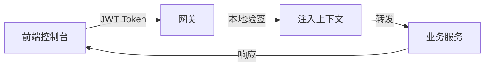
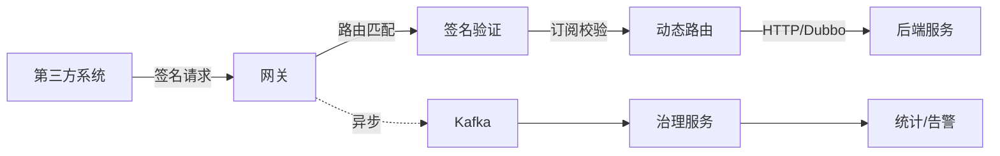

<div align="center">

# 🚀 IntelliHub

**企业级 API 开放平台 - 统一入口 · 统一安全 · 统一治理**

[](LICENSE)
[](https://spring.io/projects/spring-boot)
[](https://vuejs.org/)
[](https://github.com/yourusername/intelli_hub/pulls)

[简体中文](README.md) | [English](README_EN.md) | [系统架构图](系统架构图.drawio)

</div>

---

## 📖 项目简介

IntelliHub 是一个面向企业与开发者的**智能 API 开放平台**，旨在以 **统一入口、统一安全、统一治理** 的方式对外开放企业内部微服务能力。

### 🎯 核心价值

**解决的问题**
- ✅ 各系统烟囱式建设，API 管理混乱
- ✅ 第三方接入困难，每次都要单独开发
- ✅ 安全性参差不齐，缺乏统一鉴权
- ✅ 调用情况不清楚，问题难以排查

**提供的能力**
- 🎯 完整的 API 生命周期管理
- 🎯 多租户体系与权限控制
- 🎯 智能治理与实时监控
- 🎯 开箱即用的 SDK 支持

### ✨ 核心特性

| 特性 | 说明 |
|------|------|
| 🌐 **统一网关治理** | JWT/AppKey 双认证 · 多维限流 · 动态路由 · 实时日志 |
| 🔐 **IAM 多租户** | 租户隔离 · RBAC 权限 · 用户/角色管理 |
| 📊 **生命周期管理** | API 创建/发布/下线 · 版本管理 · 文档自动生成 |
| 🔑 **应用中心** | AppKey/Secret 管理 · API 订阅授权 · 配额控制 |
| 📈 **智能治理** | 调用统计 · 实时告警 · 性能分析 · 日志追踪 |
| 🎯 **多协议支持** | HTTP 转发 · Dubbo 泛化调用 · Mock 响应 |
| 🔒 **企业级安全** | 签名验证 · 防重放攻击 · 租户级隔离 |
| 📱 **现代化前端** | Vue3 · TypeScript · Element Plus · 响应式设计 |

### 🏢 适用场景

- **企业内部**：微服务能力统一对外开放
- **开放平台**：API 集市与生态建设
- **SaaS 服务**：多租户 API 管理与治理
- **内部治理**：统一 API 管理与监控

> 📚 **了解更多**：[项目架构文档](docs/10-架构设计-项目架构文档.md) · [系统架构图](系统架构图.drawio)

---

## 🏗️ 系统架构

### 架构总览

```
┌─────────────────────────────────────────────────────────────────┐
│  客户端层 - Console前端 / 第三方系统 / SDK                        │
└────────────────────────────┬────────────────────────────────────┘
                             │ HTTP/HTTPS
                             ▼
┌─────────────────────────────────────────────────────────────────┐
│  网关层 - Spring Cloud Gateway (WebFlux)                        │
│  • JWT鉴权 / AppKey+签名  • 限流/熔断  • 动态路由                │
└────────────────────────────┬────────────────────────────────────┘
         │                   │                   │
         ▼                   ▼                   ▼
    ┌─────────┐         ┌─────────┐        ┌─────────┐
    │  Nacos  │         │  Kafka  │        │  Redis  │
    │ 注册/配置│         │  消息队列│        │ 缓存/限流│
    └─────────┘         └─────────┘        └─────────┘
         │                   │                   │
         ▼                   ▼                   ▼
┌─────────────────────────────────────────────────────────────────┐
│  业务服务层 - Spring Boot 微服务集群                             │
│  • IAM认证  • API平台  • 应用中心  • 治理中心  • 扩展服务        │
└────────────────────────────┬────────────────────────────────────┘
                             ▼
                        ┌─────────┐
                        │  MySQL  │
                        └─────────┘
```

### 📦 模块架构

#### 核心服务（已实现）

| 模块 | 端口 | 职责 |
|------|:----:|------|
| **intelli-gateway-service** | 8080 | 🌐 统一网关：认证鉴权、限流熔断、动态路由、日志上报 |
| **intelli-auth-iam-service** | 8081 | 🔐 身份认证：多租户管理、JWT 签发、RBAC 权限 |
| **intelli-api-platform-service** | 8082 | 📊 API 平台：生命周期管理、路由配置、文档生成 |
| **intelli-app-center-service** | 8085 | 🔑 应用中心：AppKey 管理、订阅授权、配额控制 |
| **intelli-governance-service** | 8083 | 📈 治理中心：日志消费、统计分析、告警检测 |

#### 客户端 SDK

| 模块 | 说明 |
|------|------|
| **intelli-sdk** | ☕ Java SDK：签名生成、HTTP 客户端、异常处理 |
| **intellihub-frontend** | 🖥️ 管理控制台：Vue3 + TypeScript，端口 5173 |

#### 扩展服务（规划中）

| 模块 | 端口 | 说明 |
|------|:----:|------|
| intelli-aigc-service | 8084 | 🤖 AIGC 智能分析 |
| intelli-search-service | 8086 | 🔍 统一搜索服务 |
| intelli-event-service | 8087 | 📮 事件中心 |
| intelli-log-audit-service | 8088 | 📝 日志审计 |

### 🔄 核心流程

#### 1️⃣ 管理后台流量（JWT 认证）



**流程说明**：
1. 用户登录获取 JWT Token
2. 网关本地验签（性能更优）
3. 注入用户 ID、租户 ID、角色信息
4. 路由到对应微服务

#### 2️⃣ 开放 API 流量（AppKey + 签名）



**流程说明**：
1. 使用 AppKey + Secret 生成签名
2. 网关验证签名与时间戳
3. 检查 API 订阅权限
4. 根据配置动态路由（HTTP/Dubbo）
5. 异步上报调用日志到 Kafka
6. 治理服务实时统计与告警

> 📖 **详细流程文档**：
> - [网关技术流程说明书](docs/20-技术流程-网关技术流程说明书.md) - 完整的 Filter 链路与执行顺序
> - [API 开放平台设计指南](docs/12-架构设计-API开放平台架构设计指南.md) - 架构设计原则与最佳实践
> - [告警系统流程说明书](docs/21-技术流程-告警系统流程说明书.md) - 告警规则、状态机与故障排查

---

## 🛠️ 技术栈

### 后端技术

| 技术 | 版本 | 说明 |
|------|------|------|
| Spring Boot | 2.7+ | 微服务基础框架 |
| Spring Cloud | 2021.x | 微服务治理 |
| Spring Cloud Gateway | - | 响应式网关 |
| MyBatis Plus | 3.5+ | ORM增强工具 |
| Nacos | 2.x | 注册中心与配置中心 |
| Dubbo | 3.x | RPC框架（泛化调用） |
| Kafka | 2.x | 消息队列（调用日志） |
| MySQL | 8.0+ | 主数据库 |
| Redis | 6.0+ | 缓存/限流/统计 |

### 前端技术

| 技术 | 版本 | 说明 |
|------|------|------|
| Vue | 3.x | 渐进式框架 |
| Vite | 4.x | 构建工具 |
| TypeScript | 5.x | 类型系统 |
| Element Plus | 2.x | UI组件库 |
| Pinia | 2.x | 状态管理 |
| Axios | 1.x | HTTP客户端 |
| ECharts | 5.x | 数据可视化 |

---

## 🚀 快速开始

### 环境要求

- **JDK**: 8+ (推荐 11)
- **Maven**: 3.6+
- **Node.js**: ^20.19.0 || >=22.12.0
- **MySQL**: 8.0+
- **Redis**: 6.0+
- **Nacos**: 2.x (可选，本地可使用默认配置)
- **Kafka**: 2.x (可选，但推荐启用以支持完整的治理链路)

### 1️⃣ 准备中间件

#### 快速启动Kafka（Docker Compose）

```bash
# 使用 bitnami 镜像
cd docker
docker-compose -f docker-compose-kafka.yml up -d

# 或使用 wurstmeister 镜像（单机版）
docker-compose -f docker-compose-kafka-standalone.yml up -d
```

#### 启动MySQL和Redis

请确保MySQL和Redis已启动，并根据各服务的 `application.yml` 配置连接信息。

### 2️⃣ 启动后端服务

进入后端父工程目录：

```bash
cd intellihub-parent
```

按以下顺序启动服务：

```bash
# 1. IAM认证服务
cd intelli-auth-iam-service
mvn spring-boot:run

# 2. API平台服务
cd ../intelli-api-platform-service
mvn spring-boot:run

# 3. 应用中心服务
cd ../intelli-app-center-service
mvn spring-boot:run

# 4. 治理中心服务
cd ../intelli-governance-service
mvn spring-boot:run

# 5. 网关服务（最后启动）
cd ../intelli-gateway-service
mvn spring-boot:run
```

> 💡 **提示**：各服务的配置文件位于 `src/main/resources/application.yml`，请根据实际环境调整数据库、Redis、Kafka等连接信息。

### 3️⃣ 启动前端控制台

```bash
cd intellihub-frontend

# 安装依赖
npm install

# 启动开发服务器
npm run dev
```

前端将在 `http://localhost:5173` 启动，所有 `/api` 请求会自动代理到网关 `http://localhost:8080`。

### 4️⃣ 访问系统

- **控制台**: http://localhost:5173
- **网关**: http://localhost:8080
- **默认账号**: 请查看 IAM 服务的初始化脚本

---

## 📚 文档中心

### 📖 文档导航

| 分类 | 文档 | 说明 |
|------|------|------|
| **📑 索引** | [文档索引](docs/00-文档索引.md) | 完整的文档导航与分类索引 |
| **🏗️ 架构设计** | [项目架构文档](docs/10-架构设计-项目架构文档.md) | 总体架构、模块职责、关键链路、技术选型 |
| | [实体关系说明](docs/11-架构设计-实体关系说明.md) | 核心实体关系与 ER 图 |
| | [API 开放平台设计指南](docs/12-架构设计-API开放平台架构设计指南.md) | 架构设计原则与最佳实践 |
| **⚙️ 技术流程** | [网关技术流程说明书](docs/20-技术流程-网关技术流程说明书.md) | Filter 链路、鉴权、路由、日志上报 |
| | [告警系统流程说明书](docs/21-技术流程-告警系统流程说明书.md) | 告警规则、状态机、抑制策略 |
| | [API 下发指南](docs/22-技术流程-API下发指南.md) | API 配置与下发流程 |
| **📋 需求与规划** | [需求文档](docs/01-需求与规划-需求文档.md) | 功能需求与范围边界 |
| | [功能开发计划](docs/功能开发计划.md) | 项目现状与开发进度 |
| | [后续开发与优化计划](docs/03-需求与规划-后续开发与优化计划.md) | 详细的开发规划与优化路线 |

### 🛠️ 开发指南

- **[Java SDK 使用文档](intellihub-parent/intelli-sdk/README.md)** - SDK 快速接入指南
- **[系统架构图](系统架构图.drawio)** - Draw.io 可编辑架构图
- **[事件中心设计](intellihub-parent/intelli-event-service/docs/事件中心设计文档.md)** - 事件驱动架构设计
- **[多租户实现](intellihub-parent/intelli-auth-iam-service/docs/MultiTenant.md)** - 多租户技术方案

---

## 💡 核心特性详解

### 🔐 双流量认证架构

<table>
<tr>
<th width="20%">流量类型</th>
<th width="40%">管理后台</th>
<th width="40%">开放 API</th>
</tr>
<tr>
<td><strong>路径</strong></td>
<td><code>/api/**</code></td>
<td><code>/open/**</code></td>
</tr>
<tr>
<td><strong>认证方式</strong></td>
<td>JWT Token</td>
<td>AppKey + HMAC-SHA256 签名</td>
</tr>
<tr>
<td><strong>验证位置</strong></td>
<td>网关本地验签</td>
<td>网关 + 应用中心校验</td>
</tr>
<tr>
<td><strong>性能优势</strong></td>
<td>✅ 无需远程调用</td>
<td>✅ 支持缓存优化</td>
</tr>
<tr>
<td><strong>安全特性</strong></td>
<td>Token 过期机制</td>
<td>防重放攻击（Nonce + Timestamp）</td>
</tr>
</table>

### 🎯 动态路由能力

| 路由类型 | 特点 | 适用场景 |
|---------|------|----------|
| **HTTP 转发** | 服务名负载均衡、自动故障转移 | 标准 REST API、微服务调用 |
| **Dubbo 泛化调用** | 无需依赖业务 JAR、动态参数映射 | 内部 RPC 服务、高性能调用 |
| **Mock 响应** | 固定返回、便于调试 | 功能演示、前期测试 |

**关键优势**：
- ✅ 配置热更新（Redis Pub/Sub）
- ✅ 无需重启网关
- ✅ 支持灰度发布

### 📊 智能治理能力

#### 多维限流

```
IP 维度限流    ┐
               ├─► 组合判断 ─► 放行/拒绝
Path 维度限流  ┤
               │
IP+Path 维度   ┘
```

**支持的限流策略**：
- 固定窗口计数
- 滑动窗口（规划中）
- 令牌桶（规划中）

#### 实时统计与告警

**数据采集**：
- 网关 → Kafka（异步上报）
- 网关 → Redis（实时写入）

**统计维度**：
- 总调用量、成功率、平均延迟
- API Top10、错误分布
- 租户/应用级别统计

**告警规则**：
- 错误率告警（可配置阈值）
- 延迟告警（可配置阈值）
- QPS 告警（可配置阈值）

#### 全链路租户隔离

```
请求 → 网关提取 tenantId → 注入请求头 → 微服务读取 → 数据库过滤
```

**隔离层级**：
- ✅ 网络层：独立路由
- ✅ 应用层：上下文透传
- ✅ 数据层：MyBatis Plus 租户插件

---

## 🤝 参与贡献

我们欢迎任何形式的贡献！无论是新功能、Bug 修复、文档改进还是问题反馈。

### 💬 提交 Issue

**问题报告模板**：
```markdown
### 问题描述
[清晰描述遇到的问题]

### 复现步骤
1. 步骤一
2. 步骤二
3. 步骤三

### 期望行为
[描述期望的结果]

### 实际行为
[描述实际的结果]

### 环境信息
- 操作系统：
- JDK 版本：
- 项目版本：
```

### 🔧 提交 Pull Request

**PR 描述模板**：
```markdown
### 变更说明
- 修改了什么功能/问题

### 涉及模块
- [ ] Gateway
- [ ] IAM
- [ ] API Platform
- [ ] 其他

### 测试验证
- [ ] 单元测试通过
- [ ] 集成测试通过
- [ ] 手动测试验证

### 风险评估
- 影响范围：
- 兼容性：
```

### 📝 开发规范

- ✅ 遵循现有代码风格（阿里巴巴 Java 规范）
- ✅ 添加必要的注释和 JavaDoc
- ✅ 编写单元测试（覆盖率 > 70%）
- ✅ 更新相关文档
- ✅ 提交前运行 `mvn clean test`

---

## 📊 项目统计

- **代码行数**：~15,000+ 行（后端）+ ~8,000+ 行（前端）
- **服务模块**：11 个微服务模块
- **文档数量**：10+ 篇技术文档
- **技术栈**：Spring Boot + Vue3 + 多种中间件

---

## 📄 开源协议

本项目采用 [Apache License 2.0](LICENSE) 开源协议。

---

## 🙏 致谢

感谢所有为本项目做出贡献的开发者！

特别感谢以下开源项目：
- [Spring Cloud](https://spring.io/projects/spring-cloud)
- [Vue.js](https://vuejs.org/)
- [Element Plus](https://element-plus.org/)
- [MyBatis Plus](https://baomidou.com/)

---

## 📞 联系与支持

- 💬 **问题反馈**：[GitHub Issues](https://github.com/yourusername/intelli_hub/issues)
- 🗨️ **功能建议**：[GitHub Discussions](https://github.com/yourusername/intelli_hub/discussions)
- 📧 **商务合作**：[Email](mailto:your-email@example.com)

---

<div align="center">

### ⭐️ Star History

[](https://star-history.com/#yourusername/intelli_hub&Date)

---

**如果这个项目对你有帮助，请给一个 ⭐️ Star ⭐️**

**让我们一起打造更好的 API 开放平台！**

</div>
