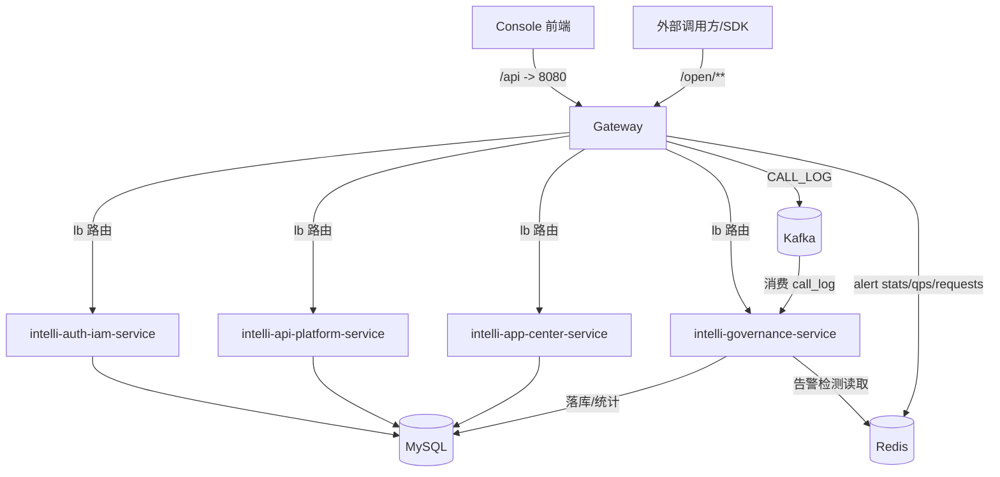
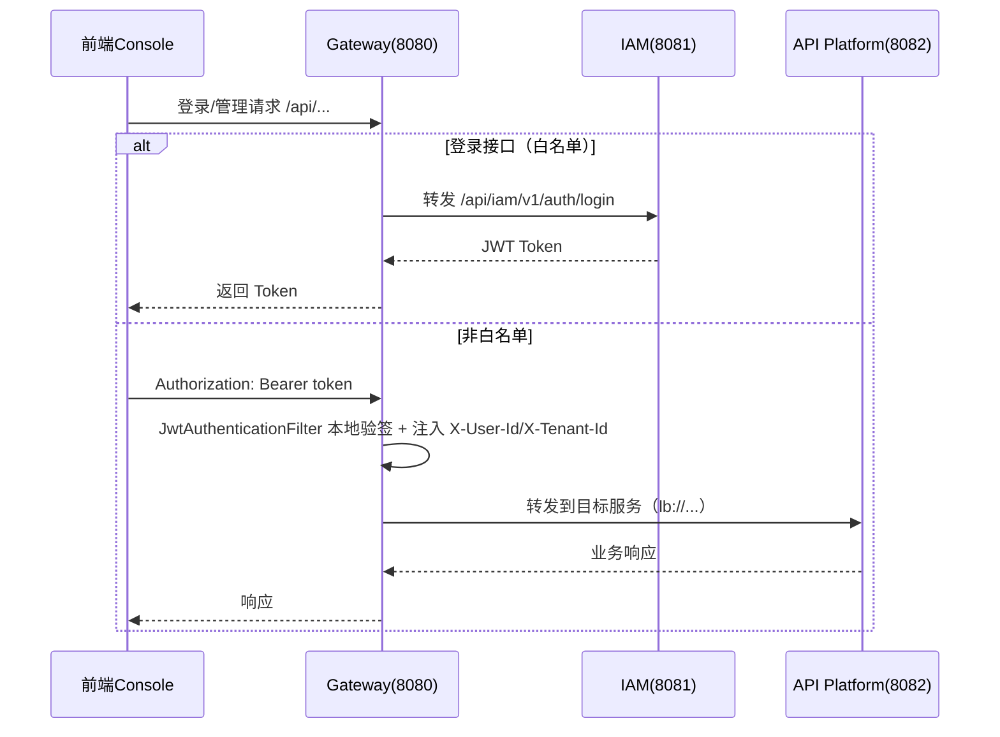
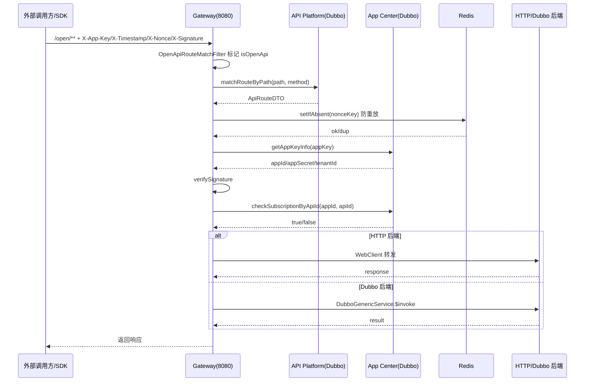
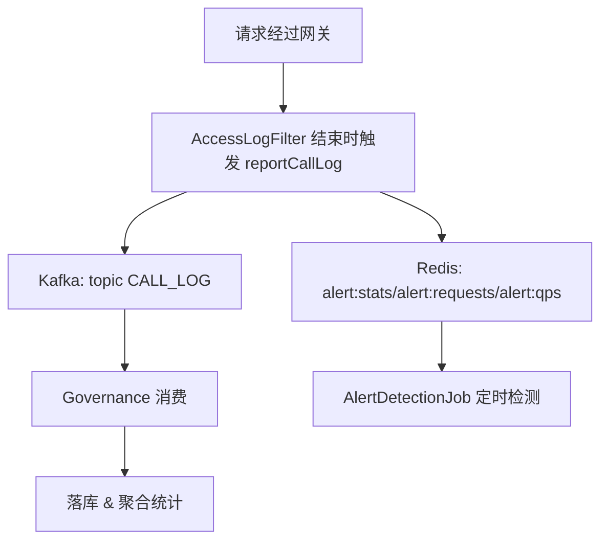

# IntelliHub 项目架构文档

> 目标：给出一份“基于现有代码与配置”的全量架构说明，覆盖 **整体架构设计**、**模块职责与拆分原因**、**关键业务链路**、**技术选型与取舍**、**部署与配置策略**。

---

## 目录

- 1. 总览：平台定位与边界
- 2. 分层架构与全局数据流
- 3. 仓库结构与模块清单
- 4. 各模块职责（做什么/为什么这样做）
- 5. 关键链路（端到端流程）
- 6. 数据与消息：MySQL / Redis / Kafka
- 7. 技术选型与取舍
- 8. 配置与部署（本地/配置中心/Docker）
- 9. 演进路线与已知差异（文档 vs 代码）
- 10. 附录：端口与依赖清单

---

## 1. 总览：平台定位与边界

IntelliHub 是一个企业级 API 开放平台，主要解决：

- 内部微服务能力对外开放（统一入口、统一安全）
- API 生命周期管理（创建/发布/下线/废弃）
- 多租户隔离（TenantId 全链路透传与数据隔离）
- 治理与可观测（调用日志、统计、告警、审计）

**边界约束（按现有实现）**：

- 外部调用者与前端管理台都只访问 **网关**（`intelli-gateway-service`）。
- “开放 API”不是简单转发固定服务，而是由网关 **根据平台配置动态路由**到 HTTP 或 Dubbo 后端。
- 网关会把调用日志写入 Kafka，并把告警检测需要的统计写入 Redis，由治理服务消费/检测。

---

## 2. 分层架构与全局数据流

### 2.1 架构分层

### 2.2 全局数据流（重点链路）

---

## 3. 仓库结构与模块清单

父工程（Maven 聚合）：`intellihub-parent/pom.xml`

### 3.1 后端模块（modules）

- `inner-intergration`（内部支撑模块集合）
- `intelli-sdk`（Java SDK）
- `intelli-gateway-service`（网关）
- `intelli-auth-iam-service`（IAM）
- `intelli-api-platform-service`（API 平台）
- `intelli-governance-service`（治理中心）
- `intelli-aigc-service`（AIGC）
- `intelli-app-center-service`（应用中心）
- `intelli-search-service`（搜索）
- `intelli-event-service`（事件）
- `intelli-log-audit-service`（日志审计）

### 3.2 前端模块

- `intellihub-frontend`：Vue3 + Vite 控制台
  - 开发代理：`/api` → `http://localhost:8080`（即网关）

---

## 4. 各模块职责（做什么 / 为什么这么做）

## 4.1 inner-intergration（内部支撑模块）

位置：`intellihub-parent/inner-intergration/*`

包含：

- `common-helper`：通用工具与通用响应（如 `ApiResponse`）、签名工具、Redis Key 常量等
- `common-dubbo-api`：Dubbo 的公共接口与 DTO（用于服务间契约）
- `mybatis-helper-spring-boot-starter`：MyBatis Plus 增强封装
- `redis-cache-spring-boot-starter`：Redis 缓存封装
- `kafka-spring-boot-starter`：Kafka 生产/消费封装
- `swagger-spring-boot-starter`：API 文档能力
- `common-interceptor-spring-boot-starter` / `common-security-spring-boot-starter` / `aop-spring-boot-starter`

**为什么这样做**：

- 将跨服务通用能力（响应结构、签名算法、Redis Key、Kafka 封装）抽到独立模块，避免多服务重复实现与版本漂移。
- 通过 starter 统一默认配置与约定，减少各服务“样板代码”。

---

## 4.2 intelli-gateway-service（网关服务）

职责：

- 统一入口：前端控制台 `/api/**` 与外部开放 API `/open/**` 都进入网关
- 过滤器链治理（按现有代码）：
  - 请求 Body 缓存（解决 WebFlux Body 只能读一次问题）
  - 访问日志记录与上报（Kafka + Redis）
  - 开放 API 路由匹配（从平台服务获取 `ApiRouteDTO`）
  - 限流（IP/Path/IP+Path）
  - 租户校验与补全（Dubbo 校验 + Redis 缓存）
  - JWT 认证（管理后台请求）
  - AppKey + 签名 + 防重放 + 订阅校验（开放 API 请求）
  - 动态路由转发（HTTP / Dubbo 泛化调用 / Mock）
- 统一异常处理（`GatewayExceptionHandler`）

**为什么这样做**：

- 统一安全与治理能力，避免下游每个服务重复实现鉴权/限流/日志。
- 开放 API 需要更强的“智能代理”能力：网关直接根据配置决定如何调用后端（HTTP 或 Dubbo）。

---

## 4.3 intelli-auth-iam-service（IAM 认证与权限）

端口：8081

职责：

- 用户登录与 Token 签发
- 多租户基础能力（租户启停、租户隔离、默认租户/默认角色）
- RBAC（角色、权限）以及相关的权限缓存/校验
- Dubbo 提供/消费：用于其他服务进行租户有效性校验等

**为什么这样做**：

- 将身份与权限从业务系统中剥离，成为平台级基础设施。
- Token 在网关侧解析，避免每次请求远程校验，提高性能。

---

## 4.4 intelli-api-platform-service（API 平台服务）

端口：8082

职责：

- API 生命周期管理：创建/发布/下线（及元数据管理）
- API 路由配置：开放 API 的 `path/method/authType/backendType/backendHost/backendPath/...`
- Dubbo 接口输出：供网关动态路由匹配与加载（`OpenApiRouteService` 通过 Dubbo 拉取）

**为什么这样做**：

- “开放 API 的配置”需要集中管理（数据库）并可动态变化，网关只负责读取配置并执行。

---

## 4.5 intelli-app-center-service（应用中心服务）

端口：8085

职责：

- 应用（App）创建与管理
- AppKey/AppSecret 生命周期管理
- App 与 API 的订阅关系（授权模型）
- Dubbo 接口输出：网关通过 Dubbo 获取 AppKey 信息、校验订阅关系

**为什么这样做**：

- 把“调用方身份（AppKey）”与“API 平台（提供方 API）”分离，便于权限模型扩展（配额、订阅审批、计费等）。

---

## 4.6 intelli-governance-service（治理中心）

端口：8083

职责：

- 消费网关写入 Kafka 的调用日志
- 调用日志落库、统计聚合（概览/趋势/分布）
- 告警检测：读取 Redis 统计，按规则触发告警（详见 `docs/告警系统流程说明书.md`）

**为什么这样做**：

- 日志与统计是高吞吐写入场景，网关不应同步落库；用 Kafka 解耦并平滑流量。
- 统计/告警属于独立领域，与 API 管理/权限分开有利于演进。

---

## 4.7 AIGC / 搜索 / 事件 / 日志审计（扩展域服务）

- `intelli-aigc-service`（8084）：AIGC 能力（配置中出现 RabbitMQ，偏向事件驱动/异步任务）
- `intelli-search-service`（8086）：聚合搜索能力（配置中出现 RabbitMQ）
- `intelli-event-service`（8087）：事件中心（配置中出现 RabbitMQ）
- `intelli-log-audit-service`（8088）：日志审计（配置中出现 RabbitMQ）

**说明**：这些模块在配置层面已形成“可扩展服务位”，但部分业务能力可能仍处于规划/逐步落地状态。

---

## 4.8 intelli-sdk（Java SDK）

职责：

- 对外提供 Java 调用客户端
- 自动生成 `X-App-Key/X-Timestamp/X-Nonce/X-Signature`
- 签名算法与网关 `SignatureUtil.verifySignature` 对齐

**为什么这样做**：

- 降低第三方接入成本，避免每个调用方都重复实现签名与重试。

---

## 4.9 intellihub-frontend（前端 Console）

技术栈（按 `package.json`）：

- Vue 3 + Vite + TypeScript
- Element Plus（UI）
- Pinia（状态管理）
- Axios（HTTP）
- ECharts（图表）

**为什么这样做**：

- Vue3 + Vite 开发效率高；Element Plus 提供企业后台组件；ECharts 适合做统计图。
- 通过 Vite proxy 把所有 `/api` 请求转发到网关，前后端解耦。

---

## 5. 关键链路（端到端流程）

## 5.1 管理后台调用链路（JWT）

**说明**：

- 按现有代码：网关 JWT 校验是本地验签（`JwtUtil`），不是每次调用 IAM 远程校验。
- 白名单（`WhiteListConfig`）包含登录、验证码等“无 Token 阶段”的入口。

---

## 5.2 开放 API 调用链路（AppKey + 签名 + 防重放 + 订阅校验 + 动态路由）

**说明**：

- 路由配置由 API 平台集中管理，网关只负责“执行配置”。
- 订阅校验由应用中心提供，形成“调用方（App）→ 订阅（授权）→ API”的权限模型。

---

## 5.3 调用日志与统计链路（Kafka + Redis）

---

## 6. 数据与消息：MySQL / Redis / Kafka

### 6.1 MySQL（服务独立库）

从配置可见：IAM / API 平台 / 治理 / 应用中心等均使用各自独立数据库（便于领域隔离与独立演进）。

### 6.2 Redis（多库使用）

从各服务配置可见：

- Gateway：Redis DB=0（告警相关统计、限流、防重放、缓存等）
- Governance：Redis DB=0（读取统计用于告警）
- IAM：Redis DB=1（验证码/权限缓存等）
- API 平台：Redis DB=1
- App Center：Redis DB=2

**原因**：多 DB 分离能降低 Key 冲突与误删风险，也便于按域清理。

### 6.3 Kafka（异步解耦）

- 网关生产调用日志（topic：`CALL_LOG`）
- 治理服务消费并落库聚合

**原因**：

- 网关是高 QPS 入口，不能同步写 DB；Kafka 用于削峰填谷与解耦。

---

## 7. 技术选型与取舍

### 7.1 Spring Boot + Spring Cloud

- 统一工程治理能力（配置、依赖管理、微服务基础设施）
- Nacos 做注册发现与配置中心：部署简单、生态成熟

### 7.2 Spring Cloud Gateway（WebFlux）

- 网关层为高并发入口，WebFlux 非阻塞模型更适合
- 支持 GlobalFilter 链式治理，便于逐步插件化

### 7.3 Dubbo

- 内部服务间调用，延迟更低；
- 网关支持 Dubbo 泛化调用（无需依赖业务接口 Jar），便于“平台化”动态路由。

### 7.4 Kafka

- 异步日志、事件驱动；
- 将治理链路从网关主链路剥离，降低入口压力。

### 7.5 Redis

- 缓存、限流、防重放（Nonce）、实时统计（告警）等高频读写场景。

### 7.6 MyBatis Plus + MySQL

- MySQL 作为主存储；MyBatis Plus 提升 CRUD 与分页效率。

### 7.7 前端：Vue3 + Element Plus

- 企业后台 UI 成熟；配合 ECharts 满足统计与监控可视化。

---

## 8. 配置与部署（本地/配置中心/Docker）

### 8.1 配置覆盖策略

网关与部分服务使用：

- `spring.config.import: optional:nacos:xxx.yml`

意味着：

- 本地 `application.yml` 是默认配置
- 若 Nacos 存在同名配置，则覆盖/补充

### 8.2 Docker（当前仓库提供）

`docker/` 目录提供 Kafka + Zookeeper 的 compose，用于开发环境快速搭建消息队列。

---

## 9. 演进路线与已知差异（文档 vs 代码）

### 9.1 README 与代码的差异点（需以代码为准）

- README 中提到“网关调用认证服务验证 Token”，但现有网关实现为 **本地验证 JWT**（`JwtUtil`），更高性能。

### 9.2 可演进点（与当前实现对齐的下一步方向）

- 限流算法：配置里存在算法枚举，但 Filter 当前主要走计数限流，可统一为滑动窗口/令牌桶。
- 插件化：将鉴权、限流、熔断等做成更标准的策略/插件体系。
- 可观测：引入 TraceId 统一链路追踪（文档中已提需求）。

---

## 10. 附录：端口与依赖清单

### 10.1 服务端口（按 application.yml）

| 服务 | 模块 | 端口 |
|------|------|------|
| 网关 | intelli-gateway-service | 8080 |
| IAM | intelli-auth-iam-service | 8081 |
| API 平台 | intelli-api-platform-service | 8082 |
| 治理中心 | intelli-governance-service | 8083 |
| AIGC | intelli-aigc-service | 8084 |
| 应用中心 | intelli-app-center-service | 8085 |
| 搜索 | intelli-search-service | 8086 |
| 事件 | intelli-event-service | 8087 |
| 日志审计 | intelli-log-audit-service | 8088 |

### 10.2 前端端口

- Vite dev server：5173
- `/api` 代理到网关：8080

### 10.3 中间件依赖

- Nacos：服务发现与配置
- MySQL：各服务独立库
- Redis：缓存/限流/防重放/实时统计
- Kafka：调用日志异步链路（治理消费）

---

*文档维护建议：后续每新增一个服务或关键链路，请补充：模块职责、关键接口、依赖中间件、以及端到端链路图。*
