# IntelliHub 网关技术流程说明书

> 本说明书基于 `intelli-gateway-service` 现有代码梳理网关的真实执行流程，目标是让你能按“文字解释 → Mermaid 图 → 代码文件”快速建立整体理解。

---

## 一、整体架构与职责边界

**你需要先记住两件事**：

1. 网关同时承载两类流量：
   - **管理后台流量**：走 **JWT**（`JwtAuthenticationFilter`）
   - **开放 API 流量**：走 **AppKey + 签名 + 防重放**（`AppKeyAuthenticationFilter`），并由网关根据“路由配置”动态转发（`OpenApiRouteFilter`）
2. 网关除了转发，还承担：限流、防重放、租户校验、日志与指标上报、统一异常返回。

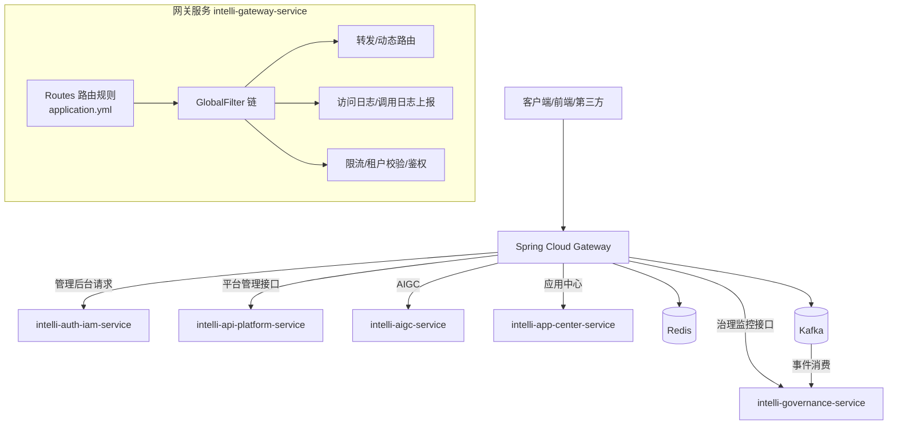

**图解**：

- **Routes** 决定请求进入哪个“服务路由”（静态路由）或进入“开放 API 动态路由”。
- **Filters** 决定请求是否放行、是否需要认证、是否限流、是否补全租户与用户上下文。
- **Forward** 对于开放 API：由网关自己决定转发到 HTTP 服务还是 Dubbo 服务。

---

## 二、路由层（Routes）如何把请求分流

网关路由规则定义于：

- `intelli-gateway-service/src/main/resources/application.yml`

核心路由（节选逻辑）：

- `/api/auth/**,/api/iam/**` → `intelli-auth-iam-service`
- `/api/platform/**` → `intelli-api-platform-service`
- `/api/governance/**,/api/monitor/**` → `intelli-governance-service`
- `/open/**,/external/**` → `forward:/open`（占位路由，真正由 `OpenApiRouteFilter` 动态转发）

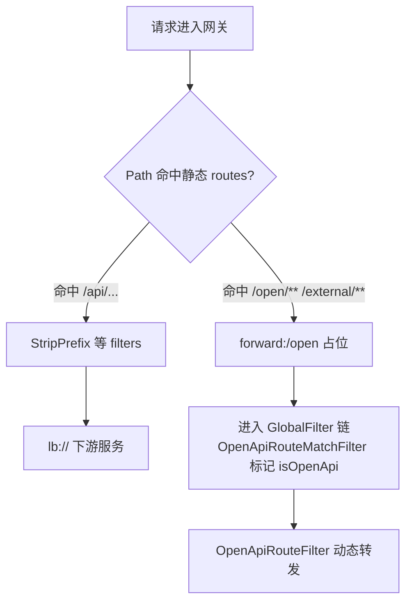

**图解**：

- `/api/**` 这类是“平台内部微服务”路由；转发目标由 `lb://serviceName` 负责。
- `/open/**` 这类是“开放 API”路由；`forward:/open` 只是让请求落到网关自身处理，真正的后端由数据库/配置（通过 Dubbo 获取）决定。

---

## 三、过滤器链（GlobalFilter）执行顺序：全局主线

过滤器顺序由：

- `FilterOrderConfig`

定义（按执行先后）：

1. `CacheBodyFilter`（-200）：缓存请求 Body（解决后续重复读取问题）
2. `AccessLogFilter`（-100）：记录访问日志 + 在响应结束时触发上报
3. `OpenApiRouteMatchFilter`（-50）：标记是否开放 API，并把匹配的 `ApiRouteDTO` 放入 exchange attributes
4. `RateLimitFilter`（100）：限流（在认证之前执行，节省认证成本）
5. `GlobalTenantFilter`（500）：租户校验与租户头补全
6. `JwtAuthenticationFilter`（1000）：管理后台 JWT 认证（白名单跳过）
7. `AppKeyAuthenticationFilter`（1100）：开放 API AppKey + 签名 + 防重放 + 订阅校验
8. `OpenApiRouteFilter`（1200）：开放 API 动态转发（HTTP/Dubbo/Mock）

```mermaid
flowchart LR
  R[Request] --> F1[CacheBodyFilter]
  F1 --> F2[AccessLogFilter]
  F2 --> F3[OpenApiRouteMatchFilter]
  F3 --> F4[RateLimitFilter]
  F4 --> F5[GlobalTenantFilter]
  F5 --> F6[JwtAuthenticationFilter]
  F6 --> F7[AppKeyAuthenticationFilter]
  F7 --> F8[OpenApiRouteFilter]
  F8 --> S[下游服务或网关直接返回]
```

**图解**：

- “开放 API”与“管理后台”不是两条完全独立的链路，而是共享同一条 Filter 链，通过 **WhiteList + isOpenApi 标记**实现分流。
- **先限流再认证**，是典型的网关优化：无效请求不要浪费鉴权与下游资源。

---

## 四、请求 Body 缓存（CacheBodyFilter）：为什么必须最先做

对应代码：

- `CacheBodyFilter`

**核心问题**：在 WebFlux/Reactive 流里，请求 Body 是流式的，读取一次后就“消费掉”了。

**网关的需求**：

- Dubbo 泛化调用需要把 Body 解析为 `Map` 参数
- HTTP 转发可能需要把 Body 原样透传

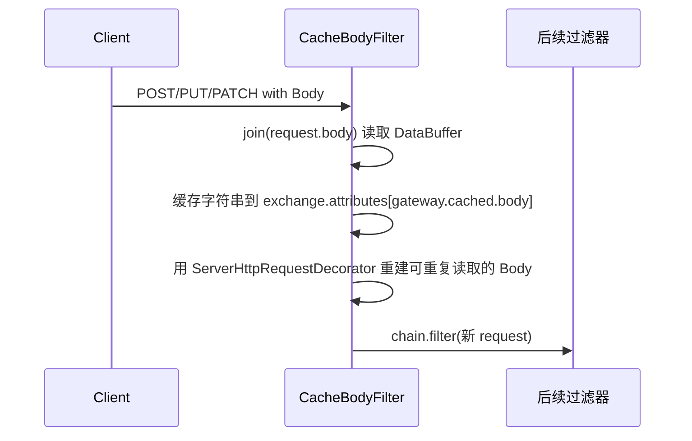

**图解**：

- `CacheBodyFilter.ATTR_CACHED_BODY = gateway.cached.body` 是后续读取 Body 的唯一入口。

---

## 五、开放 API 路由匹配（OpenApiRouteMatchFilter）：先“知道你是谁”

对应代码：

- `OpenApiRouteMatchFilter`
- `OpenApiRouteService`

**它做两件事**：

1. 判断 path 是否属于开放 API：`/open/**`、`/external/**`
2. 若是：通过 `OpenApiRouteService.matchRoute(path, method)` 获取 `ApiRouteDTO` 并写入：
   - `gateway.api.isOpenApi`
   - `gateway.api.route`
   - `gateway.api.id`

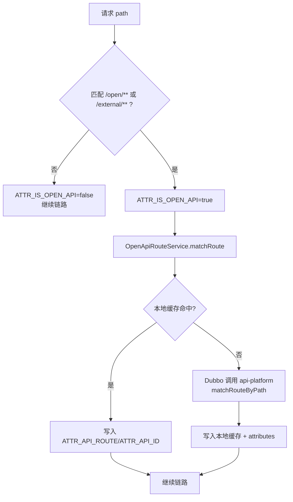

**图解**：

- `OpenApiRouteService` 的本地缓存是 `ConcurrentHashMap`，支持 `{id}` 这种路径参数匹配（通过 `AntPathMatcher`）。
- 当本地缓存未命中时，才会通过 Dubbo 调用平台服务匹配路由。

---

## 六、开放 API 鉴权（AppKeyAuthenticationFilter）：签名 + 防重放 + 订阅校验

对应代码：

- `AppKeyAuthenticationFilter`
- `AppKeyService`

### 6.1 鉴权入口与跳过逻辑

- 先看是否启用：`gateway.appkey.enabled`
- 优先读取 `ApiRouteDTO.authType`：
  - `none`：直接放行
  - `signature`（或其他）：执行 AppKey 流程

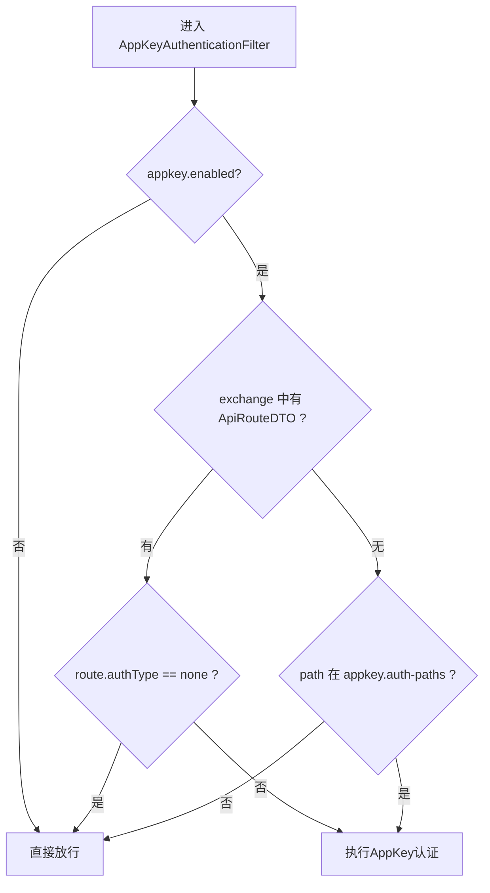

### 6.2 认证流程（你理解这张图就理解了开放 API 安全）

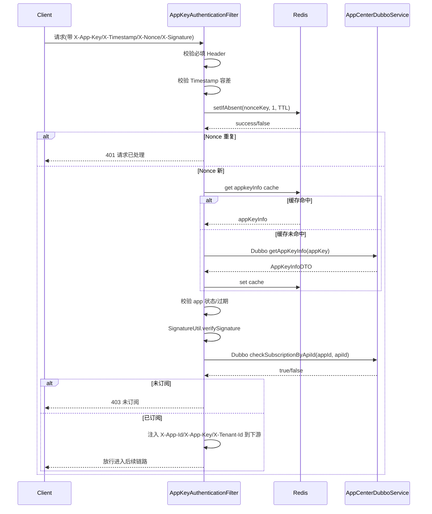

**图解**：

- **防重放**：`nonceKey = RedisKeyConstants.buildNonceKey(appKey, nonce)`，使用 `setIfAbsent`。
- **签名算法**：`SignatureUtil.verifySignature(signature, method, path, timestamp, nonce, appSecret)`。
- **授权模型**：必须“订阅 API”才允许调用（通过 Dubbo 到应用中心校验）。

---

## 七、管理后台 JWT 认证（JwtAuthenticationFilter）：只做本地验签

对应代码：

- `JwtAuthenticationFilter`
- `JwtUtil`
- `WhiteListConfig`

**核心逻辑**：

- 如果 path 在白名单：跳过 JWT
- 否则读取 `Authorization: Bearer <token>`
- `JwtUtil.parseToken` 本地解析并校验 `tokenType=access`
- 将 `X-User-Id`、`X-Username`、`X-Tenant-Id`、`X-User-Roles` 注入请求头传递给下游服务

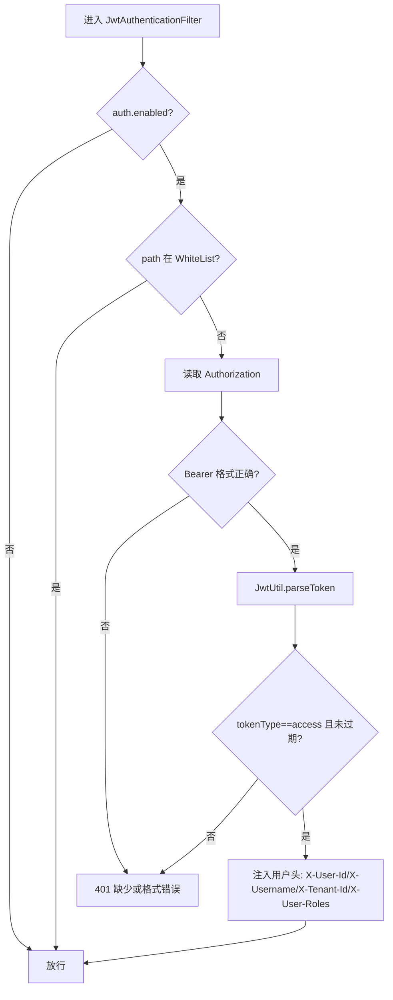

**图解**：

- JWT 校验完全在网关本地完成，不调用 IAM 服务，性能更高。
- 白名单里包含 `/open/**`，意味着开放 API **不会走 JWT**，而是走 AppKey。

---

## 八、租户校验（GlobalTenantFilter）：租户不存在直接拦截

对应代码：

- `GlobalTenantFilter`

**关键点**：

- 白名单路径不做租户校验
- 若请求缺失 `X-Tenant-Id`，默认租户为 `default`
- 非 default 租户：先查 Redis 缓存，不命中则 Dubbo 调用 `TenantDubboService.isValidTenant`

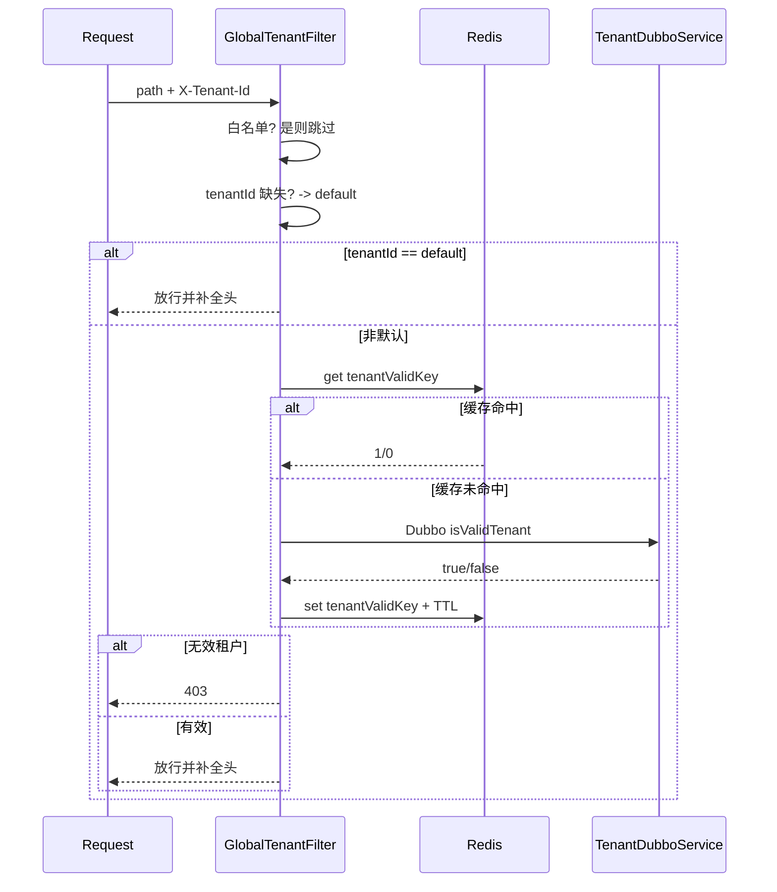

**图解**：

- 这个过滤器让“租户非法”在网关层直接失败，避免下游服务各自重复校验。

---

## 九、限流（RateLimitFilter + RateLimitService）：三维度组合限流

对应代码：

- `RateLimitFilter`
- `RateLimitConfig`
- `RateLimitService`

**限流维度**（当前实现）：

- IP 维度（更宽松）
- Path 维度（更宽松）
- IP+Path 组合（最严格）

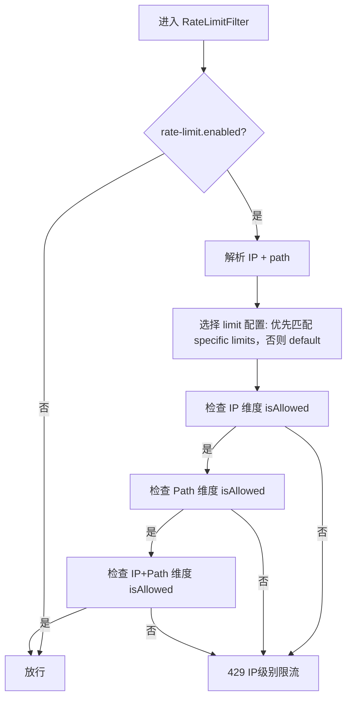

**图解**：

- 限流在认证之前执行：无效请求不用走签名/JWT 校验。
- 目前 `RateLimitService.isAllowed` 是“固定窗口计数”风格；配置里虽然有算法枚举，但实际 Filter 调用的是 `isAllowed`（可后续升级为滑动窗口/令牌桶）。

---

## 十、开放 API 动态转发（OpenApiRouteFilter）：HTTP / Dubbo / Mock

对应代码：

- `OpenApiRouteFilter`
- `DubboGenericService`

### 10.1 总体转发决策

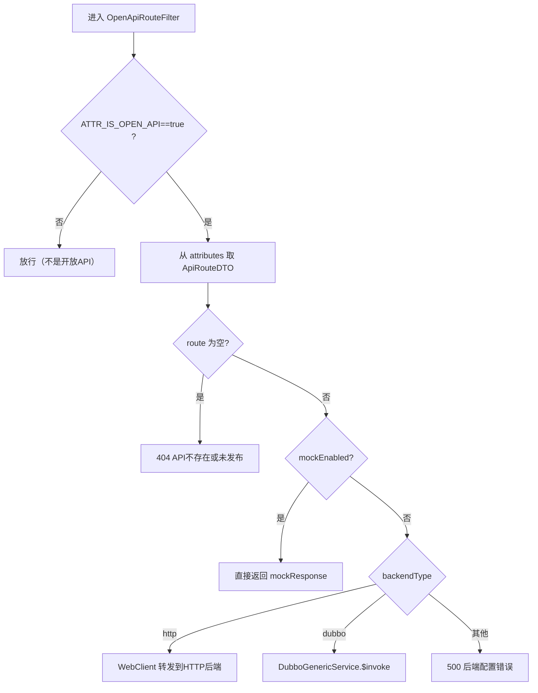

### 10.2 HTTP 后端转发：服务名解析 + WebClient 透传

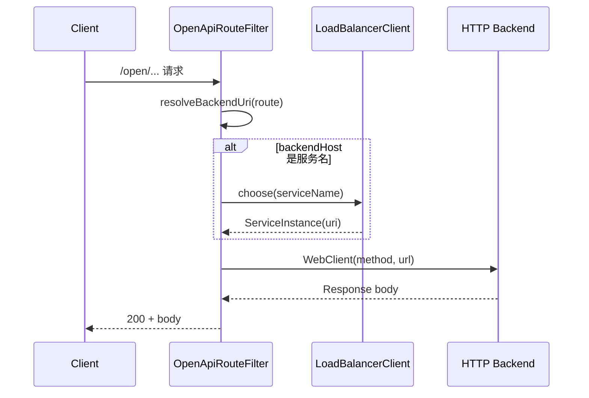

**图解**：

- `resolveBackendUri` 会把 `backendHost` 当作“服务名”处理（不是 IP 且不含端口）。
- 请求头会复制（排除 Host），Body 通过 `CacheBodyFilter` 的缓存值透传。

### 10.3 Dubbo 后端转发：参数提取 + 泛化调用

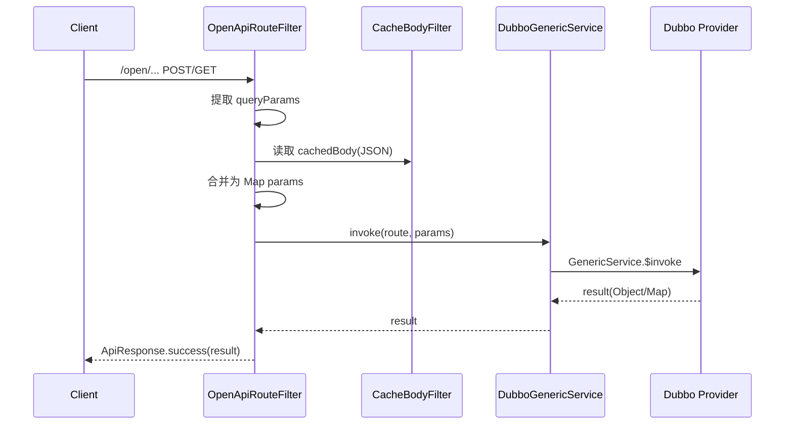

**图解**：

- Dubbo 泛化调用的关键是：网关不依赖业务接口 Jar。
- `DubboGenericService` 内部缓存 `GenericService`，减少每次创建开销。

---

## 十一、访问日志与调用日志上报（AccessLogFilter + CallLogReportService）

对应代码：

- `AccessLogFilter`
- `CallLogReportService`

### 11.1 记录访问日志（开始/结束）

`AccessLogFilter` 在请求开始记录一次日志，在 `chain.filter(exchange).then(...)` 中记录结束耗时并触发上报。

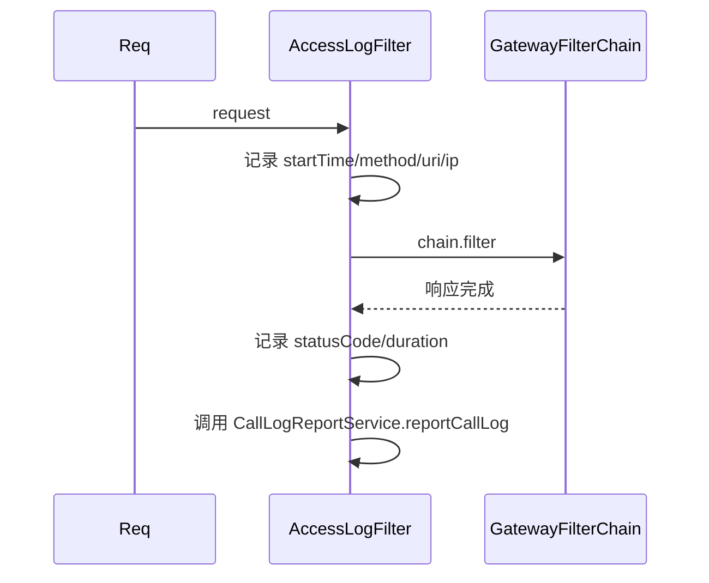

### 11.2 上报到 Kafka + 更新 Redis 实时统计

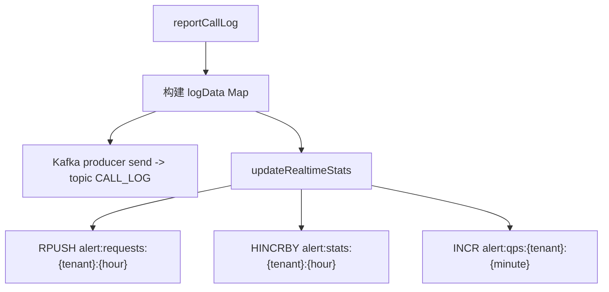

**图解**：

- Kafka 用于治理服务异步消费（日志落库、统计报表）。
- Redis 用于告警系统的实时检测与短周期指标计算。

---

## 十二、异常处理（GatewayExceptionHandler）：统一错误返回

对应代码：

- `GatewayExceptionHandler`（实现 `ErrorWebExceptionHandler`）

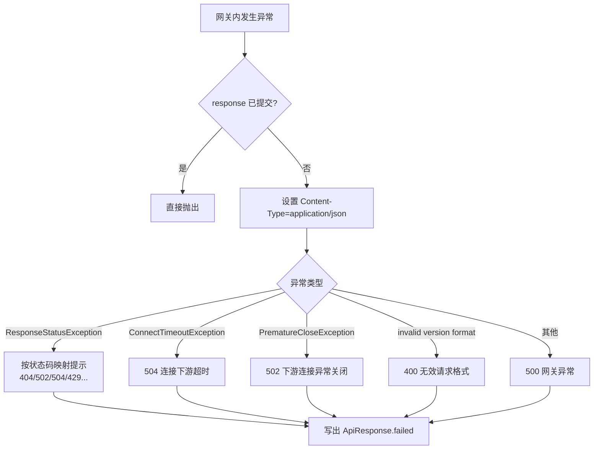

**图解**：

- 这个处理器保证网关在多数异常情况下都返回统一 JSON 结构（`ApiResponse`）。

---

## 十三、配置清单（关键开关与含义）

主要配置来源：

- `application.yml`（本地默认）
- `optional:nacos:intelli-gateway-service.yml`（可覆盖）

关键配置项：

- `spring.cloud.gateway.routes`：静态路由与 open-api 占位路由
- `intellihub.gateway.auth.enabled`：JWT 认证开关
- `intellihub.gateway.whitelist.paths`：JWT/租户校验白名单（包含 open api）
- `intellihub.gateway.rate-limit.enabled`：限流开关
- `gateway.appkey.enabled`：开放 API AppKey 认证开关

---

## 十四、按“现有代码”理解的两条主路径总结

### 14.1 管理后台请求路径（JWT）

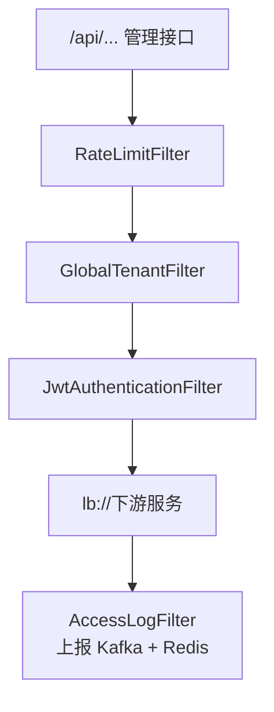

### 14.2 开放 API 请求路径（AppKey + 动态路由）

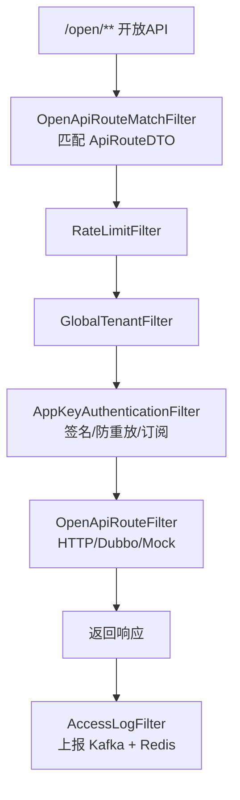

---

## 附录：关键文件速查（从图到代码）

| 领域 | 文件 |
|------|------|
| 路由配置 | `intelli-gateway-service/src/main/resources/application.yml` |
| 过滤器顺序 | `FilterOrderConfig` |
| Body 缓存 | `CacheBodyFilter` |
| 开放API匹配 | `OpenApiRouteMatchFilter`, `OpenApiRouteService` |
| AppKey认证 | `AppKeyAuthenticationFilter`, `AppKeyService` |
| JWT认证 | `JwtAuthenticationFilter`, `JwtUtil`, `WhiteListConfig`, `JwtConfig` |
| 租户校验 | `GlobalTenantFilter` |
| 限流 | `RateLimitFilter`, `RateLimitConfig`, `RateLimitService` |
| 动态路由转发 | `OpenApiRouteFilter`, `DubboGenericService` |
| 访问日志/上报 | `AccessLogFilter`, `CallLogReportService` |
| 全局异常 | `GatewayExceptionHandler` |
