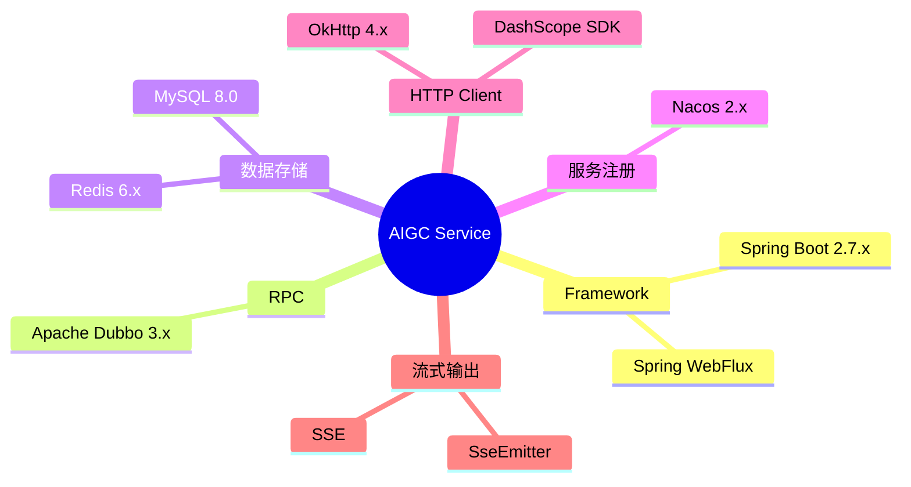
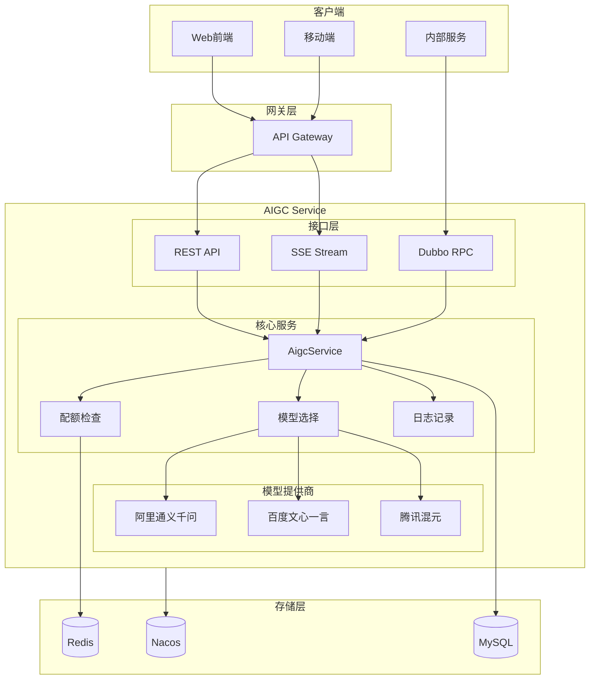
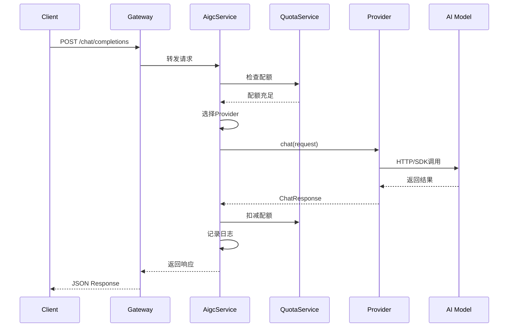
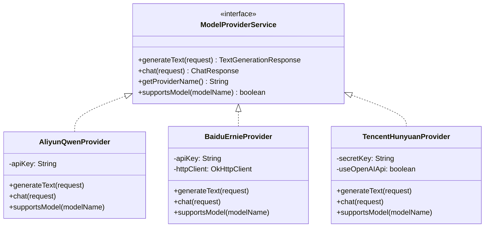
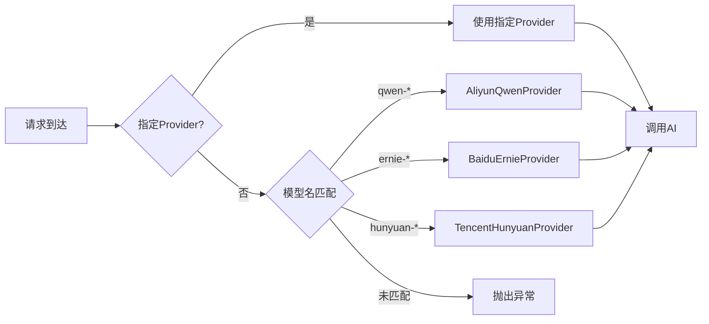
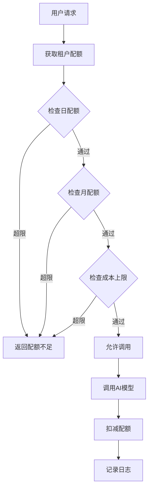

# IntelliHub AIGC 服务技术实现文档

> 版本：1.0.0  
> 更新日期：2025年1月  
> 作者：IntelliHub Team

---

## 目录

1. [服务概述](#1-服务概述)
2. [技术架构](#2-技术架构)
3. [核心模块](#3-核心模块)
4. [API 接口](#4-api-接口)
5. [模型提供商](#5-模型提供商)
6. [配额管理](#6-配额管理)
7. [流式响应](#7-流式响应)
8. [统计分析](#8-统计分析)
9. [配置说明](#9-配置说明)
10. [部署指南](#10-部署指南)

---

## 1. 服务概述

### 1.1 服务定位

IntelliHub AIGC 服务是一个统一的 AI 内容生成网关，为平台提供多厂商、多模型的 AI 能力接入。通过标准化的 API 接口，屏蔽底层厂商差异，实现：

- **多厂商接入**：阿里通义千问、百度文心一言、腾讯混元
- **统一调用**：标准化 API，一次对接多个模型
- **配额管控**：租户级别的配额限制和成本追踪
- **流式响应**：支持 SSE 流式输出，提升用户体验

### 1.2 核心功能

| 功能模块 | 说明 |
|----------|------|
| 文本生成 | 单次文本内容生成 |
| 智能对话 | 多轮对话，支持上下文 |
| 流式输出 | SSE 实时推送生成内容 |
| 配额管理 | 租户/用户级别配额控制 |
| Prompt 模板 | 预设提示词模板管理 |
| 统计分析 | 调用量、成本、性能监控 |

### 1.3 技术栈



---

## 2. 技术架构

### 2.1 整体架构



### 2.2 模块划分

```
intelli-aigc-service/
├── src/main/java/com/intellihub/aigc/
│   ├── controller/          # REST API 控制器
│   │   ├── AigcController.java           # 基础生成接口
│   │   ├── AigcStreamController.java     # 流式接口
│   │   ├── PromptTemplateController.java # 模板管理
│   │   ├── DashboardController.java      # 统计看板
│   │   └── CostAnalysisController.java   # 成本分析
│   │
│   ├── service/             # 业务服务层
│   │   ├── AigcService.java              # 核心服务接口
│   │   ├── AigcStreamService.java        # 流式服务
│   │   ├── QuotaService.java             # 配额服务
│   │   ├── ConversationService.java      # 会话服务
│   │   └── impl/                         # 实现类
│   │
│   ├── provider/            # 模型提供商
│   │   ├── ModelProviderService.java     # 提供商接口
│   │   └── impl/
│   │       ├── AliyunQwenProvider.java   # 阿里通义千问
│   │       ├── BaiduErnieProvider.java   # 百度文心一言
│   │       └── TencentHunyuanProvider.java # 腾讯混元
│   │
│   ├── dto/                 # 数据传输对象
│   │   ├── request/                      # 请求 DTO
│   │   └── response/                     # 响应 DTO
│   │
│   ├── entity/              # 数据库实体
│   │   ├── AigcRequestLog.java           # 请求日志
│   │   ├── AigcQuotaConfig.java          # 配额配置
│   │   ├── AigcConversation.java         # 对话记录
│   │   └── PromptTemplate.java           # 提示词模板
│   │
│   ├── dubbo/               # Dubbo RPC 服务
│   │   └── AigcDubboServiceImpl.java
│   │
│   ├── task/                # 定时任务
│   │   └── AlertScheduleTask.java        # 告警任务
│   │
│   └── interceptor/         # 拦截器
│       └── RateLimitInterceptor.java     # 限流拦截器
│
└── src/main/resources/
    ├── application.yml      # 应用配置
    └── db/init.sql          # 数据库初始化脚本
```

---

## 3. 核心模块

### 3.1 AigcService - 核心服务

**职责**：统一处理文本生成和对话请求，包含配额检查、模型选择、日志记录。

```java
@Service
public class AigcServiceImpl implements AigcService {

    @Autowired @Qualifier("aliyunQwenProvider")
    private ModelProviderService aliyunQwenProvider;
    
    @Autowired @Qualifier("baiduErnieProvider")
    private ModelProviderService baiduErnieProvider;
    
    @Autowired @Qualifier("tencentHunyuanProvider")
    private ModelProviderService tencentHunyuanProvider;

    @Override
    public ChatResponse chat(ChatRequest request) {
        // 1. 获取租户信息
        String tenantId = UserContextHolder.getCurrentTenantId();
        
        // 2. 检查配额
        if (!quotaService.checkQuota(tenantId, request.getMaxTokens())) {
            throw new BusinessException("配额不足");
        }
        
        // 3. 选择Provider
        ModelProviderService provider = selectProvider(request.getProvider(), request.getModel());
        
        // 4. 调用AI模型
        ChatResponse response = provider.chat(request);
        
        // 5. 扣减配额
        quotaService.deductQuota(tenantId, response.getTokensUsed());
        
        // 6. 记录日志
        quotaService.recordRequestLog(buildRequestLog(request, response));
        
        return response;
    }
}
```

### 3.2 请求处理时序图



### 3.3 模型选择策略

```java
private ModelProviderService selectProvider(String providerName, String modelName) {
    // 方式1：显式指定Provider
    if (providerName != null && !providerName.isEmpty()) {
        switch (providerName) {
            case "aliyunQwenProvider": return aliyunQwenProvider;
            case "baiduErnieProvider": return baiduErnieProvider;
            case "tencentHunyuanProvider": return tencentHunyuanProvider;
        }
    }
    
    // 方式2：根据模型名称自动选择
    if (aliyunQwenProvider.supportsModel(modelName)) return aliyunQwenProvider;
    if (baiduErnieProvider.supportsModel(modelName)) return baiduErnieProvider;
    if (tencentHunyuanProvider.supportsModel(modelName)) return tencentHunyuanProvider;
    
    throw new BusinessException("不支持的模型: " + modelName);
}
```

---

## 4. API 接口

### 4.1 基础接口

| 接口 | 方法 | 路径 | 说明 |
|------|------|------|------|
| 文本生成 | POST | `/v1/aigc/text/generate` | 单次文本生成 |
| 对话聊天 | POST | `/v1/aigc/chat/completions` | 多轮对话 |
| 模型列表 | GET | `/v1/aigc/models` | 获取支持的模型 |
| 模型详情 | GET | `/v1/aigc/models/info` | 获取模型详细信息 |
| 配额查询 | GET | `/v1/aigc/quota/usage` | 查询配额使用情况 |
| 对话历史 | GET | `/v1/aigc/conversation/{id}/history` | 获取对话历史 |
| 清空历史 | DELETE | `/v1/aigc/conversation/{id}/history` | 清空对话历史 |

### 4.2 流式接口

| 接口 | 方法 | 路径 | 说明 |
|------|------|------|------|
| 流式文本生成 | POST | `/v1/aigc/stream/text/generate` | SSE 流式文本生成 |
| 流式对话 | POST | `/v1/aigc/stream/chat/completions` | SSE 流式对话 |

### 4.3 统计接口

| 接口 | 方法 | 路径 | 说明 |
|------|------|------|------|
| 租户统计 | GET | `/v1/aigc/dashboard/tenant/stats` | 租户级别统计 |
| 模型排行 | GET | `/v1/aigc/dashboard/model/ranking` | 模型使用排行 |
| 用户排行 | GET | `/v1/aigc/dashboard/user/ranking` | 用户使用排行 |
| 调用趋势 | GET | `/v1/aigc/dashboard/daily/trend` | 每日调用趋势 |
| 实时概览 | GET | `/v1/aigc/dashboard/realtime/overview` | 实时数据概览 |

### 4.4 成本分析接口

| 接口 | 方法 | 路径 | 说明 |
|------|------|------|------|
| 成本概览 | GET | `/v1/aigc/cost/overview` | 成本统计概览 |
| 按模型 | GET | `/v1/aigc/cost/by-model` | 按模型统计成本 |
| 按日期 | GET | `/v1/aigc/cost/by-date` | 按日期统计成本 |
| 成本预测 | GET | `/v1/aigc/cost/forecast` | 成本预测 |
| 导出报表 | GET | `/v1/aigc/cost/export` | 导出成本报表 |

### 4.5 请求/响应示例

#### 对话请求

```json
POST /v1/aigc/chat/completions
Content-Type: application/json
Authorization: Bearer <token>
X-Tenant-Id: <tenant_id>

{
  "message": "帮我写一个Java单例模式",
  "model": "qwen-turbo",
  "conversationId": "conv_123456",
  "systemPrompt": "你是一个资深Java开发专家",
  "maxTokens": 2000,
  "temperature": 0.7,
  "history": [
    {"role": "user", "content": "什么是设计模式？"},
    {"role": "assistant", "content": "设计模式是..."}
  ]
}
```

#### 对话响应

```json
{
  "code": 200,
  "message": "success",
  "data": {
    "message": "以下是Java单例模式的几种实现方式：\n\n1. 饿汉式...",
    "conversationId": "conv_123456",
    "tokensUsed": 486,
    "model": "qwen-turbo",
    "requestId": "req_abc123",
    "duration": 1523,
    "finishReason": "stop"
  }
}
```

---

## 5. 模型提供商

### 5.1 模型提供商架构



### 5.2 模型选择流程



### 5.3 支持的模型

| 厂商 | 模型ID | 模型名称 | 上下文长度 | 价格(元/千Token) |
|------|--------|----------|------------|------------------|
| **阿里云** | qwen-turbo | 通义千问 Turbo | 8K | 0.002 |
| | qwen-plus | 通义千问 Plus | 32K | 0.004 |
| | qwen-max | 通义千问 Max | 32K | 0.012 |
| | qwen-max-longcontext | 通义千问 Max 长文本 | 128K | 0.012 |
| **百度** | ernie-3.5-8k | 文心 3.5 (8K) | 8K | 0.002 |
| | ernie-3.5-128k | 文心 3.5 (128K) | 128K | 0.004 |
| | ernie-4.0-8k | 文心 4.0 (8K) | 8K | 0.012 |
| | ernie-4.0-turbo-8k | 文心 4.0 Turbo | 8K | 0.008 |
| | ernie-speed-8k | 文心 Speed | 8K | 0.001 |
| | ernie-lite-8k | 文心 Lite | 8K | 0.0005 |
| **腾讯** | hunyuan-lite | 混元 Lite | 4K | 0.001 |
| | hunyuan-standard | 混元 Standard | 32K | 0.004 |
| | hunyuan-standard-256K | 混元 Standard (256K) | 256K | 0.006 |
| | hunyuan-pro | 混元 Pro | 32K | 0.01 |
| | hunyuan-turbo | 混元 Turbo | 32K | 0.008 |
| | hunyuan-turbo-latest | 混元 Turbo Latest | 32K | 0.008 |

### 5.2 Provider 实现

#### 5.2.1 阿里通义千问

```java
@Service("aliyunQwenProvider")
public class AliyunQwenProvider implements ModelProviderService {
    
    @Value("${aigc.aliyun.api-key:}")
    private String apiKey;
    
    // 使用阿里云 DashScope SDK
    @Override
    public ChatResponse chat(ChatRequest request) {
        Generation generation = new Generation();
        
        GenerationParam param = GenerationParam.builder()
                .model(request.getModel())
                .messages(buildMessages(request))
                .resultFormat(GenerationParam.ResultFormat.MESSAGE)
                .apiKey(apiKey)
                .build();
                
        GenerationResult result = generation.call(param);
        
        return ChatResponse.builder()
                .message(result.getOutput().getChoices().get(0).getMessage().getContent())
                .tokensUsed(result.getUsage().getTotalTokens())
                .build();
    }
}
```

#### 5.2.2 百度文心一言

```java
@Service("baiduErnieProvider")
public class BaiduErnieProvider implements ModelProviderService {
    
    @Value("${aigc.baidu.api-key:}")
    private String apiKey;
    
    // 千帆平台 v2 API（2025最新）
    private static final String CHAT_API_URL = "https://qianfan.baidubce.com/v2/chat/completions";
    
    // 使用 OkHttp 调用 REST API
    @Override
    public ChatResponse chat(ChatRequest request) {
        Request httpRequest = new Request.Builder()
                .url(CHAT_API_URL)
                .post(buildRequestBody(request))
                .addHeader("Authorization", "Bearer " + apiKey)
                .build();
                
        Response response = httpClient.newCall(httpRequest).execute();
        return parseResponse(response);
    }
}
```

#### 5.2.3 腾讯混元

```java
@Service("tencentHunyuanProvider")
public class TencentHunyuanProvider implements ModelProviderService {
    
    @Value("${aigc.tencent.secret-key:}")
    private String secretKey;
    
    // 支持两种调用方式
    @Value("${aigc.tencent.use-openai-api:true}")
    private boolean useOpenAIApi;
    
    // OpenAI 兼容接口（推荐）
    private static final String OPENAI_API_URL = "https://api.hunyuan.cloud.tencent.com/v1/chat/completions";
    
    @Override
    public ChatResponse chat(ChatRequest request) {
        if (useOpenAIApi) {
            return chatWithOpenAI(request);  // 推荐方式
        } else {
            return chatWithTC3(request);     // TC3签名方式
        }
    }
}
```

---

## 6. 配额管理

### 6.1 配额模型

```java
@Entity
@Table(name = "aigc_quota_config")
public class AigcQuotaConfig {
    private String tenantId;           // 租户ID
    private Integer dailyQuota;        // 每日Token配额
    private Integer monthlyQuota;      // 每月Token配额
    private Integer usedToday;         // 今日已用
    private Integer usedThisMonth;     // 本月已用
    private BigDecimal costLimit;      // 成本上限
    private LocalDateTime resetTime;   // 重置时间
}
```

### 6.2 配额检查流程



### 6.3 配额重置

```java
@Scheduled(cron = "0 0 0 * * ?")  // 每日0点
public void resetDailyQuota() {
    quotaConfigMapper.resetDailyUsage();
}

@Scheduled(cron = "0 0 0 1 * ?")  // 每月1号0点
public void resetMonthlyQuota() {
    quotaConfigMapper.resetMonthlyUsage();
}
```

---

## 7. 流式响应

### 7.1 SSE 实现

```java
@PostMapping(value = "/stream/chat/completions", produces = MediaType.TEXT_EVENT_STREAM_VALUE)
public SseEmitter streamChat(@RequestBody ChatRequest request) {
    SseEmitter emitter = new SseEmitter(120000L);  // 2分钟超时
    
    CompletableFuture.runAsync(() -> {
        try {
            // 流式调用AI模型
            streamService.streamChat(request, content -> {
                try {
                    emitter.send(SseEmitter.event()
                            .data(new StreamChunk(content))
                            .name("message"));
                } catch (IOException e) {
                    emitter.completeWithError(e);
                }
            });
            
            emitter.send(SseEmitter.event().data("[DONE]"));
            emitter.complete();
        } catch (Exception e) {
            emitter.completeWithError(e);
        }
    });
    
    return emitter;
}
```

### 7.2 前端对接

```typescript
async function streamChat(data: ChatRequest, onMessage: (text: string) => void) {
    const response = await fetch('/api/aigc/v1/aigc/stream/chat/completions', {
        method: 'POST',
        headers: { 'Content-Type': 'application/json' },
        body: JSON.stringify(data)
    });
    
    const reader = response.body?.getReader();
    const decoder = new TextDecoder();
    
    while (true) {
        const { done, value } = await reader.read();
        if (done) break;
        
        const chunk = decoder.decode(value);
        // 解析 SSE 格式
        const lines = chunk.split('\n');
        for (const line of lines) {
            if (line.startsWith('data:')) {
                const data = line.slice(5).trim();
                if (data !== '[DONE]') {
                    onMessage(JSON.parse(data).content);
                }
            }
        }
    }
}
```

---

## 8. 统计分析

### 8.1 数据模型

```sql
-- 请求日志表
CREATE TABLE aigc_request_log (
    id BIGINT PRIMARY KEY AUTO_INCREMENT,
    tenant_id VARCHAR(64) NOT NULL,
    user_id VARCHAR(64),
    model_name VARCHAR(64) NOT NULL,
    provider VARCHAR(32),
    prompt TEXT,
    response TEXT,
    tokens_used INT,
    cost DECIMAL(10,4),
    duration BIGINT,
    status TINYINT,
    error_message VARCHAR(512),
    request_id VARCHAR(64),
    created_at DATETIME DEFAULT CURRENT_TIMESTAMP,
    INDEX idx_tenant_time (tenant_id, created_at),
    INDEX idx_model (model_name)
);
```

### 8.2 统计查询

```java
@Service
public class DashboardServiceImpl implements DashboardService {
    
    @Override
    public TenantStatistics getTenantStatistics(String tenantId, int days) {
        LocalDateTime startTime = LocalDateTime.now().minusDays(days);
        
        return TenantStatistics.builder()
                .totalRequests(logMapper.countByTenantAndTime(tenantId, startTime))
                .successRequests(logMapper.countSuccessByTenantAndTime(tenantId, startTime))
                .totalTokens(logMapper.sumTokensByTenantAndTime(tenantId, startTime))
                .totalCost(logMapper.sumCostByTenantAndTime(tenantId, startTime))
                .avgLatency(logMapper.avgDurationByTenantAndTime(tenantId, startTime))
                .build();
    }
}
```

---

## 9. 配置说明

### 9.1 application.yml

```yaml
server:
  port: 8086

spring:
  application:
    name: intelli-aigc-service
  datasource:
    url: jdbc:mysql://localhost:3306/intellihub_aigc
    username: root
    password: root123
  redis:
    host: localhost
    port: 6379

# AIGC 模型配置
aigc:
  aliyun:
    api-key: ${ALIYUN_API_KEY:}
  baidu:
    api-key: ${BAIDU_API_KEY:}
  tencent:
    secret-id: ${TENCENT_SECRET_ID:}
    secret-key: ${TENCENT_SECRET_KEY:}
    use-openai-api: true

# Nacos 配置
spring:
  cloud:
    nacos:
      discovery:
        server-addr: localhost:8848

# Dubbo 配置
dubbo:
  protocol:
    name: dubbo
    port: 20886
  registry:
    address: nacos://localhost:8848
```

### 9.2 环境变量

| 变量名 | 说明 | 必填 |
|--------|------|------|
| `ALIYUN_API_KEY` | 阿里云 DashScope API Key | 是 |
| `BAIDU_API_KEY` | 百度千帆平台 API Key | 是 |
| `TENCENT_SECRET_ID` | 腾讯云 SecretId | 否 |
| `TENCENT_SECRET_KEY` | 腾讯云 SecretKey | 是 |

---

## 10. 部署指南

### 10.1 Docker 部署

```dockerfile
FROM openjdk:11-jre-slim

WORKDIR /app
COPY target/intelli-aigc-service.jar app.jar

ENV ALIYUN_API_KEY=""
ENV BAIDU_API_KEY=""
ENV TENCENT_SECRET_KEY=""

EXPOSE 8086 20886

ENTRYPOINT ["java", "-jar", "app.jar"]
```

### 10.2 启动命令

```bash
# 开发环境
mvn spring-boot:run

# 生产环境
java -jar intelli-aigc-service.jar \
  --spring.profiles.active=prod \
  -DALIYUN_API_KEY=xxx \
  -DBAIDU_API_KEY=xxx \
  -DTENCENT_SECRET_KEY=xxx
```

### 10.3 健康检查

```bash
# 服务健康检查
curl http://localhost:8086/actuator/health

# 获取模型列表（验证服务可用性）
curl http://localhost:8086/v1/aigc/models
```

---

## 附录

### A. 错误码

| 错误码 | 说明 |
|--------|------|
| 40001 | 配额不足 |
| 40002 | 模型不支持 |
| 40003 | 请求参数错误 |
| 50001 | AI模型调用失败 |
| 50002 | 内部服务错误 |

### B. 更新日志

| 版本 | 日期 | 更新内容 |
|------|------|----------|
| 1.0.0 | 2025-01 | 初始版本，支持3厂商16模型 |

---

*文档结束*
