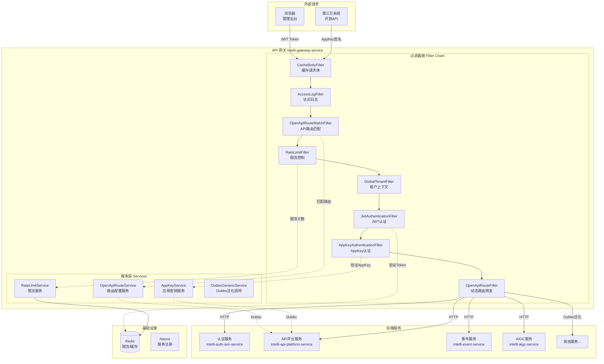
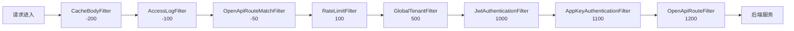
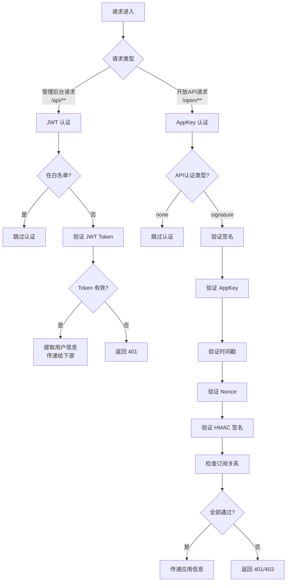
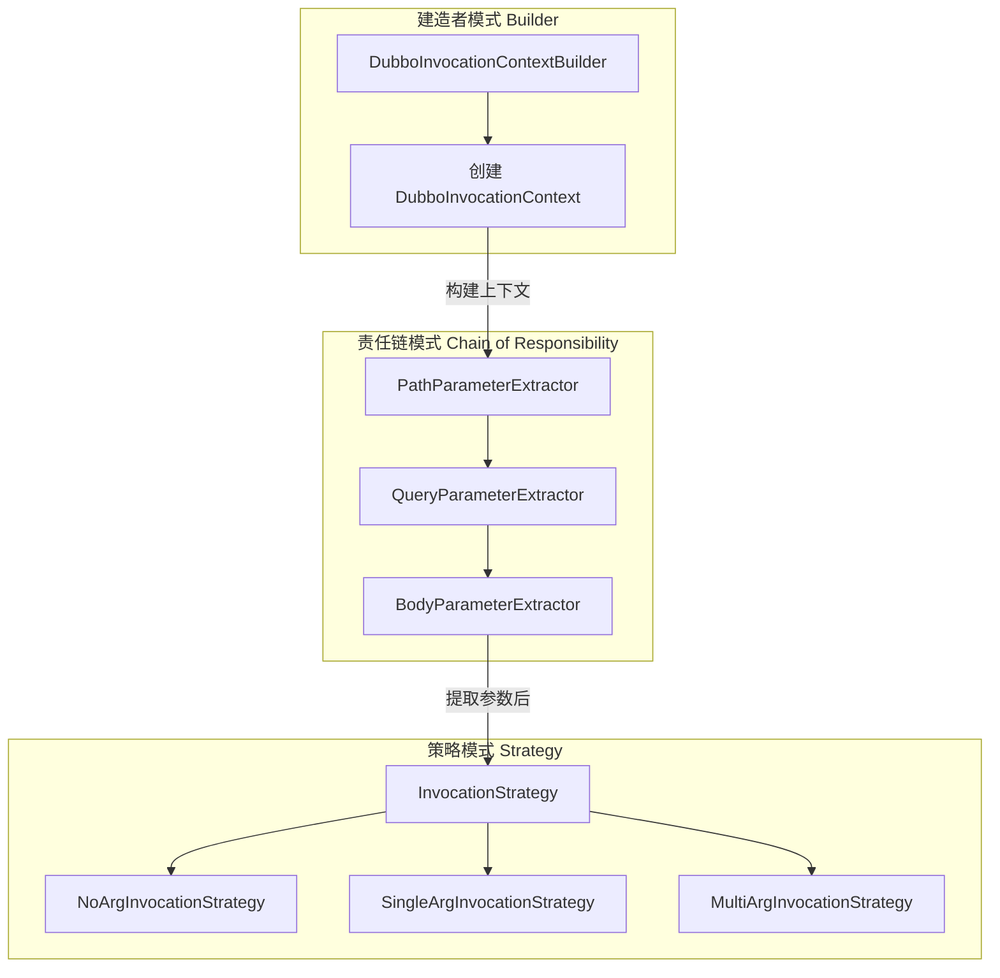
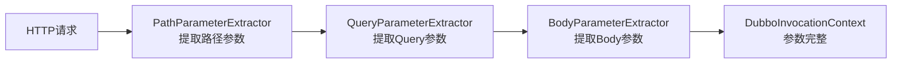
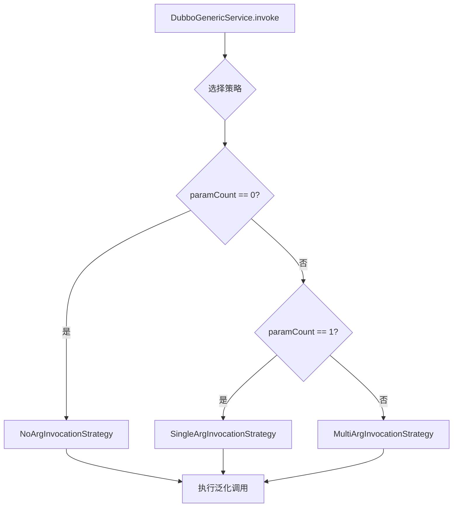
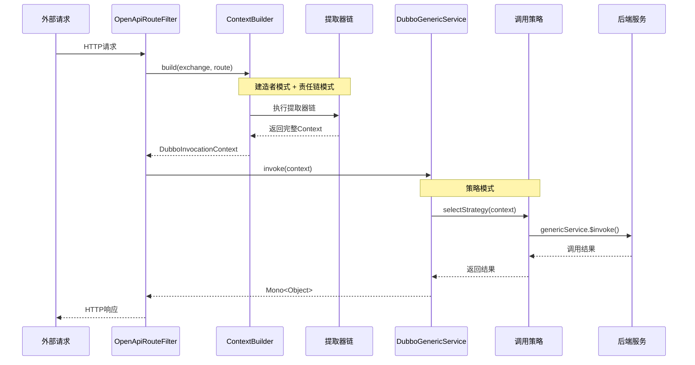
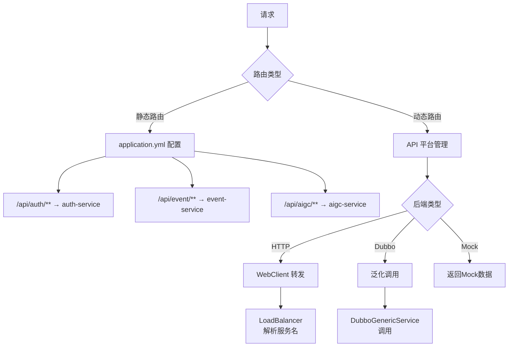
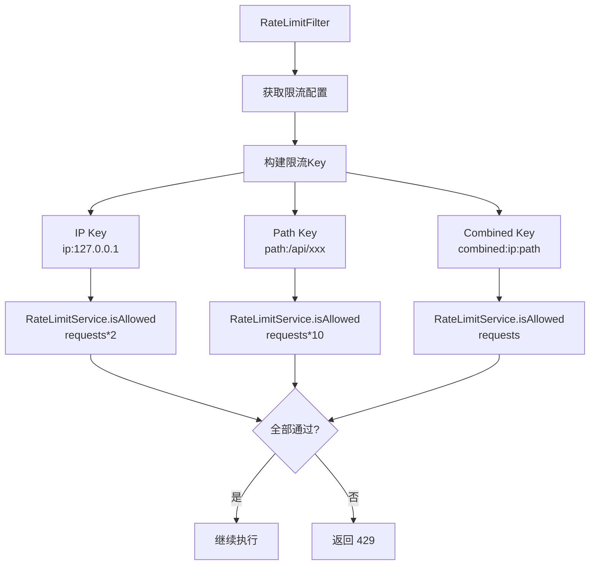

# IntelliHub API 网关技术实现文档

## 目录

1. [服务职责](#服务职责)
2. [整体架构](#整体架构)
3. [核心组件](#核心组件)
4. [过滤器链](#过滤器链)
5. [认证机制](#认证机制)
6. [设计模式](#设计模式)
7. [路由转发](#路由转发)
8. [限流机制](#限流机制)
9. [配置说明](#配置说明)
10. [常见问题](#常见问题)

---

## 服务职责

API 网关是 IntelliHub 平台的**统一入口**，负责所有外部请求的接入、认证、路由和转发。

### 核心职责

| 职责 | 说明 |
|------|------|
| **统一入口** | 所有请求通过网关进入，隐藏内部服务拓扑 |
| **身份认证** | JWT Token 认证（管理后台）、AppKey 签名认证（开放 API） |
| **动态路由** | 静态路由（配置文件）+ 动态路由（API 平台管理） |
| **限流保护** | 多维度限流（IP、路径、组合），防止资源耗尽 |
| **协议转换** | HTTP → HTTP、HTTP → Dubbo 泛化调用 |
| **访问日志** | 记录请求日志，支持调用链追踪 |
| **租户隔离** | 提取租户信息，传递给下游服务 |

---

## 整体架构

### 系统架构图



### 技术栈

| 组件 | 技术选型 | 说明 |
|------|----------|------|
| 网关框架 | Spring Cloud Gateway | 响应式网关，高性能 |
| 注册中心 | Nacos | 服务发现、配置中心 |
| RPC 框架 | Dubbo | 泛化调用后端服务 |
| 缓存 | Redis | 限流计数、Nonce 缓存 |
| 负载均衡 | Spring Cloud LoadBalancer | 服务负载均衡 |

---

## 核心组件

### 组件关系图


### 服务组件

| 组件 | 职责 | 依赖 |
|------|------|------|
| `OpenApiRouteService` | 加载/缓存 API 路由配置 | Dubbo (ApiPlatformDubboService) |
| `AppKeyService` | 验证 AppKey、检查订阅关系 | Dubbo (ApiPlatformDubboService) |
| `RateLimitService` | 限流计数、窗口控制 | Redis |
| `DubboGenericService` | Dubbo 泛化调用 | Dubbo Registry |

---

## 过滤器链

### 执行顺序



### 过滤器详解

#### 1. CacheBodyFilter (order: -200)

**职责**：缓存请求 Body，供后续过滤器读取

```java
// 将Body缓存到exchange属性
exchange.getAttributes().put(ATTR_CACHED_BODY, bodyString);
```

#### 2. AccessLogFilter (order: -100)

**职责**：记录访问日志，包含请求开始时间、耗时等

#### 3. OpenApiRouteMatchFilter (order: -50)

**职责**：匹配开放 API 路由，将路由配置存入 exchange 属性

```java
// 设置路由属性供后续过滤器使用
exchange.getAttributes().put(ATTR_API_ROUTE, route);
exchange.getAttributes().put(ATTR_API_ID, route.getApiId());
exchange.getAttributes().put(ATTR_IS_OPEN_API, true);
```

#### 4. RateLimitFilter (order: 100)

**职责**：多维度限流控制

- IP 级别限流（宽松）
- 路径级别限流
- IP+路径组合限流（严格）

#### 5. GlobalTenantFilter (order: 500)

**职责**：从请求头提取租户信息，设置租户上下文

#### 6. JwtAuthenticationFilter (order: 1000)

**职责**：验证 JWT Token（管理后台请求）

- 白名单检查
- Token 本地验证（无需调用 Auth 服务）
- 用户信息传递（X-User-Id, X-Username, X-Tenant-Id, X-User-Roles）

#### 7. AppKeyAuthenticationFilter (order: 1100)

**职责**：验证 AppKey 签名（开放 API 请求）

- AppKey 有效性验证
- HMAC-SHA256 签名验证
- 时间戳 + Nonce 防重放
- 订阅关系检查

#### 8. OpenApiRouteFilter (order: 1200)

**职责**：动态路由转发

- HTTP 后端转发（LoadBalancer 解析服务名）
- Dubbo 泛化调用
- Mock 响应返回

---

## 认证机制

### 双认证体系



### JWT 认证

**适用场景**：管理后台请求（/api/**）

**认证流程**：
1. 检查白名单（跳过）
2. 获取 `Authorization: Bearer <token>`
3. 本地验证 JWT（无需调用 Auth 服务）
4. 提取用户信息，添加到请求头

**传递的请求头**：
- `X-User-Id` - 用户ID
- `X-Username` - 用户名
- `X-Tenant-Id` - 租户ID
- `X-User-Roles` - 角色列表

### AppKey 认证

**适用场景**：开放 API 请求（/open/**, /external/**）

**认证流程**：
1. 检查 API 认证类型（none 跳过）
2. 验证必要请求头
3. 验证时间戳（防过期）
4. 验证 Nonce（防重放）
5. 验证 HMAC-SHA256 签名
6. 检查应用订阅关系

**请求头要求**：
- `X-App-Key` - 应用 Key
- `X-Timestamp` - 时间戳（秒级）
- `X-Nonce` - 随机字符串
- `X-Signature` - HMAC-SHA256 签名

**签名算法**：
```
签名字符串 = Method + Path + Timestamp + Nonce
签名 = HMAC-SHA256(签名字符串, AppSecret)
```

---

## 设计模式

网关在处理不同类型的外部接口时，采用了多种设计模式来提高代码的可扩展性和可维护性。

### 设计模式总览



### 1. 建造者模式 (Builder Pattern)

**应用场景**：构建 Dubbo 调用上下文

**核心类**：`DubboInvocationContextBuilder`

```java
/**
 * Dubbo调用上下文建造者
 * 负责构建完整的 DubboInvocationContext
 */
@Component
public class DubboInvocationContextBuilder {
    
    private final List<ParameterExtractor> extractors;
    
    public DubboInvocationContext build(ServerWebExchange exchange, ApiRouteDTO route) {
        // 1. 创建上下文对象，设置基础信息
        DubboInvocationContext context = DubboInvocationContext.builder()
                .route(route)
                .originalPath(originalPath)
                .httpMethod(exchange.getRequest().getMethod().name())
                .build();
        
        // 2. 执行参数提取器链
        for (ParameterExtractor extractor : extractors) {
            if (extractor.supports(exchange, context)) {
                extractor.extract(exchange, context);
            }
        }
        
        return context;
    }
}
```

**优点**：
- 将复杂对象的构建过程封装
- 支持分步骤构建
- 便于扩展新的构建逻辑

---

### 2. 责任链模式 (Chain of Responsibility Pattern)

**应用场景**：从 HTTP 请求中提取 Dubbo 调用参数

**核心接口**：`ParameterExtractor`

```java
/**
 * 参数提取器接口
 * 不同实现类负责从不同来源提取参数
 */
public interface ParameterExtractor {
    int getOrder();  // 执行顺序
    void extract(ServerWebExchange exchange, DubboInvocationContext context);
    default boolean supports(ServerWebExchange exchange, DubboInvocationContext context) {
        return true;
    }
}
```

**实现类**：

| 提取器 | 顺序 | 职责 |
|--------|------|------|
| `PathParameterExtractor` | 100 | 从 URL 路径提取参数（如 `/user/{id}`） |
| `QueryParameterExtractor` | 200 | 从 Query String 提取参数（如 `?name=xxx`） |
| `BodyParameterExtractor` | 300 | 从请求 Body 提取参数（JSON） |

**执行流程**：



**优点**：
- 解耦参数提取逻辑
- 新增参数来源只需添加新的提取器
- 提取器顺序可配置

---

### 3. 策略模式 (Strategy Pattern)

**应用场景**：根据参数数量选择不同的 Dubbo 调用方式

**核心接口**：`InvocationStrategy`

```java
/**
 * Dubbo调用策略接口
 * 定义不同参数数量场景下的泛化调用策略
 */
public interface InvocationStrategy {
    boolean supports(DubboInvocationContext context);
    Object invoke(GenericService genericService, DubboInvocationContext context);
    String getStrategyName();
}
```

**实现类**：

| 策略 | 适用场景 | 示例 |
|------|----------|------|
| `NoArgInvocationStrategy` | 无参数方法 | `listAll()` |
| `SingleArgInvocationStrategy` | 单参数方法 | `getById(String id)` |
| `MultiArgInvocationStrategy` | 多参数方法 | `query(String name, Integer page)` |

**策略选择流程**：



**代码示例（策略选择）**：

```java
@Service
public class DubboGenericService {
    
    private final List<InvocationStrategy> strategies;
    
    public Mono<Object> invoke(DubboInvocationContext context) {
        // 选择合适的调用策略
        InvocationStrategy strategy = selectStrategy(context);
        return strategy.invoke(genericService, context);
    }
    
    private InvocationStrategy selectStrategy(DubboInvocationContext context) {
        for (InvocationStrategy strategy : strategies) {
            if (strategy.supports(context)) {
                return strategy;
            }
        }
        throw new IllegalStateException("没有找到合适的调用策略");
    }
}
```

**优点**：
- 不同调用方式解耦
- 新增调用策略无需修改现有代码
- 便于单元测试

---

### 4. 组合使用示例

**完整调用流程**：



---

## 路由转发

### 路由类型



### 静态路由配置

```yaml
spring:
  cloud:
    gateway:
      routes:
        - id: auth-service
          uri: lb://intelli-auth-iam-service
          predicates:
            - Path=/api/auth/**,/api/iam/**
          filters:
            - StripPrefix=1
            
        - id: event-service
          uri: lb://intelli-event-service
          predicates:
            - Path=/api/event/**
          filters:
            - StripPrefix=1
```

### 动态路由

由 `OpenApiRouteService` 从 API 平台服务加载：

- 启动时加载所有已发布路由
- 支持 Redis Pub/Sub 实时刷新
- 本地缓存 + Dubbo 懒加载

---

## 限流机制

### 限流架构



### 限流配置

```yaml
intellihub:
  gateway:
    rate-limit:
      enabled: true
      
      # 默认限流（每分钟100次）
      default-limit:
        requests: 100
        window: 60
      
      # 特定路径限流
      limits:
        "/api/auth/**":
          requests: 5
          window: 60
        "/api/search/**":
          requests: 200
          window: 60
```

### 限流算法

使用 Redis 实现固定窗口限流：
- `INCR` 计数
- `EXPIRE` 设置窗口过期
- 每次检查 TTL，丢失时重新设置

---

## 配置说明

### 核心配置项

| 配置项 | 说明 | 默认值 |
|--------|------|--------|
| `server.port` | 网关端口 | 8080 |
| `intellihub.gateway.auth.enabled` | 是否启用 JWT 认证 | true |
| `intellihub.gateway.auth.secret` | JWT 密钥 | - |
| `intellihub.gateway.rate-limit.enabled` | 是否启用限流 | true |
| `gateway.appkey.enabled` | 是否启用 AppKey 认证 | true |
| `gateway.appkey.timestamp-tolerance` | 时间戳容差（秒） | 300 |

### 白名单配置

```yaml
intellihub:
  gateway:
    whitelist:
      paths:
        - /actuator/**
        - /health/**
        - /api/auth/**
        - /swagger-ui/**
        - /open/**
        - /external/**
```

---

## 常见问题

### Q1: 请求返回 401 Unauthorized

**可能原因**：
1. JWT Token 过期或无效
2. AppKey 签名错误
3. 时间戳超出允许范围
4. Nonce 重复使用

**排查步骤**：
1. 检查 Authorization 头格式
2. 检查 Token 是否过期
3. 检查签名算法是否正确
4. 检查系统时间是否同步

### Q2: 请求返回 403 Forbidden

**可能原因**：
1. 应用未订阅该 API
2. 应用已禁用
3. 应用已过期

### Q3: 请求返回 429 Too Many Requests

**原因**：触发限流

**解决**：
1. 降低请求频率
2. 调整限流配置
3. 使用 Redis 清理限流计数

### Q4: 动态路由不生效

**可能原因**：
1. API 未发布
2. 路由缓存未刷新

**解决**：
1. 检查 API 发布状态
2. 调用刷新接口或重启网关

### Q5: Dubbo 泛化调用失败

**可能原因**：
1. 后端服务未启动
2. Dubbo 注册中心连接失败
3. 接口/方法名配置错误

---

## 版本历史

| 版本 | 日期 | 说明 |
|------|------|------|
| 1.0.0 | 2025-01-07 | 初始版本，实现 JWT/AppKey 认证、动态路由、限流 |
