# IntelliHub API 网关技术实现文档

## 目录

1. [服务职责](#服务职责)
2. [整体架构](#整体架构)
3. [核心组件](#核心组件)
4. [过滤器链](#过滤器链)
5. [认证机制](#认证机制)
6. [设计模式](#设计模式)
7. [路由转发](#路由转发)
8. [限流机制](#限流机制)
9. [响应缓存机制](#响应缓存机制)
10. [配置说明](#配置说明)
11. [常见问题](#常见问题)

12. [外部接口调用完整链路](#外部接口调用完整链路)

---

## 服务职责

API 网关是 IntelliHub 平台的**统一入口**，负责所有外部请求的接入、认证、路由和转发。

### 核心职责

| 职责 | 说明 |
|------|------|
| **统一入口** | 所有请求通过网关进入，隐藏内部服务拓扑 |
| **身份认证** | JWT Token 认证（管理后台）、AppKey 签名认证（开放 API） |
| **动态路由** | 静态路由（配置文件）+ 动态路由（API 平台管理） |
| **限流保护** | 多维度限流（IP、路径、组合），防止资源耗尽 |
| **响应缓存** | 智能缓存API响应，提升性能，减轻后端压力 |
| **协议转换** | HTTP → HTTP、HTTP → Dubbo 泛化调用 |
| **访问日志** | 记录请求日志，支持调用链追踪 |
| **租户隔离** | 提取租户信息，传递给下游服务 |

---

## 整体架构

### 系统架构图

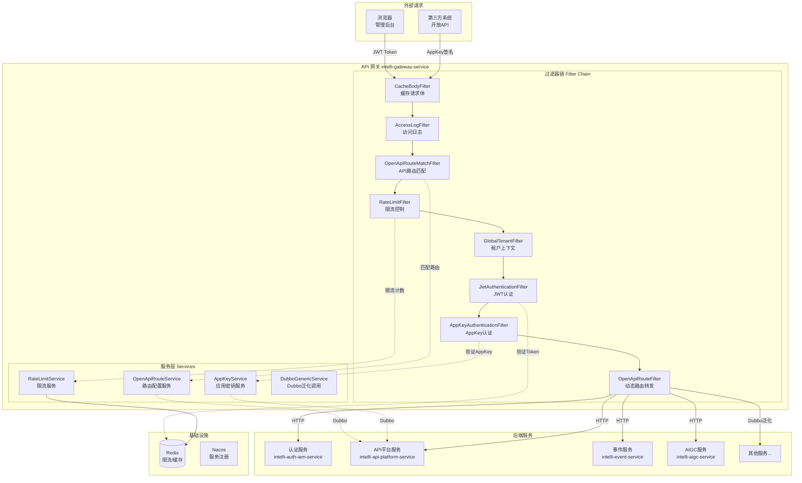

### 技术栈

| 组件 | 技术选型 | 说明 |
|------|----------|------|
| 网关框架 | Spring Cloud Gateway | 响应式网关，高性能 |
| 注册中心 | Nacos | 服务发现、配置中心 |
| RPC 框架 | Dubbo | 泛化调用后端服务 |
| 缓存 | Redis | 限流计数、Nonce 缓存、API响应缓存 |
| 负载均衡 | Spring Cloud LoadBalancer | 服务负载均衡 |

---

## 核心组件

### 组件关系图

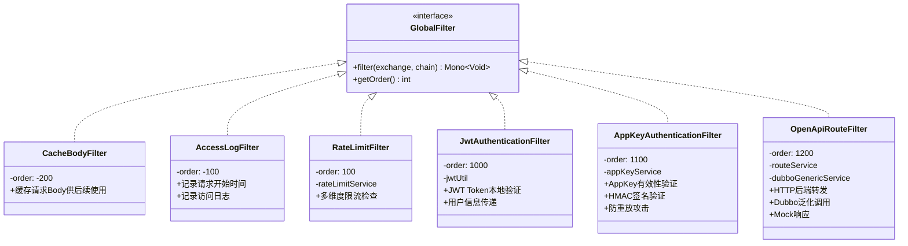

### 服务组件

| 组件 | 职责 | 依赖 |
|------|------|------|
| `OpenApiRouteService` | 加载/缓存 API 路由配置 | Dubbo (ApiPlatformDubboService) |
| `AppKeyService` | 验证 AppKey、检查订阅关系 | Dubbo (ApiPlatformDubboService) |
| `RateLimitService` | 限流计数、窗口控制 | Redis |
| `DubboGenericService` | Dubbo 泛化调用 | Dubbo Registry |

---

## 过滤器链

### 执行顺序

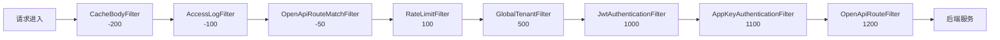

### 过滤器详解

#### 1. CacheBodyFilter (order: -200)

**职责**：缓存请求 Body，供后续过滤器读取

```java
// 将Body缓存到exchange属性
exchange.getAttributes().put(ATTR_CACHED_BODY, bodyString);
```

#### 2. AccessLogFilter (order: -100)

**职责**：记录访问日志，包含请求开始时间、耗时等

#### 3. OpenApiRouteMatchFilter (order: -50)

**职责**：匹配开放 API 路由，将路由配置存入 exchange 属性

```java
// 设置路由属性供后续过滤器使用
exchange.getAttributes().put(ATTR_API_ROUTE, route);
exchange.getAttributes().put(ATTR_API_ID, route.getApiId());
exchange.getAttributes().put(ATTR_IS_OPEN_API, true);
```

#### 4. RateLimitFilter (order: 100)

**职责**：多维度限流控制

- IP 级别限流（宽松）
- 路径级别限流
- IP+路径组合限流（严格）

#### 5. GlobalTenantFilter (order: 500)

**职责**：从请求头提取租户信息，设置租户上下文

#### 6. JwtAuthenticationFilter (order: 1000)

**职责**：验证 JWT Token（管理后台请求）

- 白名单检查
- Token 本地验证（无需调用 Auth 服务）
- 用户信息传递（X-User-Id, X-Username, X-Tenant-Id, X-User-Roles）

#### 7. AppKeyAuthenticationFilter (order: 1100)

**职责**：验证 AppKey 签名（开放 API 请求）

- AppKey 有效性验证
- HMAC-SHA256 签名验证
- 时间戳 + Nonce 防重放
- 订阅关系检查

#### 8. OpenApiRouteFilter (order: 1200)

**职责**：动态路由转发

- HTTP 后端转发（LoadBalancer 解析服务名）
- Dubbo 泛化调用
- Mock 响应返回

---

## 认证机制

### 双认证体系

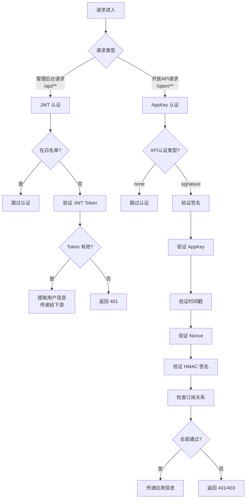

### JWT 认证

**适用场景**：管理后台请求（/api/**）

**认证流程**：
1. 检查白名单（跳过）
2. 获取 `Authorization: Bearer <token>`
3. 本地验证 JWT（无需调用 Auth 服务）
4. 提取用户信息，添加到请求头

**传递的请求头**：
- `X-User-Id` - 用户ID
- `X-Username` - 用户名
- `X-Tenant-Id` - 租户ID
- `X-User-Roles` - 角色列表

### AppKey 认证

**适用场景**：开放 API 请求（/open/**, /external/**）

**认证流程**：
1. 检查 API 认证类型（none 跳过）
2. 验证必要请求头
3. 验证时间戳（防过期）
4. 验证 Nonce（防重放）
5. 验证 HMAC-SHA256 签名
6. 检查应用订阅关系

**请求头要求**：
- `X-App-Key` - 应用 Key
- `X-Timestamp` - 时间戳（秒级）
- `X-Nonce` - 随机字符串
- `X-Signature` - HMAC-SHA256 签名

**签名算法**：
```
签名字符串 = Method + Path + Timestamp + Nonce
签名 = HMAC-SHA256(签名字符串, AppSecret)
```

---

## 设计模式

网关在处理不同类型的外部接口时，采用了多种设计模式来提高代码的可扩展性和可维护性。

### 设计模式总览

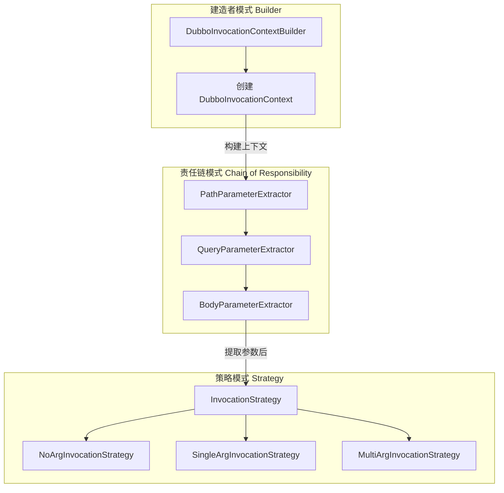

### 1. 建造者模式 (Builder Pattern)

**应用场景**：构建 Dubbo 调用上下文

**核心类**：`DubboInvocationContextBuilder`

```java
/**
 * Dubbo调用上下文建造者
 * 负责构建完整的 DubboInvocationContext
 */
@Component
public class DubboInvocationContextBuilder {
    
    private final List<ParameterExtractor> extractors;
    
    public DubboInvocationContext build(ServerWebExchange exchange, ApiRouteDTO route) {
        // 1. 创建上下文对象，设置基础信息
        DubboInvocationContext context = DubboInvocationContext.builder()
                .route(route)
                .originalPath(originalPath)
                .httpMethod(exchange.getRequest().getMethod().name())
                .build();
        
        // 2. 执行参数提取器链
        for (ParameterExtractor extractor : extractors) {
            if (extractor.supports(exchange, context)) {
                extractor.extract(exchange, context);
            }
        }
        
        return context;
    }
}
```

**优点**：
- 将复杂对象的构建过程封装
- 支持分步骤构建
- 便于扩展新的构建逻辑

---

### 2. 责任链模式 (Chain of Responsibility Pattern)

**应用场景**：从 HTTP 请求中提取 Dubbo 调用参数

**核心接口**：`ParameterExtractor`

```java
/**
 * 参数提取器接口
 * 不同实现类负责从不同来源提取参数
 */
public interface ParameterExtractor {
    int getOrder();  // 执行顺序
    void extract(ServerWebExchange exchange, DubboInvocationContext context);
    default boolean supports(ServerWebExchange exchange, DubboInvocationContext context) {
        return true;
    }
}
```

**实现类**：

| 提取器 | 顺序 | 职责 |
|--------|------|------|
| `PathParameterExtractor` | 100 | 从 URL 路径提取参数（如 `/user/{id}`） |
| `QueryParameterExtractor` | 200 | 从 Query String 提取参数（如 `?name=xxx`） |
| `BodyParameterExtractor` | 300 | 从请求 Body 提取参数（JSON） |

**执行流程**：

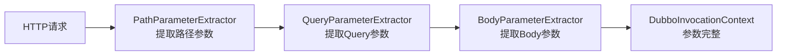

**优点**：
- 解耦参数提取逻辑
- 新增参数来源只需添加新的提取器
- 提取器顺序可配置

---

### 3. 策略模式 (Strategy Pattern)

**应用场景**：根据参数数量选择不同的 Dubbo 调用方式

**核心接口**：`InvocationStrategy`

```java
/**
 * Dubbo调用策略接口
 * 定义不同参数数量场景下的泛化调用策略
 */
public interface InvocationStrategy {
    boolean supports(DubboInvocationContext context);
    Object invoke(GenericService genericService, DubboInvocationContext context);
    String getStrategyName();
}
```

**实现类**：

| 策略 | 适用场景 | 示例 |
|------|----------|------|
| `NoArgInvocationStrategy` | 无参数方法 | `listAll()` |
| `SingleArgInvocationStrategy` | 单参数方法 | `getById(String id)` |
| `MultiArgInvocationStrategy` | 多参数方法 | `query(String name, Integer page)` |

**策略选择流程**：

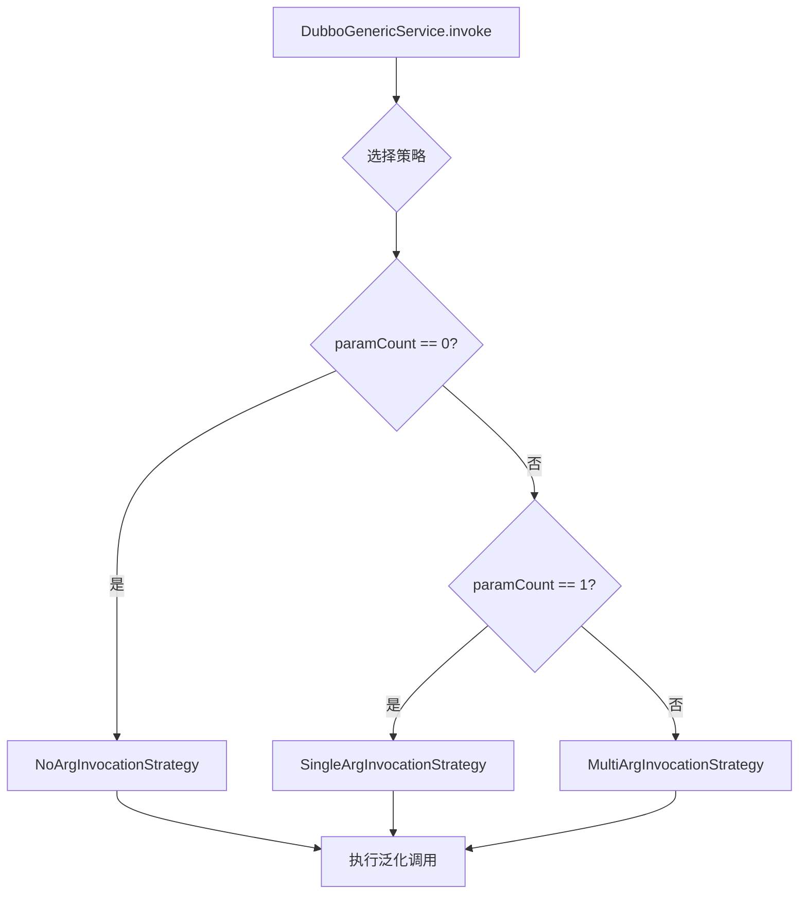

**代码示例（策略选择）**：

```java
@Service
public class DubboGenericService {
    
    private final List<InvocationStrategy> strategies;
    
    public Mono<Object> invoke(DubboInvocationContext context) {
        // 选择合适的调用策略
        InvocationStrategy strategy = selectStrategy(context);
        return strategy.invoke(genericService, context);
    }
    
    private InvocationStrategy selectStrategy(DubboInvocationContext context) {
        for (InvocationStrategy strategy : strategies) {
            if (strategy.supports(context)) {
                return strategy;
            }
        }
        throw new IllegalStateException("没有找到合适的调用策略");
    }
}
```

**优点**：
- 不同调用方式解耦
- 新增调用策略无需修改现有代码
- 便于单元测试

---

### 4. 组合使用示例

**完整调用流程**：

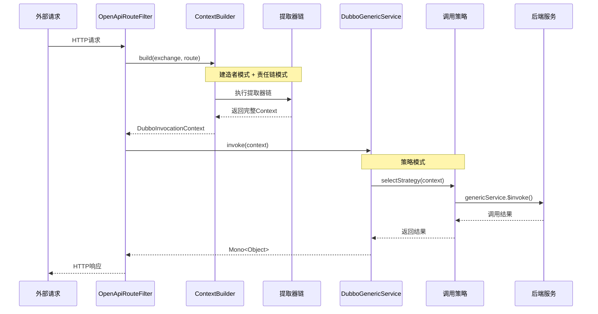

---

## 路由转发

### 路由类型

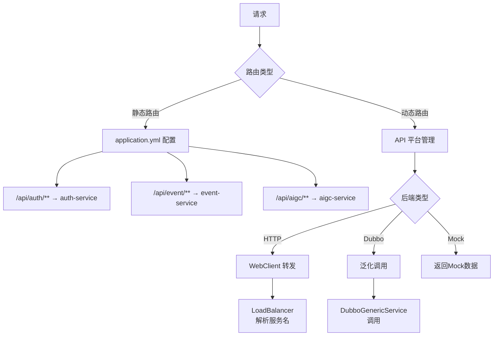

### 静态路由配置

```yaml
spring:
  cloud:
    gateway:
      routes:
        - id: auth-service
          uri: lb://intelli-auth-iam-service
          predicates:
            - Path=/api/auth/**,/api/iam/**
          filters:
            - StripPrefix=1
            
        - id: event-service
          uri: lb://intelli-event-service
          predicates:
            - Path=/api/event/**
          filters:
            - StripPrefix=1
```

### 动态路由

由 `OpenApiRouteService` 从 API 平台服务加载：

- 启动时加载所有已发布路由
- 支持 Redis Pub/Sub 实时刷新
- 本地缓存 + Dubbo 懒加载

---

## 限流机制

### 限流架构

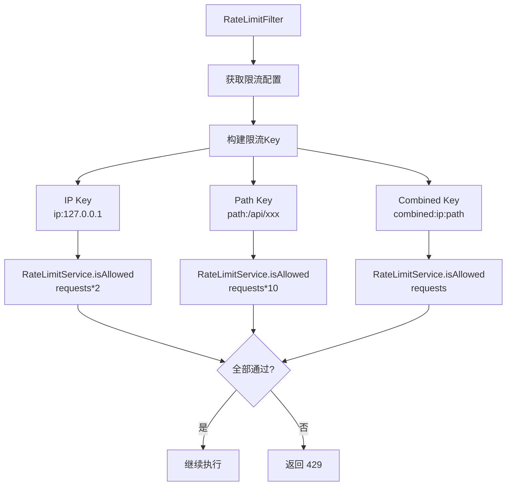

### 限流配置

```yaml
intellihub:
  gateway:
    rate-limit:
      enabled: true
      
      # 默认限流（每分钟100次）
      default-limit:
        requests: 100
        window: 60
      
      # 特定路径限流
      limits:
        "/api/auth/**":
          requests: 5
          window: 60
        "/api/search/**":
          requests: 200
          window: 60
```

### 限流算法

使用 Redis 实现固定窗口限流：
- `INCR` 计数
- `EXPIRE` 设置窗口过期
- 每次检查 TTL，丢失时重新设置

---

## 响应缓存机制

### 缓存架构

网关支持对开放API的响应进行智能缓存，显著提升性能并减轻后端服务压力。

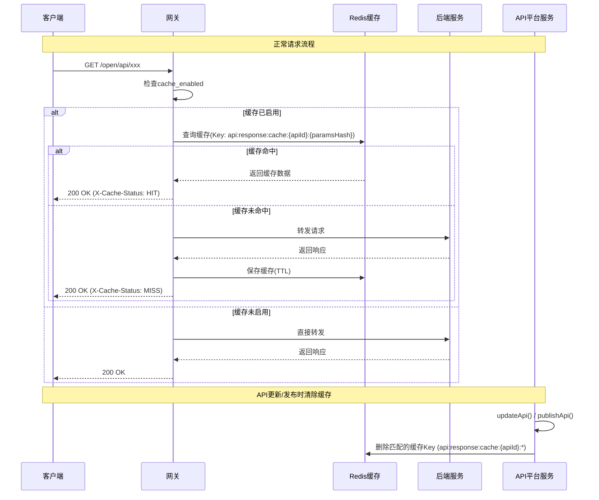

### 缓存策略

| 配置项 | 说明 | 示例 |
|--------|------|------|
| **缓存条件** | `api_info.cache_enabled = true` | 在API平台配置 |
| **缓存时间** | `api_info.cache_ttl`（秒） | 60秒 |
| **缓存Key** | `api:response:cache:{apiId}:{paramsHash}` | MD5哈希查询参数 |
| **缓存范围** | 仅GET请求 | POST/PUT/DELETE不缓存 |
| **失效机制** | TTL自动过期 + 主动清除 | API更新/发布时清除 |

### 缓存Key构建

```java
/**
 * 缓存Key格式：api:response:cache:{apiId}:{paramsHash}
 * - apiId: API唯一标识
 * - paramsHash: 查询参数的MD5哈希（无参数时为空字符串）
 */
private String buildCacheKey(ServerHttpRequest request, ApiRouteDTO route) {
    String queryParams = request.getURI().getQuery();
    
    String paramsHash = "";
    if (queryParams != null && !queryParams.isEmpty()) {
        paramsHash = DigestUtils.md5DigestAsHex(queryParams.getBytes(StandardCharsets.UTF_8));
    }
    
    return String.format("api:response:cache:%s:%s", route.getApiId(), paramsHash);
}
```

### 缓存失效机制

#### 1. TTL自动过期

Redis根据配置的`cacheTtl`自动过期缓存。

#### 2. 主动清除缓存

在API平台服务中，当API更新或发布时，主动清除所有相关缓存：

```java
/**
 * 清除API的所有响应缓存
 * 在 ApiInfoServiceImpl 中实现
 */
private void clearApiCache(String apiId) {
    try {
        String pattern = "api:response:cache:" + apiId + ":*";
        Set<String> keys = redisTemplate.keys(pattern);
        if (keys != null && !keys.isEmpty()) {
            redisTemplate.delete(keys);
            log.info("API响应缓存已清除 - apiId: {}, count: {}", apiId, keys.size());
        }
    } catch (Exception e) {
        log.error("清除API响应缓存失败 - apiId: {}", apiId, e);
    }
}
```

**触发场景**：
- API发布（`publishApi`）
- API更新（`updateApi`）

### 监控指标

网关在响应头中添加缓存状态，便于监控和调试：

| 响应头 | 值 | 说明 |
|--------|-----|------|
| `X-Cache-Status` | `HIT` | 缓存命中 |
| `X-Cache-Status` | `MISS` | 缓存未命中 |

### 性能优化建议

1. **合理设置TTL**
   - 静态数据：300-600秒
   - 准实时数据：30-60秒
   - 频繁变化数据：不启用缓存

2. **监控缓存命中率**
   - 通过`X-Cache-Status`响应头统计
   - 目标命中率：>80%

3. **控制缓存大小**
   - 避免缓存大响应（建议<100KB）
   - 设置Redis maxmemory策略

4. **参数组合控制**
   - 避免参数组合爆炸
   - 对于复杂查询，考虑禁用缓存

### 使用示例

#### 在API平台配置缓存

```json
{
  "name": "获取用户列表",
  "path": "/open/users",
  "method": "GET",
  "cacheEnabled": true,
  "cacheTtl": 60
}
```

#### 客户端请求

```bash
# 第一次请求（缓存未命中）
curl -H "X-App-Key: xxx" \
     -H "X-Signature: xxx" \
     https://api.example.com/open/users?page=1

# 响应头：X-Cache-Status: MISS

# 第二次请求（缓存命中）
curl -H "X-App-Key: xxx" \
     -H "X-Signature: xxx" \
     https://api.example.com/open/users?page=1

# 响应头：X-Cache-Status: HIT
```

### 注意事项

1. **只缓存GET请求**：POST/PUT/DELETE等修改操作不会被缓存
2. **参数敏感**：不同的查询参数会生成不同的缓存Key
3. **缓存穿透**：首次请求仍需访问后端服务
4. **数据一致性**：缓存期间数据可能不是最新的，适用于对实时性要求不高的场景

---

## 外部接口调用完整链路

本章节详细描述一个外部 API 调用从进入网关到返回响应的完整流程，包含每一步执行的方法、使用的 Redis Key、调用的服务接口。

### 链路总览图

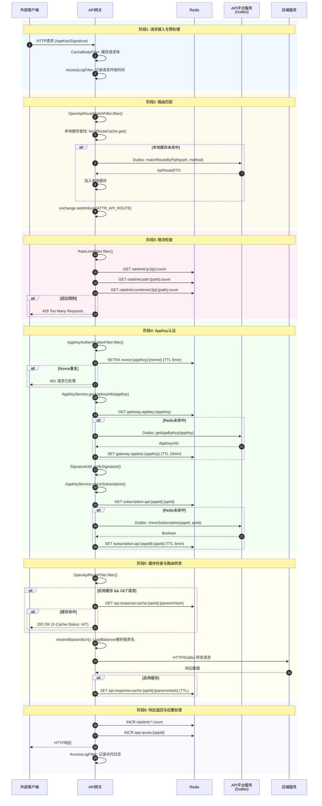

### 链路步骤详解

#### 步骤1: 请求接入与预处理

| 序号 | 过滤器 | 方法 | 说明 |
|------|---------|------|------|
| 1.1 | `CacheBodyFilter` | `filter()` | 缓存请求Body到`exchange.attributes` |
| 1.2 | `AccessLogFilter` | `filter()` | 记录`startTime`供后续计算耗时 |

```java
// CacheBodyFilter - 缓存Body
exchange.getAttributes().put("gateway.cached.body", bodyString);
```

---

#### 步骤2: API路由匹配

| 序号 | 组件 | 方法 | 说明 |
|------|------|------|------|
| 2.1 | `OpenApiRouteMatchFilter` | `filter()` | 过滤器入口 |
| 2.2 | `OpenApiRouteService` | `matchRoute(path, method)` | 匹配路由配置 |
| 2.3 | 本地缓存 | `localRouteCache.get(cacheKey)` | 优先本地缓存 |
| 2.4 | `ApiPlatformDubboService` | `matchRouteByPath(path, method)` | Dubbo远程调用 |

**缓存策略**：
- 本地缓存: `ConcurrentHashMap<String, ApiRouteDTO>`
- 缓存Key: `{path}:{METHOD}` (e.g., `/open/user/{id}:GET`)

**Dubbo接口**：
```java
// ApiPlatformDubboService
ApiRouteDTO matchRouteByPath(String path, String method);
ApiRouteDTO getRouteByApiId(String apiId);
List<ApiRouteDTO> getAllPublishedRoutes();
```

---

#### 步骤3: 限流检查

| 序号 | 组件 | 方法 | Redis Key | TTL |
|------|------|------|-----------|-----|
| 3.1 | `RateLimitFilter` | `filter()` | - | - |
| 3.2 | `RateLimitService` | `checkLimit(ipKey, ...)` | `intellihub:gateway:ratelimit:ip:{ip}:count` | window秒 |
| 3.3 | `RateLimitService` | `checkLimit(pathKey, ...)` | `intellihub:gateway:ratelimit:path:{path}:count` | window秒 |
| 3.4 | `RateLimitService` | `checkLimit(combinedKey, ...)` | `intellihub:gateway:ratelimit:combined:{ip}:{path}:count` | window秒 |

**限流算法**：
- 固定窗口: `INCR key` + `EXPIRE key window`
- 滑动窗口: `ZSET` + Lua脚本
- 令牌桶: `HASH` + Lua脚本

```java
// Redis Key构建
public static String buildRateLimitKey(String type, String value) {
    return "intellihub:gateway:ratelimit:" + type + ":" + value;
}
```

---

#### 步骤4: AppKey认证

| 序号 | 组件 | 方法 | Redis Key | TTL |
|------|------|------|-----------|-----|
| 4.1 | `AppKeyAuthenticationFilter` | `filter()` | - | - |
| 4.2 | `ReactiveRedisUtil` | `setIfAbsent()` | `intellihub:nonce:{appKey}:{nonce}` | 300s |
| 4.3 | `AppKeyService` | `getAppKeyInfo(appKey)` | `intellihub:gateway:appkey:{appKey}` | 600s |
| 4.4 | `SignatureUtil` | `verifySignature()` | - | - |
| 4.5 | `AppKeyService` | `checkSubscriptionByApiId()` | `intellihub:subscription:api:{appId}:{apiId}` | 300s |
| 4.6 | `AppKeyService` | `checkQuota()` | `app:quota:{appId}` | 24h |

**Nonce防重放**：
```java
// Redis Key
public static String buildNonceKey(String appKey, String nonce) {
    return "intellihub:nonce:" + appKey + ":" + nonce;
}
// TTL: 300秒 (5分钟)
```

**AppKey信息缓存**：
```java
// Redis Key
public static String buildAppKeyInfoKey(String appKey) {
    return "intellihub:gateway:appkey:" + appKey;
}
// TTL: 600秒 (10分钟)
```

**订阅关系缓存**：
```java
// Redis Key
public static String buildSubscriptionApiKey(String appId, String apiId) {
    return "intellihub:subscription:api:" + appId + ":" + apiId;
}
// TTL: 300秒 (5分钟)
```

**Dubbo接口**：
```java
// ApiPlatformDubboService
AppDTO getAppByKey(String appKey);
boolean checkSubscription(String appId, String apiId);
```

**签名验证**：
```java
// SignatureUtil.verifySignature()
String signString = method + path + timestamp + nonce;
String expected = HmacSHA256(signString, appSecret);
return expected.equals(signature);
```

---

#### 步骤5: 缓存检查与路由转发

| 序号 | 组件 | 方法 | Redis Key | TTL |
|------|------|------|-----------|-----|
| 5.1 | `OpenApiRouteFilter` | `filter()` | - | - |
| 5.2 | `OpenApiRouteFilter` | `buildCacheKey()` | `api:response:cache:{apiId}:{paramsHash}` | cacheTtl |
| 5.3 | `OpenApiRouteFilter` | `checkCacheAndForward()` | 同上 | - |
| 5.4 | `OpenApiRouteFilter` | `resolveBackendUri()` | - | - |
| 5.5 | `LoadBalancerClient` | `choose(serviceName)` | - | - |
| 5.6 | `WebClient` / `DubboGenericService` | HTTP转发 / Dubbo泛化调用 | - | - |

**响应缓存Key**：
```java
// 构建Key
private String buildCacheKey(ServerHttpRequest request, ApiRouteDTO route) {
    String queryParams = request.getURI().getQuery();
    String paramsHash = "";
    if (queryParams != null && !queryParams.isEmpty()) {
        paramsHash = DigestUtils.md5DigestAsHex(queryParams.getBytes());
    }
    return String.format("api:response:cache:%s:%s", route.getApiId(), paramsHash);
}
// TTL: api_info.cache_ttl (可配置)
```

**后端转发类型**：

| 类型 | 方法 | 说明 |
|------|------|------|
| HTTP | `forwardToHttpBackend()` | 使用WebClient转发，LoadBalancer解析服务名 |
| Dubbo | `forwardToDubboBackend()` | 使用泛化调用，支持多参数策略 |
| Mock | `handleMockResponse()` | 直接返回Mock数据 |

---

#### 步骤6: 响应返回与后置处理

| 序号 | 组件 | 方法 | Redis Key | 说明 |
|------|------|------|-----------|------|
| 6.1 | `RateLimitService` | `incrementCounter()` | `ratelimit:*:count` | 限流计数+1 |
| 6.2 | `AppKeyAuthenticationFilter` | `incrementQuotaAsync()` | `app:quota:{appId}` | 配额计数+1 |
| 6.3 | `AccessLogFilter` | - | - | 记录访问日志 |

---

### Redis Key汇总表

| Key模式 | 用途 | TTL | 数据类型 |
|---------|------|-----|----------|
| `intellihub:gateway:ratelimit:ip:{ip}:count` | IP级限流计数 | window秒 | String |
| `intellihub:gateway:ratelimit:path:{path}:count` | 路径级限流计数 | window秒 | String |
| `intellihub:gateway:ratelimit:combined:{ip}:{path}:count` | 组合限流计数 | window秒 | String |
| `intellihub:nonce:{appKey}:{nonce}` | Nonce防重放 | 300s | String |
| `intellihub:gateway:appkey:{appKey}` | AppKey信息缓存 | 600s | JSON |
| `intellihub:subscription:api:{appId}:{apiId}` | 订阅关系缓存 | 300s | Boolean |
| `app:quota:{appId}` | 应用调用配额 | 24h | String |
| `api:response:cache:{apiId}:{paramsHash}` | API响应缓存 | cacheTtl | JSON |

---

### Dubbo接口汇总表

| 接口类 | 方法 | 调用时机 |
|--------|------|----------|
| `ApiPlatformDubboService` | `matchRouteByPath(path, method)` | 路由匹配(本地未命中) |
| `ApiPlatformDubboService` | `getRouteByApiId(apiId)` | 刷新单个路由 |
| `ApiPlatformDubboService` | `getAllPublishedRoutes()` | 启动时加载全部路由 |
| `ApiPlatformDubboService` | `getAppByKey(appKey)` | 获取应用信息(缓存未命中) |
| `ApiPlatformDubboService` | `checkSubscription(appId, apiId)` | 检查订阅关系(缓存未命中) |

---

### 完整调用链路示例

以下是一个完整的外部API调用示例：

**请求**：
```http
GET /open/user/123 HTTP/1.1
Host: api.intellihub.com
X-App-Key: app_abc123
X-Timestamp: 1705395200
X-Nonce: random_string_xyz
X-Signature: hmac_sha256_signature
```

**执行流程**：

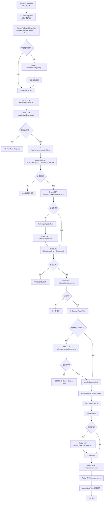

---

### 异常处理路径

| 错误码 | 触发条件 | 触发位置 |
|--------|----------|----------|
| 401 | 缺少认证头 | `AppKeyAuthenticationFilter` |
| 401 | 时间戳过期 | `AppKeyAuthenticationFilter` |
| 401 | Nonce重复 | `AppKeyAuthenticationFilter` |
| 401 | 签名验证失败 | `AppKeyAuthenticationFilter` |
| 401 | AppKey无效 | `AppKeyAuthenticationFilter` |
| 403 | 应用已禁用 | `AppKeyAuthenticationFilter` |
| 403 | 未订阅API | `AppKeyAuthenticationFilter` |
| 403 | 配额已用完 | `AppKeyAuthenticationFilter` |
| 403 | IP不在白名单 | `AppKeyAuthenticationFilter` |
| 404 | API不存在 | `OpenApiRouteFilter` |
| 429 | 超出限流 | `RateLimitFilter` |
| 502 | 后端服务调用失败 | `OpenApiRouteFilter` |

---

## 配置说明

### 核心配置项

| 配置项 | 说明 | 默认值 |
|--------|------|--------|
| `server.port` | 网关端口 | 8080 |
| `intellihub.gateway.auth.enabled` | 是否启用 JWT 认证 | true |
| `intellihub.gateway.auth.secret` | JWT 密钥 | - |
| `intellihub.gateway.rate-limit.enabled` | 是否启用限流 | true |
| `gateway.appkey.enabled` | 是否启用 AppKey 认证 | true |
| `gateway.appkey.timestamp-tolerance` | 时间戳容差（秒） | 300 |

### 白名单配置

```yaml
intellihub:
  gateway:
    whitelist:
      paths:
        - /actuator/**
        - /health/**
        - /api/auth/**
        - /swagger-ui/**
        - /open/**
        - /external/**
```

---

## 常见问题

### Q1: 请求返回 401 Unauthorized

**可能原因**：
1. JWT Token 过期或无效
2. AppKey 签名错误
3. 时间戳超出允许范围
4. Nonce 重复使用

**排查步骤**：
1. 检查 Authorization 头格式
2. 检查 Token 是否过期
3. 检查签名算法是否正确
4. 检查系统时间是否同步

### Q2: 请求返回 403 Forbidden

**可能原因**：
1. 应用未订阅该 API
2. 应用已禁用
3. 应用已过期

### Q3: 请求返回 429 Too Many Requests

**原因**：触发限流

**解决**：
1. 降低请求频率
2. 调整限流配置
3. 使用 Redis 清理限流计数

### Q4: 动态路由不生效

**可能原因**：
1. API 未发布
2. 路由缓存未刷新

**解决**：
1. 检查 API 发布状态
2. 调用刷新接口或重启网关

### Q5: Dubbo 泛化调用失败

**可能原因**：
1. 后端服务未启动
2. Dubbo 注册中心连接失败
3. 接口/方法名配置错误

### Q6: 缓存未生效或返回旧数据

**可能原因**：
1. API未启用缓存（`cache_enabled = false`）
2. 请求方法不是GET
3. 缓存TTL过长，数据已更新但缓存未过期

**解决**：
1. 检查API配置中的`cacheEnabled`和`cacheTtl`
2. 确认请求方法为GET
3. 更新API后会自动清除缓存
4. 手动清除：`redis-cli KEYS "api:response:cache:{apiId}:*" | xargs redis-cli DEL`

### Q7: 响应头显示 X-Cache-Status: MISS 但预期应该命中

**可能原因**：
1. 查询参数不同（参数顺序、大小写）
2. 缓存已过期
3. API刚更新/发布，缓存被清除
4. Redis连接失败

**排查步骤**：
1. 检查请求URL和参数是否完全一致
2. 查看Redis中的缓存Key：`redis-cli KEYS "api:response:cache:{apiId}:*"`
3. 检查网关日志中的缓存相关日志

---

## 响应式编程与 Mono 说明

Spring Cloud Gateway 基于 **Spring WebFlux** 构建，采用响应式编程模型。网关中大量使用的 `Mono` 和 `Flux` 是 **Project Reactor** 提供的异步非阻塞类型。

### 为什么使用响应式编程？

| 传统同步模式 | 响应式异步模式 |
|----------------|------------------|
| 线程阻塞等待I/O | 线程不阻塞，I/O完成后回调 |
| 一个请求占用一个线程 | 少量线程处理大量请求 |
| 高并发时线程耗尽 | 高并发时仍能高效运行 |

### Mono vs Flux

| 类型 | 说明 | 用途 |
|------|------|------|
| `Mono<T>` | 发射 **0或1** 个元素 | 单个结果（如查询单条记录、判断是否允许） |
| `Flux<T>` | 发射 **0到N** 个元素 | 多个结果（如查询列表、流式数据） |

### 网关中的 Mono 使用场景


### 代码示例

#### 示例1：Redis 异步操作

```java
/**
 * 传统同步写法（阻塞线程）
 */
public boolean checkNonceSync(String nonceKey) {
    // 线程在此阻塞，等待 Redis 返回
    Boolean result = redisTemplate.opsForValue().setIfAbsent(nonceKey, "1", 300, TimeUnit.SECONDS);
    return Boolean.TRUE.equals(result);
}

/**
 * 响应式异步写法（不阻塞线程）
 */
public Mono<Boolean> checkNonceAsync(String nonceKey) {
    // 立即返回 Mono，线程不阻塞
    // Redis 操作完成后，通过回调处理结果
    return reactiveRedisTemplate.opsForValue()
            .setIfAbsent(nonceKey, "1", Duration.ofSeconds(300));
}
```

#### 示例2：过滤器链式调用

```java
/**
 * AppKeyAuthenticationFilter 中的实际代码片段
 * 展示了多个异步操作的链式组合
 */
@Override
public Mono<Void> filter(ServerWebExchange exchange, GatewayFilterChain chain) {
    String appKey = getAppKey(exchange);
    String nonce = getNonce(exchange);
    String nonceKey = RedisKeyConstants.buildNonceKey(appKey, nonce);
    
    // 步骤1: 验证 Nonce（防重放）
    return redisUtil.setIfAbsent(nonceKey, "1", 300)  // Mono<Boolean>
            .flatMap(nonceSuccess -> {
                if (!nonceSuccess) {
                    // Nonce 已存在，拒绝请求
                    return handleUnauthorized(exchange, "请求已处理");
                }
                
                // 步骤2: 获取 AppKey 信息
                return appKeyService.getAppKeyInfo(appKey)  // Mono<AppKeyInfo>
                        .flatMap(appKeyInfo -> {
                            // 步骤3: 验证签名
                            boolean signatureValid = SignatureUtil.verifySignature(...);
                            if (!signatureValid) {
                                return handleUnauthorized(exchange, "签名验证失败");
                            }
                            

                            // 步骤4: 检查订阅关系
                            return appKeyService.checkSubscription(appKeyInfo.getAppId(), apiId)
                                    .flatMap(hasSubscription -> {
                                        if (!hasSubscription) {
                                            return handleForbidden(exchange, "未订阅该API");
                                        }
                                        
                                        // 所有检查通过，继续执行下一个过滤器
                                        return chain.filter(exchange);
                                    });
                        });
            });
}
```

**执行流程解读**：

```
请求进入
    ↓
[1] redisUtil.setIfAbsent() → 返回 Mono<Boolean>，不阻塞
    ↓ (异步回调)
flatMap: 如果 nonceSuccess = true
    ↓
[2] appKeyService.getAppKeyInfo() → 返回 Mono<AppKeyInfo>
    ↓ (异步回调)
flatMap: 如果 AppKeyInfo 存在
    ↓
[3] SignatureUtil.verifySignature() → 同步计算（CPU密集型）
    ↓
[4] appKeyService.checkSubscription() → 返回 Mono<Boolean>
    ↓ (异步回调)
flatMap: 如果 hasSubscription = true
    ↓
chain.filter() → 继续执行下一个过滤器
```


#### 示例3：并行执行多个异步操作

```java
/**
 * 同时检查多个限流维度（并行执行，提高性能）
 */
public Mono<Boolean> checkRateLimits(String ip, String path) {
    String ipKey = buildKey("ip", ip);
    String pathKey = buildKey("path", path);
    String combinedKey = buildKey("combined", ip + ":" + path);
    
    // 使用 Mono.zip 并行执行三个 Redis 查询
    return Mono.zip(
            checkLimit(ipKey, 1000, 60),        // IP 限流
            checkLimit(pathKey, 500, 60),       // 路径限流
            checkLimit(combinedKey, 100, 60)    // 组合限流
    ).map(tuple -> {
        // 三个检查都通过才允许
        return tuple.getT1().isAllowed() 
            && tuple.getT2().isAllowed() 
            && tuple.getT3().isAllowed();
    });
}
```

### 常用操作符说明

| 操作符          | 说明                          | 用途           |
| --------------- | ----------------------------- | -------------- |
| `flatMap`       | 将元素转换为新的 Mono/Flux    | 链式异步调用   |
| `map`           | 同步转换元素                  | 数据转换       |
| `then`          | 忽略当前结果，执行下一个 Mono | 执行完成后继续 |
| `switchIfEmpty` | 当 Mono 为空时的备选方案      | 默认值处理     |
| `onErrorResume` | 异常处理                      | 错误恢复       |
| `doOnNext`      | 副作用（不改变数据流）        | 日志记录       |
| `zip`           | 并行执行多个 Mono             | 并发查询       |
| `defer`         | 延迟创建 Mono                 | 懒加载         |

### 网关中的实际应用场景

```java
// 1. Redis 异步读取
Mono<String> cachedValue = redisTemplate.opsForValue().get(cacheKey);

// 2. Redis 异步写入
Mono<Boolean> setResult = redisTemplate.opsForValue().set(key, value, ttl);

// 3. Dubbo 调用包装为 Mono
Mono<ApiRouteDTO> route = Mono.fromCallable(() -> 
    apiPlatformDubboService.matchRouteByPath(path, method)
);

// 4. HTTP 转发
Mono<String> response = webClient.get()
    .uri(backendUri)
    .retrieve()
    .bodyToMono(String.class);

// 5. 过滤器链继续
Mono<Void> next = chain.filter(exchange);
```

### 性能优势


传统同步模式：
请求1 → [线程1阻塞等待Redis] → [阻塞等待Dubbo] → 返回
请求2 → [线程2阻塞等待Redis] → [阻塞等待Dubbo] → 返回
请求3 → [线程3阻塞等待Redis] → [阻塞等待Dubbo] → 返回
→ 需要 N 个线程处理 N 个请求

响应式异步模式：
请求1 → [提交Redis任务] → 线程空闲
请求2 → [提交Redis任务] → 线程空闲
请求3 → [提交Redis任务] → 线程空闲
         ...Redis返回...
[回调处理请求1] → [提交Dubbo任务] → 线程空闲
→ 少量线程即可处理大量并发请求
```

**结论**：在 API 网关这种 I/O 密集型场景中，响应式编程可以显著提升吹量和资源利用率。

---

## 版本历史

| 版本 | 日期 | 说明 |
|------|------|------|
| 1.0.0 | 2025-01-07 | 初始版本，实现 JWT/AppKey 认证、动态路由、限流 |
| 1.1.0 | 2026-01-16 | 新增API响应缓存机制，清理日志审计服务路由配置 |
| 1.2.0 | 2026-01-16 | 新增“外部接口调用完整链路”章节，详细描述每步方法、Redis Key、Dubbo接口 |
| 1.3.0 | 2026-01-16 | 新增“响应式编程与 Mono 说明”章节，解释异步非阻塞机制 |
