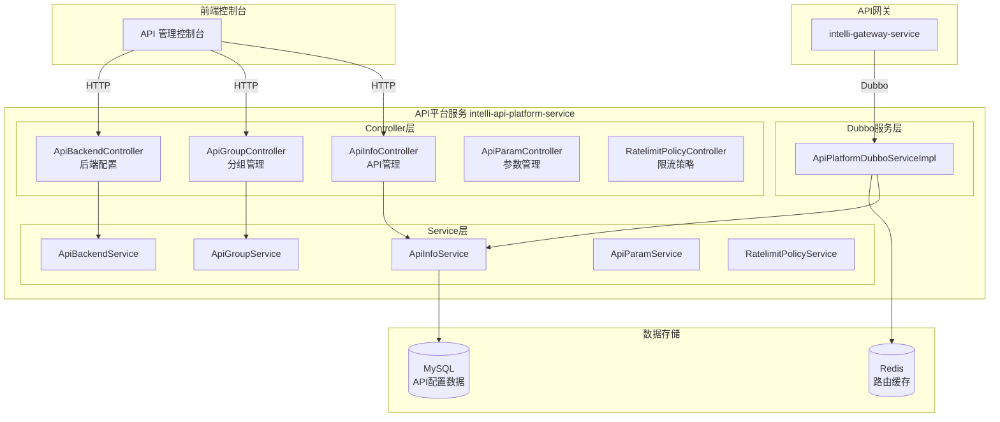
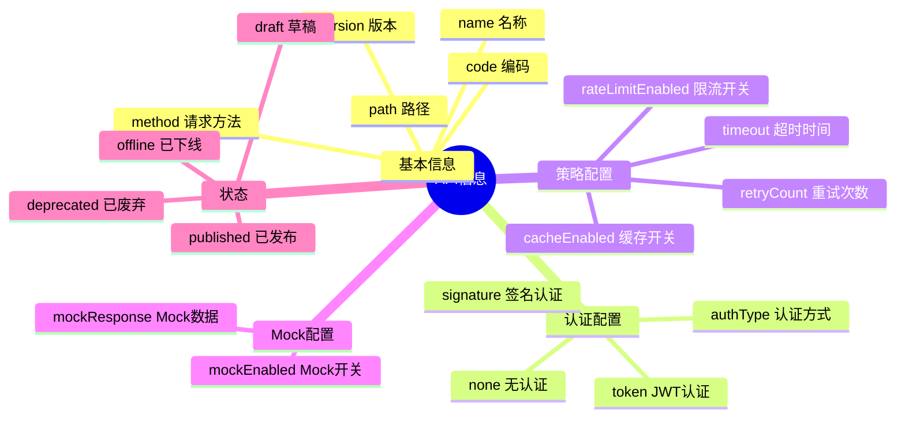
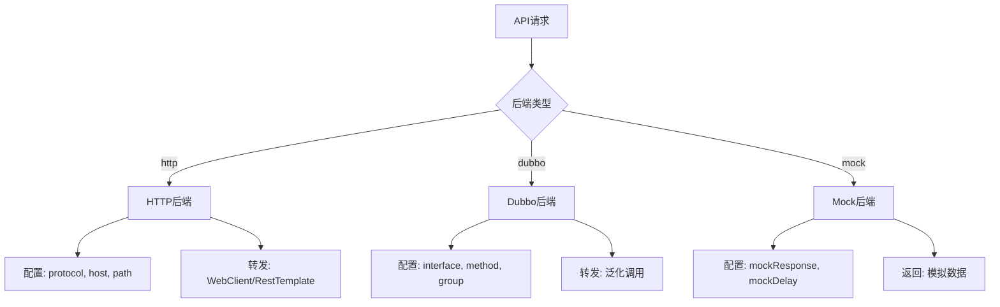
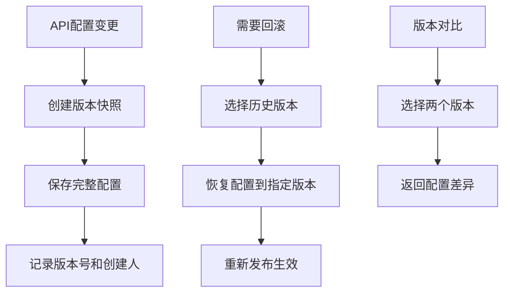
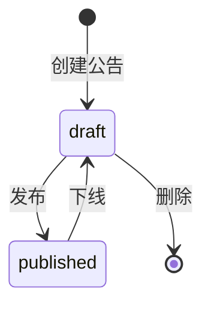
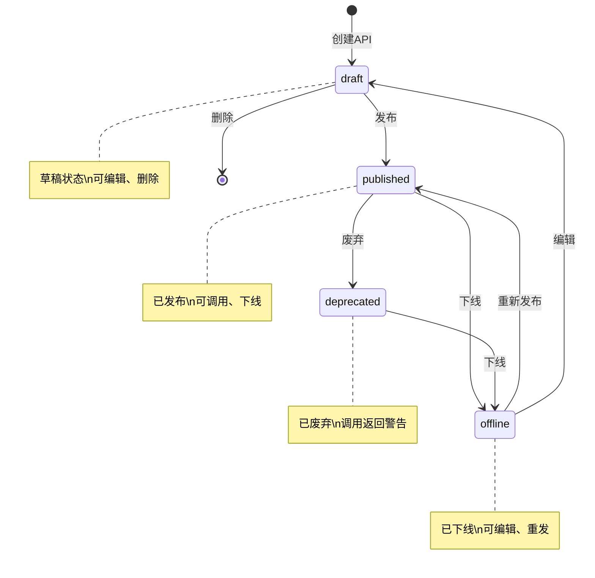
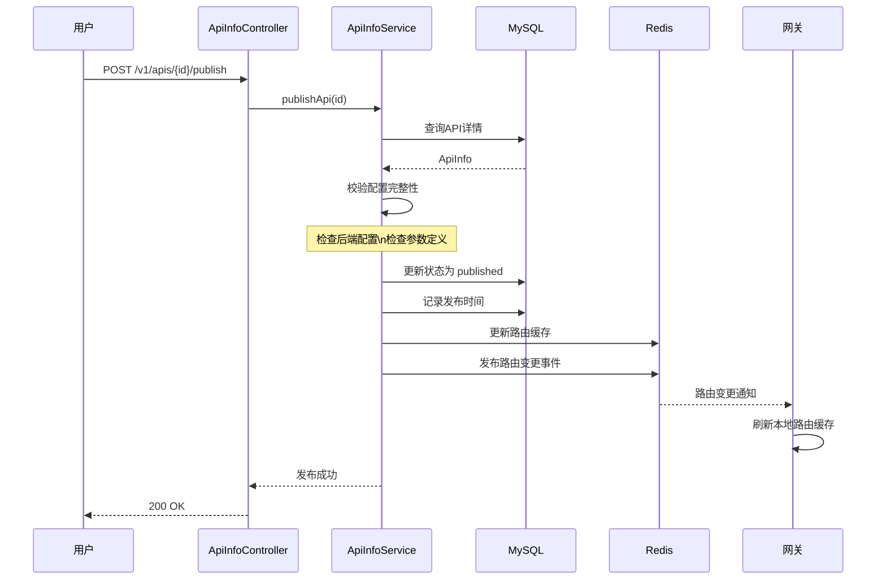
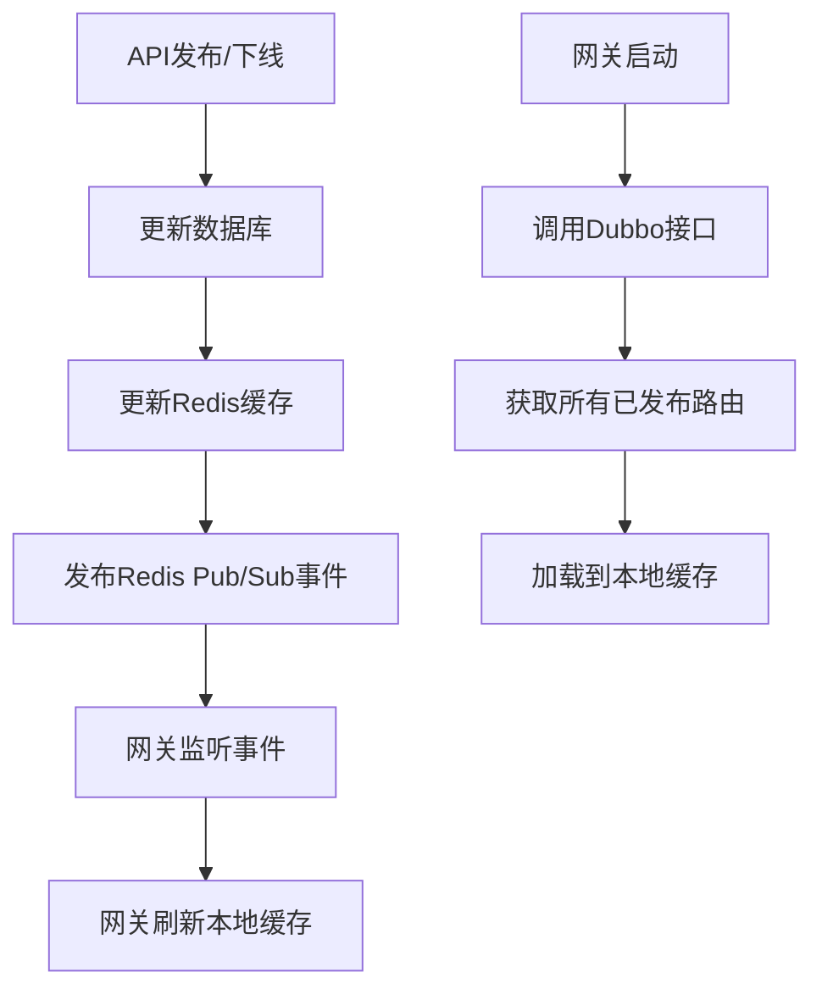
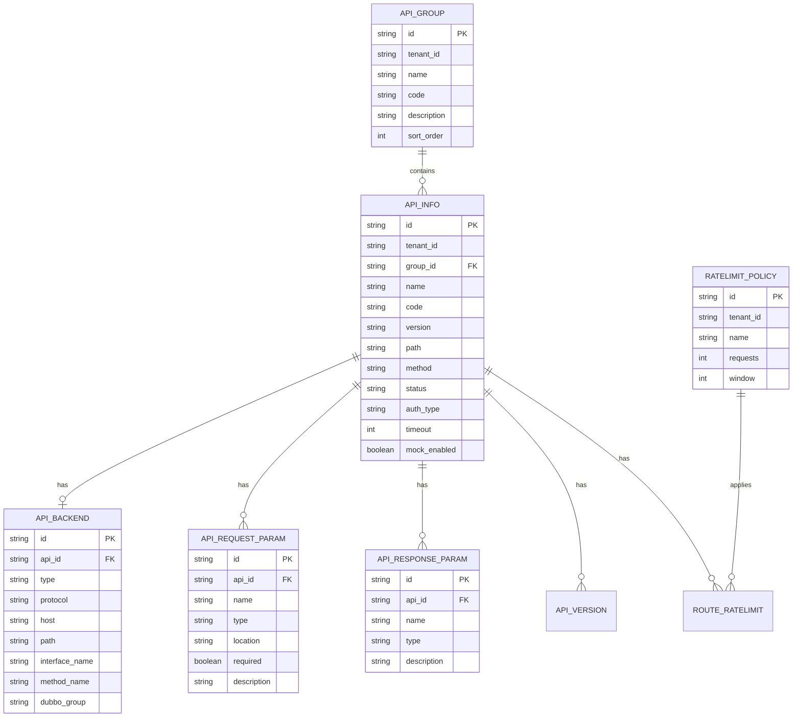

# IntelliHub API 平台服务实现文档

## 目录

1. [概述](#概述)
2. [整体架构](#整体架构)
3. [核心概念](#核心概念)
4. [功能模块详解](#功能模块详解)
   - API 管理
   - 分组管理
   - 后端配置管理
   - 参数管理
   - 限流策略管理
   - API 版本管理
   - 系统配置管理
   - 公告管理
5. [API 生命周期](#api-生命周期)
6. [路由配置](#路由配置)
7. [数据模型](#数据模型)
8. [Dubbo 服务](#dubbo-服务)
9. [配置说明](#配置说明)
10. [常见问题](#常见问题)

---

## 概述

API 平台服务是 IntelliHub 的**API 全生命周期管理中心**，负责 API 的定义、配置、发布和管理，为网关提供动态路由配置。

### 核心能力

| 能力 | 说明 |
|------|------|
| API 定义 | 创建、编辑、删除 API，支持版本管理 |
| 后端配置 | HTTP/Dubbo/Mock 三种后端类型 |
| 参数管理 | 请求参数、响应参数定义和校验 |
| 生命周期 | 草稿 → 发布 → 下线 → 废弃 |
| 分组管理 | API 分组分类，便于管理 |
| 路由同步 | 向网关提供动态路由配置 |
| 限流策略 | API 级别的限流策略配置 |

### 服务信息

| 项目 | 值 |
|------|-----|
| 服务名称 | intelli-api-platform-service |
| 端口 | 8082 |
| Dubbo 端口 | 20882 |
| 数据库 | intelli_hub_api_platform |

---

## 整体架构

### 系统架构图



### 技术栈

| 组件 | 技术选型 | 说明 |
|------|----------|------|
| 框架 | Spring Boot 2.x | 微服务基础框架 |
| ORM | MyBatis-Plus | 数据持久层 |
| RPC | Dubbo | 为网关提供路由查询服务 |
| 缓存 | Redis | 路由配置缓存 |
| 注册中心 | Nacos | 服务注册发现 |
| API文档 | SpringDoc OpenAPI | Swagger UI |

---

## 核心概念

### API 信息 (ApiInfo)

API 的核心元数据，包括名称、路径、方法、认证方式等。



### 后端配置 (ApiBackend)

定义 API 请求如何转发到后端服务。

| 后端类型 | 说明 | 配置项 |
|----------|------|--------|
| `http` | HTTP 后端 | protocol, host, path, method, timeout |
| `dubbo` | Dubbo 泛化调用 | interfaceName, methodName, dubboGroup, dubboVersion |
| `mock` | Mock 响应 | mockResponse, mockDelay |

### API 分组 (ApiGroup)

按业务领域或功能模块对 API 进行分组。

### API 参数

| 参数类型 | 实体类 | 说明 |
|----------|--------|------|
| 请求参数 | `ApiRequestParam` | 定义请求参数的名称、类型、位置、校验规则 |
| 响应参数 | `ApiResponseParam` | 定义响应字段的名称、类型、说明 |

---

## 功能模块详解

### 1. API 管理

**功能**：API 的全生命周期管理。

**API 接口**：

| 方法 | 路径 | 说明 |
|------|------|------|
| GET | `/v1/apis/list` | 分页查询 API 列表 |
| GET | `/v1/apis/{id}/detail` | 获取 API 详情 |
| POST | `/v1/apis/create` | 创建 API |
| POST | `/v1/apis/{id}/update` | 更新 API |
| POST | `/v1/apis/{id}/delete` | 删除 API |
| POST | `/v1/apis/{id}/publish` | 发布 API |
| POST | `/v1/apis/{id}/offline` | 下线 API |
| POST | `/v1/apis/{id}/deprecate` | 废弃 API |
| POST | `/v1/apis/{id}/copy` | 复制 API |
| GET | `/v1/apis/routes` | 获取已发布路由 |

**代码位置**：
- Controller: `ApiInfoController.java`
- Service: `ApiInfoService.java`
- Entity: `ApiInfo.java`

---

### 2. 分组管理

**功能**：API 分组的 CRUD。

**API 接口**：

| 方法 | 路径 | 说明 |
|------|------|------|
| GET | `/v1/api-groups/list` | 查询分组列表 |
| POST | `/v1/api-groups/create` | 创建分组 |
| POST | `/v1/api-groups/{id}/update` | 更新分组 |
| POST | `/v1/api-groups/{id}/delete` | 删除分组 |

**代码位置**：
- Controller: `ApiGroupController.java`
- Service: `ApiGroupService.java`
- Entity: `ApiGroup.java`

---

### 3. 后端配置管理

**功能**：配置 API 的后端转发目标。

**API 接口**：

| 方法 | 路径 | 说明 |
|------|------|------|
| GET | `/v1/apis/{apiId}/backend` | 获取后端配置 |
| POST | `/v1/apis/{apiId}/backend/save` | 保存后端配置 |

**后端类型说明**：



**代码位置**：
- Controller: `ApiBackendController.java`
- Service: `ApiBackendService.java`
- Entity: `ApiBackend.java`

---

### 4. 参数管理

**功能**：定义 API 的请求参数和响应参数。

**API 接口**：

| 方法 | 路径 | 说明 |
|------|------|------|
| GET | `/v1/apis/{apiId}/params/request` | 获取请求参数 |
| GET | `/v1/apis/{apiId}/params/response` | 获取响应参数 |
| POST | `/v1/apis/{apiId}/params/request/save` | 保存请求参数 |
| POST | `/v1/apis/{apiId}/params/response/save` | 保存响应参数 |

**参数位置**：

| 位置 | 说明 | 示例 |
|------|------|------|
| `PATH` | 路径参数 | `/user/{id}` |
| `QUERY` | 查询参数 | `?name=xxx` |
| `HEADER` | 请求头 | `X-Token: xxx` |
| `BODY` | 请求体 | JSON Body |

**代码位置**：
- Controller: `ApiParamController.java`
- Service: `ApiParamService.java`
- Entity: `ApiRequestParam.java`, `ApiResponseParam.java`

---

### 5. 限流策略管理

**功能**：定义和应用 API 限流策略。

**API 接口**：

| 方法 | 路径 | 说明 |
|------|------|------|
| GET | `/v1/ratelimit-policies/list` | 查询策略列表 |
| POST | `/v1/ratelimit-policies/create` | 创建策略 |
| POST | `/v1/ratelimit-policies/{id}/apply` | 应用到 API |

**代码位置**：
- Controller: `RatelimitPolicyController.java`
- Service: `RatelimitPolicyService.java`
- Entity: `RatelimitPolicy.java`

---

### 6. API 版本管理

**功能**：API 版本快照和历史管理，支持版本回滚和对比。

**API 接口**：

| 方法 | 路径 | 说明 |
|------|------|------|
| GET | `/v1/apis/{apiId}/versions/list` | 获取版本历史列表 |
| GET | `/v1/apis/{apiId}/versions/{versionId}/detail` | 获取版本详情 |
| POST | `/v1/apis/{apiId}/versions/create` | 创建新版本快照 |
| POST | `/v1/apis/{apiId}/versions/{versionId}/rollback` | 回滚到指定版本 |
| POST | `/v1/apis/{apiId}/versions/{versionId}/delete` | 删除版本 |
| GET | `/v1/apis/{apiId}/versions/compare` | 比较两个版本差异 |

**版本管理流程**：



**代码位置**：
- Controller: `ApiVersionController.java`
- Service: `ApiVersionService.java`
- Entity: `ApiVersion.java`

---

### 7. 系统配置管理

**功能**：租户级别的系统配置管理，支持多种配置类型。

**API 接口**：

| 方法 | 路径 | 说明 |
|------|------|------|
| GET | `/platform/v1/settings` | 获取所有配置 |
| GET | `/platform/v1/settings/{key}` | 获取指定配置 |
| POST | `/platform/v1/settings` | 批量设置配置 |
| PUT | `/platform/v1/settings/{key}` | 设置单个配置 |
| DELETE | `/platform/v1/settings/{key}` | 删除配置 |

**配置类型**：

| 类型 | 说明 | 示例 |
|------|------|------|
| `string` | 字符串 | 平台名称 |
| `number` | 数字 | 超时时间 |
| `boolean` | 布尔值 | 功能开关 |
| `json` | JSON 对象 | 复杂配置 |

**代码位置**：
- Controller: `SysConfigController.java`
- Service: `SysConfigService.java`
- Entity: `SysConfig.java`

---

### 8. 公告管理

**功能**：平台公告的发布和管理。

**API 接口**：

| 方法 | 路径 | 说明 |
|------|------|------|
| GET | `/platform/v1/announcements` | 分页查询公告列表 |
| GET | `/platform/v1/announcements/published` | 获取已发布公告 |
| GET | `/platform/v1/announcements/{id}` | 获取公告详情 |
| POST | `/platform/v1/announcements` | 创建公告 |
| PUT | `/platform/v1/announcements/{id}` | 更新公告 |
| POST | `/platform/v1/announcements/{id}/publish` | 发布公告 |
| POST | `/platform/v1/announcements/{id}/unpublish` | 下线公告 |
| DELETE | `/platform/v1/announcements/{id}` | 删除公告 |

**公告状态流转**：



**代码位置**：
- Controller: `AnnouncementController.java`
- Service: `AnnouncementService.java`
- Entity: `Announcement.java`

---

## API 生命周期

### 状态流转图



### 状态说明

| 状态 | 说明 | 可执行操作 |
|------|------|------------|
| `draft` | 草稿 | 编辑、删除、发布 |
| `published` | 已发布 | 下线、废弃 |
| `offline` | 已下线 | 编辑、重新发布 |
| `deprecated` | 已废弃 | 下线 |

### 发布流程



---

## 路由配置

### 路由数据结构

网关通过 Dubbo 接口获取路由配置：

```java
public class ApiRouteDTO {
    private String apiId;           // API ID
    private String path;            // 请求路径
    private String method;          // 请求方法
    private String authType;        // 认证类型
    
    // 后端配置
    private String backendType;     // http/dubbo/mock
    private String backendProtocol;
    private String backendHost;
    private String backendPath;
    private String backendMethod;
    
    // Dubbo配置
    private String dubboInterface;
    private String dubboMethod;
    private String dubboGroup;
    private String dubboVersion;
    
    // Mock配置
    private Boolean mockEnabled;
    private String mockResponse;
    
    // 其他配置
    private Integer timeout;
}
```

### 路由同步机制



---

## 数据模型

### E-R 图



### 核心表结构

```sql
-- API信息表
CREATE TABLE api_info (
    id VARCHAR(36) PRIMARY KEY,
    tenant_id VARCHAR(36) NOT NULL,
    group_id VARCHAR(36),
    name VARCHAR(100) NOT NULL,
    code VARCHAR(100),
    version VARCHAR(20) DEFAULT 'v1',
    description TEXT,
    method VARCHAR(10) NOT NULL,
    path VARCHAR(200) NOT NULL,
    protocol VARCHAR(10) DEFAULT 'HTTP',
    content_type VARCHAR(50),
    status VARCHAR(20) DEFAULT 'draft',
    auth_type VARCHAR(20) DEFAULT 'none',
    timeout INT DEFAULT 5000,
    retry_count INT DEFAULT 0,
    cache_enabled TINYINT DEFAULT 0,
    cache_ttl INT DEFAULT 60,
    rate_limit_enabled TINYINT DEFAULT 0,
    rate_limit_qps INT,
    mock_enabled TINYINT DEFAULT 0,
    mock_response TEXT,
    created_by VARCHAR(36),
    creator_name VARCHAR(50),
    published_at DATETIME,
    created_at DATETIME DEFAULT CURRENT_TIMESTAMP,
    updated_at DATETIME DEFAULT CURRENT_TIMESTAMP ON UPDATE CURRENT_TIMESTAMP,
    deleted_at DATETIME,
    INDEX idx_tenant_status (tenant_id, status),
    INDEX idx_group (group_id)
);

-- API后端配置表
CREATE TABLE api_backend (
    id VARCHAR(36) PRIMARY KEY,
    api_id VARCHAR(36) NOT NULL,
    type VARCHAR(20) NOT NULL COMMENT 'http/dubbo/mock',
    protocol VARCHAR(10) DEFAULT 'HTTP',
    method VARCHAR(10),
    host VARCHAR(200),
    path VARCHAR(200),
    timeout INT DEFAULT 5000,
    connect_timeout INT DEFAULT 3000,
    interface_name VARCHAR(200) COMMENT 'Dubbo接口',
    method_name VARCHAR(100) COMMENT 'Dubbo方法',
    dubbo_version VARCHAR(20),
    dubbo_group VARCHAR(50),
    mock_delay INT DEFAULT 0,
    created_at DATETIME DEFAULT CURRENT_TIMESTAMP,
    updated_at DATETIME DEFAULT CURRENT_TIMESTAMP ON UPDATE CURRENT_TIMESTAMP,
    UNIQUE KEY uk_api_id (api_id)
);

-- API请求参数表
CREATE TABLE api_request_param (
    id VARCHAR(36) PRIMARY KEY,
    api_id VARCHAR(36) NOT NULL,
    name VARCHAR(100) NOT NULL,
    type VARCHAR(20) NOT NULL,
    location VARCHAR(20) NOT NULL COMMENT 'PATH/QUERY/HEADER/BODY',
    required TINYINT DEFAULT 0,
    default_value VARCHAR(200),
    description TEXT,
    example VARCHAR(500),
    sort_order INT DEFAULT 0,
    created_at DATETIME DEFAULT CURRENT_TIMESTAMP,
    INDEX idx_api_id (api_id)
);

-- API分组表
CREATE TABLE api_group (
    id VARCHAR(36) PRIMARY KEY,
    tenant_id VARCHAR(36) NOT NULL,
    name VARCHAR(100) NOT NULL,
    code VARCHAR(50),
    description TEXT,
    sort_order INT DEFAULT 0,
    created_at DATETIME DEFAULT CURRENT_TIMESTAMP,
    updated_at DATETIME DEFAULT CURRENT_TIMESTAMP ON UPDATE CURRENT_TIMESTAMP,
    INDEX idx_tenant (tenant_id)
);
```

---

## Dubbo 服务

### 服务接口

API 平台通过 Dubbo 向网关提供路由查询服务：

```java
public interface ApiPlatformDubboService {
    
    /**
     * 获取所有已发布的API路由配置
     */
    List<ApiRouteDTO> getAllPublishedRoutes();
    
    /**
     * 根据路径和方法获取路由配置
     */
    ApiRouteDTO getRouteByPath(String path, String method);
    
    /**
     * 根据API ID获取路由配置
     */
    ApiRouteDTO getRouteByApiId(String apiId);
    
    /**
     * 匹配路由（支持路径参数）
     */
    ApiRouteDTO matchRouteByPath(String requestPath, String method);
    
    /**
     * 获取AppKey信息
     */
    AppKeyInfo getAppKeyInfo(String appKey);
    
    /**
     * 检查应用订阅关系
     */
    boolean checkSubscription(String appId, String apiId);
}
```

### Dubbo 配置

```yaml
dubbo:
  application:
    name: intelli-api-platform-dubbo
  registry:
    address: nacos://127.0.0.1:8848
  protocol:
    name: dubbo
    port: 20882
  scan:
    base-packages: com.intellihub.api.service.dubbo
  provider:
    group: intellihub
```

---

## 配置说明

### 核心配置项

| 配置项 | 说明 | 默认值 |
|--------|------|--------|
| `server.port` | HTTP 端口 | 8082 |
| `dubbo.protocol.port` | Dubbo 端口 | 20882 |
| `dubbo.provider.group` | Dubbo 分组 | intellihub |

### 多租户配置

```yaml
intellihub:
  mybatis:
    tenant:
      enabled: true
      column: tenant_id
      ignore-tables:
        - sys_config
        - sys_announcement
```

---

## 常见问题

### Q1: API 发布失败怎么办？

**可能原因**：
1. 后端配置不完整
2. API 状态不是草稿或已下线
3. 路径重复

**排查步骤**：
1. 检查后端配置是否完整
2. 检查 API 当前状态
3. 查看日志中的具体错误信息

### Q2: 网关获取不到路由配置？

**可能原因**：
1. API 未发布
2. Dubbo 服务未注册
3. 网关与 API 平台分组不一致

**排查步骤**：
1. 确认 API 状态为 `published`
2. 检查 Nacos 中 Dubbo 服务是否注册
3. 确认 `dubbo.provider.group` 配置一致

### Q3: 如何支持新的后端类型？

1. 在 `ApiBackend` 实体添加相关字段
2. 在网关 `OpenApiRouteFilter` 添加转发逻辑
3. 更新前端配置界面

### Q4: API 路径支持哪些格式？

支持：
- 固定路径：`/api/user/list`
- 路径参数：`/api/user/{id}`
- 通配符：`/api/user/**`

### Q5: 如何实现 API 版本管理？

1. 在路径中包含版本号：`/v1/user/list`、`/v2/user/list`
2. 使用 `ApiVersion` 实体管理版本历史
3. 支持版本切换和回滚

---

## 版本历史

| 版本 | 日期 | 说明 |
|------|------|------|
| 1.0.0 | 2025-01-07 | 初始版本，实现 API 全生命周期管理、后端配置、参数管理、路由同步 |
