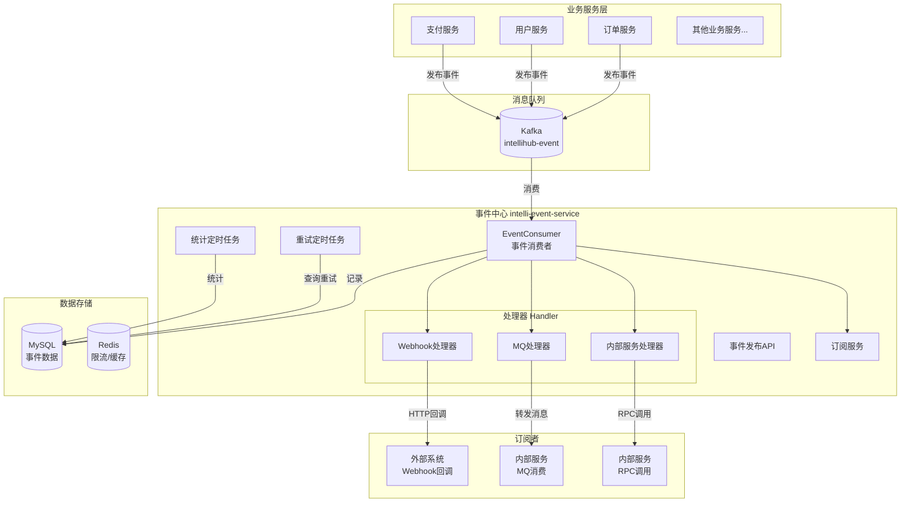
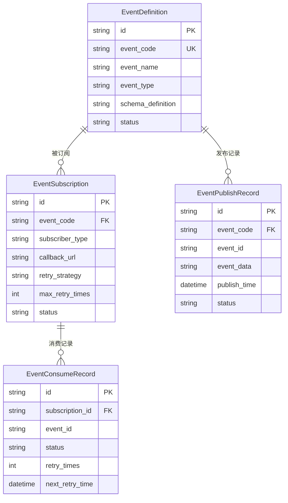
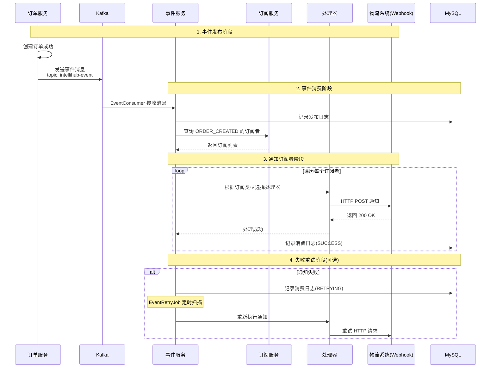
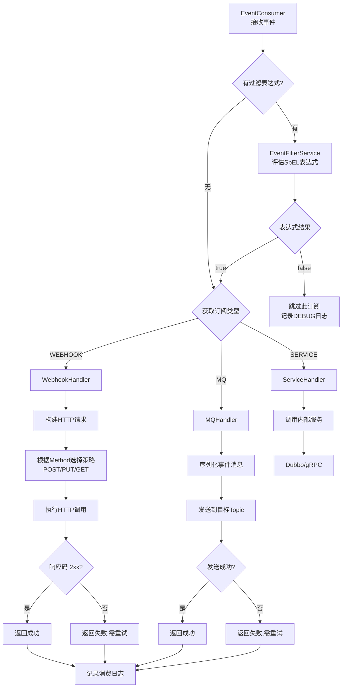
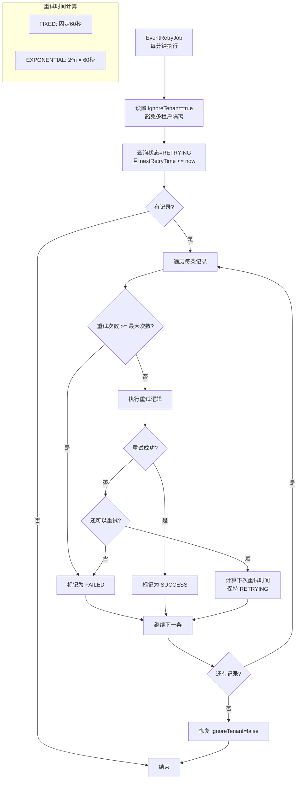
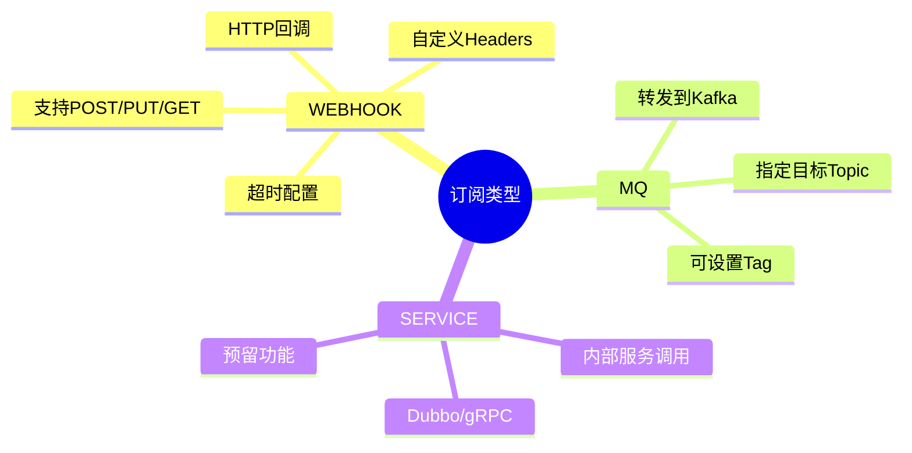
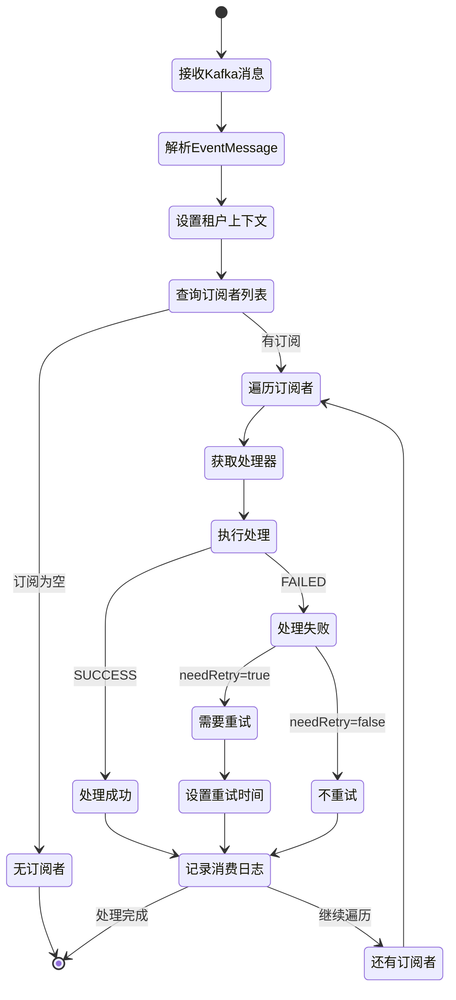

# IntelliHub 事件中心实现文档

## 目录

1. [概述](#概述)
2. [整体架构](#整体架构)
3. [核心概念](#核心概念)
4. [微服务交互流程](#微服务交互流程)
5. [功能模块详解](#功能模块详解)
6. [使用指南](#使用指南)
7. [配置说明](#配置说明)
8. [数据模型](#数据模型)

---

## 概述

事件中心是 IntelliHub 平台的核心基础设施，提供**统一的事件发布/订阅**能力，实现微服务之间的**松耦合通信**。

### 核心能力

| 能力 | 说明 |
|------|------|
| 事件定义 | 统一管理事件元数据，支持 JSON Schema 校验 |
| 事件订阅 | 支持 Webhook、MQ、内部服务等多种订阅方式 |
| 事件发布 | 通过 Kafka 异步发布事件，支持多租户隔离 |
| 事件消费 | 自动分发事件到所有订阅者，记录消费日志 |
| 失败重试 | 支持固定间隔和指数退避两种重试策略 |
| 数据统计 | 自动统计事件发布/消费数据，支持监控告警 |

---

## 整体架构

### 系统架构图



### 技术栈

| 组件 | 技术选型 | 说明 |
|------|----------|------|
| 消息队列 | Apache Kafka | 高吞吐、持久化、分布式 |
| 数据存储 | MySQL 8.0 | 事件定义、订阅、记录 |
| 缓存 | Redis | 限流、缓存热点数据 |
| 服务框架 | Spring Boot 2.7 | 微服务基础框架 |
| ORM | MyBatis-Plus | 简化数据访问 |
| 注册中心 | Nacos | 服务注册与配置中心 |

---

## 核心概念

### 概念关系图



### 概念说明

#### 1. 事件定义 (EventDefinition)

事件的元数据定义，描述"这是什么事件"。

```json
{
  "eventCode": "ORDER_CREATED",
  "eventName": "订单创建事件",
  "eventType": "BUSINESS",
  "schemaDefinition": {
    "type": "object",
    "properties": {
      "orderId": { "type": "string" },
      "amount": { "type": "number" }
    }
  }
}
```

#### 2. 事件订阅 (EventSubscription)

订阅者注册监听某个事件，定义"如何接收事件"。

```json
{
  "eventCode": "ORDER_CREATED",
  "subscriberType": "WEBHOOK",
  "subscriberName": "物流系统",
  "callbackUrl": "https://logistics.example.com/api/order/notify",
  "callbackMethod": "POST",
  "retryStrategy": "EXPONENTIAL",
  "maxRetryTimes": 3,
  "timeoutSeconds": 30
}
```

#### 3. 事件消息 (EventMessage)

事件发布时的消息体，描述"发生了什么事"。

```json
{
  "eventId": "evt_20250107_001",
  "eventCode": "ORDER_CREATED",
  "tenantId": "tenant_001",
  "source": "order-service",
  "timestamp": "2025-01-07T10:00:00Z",
  "data": {
    "orderId": "ORD123456",
    "amount": 199.00,
    "userId": "user_001"
  }
}
```

---

## 微服务交互流程

### 完整事件流程



### 订阅者类型处理流程（含过滤表达式）



### 重试机制流程



---

## 功能模块详解

### 1. 事件定义管理

**功能**：管理事件的元数据，包括事件编码、名称、类型、Schema 定义等。

**API 接口**：

| 方法 | 路径 | 说明 |
|------|------|------|
| GET | `/event/v1/event-definitions/list` | 查询事件定义列表 |
| GET | `/event/v1/event-definitions/{id}` | 查询事件定义详情 |
| POST | `/event/v1/event-definitions/create` | 创建事件定义 |
| POST | `/event/v1/event-definitions/{id}/update` | 更新事件定义 |
| POST | `/event/v1/event-definitions/{id}/delete` | 删除事件定义 |

**代码位置**：
- Controller: `EventDefinitionController.java`
- Entity: `EventDefinition.java`

---

### 2. 事件订阅管理

**功能**：管理事件订阅配置，支持 Webhook、MQ、内部服务等订阅方式。

**API 接口**：

| 方法 | 路径 | 说明 |
|------|------|------|
| GET | `/event/v1/event-subscriptions/list` | 查询订阅列表 |
| GET | `/event/v1/event-subscriptions/{id}` | 查询订阅详情 |
| POST | `/event/v1/event-subscriptions/create` | 创建订阅 |
| POST | `/event/v1/event-subscriptions/{id}/update` | 更新订阅 |
| POST | `/event/v1/event-subscriptions/{id}/delete` | 删除订阅 |
| POST | `/event/v1/event-subscriptions/{id}/pause` | 暂停订阅 |
| POST | `/event/v1/event-subscriptions/{id}/resume` | 恢复订阅 |

**订阅类型说明**：



**代码位置**：
- Controller: `EventSubscriptionController.java`
- Service: `EventSubscriptionServiceImpl.java`
- Entity: `EventSubscription.java`

---

### 3. 事件发布

**功能**：业务服务发布事件到 Kafka，事件服务消费并分发。

#### 方式一：通过 API 发布（测试用）

```http
POST /event/v1/events/publish
Content-Type: application/json

{
  "eventCode": "ORDER_CREATED",
  "source": "order-service",
  "data": {
    "orderId": "ORD123456",
    "amount": 199.00
  }
}
```

#### 方式二：通过 Kafka 发布（推荐）

```java
// 1. 引入依赖
// <dependency>
//     <groupId>com.intellihub</groupId>
//     <artifactId>kafka-spring-boot-starter</artifactId>
// </dependency>

// 2. 注入生产者
@Autowired
private KafkaMessageProducer kafkaProducer;

// 3. 发布事件
public void publishOrderCreatedEvent(Order order) {
    EventMessage event = new EventMessage();
    event.setEventCode("ORDER_CREATED");
    event.setEventId(UUID.randomUUID().toString());
    event.setTenantId(UserContextHolder.getCurrentTenantId());
    event.setSource("order-service");
    event.setTimestamp(LocalDateTime.now());
    event.setData(Map.of(
        "orderId", order.getId(),
        "amount", order.getAmount(),
        "userId", order.getUserId()
    ));
    
    // 发送到 Kafka
    kafkaProducer.send(KafkaTopics.EVENT, event);
}
```

**代码位置**：
- Controller: `EventPublishController.java`
- Service: `EventPublishServiceImpl.java`
- Consumer: `EventConsumer.java`

---

### 4. 事件消费

**功能**：监听 Kafka 消息，根据订阅配置分发事件到各个订阅者。

**消费流程**：



**代码位置**：
- Consumer: `EventConsumer.java`
- Handler: `SubscriptionHandlerFactory.java`, `WebhookHandler.java`, `MQHandler.java`

---

### 5. 失败重试

**功能**：定时扫描失败的消费记录，按照配置的重试策略重新执行。

**重试策略**：

| 策略 | 说明 | 示例 |
|------|------|------|
| FIXED | 固定间隔 | 每次都是 60 秒后重试 |
| EXPONENTIAL | 指数退避 | 第1次 120秒，第2次 240秒，第3次 480秒 |

**代码位置**：
- Job: `EventRetryJob.java`

---

### 6. 数据统计

**功能**：每小时自动统计事件发布/消费数据，支持按日期查询。

**统计指标**：
- 发布次数
- 消费次数
- 成功次数
- 失败次数
- 平均耗时
- 最大耗时

**代码位置**：
- Job: `EventStatisticsJob.java`
- Controller: `EventRecordController.java`

---

## 使用指南

### 1. 接入事件中心

#### 步骤一：定义事件

在事件中心控制台创建事件定义：

```json
{
  "eventCode": "USER_REGISTERED",
  "eventName": "用户注册事件",
  "eventType": "BUSINESS",
  "description": "用户完成注册后触发"
}
```

#### 步骤二：创建订阅

订阅方在控制台注册订阅：

```json
{
  "eventCode": "USER_REGISTERED",
  "subscriberType": "WEBHOOK",
  "subscriberName": "营销系统",
  "callbackUrl": "https://marketing.example.com/api/user/welcome",
  "callbackMethod": "POST",
  "retryStrategy": "EXPONENTIAL",
  "maxRetryTimes": 3
}
```

#### 步骤三：发布事件

用户服务发布事件：

```java
@Service
public class UserService {
    
    @Autowired
    private KafkaMessageProducer kafkaProducer;
    
    public void register(User user) {
        // 1. 保存用户
        userMapper.insert(user);
        
        // 2. 发布事件
        EventMessage event = new EventMessage();
        event.setEventCode("USER_REGISTERED");
        event.setEventId(UUID.randomUUID().toString());
        event.setTenantId(UserContextHolder.getCurrentTenantId());
        event.setSource("user-service");
        event.setData(Map.of(
            "userId", user.getId(),
            "username", user.getUsername(),
            "email", user.getEmail()
        ));
        
        kafkaProducer.send(KafkaTopics.EVENT, event);
    }
}
```

#### 步骤四：接收事件

营销系统实现 Webhook 接口：

```java
@RestController
@RequestMapping("/api/user")
public class UserWebhookController {
    
    @PostMapping("/welcome")
    public ResponseEntity<String> handleUserRegistered(@RequestBody EventMessage event) {
        Map<String, Object> data = event.getData();
        String userId = (String) data.get("userId");
        String email = (String) data.get("email");
        
        // 发送欢迎邮件
        emailService.sendWelcomeEmail(email);
        
        return ResponseEntity.ok("OK");
    }
}
```

---

## 配置说明

### application.yml

```yaml
# 服务配置
server:
  port: 8087

spring:
  application:
    name: intelli-event-service

# Kafka 配置
spring:
  kafka:
    bootstrap-servers: 192.168.200.130:9092
    consumer:
      group-id: event-service-group
      auto-offset-reset: earliest
      enable-auto-commit: true
    producer:
      retries: 3
      acks: all

# MyBatis-Plus 配置
mybatis-plus:
  configuration:
    log-impl: org.apache.ibatis.logging.stdout.StdOutImpl
  global-config:
    db-config:
      id-type: assign_uuid

# 多租户配置
intellihub:
  tenant:
    enabled: true
    column: tenant_id
    ignore-tables:
      - event_statistics  # 统计表不需要租户隔离
```

---

## 数据模型

### 数据库表结构

```sql
-- 事件定义表
CREATE TABLE event_definition (
    id VARCHAR(36) PRIMARY KEY,
    tenant_id VARCHAR(36) NOT NULL,
    event_code VARCHAR(100) NOT NULL,
    event_name VARCHAR(200) NOT NULL,
    event_type VARCHAR(50),
    description TEXT,
    schema_definition JSON,
    status VARCHAR(20) DEFAULT 'ACTIVE',
    created_by VARCHAR(36),
    created_at DATETIME DEFAULT CURRENT_TIMESTAMP,
    updated_at DATETIME DEFAULT CURRENT_TIMESTAMP ON UPDATE CURRENT_TIMESTAMP,
    UNIQUE KEY uk_tenant_code (tenant_id, event_code)
);

-- 事件订阅表
CREATE TABLE event_subscription (
    id VARCHAR(36) PRIMARY KEY,
    tenant_id VARCHAR(36) NOT NULL,
    event_code VARCHAR(100) NOT NULL,
    subscriber_type VARCHAR(20) NOT NULL,
    subscriber_name VARCHAR(200),
    callback_url VARCHAR(500),
    callback_method VARCHAR(10) DEFAULT 'POST',
    callback_headers JSON,
    mq_topic VARCHAR(200),
    mq_tag VARCHAR(100),
    filter_expression TEXT,
    retry_strategy VARCHAR(20) DEFAULT 'FIXED',
    max_retry_times INT DEFAULT 3,
    timeout_seconds INT DEFAULT 30,
    status VARCHAR(20) DEFAULT 'ACTIVE',
    priority INT DEFAULT 0,
    created_by VARCHAR(36),
    created_at DATETIME DEFAULT CURRENT_TIMESTAMP,
    updated_at DATETIME DEFAULT CURRENT_TIMESTAMP ON UPDATE CURRENT_TIMESTAMP,
    INDEX idx_tenant_event (tenant_id, event_code)
);

-- 事件发布记录表
CREATE TABLE event_publish_record (
    id VARCHAR(36) PRIMARY KEY,
    tenant_id VARCHAR(36) NOT NULL,
    event_code VARCHAR(100) NOT NULL,
    event_id VARCHAR(100) NOT NULL,
    event_data JSON,
    source VARCHAR(100),
    publish_time DATETIME NOT NULL,
    status VARCHAR(20) DEFAULT 'PUBLISHED',
    error_message TEXT,
    created_at DATETIME DEFAULT CURRENT_TIMESTAMP,
    updated_at DATETIME DEFAULT CURRENT_TIMESTAMP ON UPDATE CURRENT_TIMESTAMP,
    INDEX idx_tenant_event_time (tenant_id, event_code, publish_time)
);

-- 事件消费记录表
CREATE TABLE event_consume_record (
    id VARCHAR(36) PRIMARY KEY,
    tenant_id VARCHAR(36) NOT NULL,
    subscription_id VARCHAR(36) NOT NULL,
    event_id VARCHAR(100) NOT NULL,
    event_code VARCHAR(100) NOT NULL,
    event_data JSON,
    consume_time DATETIME NOT NULL,
    status VARCHAR(20) NOT NULL,
    retry_times INT DEFAULT 0,
    next_retry_time DATETIME,
    response_code INT,
    response_body TEXT,
    error_message TEXT,
    cost_time INT,
    created_at DATETIME DEFAULT CURRENT_TIMESTAMP,
    updated_at DATETIME DEFAULT CURRENT_TIMESTAMP ON UPDATE CURRENT_TIMESTAMP,
    INDEX idx_status_retry (status, next_retry_time),
    INDEX idx_tenant_event (tenant_id, event_code)
);

-- 事件统计表
CREATE TABLE event_statistics (
    id VARCHAR(36) PRIMARY KEY,
    tenant_id VARCHAR(36) NOT NULL,
    event_code VARCHAR(100) NOT NULL,
    stat_date DATE NOT NULL,
    publish_count INT DEFAULT 0,
    consume_count INT DEFAULT 0,
    success_count INT DEFAULT 0,
    fail_count INT DEFAULT 0,
    avg_cost_time INT DEFAULT 0,
    max_cost_time INT DEFAULT 0,
    created_at DATETIME DEFAULT CURRENT_TIMESTAMP,
    updated_at DATETIME DEFAULT CURRENT_TIMESTAMP ON UPDATE CURRENT_TIMESTAMP,
    UNIQUE KEY uk_tenant_event_date (tenant_id, event_code, stat_date)
);
```

---

## 常见问题

### Q1: 事件消费失败怎么办？

事件中心会自动重试，重试次数和策略可在订阅配置中指定。超过最大重试次数后标记为失败，可在控制台查看失败原因。

### Q2: 如何保证事件不丢失？

1. Kafka 配置 `acks=all`，确保消息持久化
2. 消费者手动提交 offset（可配置）
3. 消费记录持久化到 MySQL

### Q3: 多租户如何隔离？

所有数据表都有 `tenant_id` 字段，MyBatis-Plus 多租户拦截器自动添加租户条件。

### Q4: 定时任务为什么查询不到数据？

定时任务没有用户上下文，需要使用 `UserContextHolder.setIgnoreTenant(true)` 临时豁免租户隔离。

### Q5: 什么是 SpEL 过滤表达式？如何使用？

**SpEL（Spring Expression Language）** 是 Spring 框架提供的表达式语言，事件中心用它来实现**事件过滤**功能。

订阅者可以配置过滤表达式，只有满足条件的事件才会被处理，实现精细化的事件订阅。

**支持的变量**：

| 变量 | 类型 | 说明 |
|------|------|------|
| `#eventCode` | String | 事件编码 |
| `#eventId` | String | 事件ID |
| `#source` | String | 事件来源（发布方服务名） |
| `#tenantId` | String | 租户ID |
| `#timestamp` | LocalDateTime | 事件时间戳 |
| `#data` | Map | 事件数据（可通过 `#data['key']` 访问） |

**常用表达式示例**：

```java
// 1. 只处理来自订单服务的事件
#source == 'order-service'

// 2. 只处理 VIP 用户的事件
#data['userType'] == 'VIP'

// 3. 只处理金额大于100的订单
#data['amount'] > 100

// 4. 组合条件（AND）
#source == 'order-service' and #data['amount'] > 100

// 5. 组合条件（OR）
#data['type'] == 'VIP' or #data['amount'] > 1000

// 6. 检查字段是否存在
#data.containsKey('userId') and #data['userId'] != null

// 7. 字符串前缀匹配
#eventCode.startsWith('order.')

// 8. 列表包含检查
#data['tags'].contains('important')

// 9. 正则匹配
#eventCode.matches('order\\..*\\.created')
```

**注意事项**：
- 表达式为空时默认放行（处理所有事件）
- 表达式语法错误时默认放行，但会记录 ERROR 日志
- 表达式结果缓存，避免重复解析

**代码位置**：`EventFilterService.java`

### Q6: 如何验证过滤表达式是否正确？

可以调用 `EventFilterService.isValidExpression(expression)` 方法验证表达式语法是否正确。建议在保存订阅配置前进行校验。

---

## 版本历史

| 版本 | 日期 | 说明 |
|------|------|------|
| 1.0.0 | 2025-01-07 | 初始版本，实现事件定义、订阅、发布、消费、重试功能 |
| 1.1.0 | 2025-01-07 | 新增事件统计页面（ECharts 图表），新增 SpEL 过滤表达式功能 |
