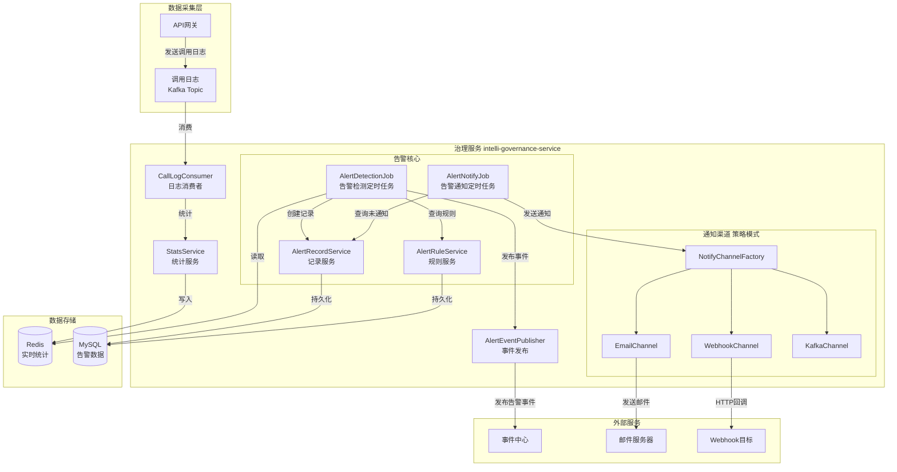
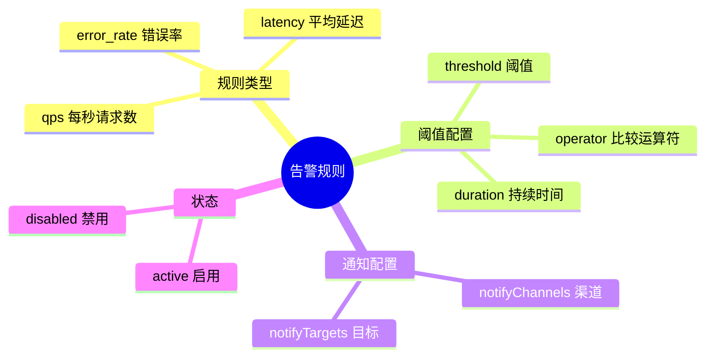
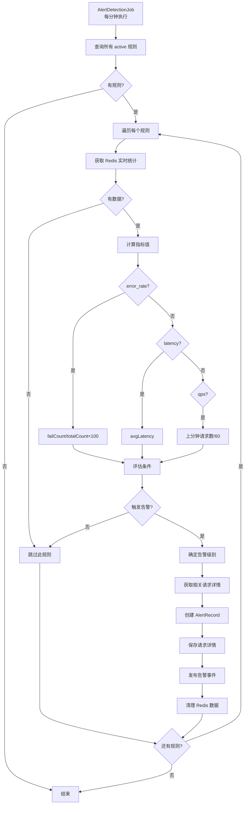
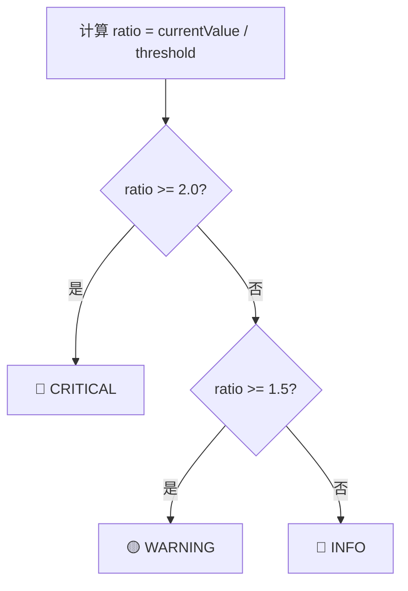
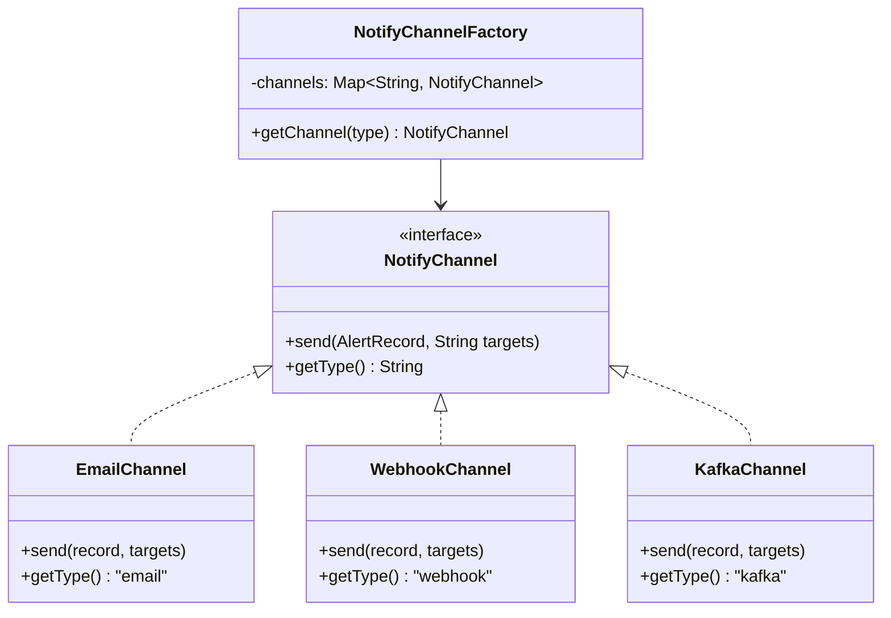
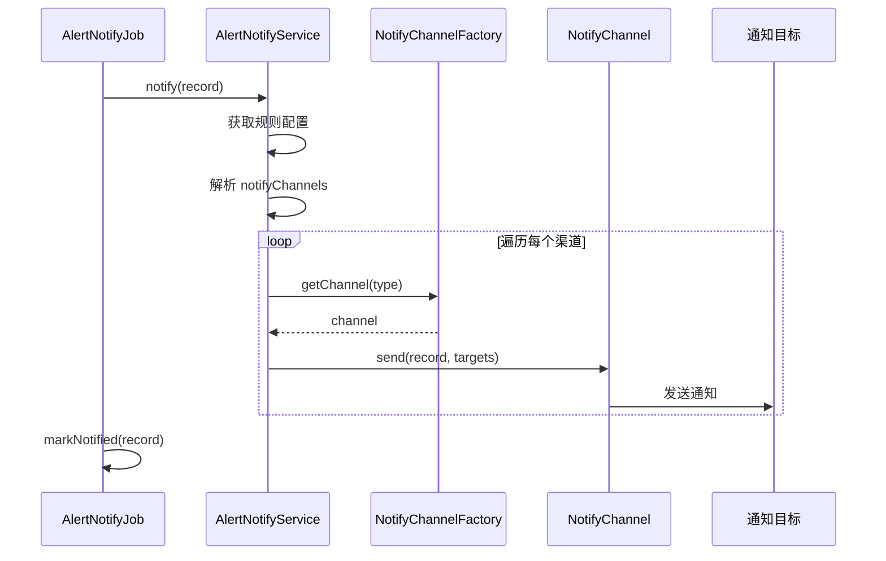
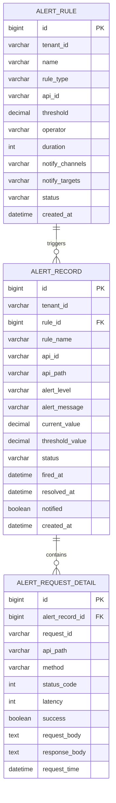

# IntelliHub 告警中心实现文档

## 目录

1. [概述](#概述)
2. [整体架构](#整体架构)
3. [核心概念](#核心概念)
4. [功能模块详解](#功能模块详解)
5. [告警检测流程](#告警检测流程)
6. [通知渠道](#通知渠道)
7. [数据模型](#数据模型)
8. [配置说明](#配置说明)
9. [常见问题](#常见问题)

---

## 概述

告警中心是 IntelliHub 平台的**监控预警系统**，负责实时监测 API 运行状态，当指标异常时自动触发告警并通知相关人员。

### 核心能力

| 能力 | 说明 |
|------|------|
| 规则管理 | 创建、编辑、启用/禁用告警规则 |
| 实时检测 | 每分钟检测一次，基于 Redis 实时统计数据 |
| 多指标支持 | 错误率、平均延迟、QPS 三种指标类型 |
| 智能定级 | 根据超标程度自动确定告警级别 |
| 多渠道通知 | 支持邮件、短信、Webhook、Kafka 等通知方式 |
| 请求追溯 | 告警时保存相关请求详情，便于问题排查 |

### 服务信息

| 项目 | 值 |
|------|-----|
| 服务名称 | intelli-governance-service |
| 端口 | 8083 |
| 数据库 | intelli_hub_governance |

---

## 整体架构

### 系统架构图



### 技术栈

| 组件 | 技术选型 | 说明 |
|------|----------|------|
| 框架 | Spring Boot 2.x | 微服务基础框架 |
| 消息队列 | Kafka | 接收调用日志 |
| 缓存 | Redis | 存储实时统计数据 |
| 数据库 | MySQL 8.0 | 存储规则和告警记录 |
| 定时任务 | Spring Scheduler | 告警检测和通知 |
| 事件发布 | 事件中心 | 告警事件通知 |

---

## 核心概念

### 告警规则 (AlertRule)

定义什么情况下触发告警。



### 告警记录 (AlertRecord)

记录每次告警触发的详细信息。

### 告警级别 (AlertLevel)

| 级别 | 代码 | 触发条件 | 图标 |
|------|------|----------|------|
| 严重 | critical | 当前值 ≥ 阈值 × 2 | 🔴 |
| 警告 | warning | 当前值 ≥ 阈值 × 1.5 | 🟡 |
| 信息 | info | 当前值 ≥ 阈值 | 🔵 |

### 比较运算符

| 运算符 | 说明 | 示例 |
|--------|------|------|
| gt | 大于 | 错误率 > 5% |
| gte | 大于等于 | 延迟 >= 1000ms |
| lt | 小于 | QPS < 10 |
| lte | 小于等于 | 错误率 <= 1% |
| eq | 等于 | - |

---

## 功能模块详解

### 1. 告警规则管理

**功能**：创建、编辑、查询、删除告警规则。

**API 接口**：

| 方法 | 路径 | 说明 |
|------|------|------|
| GET | `/governance/v1/alert-rules/list` | 查询规则列表 |
| GET | `/governance/v1/alert-rules/{id}` | 查询规则详情 |
| POST | `/governance/v1/alert-rules/create` | 创建规则 |
| POST | `/governance/v1/alert-rules/{id}/update` | 更新规则 |
| POST | `/governance/v1/alert-rules/{id}/delete` | 删除规则 |
| POST | `/governance/v1/alert-rules/{id}/enable` | 启用规则 |
| POST | `/governance/v1/alert-rules/{id}/disable` | 禁用规则 |

**规则类型说明**：

| 类型 | 说明 | 数据来源 | 典型阈值 |
|------|------|----------|----------|
| `error_rate` | 错误率 | failCount / totalCount × 100% | > 5% |
| `latency` | 平均延迟 | Redis latency 列表平均值 | > 1000ms |
| `qps` | 每秒请求数 | 上一分钟请求数 / 60 | > 100 |

**代码位置**：
- Controller: `AlertRuleController.java`
- Service: `AlertRuleService.java`
- Entity: `AlertRule.java`

---

### 2. 告警记录管理

**功能**：查询告警历史、告警详情、请求追溯。

**API 接口**：

| 方法 | 路径 | 说明 |
|------|------|------|
| GET | `/governance/v1/alert-records/list` | 查询告警列表 |
| GET | `/governance/v1/alert-records/{id}` | 查询告警详情 |
| GET | `/governance/v1/alert-records/{id}/requests` | 查询关联请求 |

**代码位置**：
- Controller: `AlertRecordController.java`
- Service: `AlertRecordService.java`
- Entity: `AlertRecord.java`, `AlertRequestDetail.java`

---

### 3. 实时统计服务

**功能**：从 Kafka 消费调用日志，计算实时统计数据并存入 Redis。

**Redis Key 设计**：

```
# 实时统计 Hash
stats:realtime:{tenantId}:global:{hour}
  - totalCount: 总调用数
  - failCount: 失败数
  - avgLatency: 平均延迟

# 延迟列表
stats:realtime:{tenantId}:global:{hour}:latency (List)

# QPS 计数（分钟级）
stats:qps:{tenantId}:{minute} (String)

# 告警相关请求详情
alert:requests:{tenantId}:{hour} (List)
```

**代码位置**：
- Consumer: `CallLogConsumer.java`
- Service: `StatsService.java`

---

## 告警检测流程

### 检测流程图



### 告警级别确定



### 核心代码

**AlertDetectionJob.java**（简化）：

```java
@Scheduled(fixedRate = 60000)
public void detectAlerts() {
    List<AlertRule> activeRules = alertRuleService.getAllActiveRules();
    
    for (AlertRule rule : activeRules) {
        // 1. 获取统计数据
        Map<String, Object> stats = statsService.getRealtimeStats(tenantId, null);
        
        // 2. 计算指标值
        BigDecimal currentValue = calculateMetricValue(rule.getRuleType(), stats, tenantId);
        
        // 3. 评估条件
        boolean triggered = evaluateCondition(currentValue, rule.getThreshold(), rule.getOperator());
        
        if (triggered) {
            // 4. 确定告警级别
            AlertLevel level = determineAlertLevel(currentValue, rule.getThreshold(), rule.getRuleType());
            
            // 5. 创建告警记录
            AlertRecord record = alertRecordService.createRecordWithDetails(rule, ...);
            
            // 6. 发布告警事件
            alertEventPublisher.publishAlertTriggered(record, ...);
        }
    }
}
```

---

## 通知渠道

### 策略模式实现



### 通知流程



### 支持的通知渠道

| 渠道 | 类型 | 说明 | targets 格式 |
|------|------|------|--------------|
| 邮件 | email | 发送邮件通知 | 邮箱地址，逗号分隔 |
| Webhook | webhook | HTTP POST 回调 | URL 地址 |
| Kafka | kafka | 发送到 Kafka Topic | Topic 名称 |

---

## 数据模型

### E-R 图



### 建表语句

```sql
-- 告警规则表
CREATE TABLE alert_rule (
    id BIGINT PRIMARY KEY,
    tenant_id VARCHAR(36) NOT NULL,
    name VARCHAR(100) NOT NULL,
    rule_type VARCHAR(20) NOT NULL COMMENT 'error_rate/latency/qps',
    api_id VARCHAR(100) COMMENT '为空表示全局',
    threshold DECIMAL(10,2) NOT NULL,
    operator VARCHAR(10) NOT NULL COMMENT 'gt/gte/lt/lte/eq',
    duration INT DEFAULT 60,
    notify_channels VARCHAR(200) COMMENT 'email,webhook,kafka',
    notify_targets TEXT,
    status VARCHAR(20) DEFAULT 'active',
    created_by VARCHAR(50),
    created_at DATETIME DEFAULT CURRENT_TIMESTAMP,
    updated_at DATETIME DEFAULT CURRENT_TIMESTAMP ON UPDATE CURRENT_TIMESTAMP,
    INDEX idx_tenant_status (tenant_id, status)
);

-- 告警记录表
CREATE TABLE alert_record (
    id BIGINT PRIMARY KEY,
    tenant_id VARCHAR(36) NOT NULL,
    rule_id BIGINT NOT NULL,
    rule_name VARCHAR(100),
    api_id VARCHAR(100),
    api_path VARCHAR(200),
    alert_level VARCHAR(20) NOT NULL COMMENT 'info/warning/critical',
    alert_message TEXT,
    current_value DECIMAL(10,2),
    threshold_value DECIMAL(10,2),
    status VARCHAR(20) DEFAULT 'firing' COMMENT 'firing/resolved',
    fired_at DATETIME,
    resolved_at DATETIME,
    notified TINYINT DEFAULT 0,
    created_at DATETIME DEFAULT CURRENT_TIMESTAMP,
    INDEX idx_tenant_status (tenant_id, status),
    INDEX idx_rule_time (rule_id, fired_at)
);

-- 告警请求详情表
CREATE TABLE alert_request_detail (
    id BIGINT PRIMARY KEY AUTO_INCREMENT,
    alert_record_id BIGINT NOT NULL,
    request_id VARCHAR(100),
    api_path VARCHAR(200),
    method VARCHAR(10),
    status_code INT,
    latency INT,
    success TINYINT,
    request_body TEXT,
    response_body TEXT,
    request_time DATETIME,
    INDEX idx_alert_record (alert_record_id)
);
```

---

## 配置说明

### 核心配置项

| 配置项 | 说明 | 默认值 |
|--------|------|--------|
| `server.port` | 服务端口 | 8083 |
| 检测频率 | 告警检测定时任务 | 60秒 |
| 通知频率 | 告警通知定时任务 | 30秒 |

### 多租户配置

```yaml
intellihub:
  mybatis:
    tenant:
      enabled: true
      column: tenant_id
```

---

## 常见问题

### Q1: 告警没有触发怎么排查？

1. 检查规则状态是否为 `active`
2. 检查 Redis 是否有统计数据
3. 查看 `AlertDetectionJob` 日志
4. 确认阈值和运算符配置正确

### Q2: 告警触发了但没收到通知？

1. 检查规则的 `notifyChannels` 和 `notifyTargets` 配置
2. 查看 `AlertNotifyJob` 日志
3. 检查告警记录的 `notified` 字段

### Q3: QPS 计算不准确？

QPS 使用固定窗口算法：上一分钟的请求数 / 60。分钟刚开始时数据可能偏低。

### Q4: 如何添加新的通知渠道？

1. 实现 `NotifyChannel` 接口
2. 添加 `@Component` 注解
3. 在规则中配置渠道类型

```java
@Component
public class DingTalkChannel implements NotifyChannel {
    @Override
    public void send(AlertRecord record, String targets) {
        // 实现钉钉机器人通知
    }
    
    @Override
    public String getType() {
        return "dingtalk";
    }
}
```

### Q5: 告警会重复触发吗？

不会。触发告警后会删除 Redis 统计数据（QPS 除外），避免同一批数据重复触发。

---

## 版本历史

| 版本 | 日期 | 说明 |
|------|------|------|
| 1.0.0 | 2025-01-07 | 初始版本，实现告警规则、检测、通知、请求追溯功能 |
