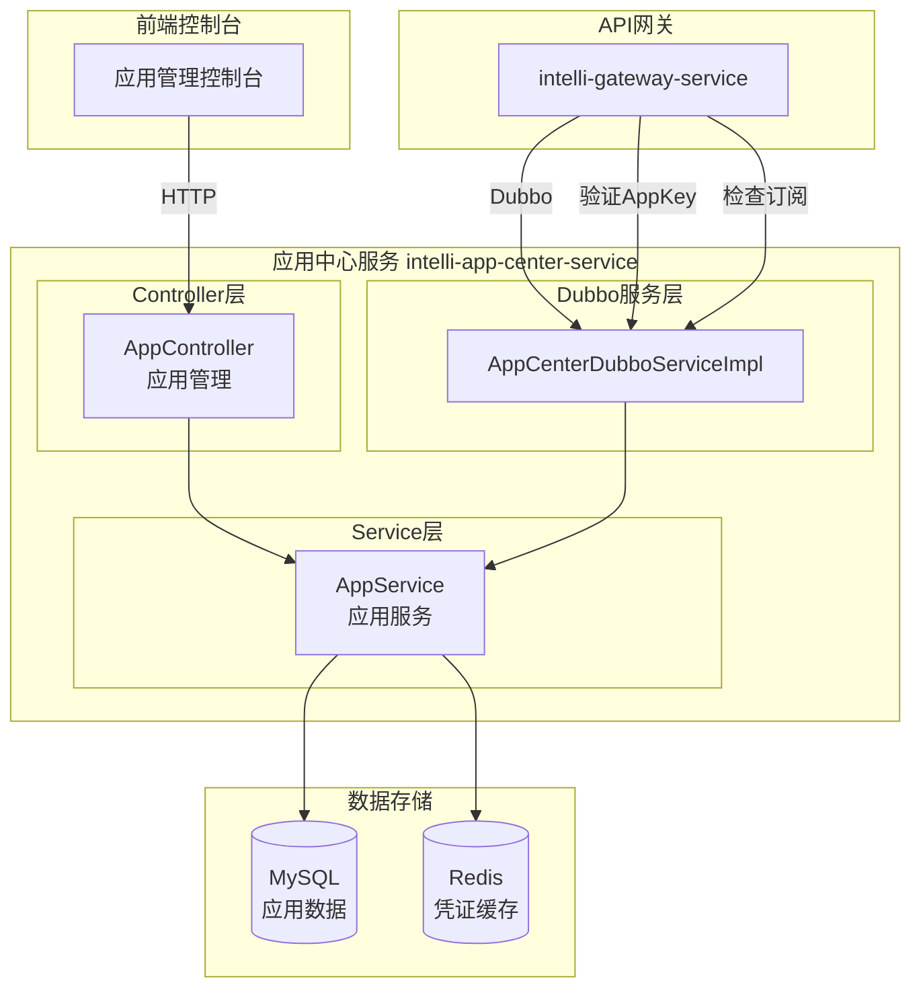
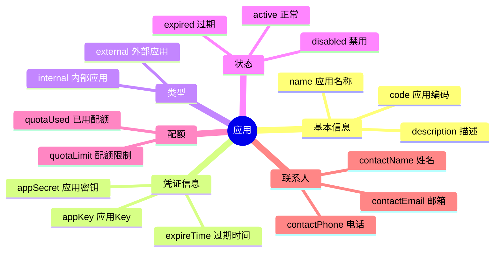
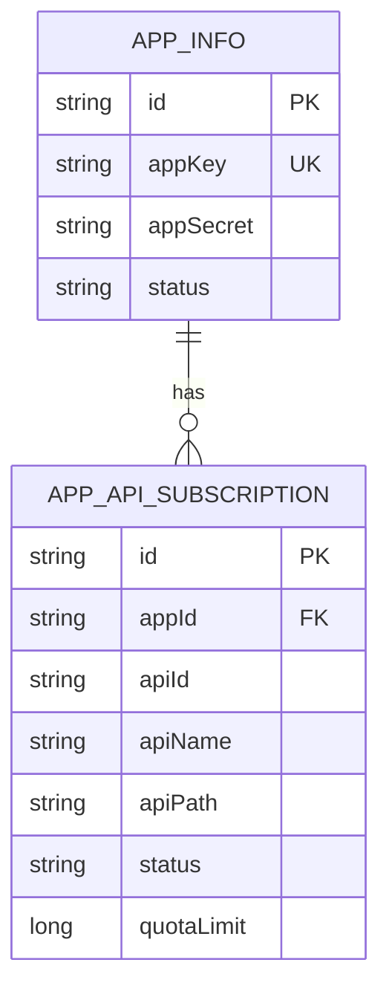
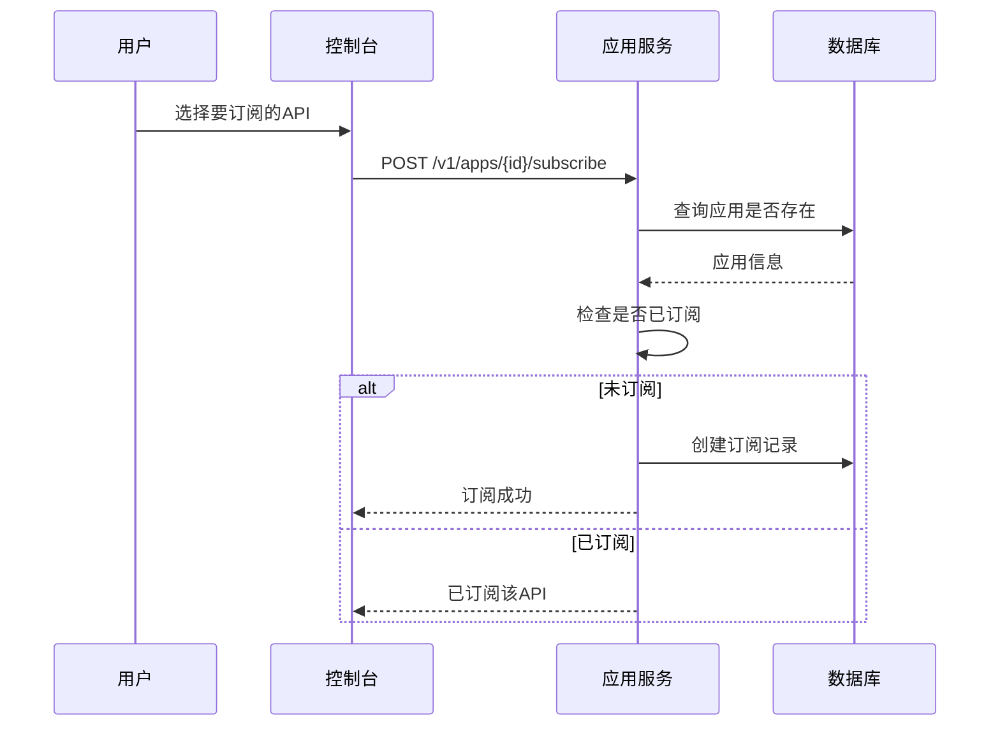
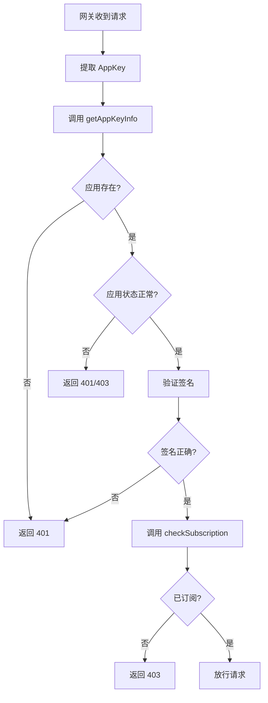
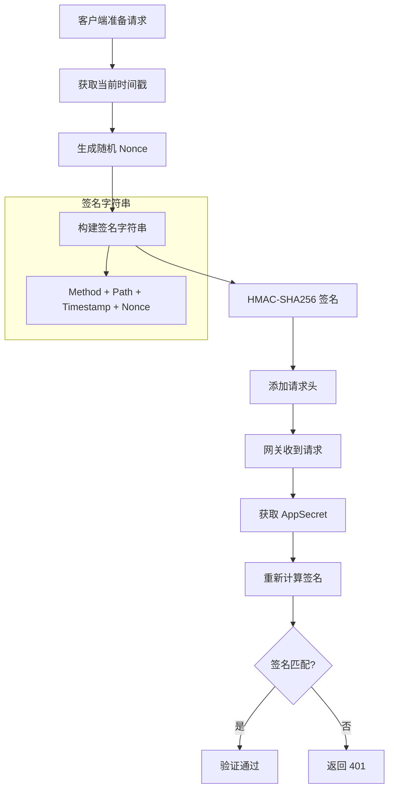
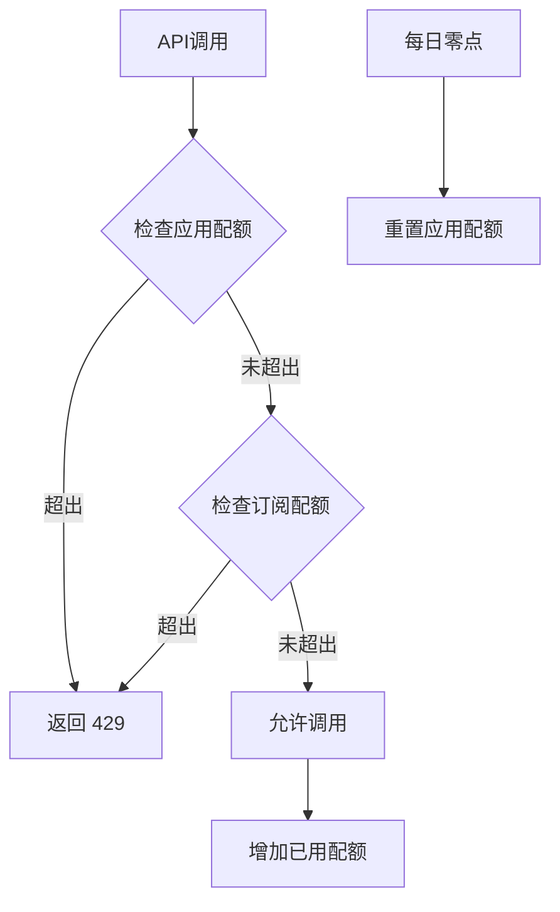
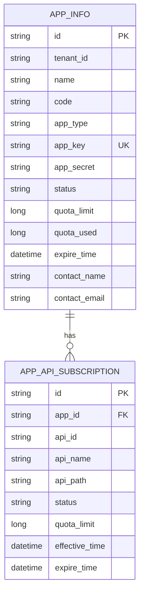

# IntelliHub 应用中心服务实现文档

## 目录

1. [概述](#概述)
2. [整体架构](#整体架构)
3. [核心概念](#核心概念)
4. [功能模块详解](#功能模块详解)
5. [凭证管理](#凭证管理)
6. [订阅机制](#订阅机制)
7. [数据模型](#数据模型)
8. [Dubbo 服务](#dubbo-服务)
9. [配置说明](#配置说明)
10. [常见问题](#常见问题)

---

## 概述

应用中心是 IntelliHub 的**应用凭证管理和 API 订阅中心**，负责管理 API 调用方的身份标识和权限控制。

### 核心能力

| 能力 | 说明 |
|------|------|
| 应用管理 | 创建、编辑、启用/禁用应用 |
| 凭证管理 | 生成和管理 AppKey/AppSecret |
| API 订阅 | 管理应用与 API 的订阅关系 |
| 配额控制 | 应用级和订阅级配额限制 |
| 权限验证 | 供网关验证应用身份和订阅关系 |

### 服务信息

| 项目 | 值 |
|------|-----|
| 服务名称 | intelli-app-center-service |
| HTTP 端口 | 8085 |
| Dubbo 端口 | 20883 |
| 数据库 | intelli_hub_app_center |

---

## 整体架构

### 系统架构图



### 技术栈

| 组件 | 技术选型 | 说明 |
|------|----------|------|
| 框架 | Spring Boot 2.x | 微服务基础框架 |
| ORM | MyBatis-Plus | 数据持久层 |
| RPC | Dubbo | 为网关提供认证服务 |
| 缓存 | Redis | AppKey 信息缓存 |
| 注册中心 | Nacos | 服务注册发现 |

---

## 核心概念

### 应用 (AppInfo)

应用是 API 调用方的身份标识，包含凭证信息和配额配置。



### 应用状态

| 状态 | 代码 | 说明 |
|------|------|------|
| 正常 | `active` | 应用可正常调用 API |
| 禁用 | `disabled` | 应用被管理员禁用 |
| 过期 | `expired` | 凭证已过期 |

### 应用类型

| 类型 | 代码 | 说明 |
|------|------|------|
| 内部应用 | `internal` | 企业内部系统 |
| 外部应用 | `external` | 第三方合作伙伴 |

### API 订阅 (AppApiSubscription)

应用与 API 的绑定关系，只有订阅后才能调用。



---

## 功能模块详解

### 1. 应用管理

**功能**：应用的 CRUD 和状态管理。

**API 接口**：

| 方法 | 路径 | 说明 |
|------|------|------|
| GET | `/v1/apps/list` | 分页查询应用列表 |
| GET | `/v1/apps/{id}/detail` | 获取应用详情 |
| GET | `/v1/apps/by-appkey` | 根据 AppKey 查询应用 |
| POST | `/v1/apps/create` | 创建应用（返回 AppKey/AppSecret） |
| POST | `/v1/apps/{id}/update` | 更新应用信息 |
| POST | `/v1/apps/{id}/delete` | 删除应用 |
| POST | `/v1/apps/{id}/enable` | 启用应用 |
| POST | `/v1/apps/{id}/disable` | 禁用应用 |
| POST | `/v1/apps/{id}/reset-secret` | 重置 AppSecret |

**创建应用响应示例**：

```json
{
  "code": 0,
  "message": "创建成功，请妥善保管AppSecret",
  "data": {
    "id": "app-123",
    "name": "我的应用",
    "appKey": "ak_xxxxxxxxxxxxxxxx",
    "appSecret": "sk_xxxxxxxxxxxxxxxxxxxxxxxx"
  }
}
```

**代码位置**：
- Controller: `AppController.java`
- Service: `AppService.java`
- Entity: `AppInfo.java`

---

### 2. API 订阅管理

**功能**：管理应用与 API 的订阅关系。

**API 接口**：

| 方法 | 路径 | 说明 |
|------|------|------|
| POST | `/v1/apps/{id}/subscribe` | 订阅 API |
| POST | `/v1/apps/{id}/unsubscribe` | 取消订阅 |
| GET | `/v1/apps/{id}/subscriptions` | 获取订阅列表 |
| GET | `/v1/apps/check-subscription` | 检查订阅关系（内部） |
| GET | `/v1/apps/{id}/check-subscription` | 按路径检查订阅（内部） |

**订阅流程**：



**代码位置**：
- Controller: `AppController.java`
- Entity: `AppApiSubscription.java`

---

### 3. 内部验证接口

**功能**：供网关调用，验证应用身份和权限。

**API 接口**：

| 方法 | 路径 | 说明 |
|------|------|------|
| GET | `/v1/apps/by-appkey/{appKey}` | 获取应用内部信息（含 Secret） |
| POST | `/v1/apps/validate-credentials` | 验证 AppKey/AppSecret |
| GET | `/v1/apps/check-subscription` | 检查订阅关系 |

**网关调用流程**：



---

## 凭证管理

### AppKey/AppSecret 生成规则

| 凭证 | 格式 | 长度 | 说明 |
|------|------|------|------|
| AppKey | `ak_` + UUID | 36 字符 | 公开标识，用于请求头 |
| AppSecret | `sk_` + UUID | 36 字符 | 私密密钥，用于签名 |

### 凭证安全策略

1. **创建时展示**：AppSecret 只在创建时返回一次
2. **加密存储**：数据库中 AppSecret 加密存储
3. **重置机制**：支持重置 AppSecret，旧密钥立即失效
4. **过期控制**：支持设置 AppKey 过期时间

### 签名验证流程



---

## 订阅机制

### 订阅状态

| 状态 | 代码 | 说明 |
|------|------|------|
| 生效 | `active` | 可正常调用 API |
| 禁用 | `disabled` | 订阅被禁用 |
| 过期 | `expired` | 订阅已过期 |

### 配额控制



**配额层级**：

| 层级 | 说明 | 优先级 |
|------|------|--------|
| 订阅级配额 | 单个 API 的调用限制 | 高 |
| 应用级配额 | 应用的总调用限制 | 低 |

---

## 数据模型

### E-R 图



### 建表语句

```sql
-- 应用信息表
CREATE TABLE app_info (
    id VARCHAR(36) PRIMARY KEY,
    tenant_id VARCHAR(36) NOT NULL,
    name VARCHAR(100) NOT NULL,
    code VARCHAR(50),
    description TEXT,
    app_type VARCHAR(20) DEFAULT 'external' COMMENT 'internal/external',
    app_key VARCHAR(50) NOT NULL UNIQUE,
    app_secret VARCHAR(100) NOT NULL,
    status VARCHAR(20) DEFAULT 'active' COMMENT 'active/disabled/expired',
    quota_limit BIGINT DEFAULT 10000 COMMENT '每日配额',
    quota_used BIGINT DEFAULT 0,
    quota_reset_time DATETIME,
    callback_url VARCHAR(500),
    ip_whitelist TEXT,
    expire_time DATETIME COMMENT 'AppKey过期时间',
    contact_name VARCHAR(50),
    contact_email VARCHAR(100),
    contact_phone VARCHAR(20),
    created_by VARCHAR(36),
    created_by_name VARCHAR(50),
    created_at DATETIME DEFAULT CURRENT_TIMESTAMP,
    updated_at DATETIME DEFAULT CURRENT_TIMESTAMP ON UPDATE CURRENT_TIMESTAMP,
    deleted INT DEFAULT 0,
    INDEX idx_tenant (tenant_id),
    INDEX idx_app_key (app_key),
    INDEX idx_status (status)
);

-- 应用API订阅表
CREATE TABLE app_api_subscription (
    id VARCHAR(36) PRIMARY KEY,
    app_id VARCHAR(36) NOT NULL,
    api_id VARCHAR(36) NOT NULL,
    api_name VARCHAR(100),
    api_path VARCHAR(200),
    status VARCHAR(20) DEFAULT 'active' COMMENT 'active/disabled/expired',
    quota_limit BIGINT COMMENT '订阅级配额',
    effective_time DATETIME DEFAULT CURRENT_TIMESTAMP,
    expire_time DATETIME,
    created_at DATETIME DEFAULT CURRENT_TIMESTAMP,
    updated_at DATETIME DEFAULT CURRENT_TIMESTAMP ON UPDATE CURRENT_TIMESTAMP,
    UNIQUE KEY uk_app_api (app_id, api_id),
    INDEX idx_app_id (app_id),
    INDEX idx_api_id (api_id)
);
```

---

## Dubbo 服务

### 服务接口

应用中心通过 Dubbo 向网关提供认证服务：

```java
public interface AppCenterDubboService {
    
    /**
     * 根据AppKey获取应用信息
     */
    AppKeyInfo getAppKeyInfo(String appKey);
    
    /**
     * 检查应用是否订阅了指定API
     */
    boolean checkSubscription(String appId, String apiId);
    
    /**
     * 按路径检查订阅关系
     */
    boolean checkSubscriptionByPath(String appId, String path);
    
    /**
     * 验证AppKey和AppSecret
     */
    boolean validateCredentials(String appKey, String appSecret);
}
```

### AppKeyInfo 结构

```java
public class AppKeyInfo {
    private String appId;       // 应用ID
    private String appKey;      // AppKey
    private String appSecret;   // AppSecret（明文，用于签名验证）
    private String tenantId;    // 租户ID
    private String status;      // 状态
    private Long expireTime;    // 过期时间戳
}
```

### Dubbo 配置

```yaml
dubbo:
  application:
    name: intelli-app-center-dubbo
  registry:
    address: nacos://127.0.0.1:8848
  protocol:
    name: dubbo
    port: 20883
  scan:
    base-packages: com.intellihub.app.dubbo
  provider:
    group: intellihub
```

---

## 配置说明

### 核心配置项

| 配置项 | 说明 | 默认值 |
|--------|------|--------|
| `server.port` | HTTP 端口 | 8085 |
| `dubbo.protocol.port` | Dubbo 端口 | 20883 |
| `dubbo.provider.group` | Dubbo 分组 | intellihub |

### 多租户配置

```yaml
intellihub:
  mybatis:
    tenant:
      enabled: true
      column: tenant_id
      ignore-tables: []  # 所有表都需要租户隔离
```

---

## 常见问题

### Q1: AppSecret 丢失怎么办？

AppSecret 只在创建时展示一次，丢失后只能通过"重置密钥"生成新的 AppSecret。

### Q2: 应用调用 API 返回 403？

**可能原因**：
1. 应用未订阅该 API
2. 订阅已过期或禁用
3. 配额已用尽

**排查**：
1. 检查订阅列表
2. 检查订阅状态和过期时间
3. 检查配额使用情况

### Q3: 如何迁移应用到新租户？

目前不支持跨租户迁移。需要在新租户重新创建应用，并重新订阅 API。

### Q4: 配额什么时候重置？

应用级配额每日零点自动重置。

### Q5: 如何限制特定 IP 访问？

在应用设置中配置 IP 白名单（`ipWhitelist` 字段），多个 IP 用逗号分隔。

---

## 版本历史

| 版本 | 日期 | 说明 |
|------|------|------|
| 1.0.0 | 2025-01-07 | 初始版本，实现应用管理、凭证管理、API订阅、配额控制 |
