# IntelliHub 统计服务实现文档

## 目录

1. [概述](#概述)
2. [整体架构](#整体架构)
3. [核心概念](#核心概念)
4. [数据采集](#数据采集)
5. [统计查询](#统计查询)
6. [实时统计](#实时统计)
7. [数据模型](#数据模型)
8. [Redis Key 设计](#redis-key-设计)
9. [定时任务架构](#定时任务架构)
10. [配置说明](#配置说明)
11. [常见问题](#常见问题)

---

## 概述

统计服务是 IntelliHub 的**API 调用监控和数据分析中心**，负责采集、存储和查询 API 调用数据，为运维监控和告警提供数据支撑。

### 核心能力

| 能力 | 说明 |
|------|------|
| 日志采集 | 从 Kafka 消费网关上报的调用日志 |
| 实时统计 | 基于 Redis 的实时 QPS、错误率、延迟统计 |
| 历史统计 | 小时/天维度的预聚合统计数据 |
| 趋势分析 | 调用量、成功率、延迟趋势图表 |
| Top 排行 | 热门 API 排行榜 |
| 分布统计 | 状态码分布、响应时间分布 |

### 服务信息

| 项目 | 值 |
|------|-----|
| 服务名称 | intelli-governance-service |
| 端口 | 8083 |
| 数据库 | intelli_hub_governance |
| Kafka Topic | `call-log` |

---

## 整体架构

### 系统架构图

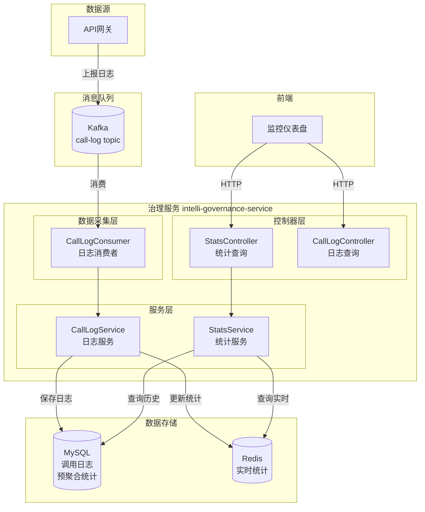

### 数据流向

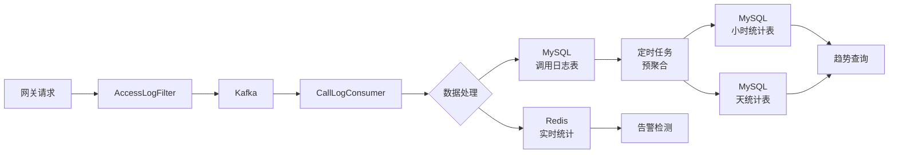

---

## 核心概念

### 调用日志 (ApiCallLog)

记录每次 API 调用的详细信息。

| 字段 | 说明 |
|------|------|
| `apiPath` | API 路径 |
| `apiMethod` | 请求方法 |
| `appId/appKey` | 调用方应用 |
| `statusCode` | HTTP 状态码 |
| `success` | 是否成功 |
| `latency` | 响应时间 (ms) |
| `requestTime` | 请求时间 |
| `clientIp` | 客户端 IP |

### 统计维度

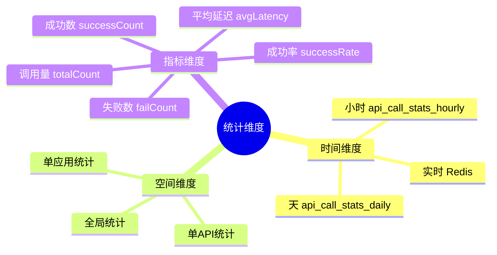

### 统计概览 (StatsOverviewDTO)

| 指标 | 说明 |
|------|------|
| `todayTotalCount` | 今日总调用量 |
| `todaySuccessCount` | 今日成功数 |
| `todayFailCount` | 今日失败数 |
| `todaySuccessRate` | 今日成功率 |
| `todayAvgLatency` | 今日平均延迟 |
| `yesterdayTotalCount` | 昨日总调用量 |
| `dayOverDayRate` | 日环比增长率 |
| `currentQps` | 当前 QPS |

---

## 数据采集

### Kafka 消费流程

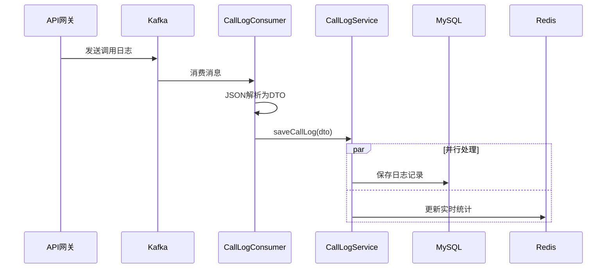

### 日志消费者

**核心代码**：

```java
@KafkaListener(topics = KafkaTopics.CALL_LOG, groupId = "governance-call-log-group")
public void consumeCallLog(ConsumerRecord<String, String> record) {
    // 解析日志数据
    Map<String, Object> logData = objectMapper.readValue(record.value(), Map.class);
    
    // 转换为DTO
    CallLogDTO dto = convertToDTO(logData);
    
    // 保存调用日志
    callLogService.saveCallLog(dto);
}
```

### 日志消息格式

```json
{
  "tenantId": "tenant-001",
  "apiId": "api-123",
  "apiPath": "/api/user/list",
  "apiMethod": "GET",
  "appId": "app-456",
  "appKey": "ak_xxxxxx",
  "clientIp": "192.168.1.100",
  "statusCode": 200,
  "success": true,
  "latency": 45,
  "requestTime": "2025-01-07T10:30:00",
  "userAgent": "Mozilla/5.0..."
}
```

---

## 统计查询

### API 接口

| 方法 | 路径 | 说明 |
|------|------|------|
| GET | `/governance/v1/stats/overview` | 统计概览 |
| GET | `/governance/v1/stats/trend/hourly` | 小时趋势 |
| GET | `/governance/v1/stats/trend/daily` | 天趋势 |
| GET | `/governance/v1/stats/api/{apiPath}` | 单 API 趋势 |
| GET | `/governance/v1/stats/top` | Top N API |
| GET | `/governance/v1/stats/logs` | 调用日志分页 |
| GET | `/governance/v1/stats/realtime` | 实时调用数 |
| GET | `/governance/v1/stats/api-detail/{apiId}` | API 统计详情 |

### 统计概览查询

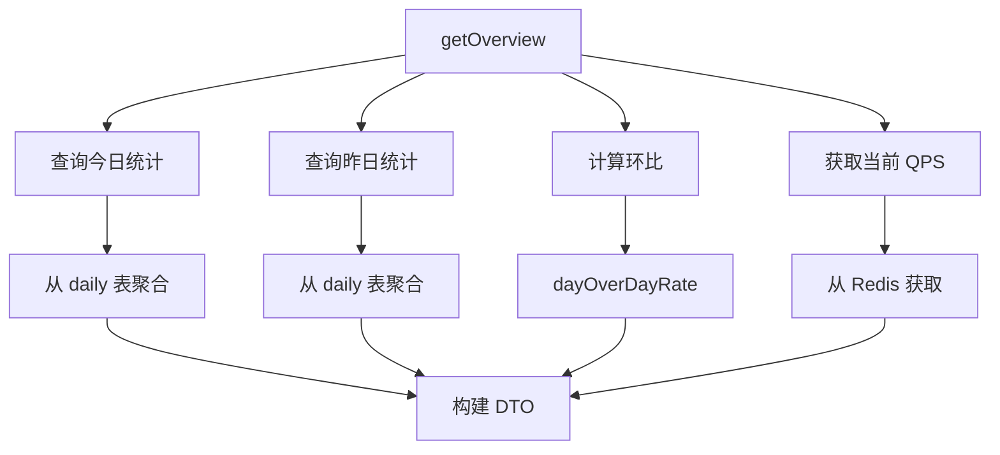

### 趋势查询

**小时趋势**：

```java
public StatsTrendDTO getHourlyTrend(LocalDateTime startTime, LocalDateTime endTime) {
    List<ApiCallStatsHourly> stats = hourlyMapper.selectTrend(tenantId, startTime, endTime);
    return buildTrendDTO(stats);
}
```

**返回数据结构**：

```json
{
  "timePoints": ["01-07 10:00", "01-07 11:00", "01-07 12:00"],
  "totalCounts": [1500, 1800, 2100],
  "successCounts": [1450, 1750, 2050],
  "failCounts": [50, 50, 50],
  "avgLatencies": [42, 45, 48],
  "successRates": [96.67, 97.22, 97.62]
}
```

### API 统计详情

包含更丰富的统计信息：

| 指标 | 说明 |
|------|------|
| `todayCalls` | 今日调用量 |
| `totalCalls` | 总调用量 |
| `avgLatency` | 平均延迟 |
| `successRate` | 成功率 |
| `todayTrend` | 调用量环比 |
| `latencyTrend` | 延迟环比 |
| `statusDistribution` | 状态码分布 |
| `latencyDistribution` | 响应时间分布 |

---

## 实时统计

### Redis 数据结构

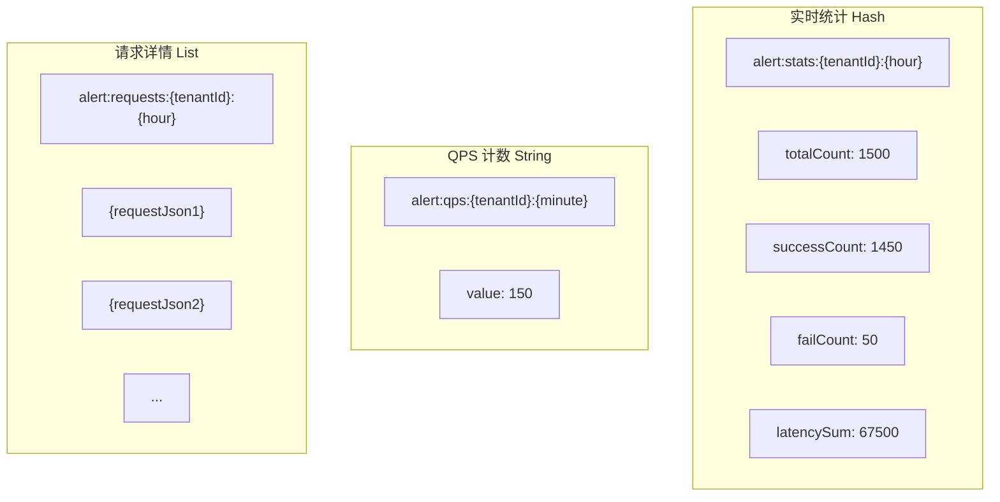

### QPS 计算

使用**固定窗口**算法：

```java
public double getQps() {
    // 获取上一分钟的时间标识
    LocalDateTime lastMinute = LocalDateTime.now().minusMinutes(1);
    String minute = lastMinute.format(MINUTE_FORMATTER);
    String qpsKey = RedisKeyConstants.buildQpsKey(tenantId, minute);
    
    // 获取上一分钟的请求数
    String countStr = stringRedisTemplate.opsForValue().get(qpsKey);
    long count = countStr != null ? Long.parseLong(countStr) : 0;
    
    // QPS = 请求数 / 60秒
    return count / 60.0;
}
```

### 实时统计查询

```java
public Map<String, Object> getRealtimeStats(String apiId) {
    String hour = LocalDateTime.now().format(HOUR_FORMATTER);
    String statsKey = RedisKeyConstants.buildAlertStatsKey(tenantId, hour);
    
    // 从 Hash 获取所有字段
    Map<Object, Object> hashData = stringRedisTemplate.opsForHash().entries(statsKey);
    
    // 计算指标
    long totalCount = parseLong(hashData.get("totalCount"));
    long failCount = parseLong(hashData.get("failCount"));
    long latencySum = parseLong(hashData.get("latencySum"));
    
    // 计算错误率和平均延迟
    double errorRate = totalCount > 0 ? (failCount * 100.0 / totalCount) : 0.0;
    int avgLatency = totalCount > 0 ? (int) (latencySum / totalCount) : 0;
    
    return Map.of(
        "totalCount", totalCount,
        "failCount", failCount,
        "errorRate", errorRate,
        "avgLatency", avgLatency
    );
}
```

---

## 数据模型

### E-R 图

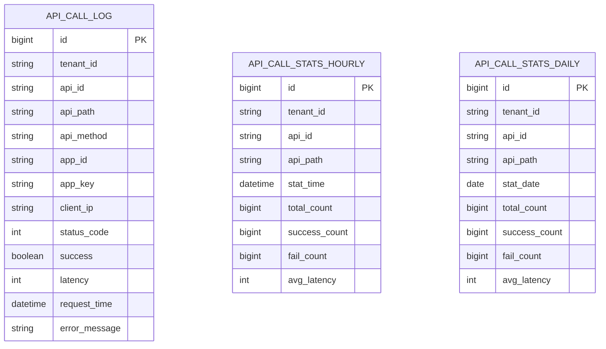

### 建表语句

```sql
-- 调用日志表（分区表，按月分区）
CREATE TABLE api_call_log (
    id BIGINT PRIMARY KEY,
    tenant_id VARCHAR(36) NOT NULL,
    api_id VARCHAR(36),
    api_path VARCHAR(200) NOT NULL,
    api_method VARCHAR(10),
    app_id VARCHAR(36),
    app_key VARCHAR(50),
    client_ip VARCHAR(50),
    status_code INT,
    success TINYINT,
    latency INT COMMENT '响应时间(ms)',
    request_time DATETIME NOT NULL,
    error_message TEXT,
    user_agent VARCHAR(500),
    request_body TEXT,
    response_body TEXT,
    created_at DATETIME DEFAULT CURRENT_TIMESTAMP,
    INDEX idx_tenant_time (tenant_id, request_time),
    INDEX idx_api_path (api_path),
    INDEX idx_app_id (app_id)
) PARTITION BY RANGE (TO_DAYS(request_time)) (
    PARTITION p202501 VALUES LESS THAN (TO_DAYS('2025-02-01')),
    PARTITION p202502 VALUES LESS THAN (TO_DAYS('2025-03-01'))
);

-- 小时统计预聚合表
CREATE TABLE api_call_stats_hourly (
    id BIGINT PRIMARY KEY AUTO_INCREMENT,
    tenant_id VARCHAR(36) NOT NULL,
    api_id VARCHAR(36),
    api_path VARCHAR(200),
    stat_time DATETIME NOT NULL COMMENT '统计时间（精确到小时）',
    total_count BIGINT DEFAULT 0,
    success_count BIGINT DEFAULT 0,
    fail_count BIGINT DEFAULT 0,
    avg_latency INT DEFAULT 0 COMMENT '平均响应时间(ms)',
    created_at DATETIME DEFAULT CURRENT_TIMESTAMP,
    UNIQUE KEY uk_tenant_api_time (tenant_id, api_path, stat_time),
    INDEX idx_stat_time (stat_time)
);

-- 天统计预聚合表
CREATE TABLE api_call_stats_daily (
    id BIGINT PRIMARY KEY AUTO_INCREMENT,
    tenant_id VARCHAR(36) NOT NULL,
    api_id VARCHAR(36),
    api_path VARCHAR(200),
    stat_date DATE NOT NULL COMMENT '统计日期',
    total_count BIGINT DEFAULT 0,
    success_count BIGINT DEFAULT 0,
    fail_count BIGINT DEFAULT 0,
    avg_latency INT DEFAULT 0,
    created_at DATETIME DEFAULT CURRENT_TIMESTAMP,
    UNIQUE KEY uk_tenant_api_date (tenant_id, api_path, stat_date),
    INDEX idx_stat_date (stat_date)
);
```

---

## Redis Key 设计

### Key 命名规范

| Key 模式 | 类型 | TTL | 说明 |
|----------|------|-----|------|
| `alert:stats:{tenantId}:{hour}` | Hash | 2h | 小时级实时统计 |
| `alert:qps:{tenantId}:{minute}` | String | 2min | 分钟级请求计数 |
| `alert:requests:{tenantId}:{hour}` | List | 2h | 请求详情（供告警） |

### Key 示例

```
# 实时统计 Hash
alert:stats:tenant-001:2025010710
  - totalCount: 1500
  - successCount: 1450
  - failCount: 50
  - latencySum: 67500

# QPS 计数
alert:qps:tenant-001:202501071030 = "150"

# 请求详情列表
alert:requests:tenant-001:2025010710
  [0] = "{\"apiPath\":\"/api/user\",\"latency\":45,\"success\":true...}"
  [1] = "{\"apiPath\":\"/api/order\",\"latency\":120,\"success\":false...}"
```

---

## 定时任务架构

### 定时任务总览

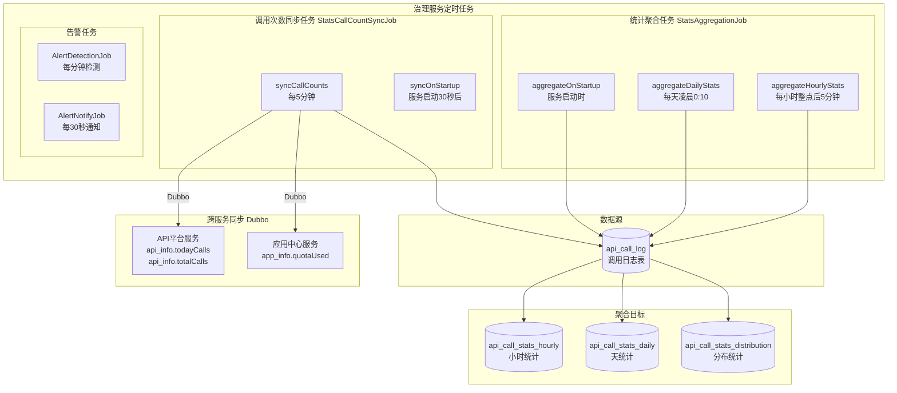

### 定时任务详情

| 任务类 | 方法 | 调度规则 | 说明 |
|--------|------|----------|------|
| `StatsAggregationJob` | `aggregateHourlyStats` | `0 5 * * * ?` | 每小时整点后5分钟，聚合上一小时数据 |
| `StatsAggregationJob` | `aggregateDailyStats` | `0 10 0 * * ?` | 每天凌晨0:10，聚合昨日数据 |
| `StatsAggregationJob` | `aggregateOnStartup` | 启动时执行一次 | 补充今日和昨日统计数据 |
| `StatsCallCountSyncJob` | `syncCallCounts` | `0 */5 * * * ?` | 每5分钟，同步调用次数到其他服务 |
| `StatsCallCountSyncJob` | `syncOnStartup` | 启动30秒后 | 首次同步调用次数 |
| `AlertDetectionJob` | `detectAlerts` | 每60秒 | 检测告警规则 |
| `AlertNotifyJob` | `notifyAlerts` | 每30秒 | 发送未通知的告警 |

---

### 统计聚合任务

**聚合流程**：

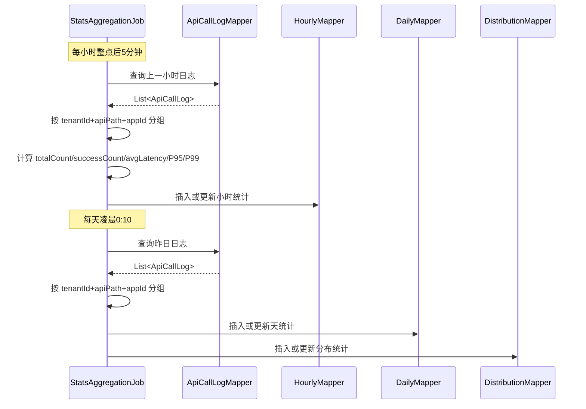

**聚合指标**：

| 指标 | 说明 |
|------|------|
| `totalCount` | 总调用次数 |
| `successCount` | 成功次数 |
| `failCount` | 失败次数 |
| `avgLatency` | 平均延迟 |
| `maxLatency` | 最大延迟 |
| `minLatency` | 最小延迟 |
| `p95Latency` | P95 延迟 |
| `p99Latency` | P99 延迟 |

---

### 调用次数同步任务

**同步流程**：

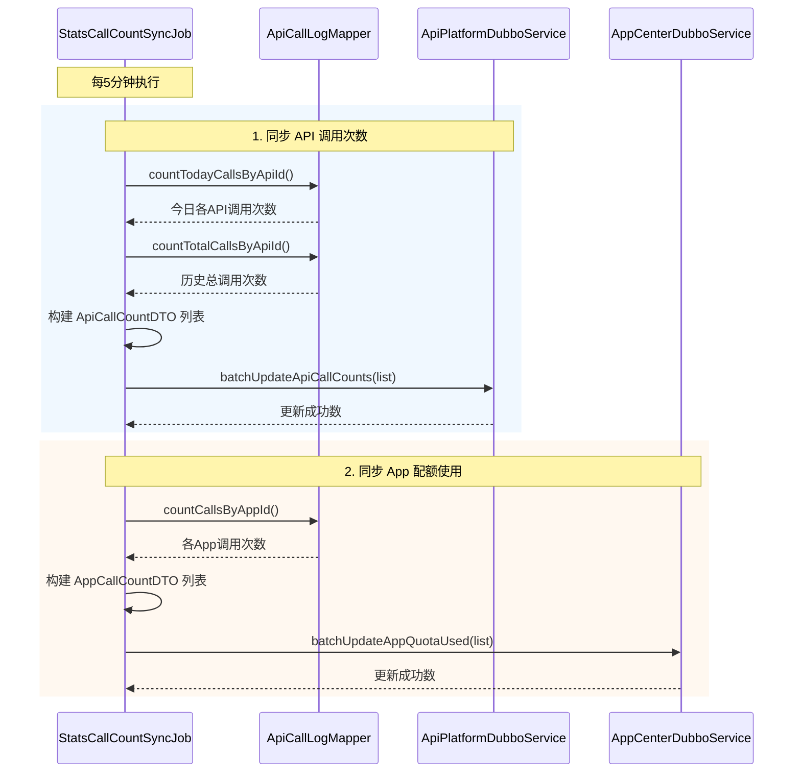

**同步目标**：

| 目标服务 | 目标表 | 更新字段 | 说明 |
|----------|--------|----------|------|
| API 平台服务 | `api_info` | `today_calls` | 今日调用次数 |
| API 平台服务 | `api_info` | `total_calls` | 历史总调用次数 |
| 应用中心服务 | `app_info` | `quota_used` | 已使用配额 |

**Dubbo 接口**：

```java
// API 平台服务接口
public interface ApiPlatformDubboService {
    /**
     * 批量更新 API 调用次数
     */
    int batchUpdateApiCallCounts(List<ApiCallCountDTO> callCounts);
}

// 应用中心服务接口
public interface AppCenterDubboService {
    /**
     * 批量更新 App 配额使用
     */
    int batchUpdateAppQuotaUsed(List<AppCallCountDTO> callCounts);
}
```

---

### 告警任务

**检测流程**：

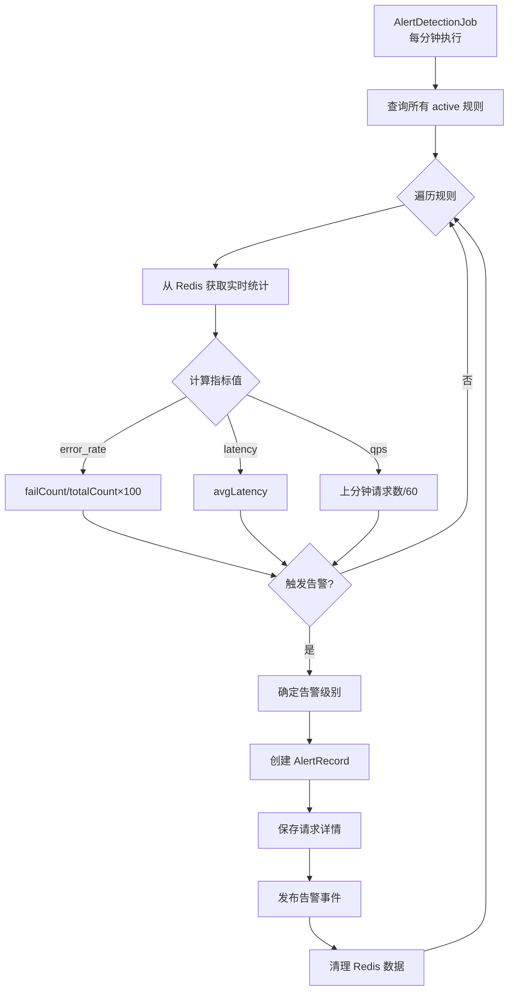

**通知流程**：

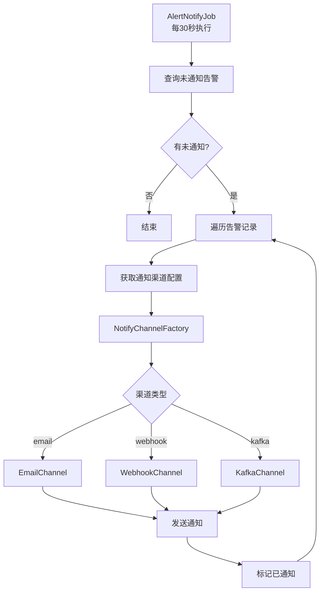

---

## 配置说明

### Kafka 配置

```yaml
spring:
  kafka:
    bootstrap-servers: 192.168.200.130:9092
    consumer:
      group-id: governance-call-log-group
      auto-offset-reset: earliest
      enable-auto-commit: true
```

### Redis 配置

```yaml
spring:
  redis:
    host: 192.168.200.130
    port: 6379
    database: 0
```

---

## 常见问题

### Q1: 统计数据与实际调用量不一致？

**可能原因**：
1. Kafka 消费延迟
2. 网关日志上报失败
3. 预聚合任务未执行

**排查**：
1. 检查 Kafka 消费者 lag
2. 检查网关日志上报配置
3. 检查定时任务执行日志

### Q2: QPS 显示为 0？

**原因**：QPS 使用上一分钟的数据计算，刚启动时可能为 0。

### Q3: 小时/天统计数据缺失？

**原因**：预聚合定时任务未执行或失败。

**解决**：手动触发聚合任务或检查定时任务配置。

### Q4: 调用日志表数据量过大？

**建议**：
1. 使用分区表，按月分区
2. 定期归档历史数据
3. 考虑使用 Elasticsearch 存储日志

### Q5: 实时统计数据丢失？

**原因**：Redis 重启或 Key 过期。

**建议**：
1. 确保 Redis 持久化配置
2. 检查 Key TTL 设置

---

## 版本历史

| 版本 | 日期 | 说明 |
|------|------|------|
| 1.0.0 | 2025-01-07 | 初始版本，实现日志采集、实时统计、趋势查询、分布统计 |
