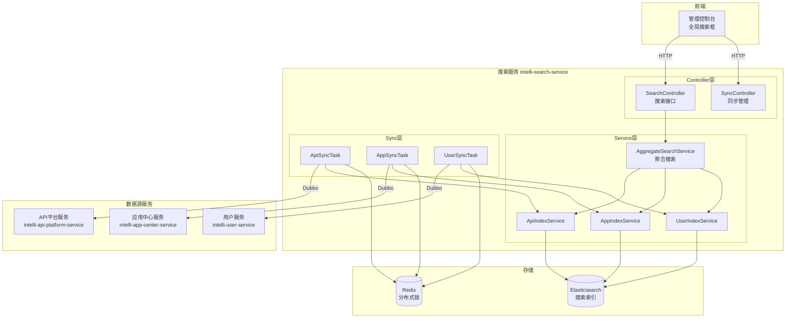
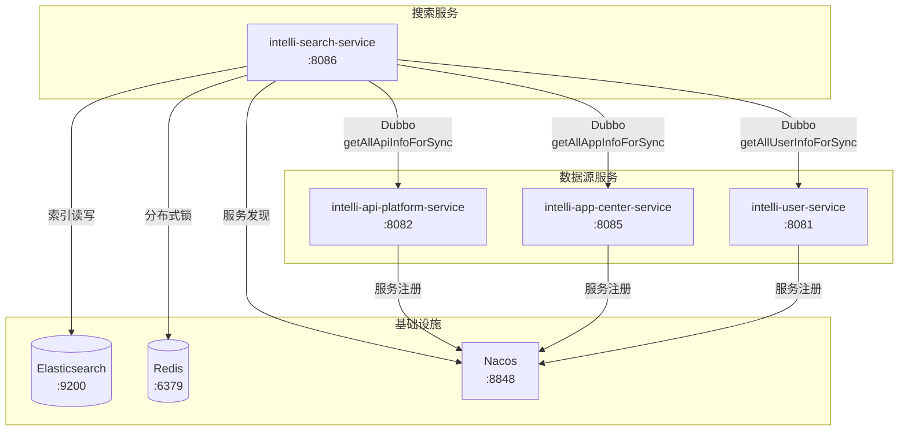
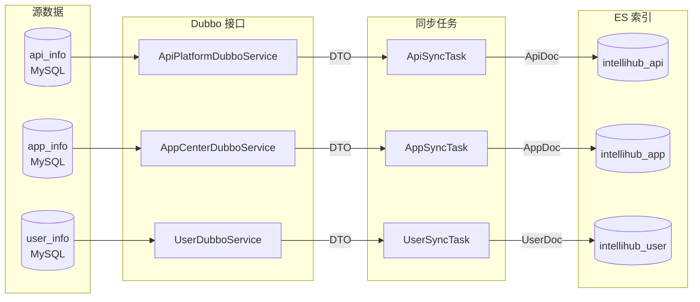
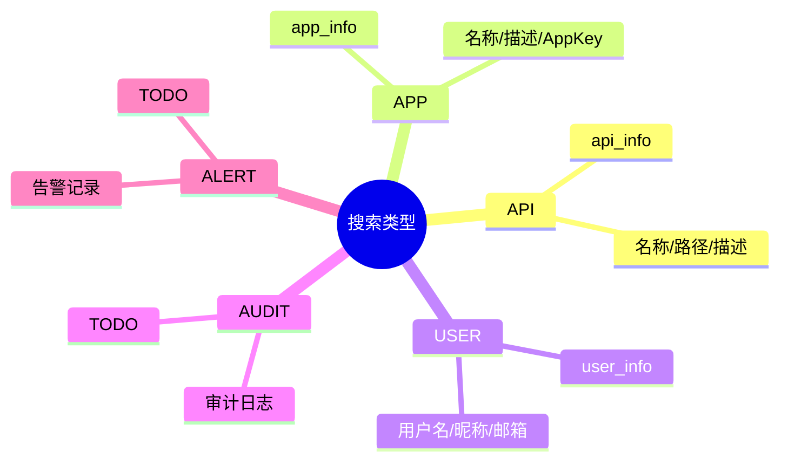
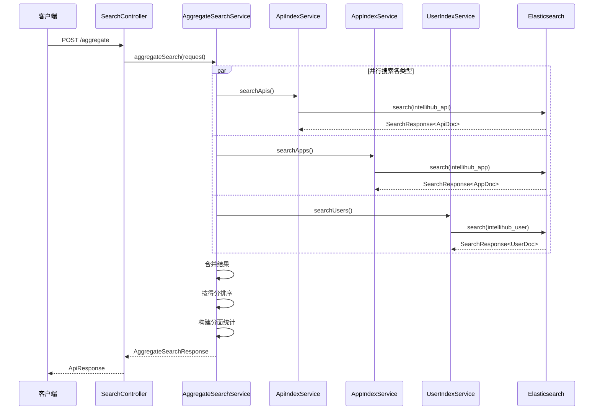
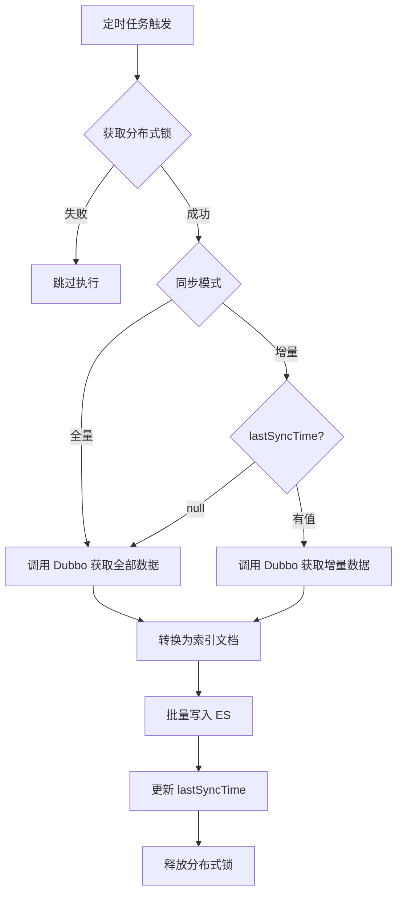
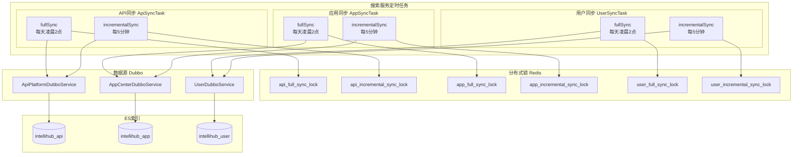
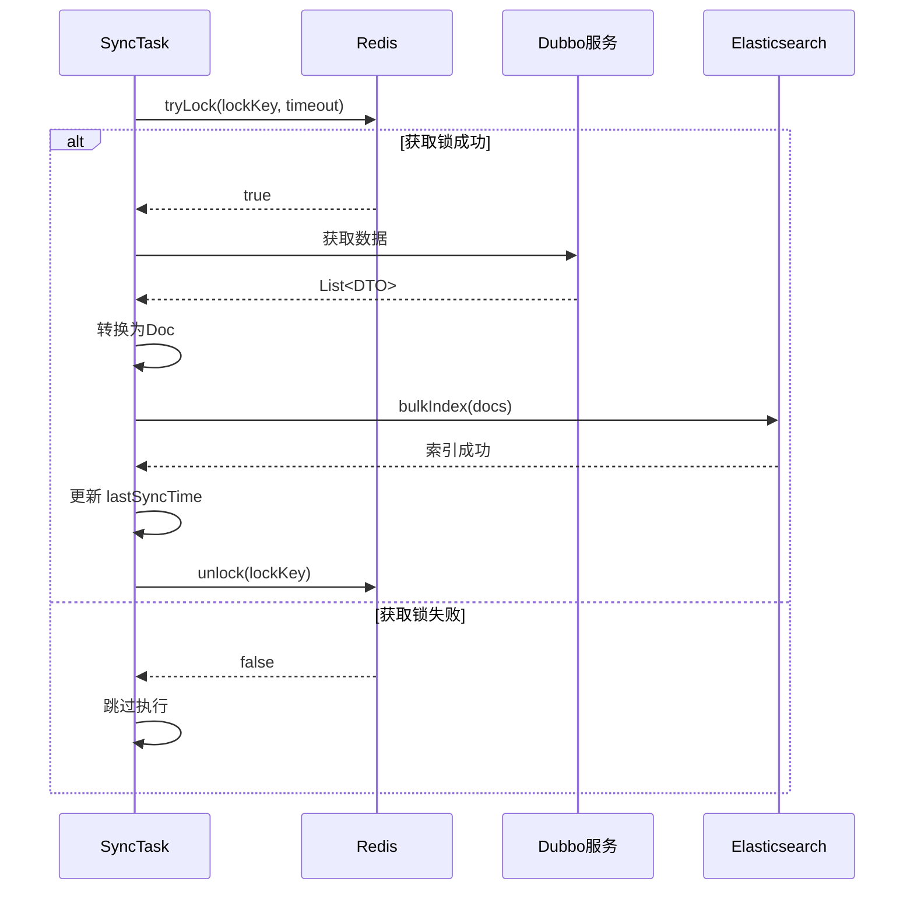

# IntelliHub 聚合搜索服务实现文档

## 目录

1. [概述](#概述)
2. [整体架构](#整体架构)
3. [与其他服务的关系](#与其他服务的关系)
4. [核心概念](#核心概念)
5. [搜索功能](#搜索功能)
6. [数据同步](#数据同步)
7. [定时任务架构](#定时任务架构)
8. [索引设计](#索引设计)
9. [配置说明](#配置说明)
10. [常见问题](#常见问题)

---

## 概述

聚合搜索服务是 IntelliHub 的**全文搜索和数据检索中心**，基于 Elasticsearch 提供跨资源类型的聚合搜索能力，支持 API、应用、用户等多种资源的统一检索。

### 核心能力

| 能力 | 说明 |
|------|------|
| 聚合搜索 | 一次查询多种资源类型，统一返回 |
| 全文检索 | 支持中文分词、关键词高亮 |
| 分面统计 | 按类型统计命中数量 |
| 数据同步 | 定时从源服务同步数据到 ES |
| 增量同步 | 支持全量和增量两种同步模式 |

### 服务信息

| 项目 | 值 |
|------|-----|
| 服务名称 | intelli-search-service |
| 端口 | 8086 |
| 搜索引擎 | Elasticsearch |
| 索引前缀 | intellihub |

---

## 整体架构

### 系统架构图



### 技术栈

| 组件 | 技术选型 | 说明 |
|------|----------|------|
| 框架 | Spring Boot 2.x | 微服务基础框架 |
| 搜索引擎 | Elasticsearch 7.x | 全文搜索 |
| RPC | Dubbo | 从源服务获取数据 |
| 分布式锁 | Redis | 防止重复同步 |
| 注册中心 | Nacos | 服务注册发现 |

---

## 与其他服务的关系

### 服务依赖关系图



### Dubbo 接口依赖

| 源服务 | 接口 | 方法 | 说明 |
|--------|------|------|------|
| API 平台服务 | `ApiPlatformDubboService` | `getAllApiInfoForSync(tenantId)` | 获取全量 API 数据 |
| API 平台服务 | `ApiPlatformDubboService` | `getApiInfoUpdatedAfter(tenantId, time)` | 获取增量 API 数据 |
| 应用中心服务 | `AppCenterDubboService` | `getAllAppInfoForSync(tenantId)` | 获取全量应用数据 |
| 应用中心服务 | `AppCenterDubboService` | `getAppInfoUpdatedAfter(tenantId, time)` | 获取增量应用数据 |
| 用户服务 | `UserDubboService` | `getAllUserInfoForSync(tenantId)` | 获取全量用户数据 |
| 用户服务 | `UserDubboService` | `getUserInfoUpdatedAfter(tenantId, time)` | 获取增量用户数据 |

### 数据流向



---

## 核心概念

### 搜索类型



### 索引文档

| 文档类型 | 索引名称 | 主要字段 |
|----------|----------|----------|
| `ApiDoc` | `intellihub_api` | name, code, path, method, description, status |
| `AppDoc` | `intellihub_app` | name, code, description, appKey, status |
| `UserDoc` | `intellihub_user` | username, nickname, email, phone, status |

### 聚合搜索响应

```java
public class AggregateSearchResponse {
    private Long total;           // 总命中数
    private Integer page;         // 当前页
    private Integer size;         // 每页大小
    private Integer totalPages;   // 总页数
    private Long took;            // 耗时(ms)
    private List<SearchItem> items;  // 搜索结果
    private Map<String, Map<String, Long>> facets;  // 分面统计
}

public class SearchItem {
    private String type;          // 资源类型
    private String id;            // 资源ID
    private String name;          // 名称
    private String description;   // 描述
    private Double score;         // 相关性得分
    private Map<String, List<String>> highlights;  // 高亮
    private Object data;          // 原始文档
}
```

---

## 搜索功能

### API 接口

| 方法 | 路径 | 说明 |
|------|------|------|
| POST | `/v1/search/aggregate` | 聚合搜索（多类型） |
| GET | `/v1/search/api` | 搜索 API |
| GET | `/v1/search/api/{id}` | 获取 API 详情 |
| POST | `/v1/search/api/index` | 手动索引 API |
| DELETE | `/v1/search/api/{id}` | 删除 API 索引 |

### 聚合搜索流程



### 搜索请求示例

```json
{
  "keyword": "用户管理",
  "types": ["api", "app"],
  "filters": {
    "status": "published"
  },
  "page": 1,
  "size": 20,
  "highlight": true
}
```

### 搜索响应示例

```json
{
  "code": 0,
  "data": {
    "total": 15,
    "page": 1,
    "size": 20,
    "totalPages": 1,
    "took": 45,
    "items": [
      {
        "type": "api",
        "id": "api-123",
        "name": "用户管理接口",
        "description": "提供用户增删改查功能",
        "score": 12.5,
        "highlights": {
          "name": ["<em>用户管理</em>接口"],
          "description": ["提供<em>用户</em>增删改查功能"]
        },
        "data": { ... }
      }
    ],
    "facets": {
      "types": {
        "api": 10,
        "app": 5,
        "user": 0
      }
    }
  }
}
```

---

## 数据同步

### 同步模式

| 模式 | 说明 | 调度规则 |
|------|------|----------|
| 全量同步 | 从源服务拉取全部数据重建索引 | 每天凌晨2点 |
| 增量同步 | 只同步上次同步后更新的数据 | 每5分钟 |

### 同步管理接口

| 方法 | 路径 | 说明 |
|------|------|------|
| POST | `/v1/search/sync/full` | 手动触发全量同步（所有类型） |
| POST | `/v1/search/sync/api/full` | 手动触发 API 全量同步 |
| POST | `/v1/search/sync/api/incremental` | 手动触发 API 增量同步 |
| POST | `/v1/search/sync/app/full` | 手动触发应用全量同步 |
| POST | `/v1/search/sync/user/full` | 手动触发用户全量同步 |

### 同步流程



---

## 定时任务架构

### 定时任务总览



### 定时任务详情

| 任务类 | 方法 | 调度规则 | 锁超时 | 说明 |
|--------|------|----------|--------|------|
| `ApiSyncTask` | `fullSync` | `0 0 2 * * ?` | 600s | API 全量同步 |
| `ApiSyncTask` | `incrementalSync` | `0 */5 * * * ?` | 120s | API 增量同步 |
| `AppSyncTask` | `fullSync` | `0 0 2 * * ?` | 600s | 应用全量同步 |
| `AppSyncTask` | `incrementalSync` | `0 */5 * * * ?` | 120s | 应用增量同步 |
| `UserSyncTask` | `fullSync` | `0 0 2 * * ?` | 600s | 用户全量同步 |
| `UserSyncTask` | `incrementalSync` | `0 */5 * * * ?` | 120s | 用户增量同步 |

### 分布式锁机制



---

## 索引设计

### 索引命名规范

| 索引 | 名称 | 说明 |
|------|------|------|
| API 索引 | `intellihub_api` | 存储 API 信息 |
| 应用索引 | `intellihub_app` | 存储应用信息 |
| 用户索引 | `intellihub_user` | 存储用户信息 |

### API 索引 Mapping

```json
{
  "mappings": {
    "properties": {
      "id": { "type": "keyword" },
      "tenantId": { "type": "keyword" },
      "name": { 
        "type": "text", 
        "analyzer": "ik_max_word",
        "search_analyzer": "ik_smart"
      },
      "code": { "type": "keyword" },
      "path": { 
        "type": "text",
        "fields": {
          "keyword": { "type": "keyword" }
        }
      },
      "method": { "type": "keyword" },
      "description": { 
        "type": "text", 
        "analyzer": "ik_max_word" 
      },
      "groupId": { "type": "keyword" },
      "groupName": { "type": "keyword" },
      "status": { "type": "keyword" },
      "authType": { "type": "keyword" },
      "version": { "type": "keyword" },
      "createdBy": { "type": "keyword" },
      "creatorName": { "type": "keyword" },
      "publishedAt": { "type": "date" },
      "createdAt": { "type": "date" },
      "updatedAt": { "type": "date" }
    }
  },
  "settings": {
    "number_of_shards": 1,
    "number_of_replicas": 0
  }
}
```

---

## 配置说明

### Elasticsearch 配置

```yaml
intellihub:
  elasticsearch:
    enabled: true
    hosts:
      - 192.168.200.130:9200
    username:
    password:
    connect-timeout: 5s
    socket-timeout: 30s
    max-connections: 100
    index-prefix: intellihub
    default-shards: 1
    default-replicas: 0
```

### 同步任务配置

```yaml
intellihub:
  search:
    sync:
      full-cron: "0 0 2 * * ?"           # API全量同步
      incremental-cron: "0 */5 * * * ?"  # API增量同步
      app-full-cron: "0 0 2 * * ?"       # 应用全量同步
      app-incremental-cron: "0 */5 * * * ?"
      user-full-cron: "0 0 2 * * ?"      # 用户全量同步
      user-incremental-cron: "0 */5 * * * ?"
```

### Dubbo 配置

```yaml
dubbo:
  application:
    name: intelli-search-service
  consumer:
    group: intellihub
    check: false
    timeout: 30000
```

---

## 常见问题

### Q1: 搜索结果为空？

**可能原因**：
1. 数据未同步到 ES
2. ES 索引不存在
3. 租户ID不匹配

**排查**：
1. 检查同步任务日志
2. 检查 ES 索引是否存在
3. 确认请求头中的 `X-Tenant-Id`

### Q2: 同步任务不执行？

**可能原因**：
1. 分布式锁被占用
2. Dubbo 服务不可用
3. Cron 表达式配置错误

**排查**：
1. 检查 Redis 中的锁状态
2. 检查 Dubbo 服务注册状态
3. 验证 Cron 表达式

### Q3: 搜索性能慢？

**优化建议**：
1. 调整 ES 分片数
2. 使用更精确的查询条件
3. 减少返回字段
4. 开启 ES 查询缓存

### Q4: 增量同步数据丢失？

**原因**：`lastSyncTime` 在内存中，服务重启后丢失。

**解决**：首次增量同步会自动触发全量同步。

### Q5: 如何添加新的搜索类型？

1. 创建新的 `XxxDoc` 文档类
2. 创建 `XxxIndexService` 索引服务
3. 创建 `XxxSyncTask` 同步任务
4. 在 `AggregateSearchService` 中添加搜索逻辑
5. 在 `SearchType` 中添加新类型

---

## 版本历史

| 版本 | 日期 | 说明 |
|------|------|------|
| 1.0.0 | 2025-01-07 | 初始版本，实现聚合搜索、API/应用/用户索引、全量/增量同步 |
