# IntelliHub 事件中心实施计划

## 1. 概述

本文档规划了 IntelliHub 平台各个微服务需要发布和订阅的事件，以及事件中心前端管理界面的需求。通过事件驱动架构，实现服务间的解耦和异步通信。

## 2. 前端界面需求分析

### 2.1 是否需要前端界面？

**答案：需要**

### 2.2 为什么需要前端界面？

#### 2.2.1 事件定义管理
- **业务需求**：平台管理员需要统一管理所有事件类型
- **功能价值**：
  - 查看系统中所有可用的事件类型
  - 创建新的事件定义（事件编码、名称、描述、数据模板）
  - 编辑和删除事件定义
  - 查看事件的订阅者列表
  - 查看事件的发布统计

#### 2.2.2 事件订阅管理
- **业务需求**：各个服务的开发者和运维人员需要配置事件订阅
- **功能价值**：
  - 为服务配置订阅关系（订阅哪些事件）
  - 配置回调地址和请求方式
  - 配置重试策略和优先级
  - 暂停和恢复订阅
  - 查看订阅的消费状态

#### 2.2.3 事件监控与追踪
- **业务需求**：运维人员需要监控事件的发布和消费情况
- **功能价值**：
  - 查看事件发布记录（成功/失败）
  - 查看事件消费记录（成功/失败/重试中）
  - 追踪单个事件的完整生命周期
  - 查看订阅者的处理性能
  - 失败事件的手动重试

#### 2.2.4 统计与分析
- **业务需求**：产品和运营人员需要了解系统的事件流转情况
- **功能价值**：
  - 事件发布量统计（按天/小时）
  - 事件消费成功率统计
  - 订阅者性能排行
  - 异常事件告警

### 2.3 前端界面模块规划

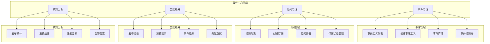

## 3. 系统事件规划

### 3.1 用户服务事件

#### 3.1.1 user.created - 用户创建事件

**事件说明：**
- **触发时机**：新用户注册成功后
- **事件数据**：
```json
{
  "userId": "string",
  "username": "string",
  "email": "string",
  "phone": "string",
  "tenantId": "string",
  "createdAt": "datetime"
}
```

**订阅者规划：**

| 订阅者 | 订阅类型 | 处理逻辑 | 优先级 |
|--------|---------|---------|--------|
| 通知服务 | Webhook | 发送欢迎邮件 | 8 |
| 审计服务 | Webhook | 记录用户创建日志 | 7 |
| 统计服务 | Webhook | 更新用户统计数据 | 5 |
| 推荐服务 | Webhook | 初始化用户画像 | 3 |

**事件流转图：**

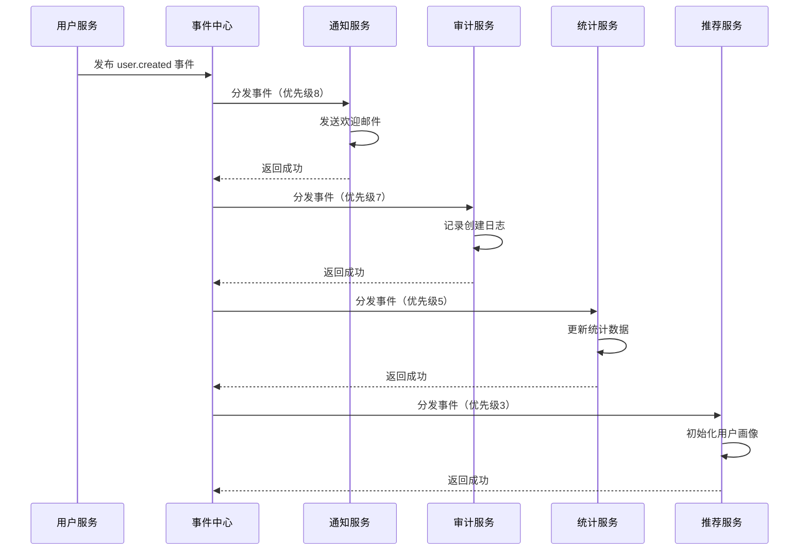

#### 3.1.2 user.updated - 用户信息更新事件

**事件说明：**
- **触发时机**：用户信息被修改后
- **事件数据**：
```json
{
  "userId": "string",
  "updatedFields": ["email", "phone"],
  "oldValues": {
    "email": "old@example.com"
  },
  "newValues": {
    "email": "new@example.com"
  },
  "updatedAt": "datetime"
}
```

**订阅者规划：**

| 订阅者 | 订阅类型 | 处理逻辑 | 优先级 |
|--------|---------|---------|--------|
| 通知服务 | Webhook | 发送变更通知 | 8 |
| 审计服务 | Webhook | 记录变更日志 | 7 |
| 缓存服务 | Webhook | 刷新用户缓存 | 9 |

**事件流转图：**

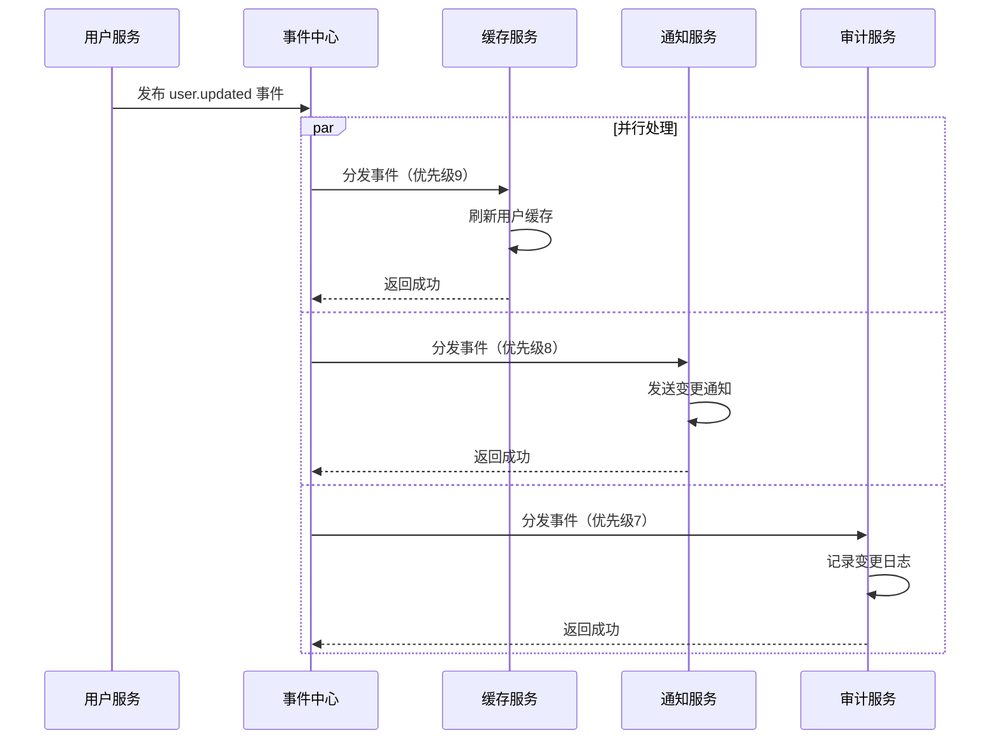

#### 3.1.3 user.deleted - 用户删除事件

**事件说明：**
- **触发时机**：用户账号被删除后
- **事件数据**：
```json
{
  "userId": "string",
  "username": "string",
  "deletedBy": "string",
  "deletedAt": "datetime",
  "reason": "string"
}
```

**订阅者规划：**

| 订阅者 | 订阅类型 | 处理逻辑 | 优先级 |
|--------|---------|---------|--------|
| 审计服务 | Webhook | 记录删除日志 | 9 |
| 数据清理服务 | Webhook | 清理用户相关数据 | 8 |
| 统计服务 | Webhook | 更新统计数据 | 5 |

**事件流转图：**

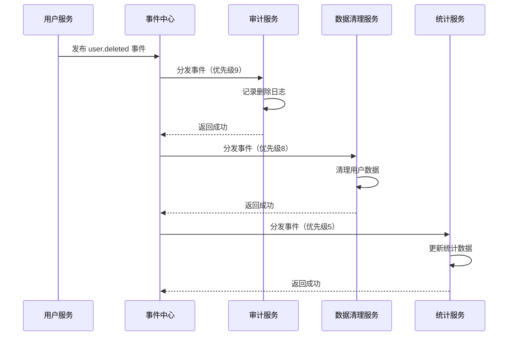

### 3.2 API 服务事件

#### 3.2.1 api.created - API 创建事件

**事件说明：**
- **触发时机**：新 API 被创建后
- **事件数据**：
```json
{
  "apiId": "string",
  "apiName": "string",
  "apiPath": "string",
  "method": "string",
  "tenantId": "string",
  "createdBy": "string",
  "createdAt": "datetime"
}
```

**订阅者规划：**

| 订阅者 | 订阅类型 | 处理逻辑 | 优先级 |
|--------|---------|---------|--------|
| 审计服务 | Webhook | 记录 API 创建日志 | 7 |
| 文档服务 | Webhook | 生成 API 文档 | 5 |

**事件流转图：**

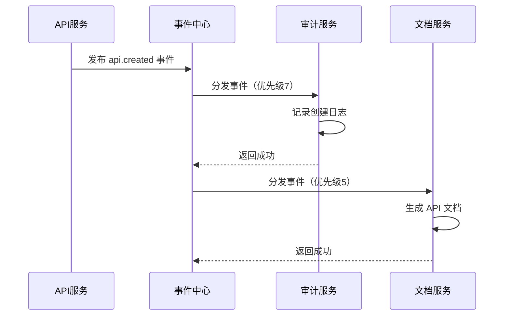

#### 3.2.2 api.published - API 发布事件

**事件说明：**
- **触发时机**：API 状态从草稿变为已发布
- **事件数据**：
```json
{
  "apiId": "string",
  "apiName": "string",
  "apiPath": "string",
  "method": "string",
  "serviceId": "string",
  "servicePath": "string",
  "tenantId": "string",
  "publishedBy": "string",
  "publishedAt": "datetime"
}
```

**订阅者规划：**

| 订阅者 | 订阅类型 | 处理逻辑 | 优先级 |
|--------|---------|---------|--------|
| 网关服务 | Webhook | 刷新路由配置 | 10 |
| 审计服务 | Webhook | 记录发布日志 | 7 |
| 监控服务 | Webhook | 配置监控指标 | 6 |
| 文档服务 | Webhook | 更新 API 文档 | 5 |

**事件流转图：**

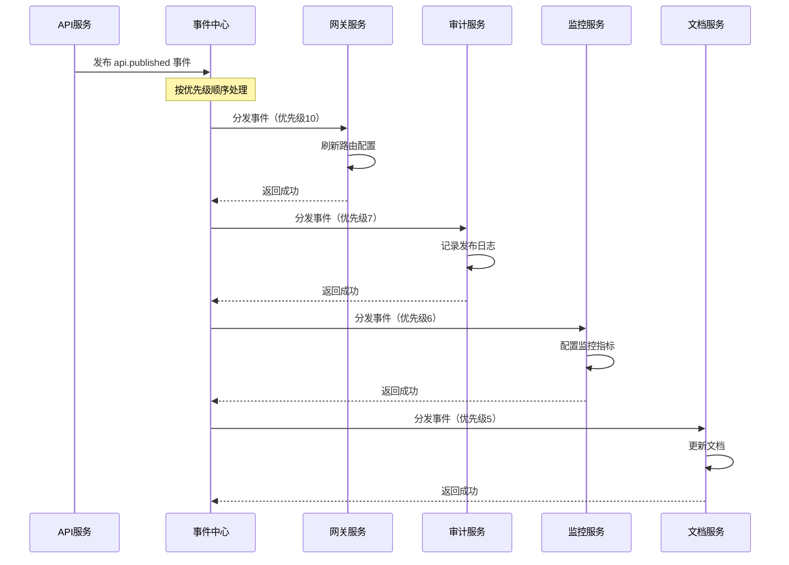

#### 3.2.3 api.updated - API 更新事件

**事件说明：**
- **触发时机**：已发布的 API 配置被修改
- **事件数据**：
```json
{
  "apiId": "string",
  "apiPath": "string",
  "updatedFields": ["timeout", "rateLimit"],
  "oldValues": {
    "timeout": 5000
  },
  "newValues": {
    "timeout": 10000
  },
  "updatedAt": "datetime"
}
```

**订阅者规划：**

| 订阅者 | 订阅类型 | 处理逻辑 | 优先级 |
|--------|---------|---------|--------|
| 网关服务 | Webhook | 更新路由配置 | 10 |
| 审计服务 | Webhook | 记录更新日志 | 7 |
| 文档服务 | Webhook | 更新 API 文档 | 5 |

**事件流转图：**

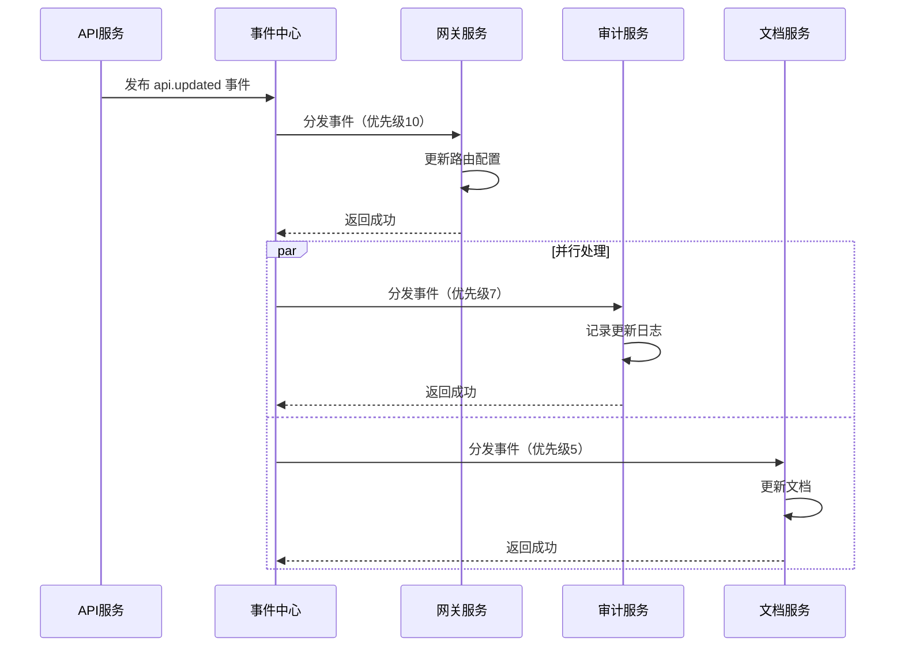

#### 3.2.4 api.offline - API 下线事件

**事件说明：**
- **触发时机**：API 被下线（不再对外提供服务）
- **事件数据**：
```json
{
  "apiId": "string",
  "apiPath": "string",
  "reason": "string",
  "offlineBy": "string",
  "offlineAt": "datetime"
}
```

**订阅者规划：**

| 订阅者 | 订阅类型 | 处理逻辑 | 优先级 |
|--------|---------|---------|--------|
| 网关服务 | Webhook | 移除路由配置 | 10 |
| 审计服务 | Webhook | 记录下线日志 | 7 |
| 监控服务 | Webhook | 停止监控 | 6 |

**事件流转图：**

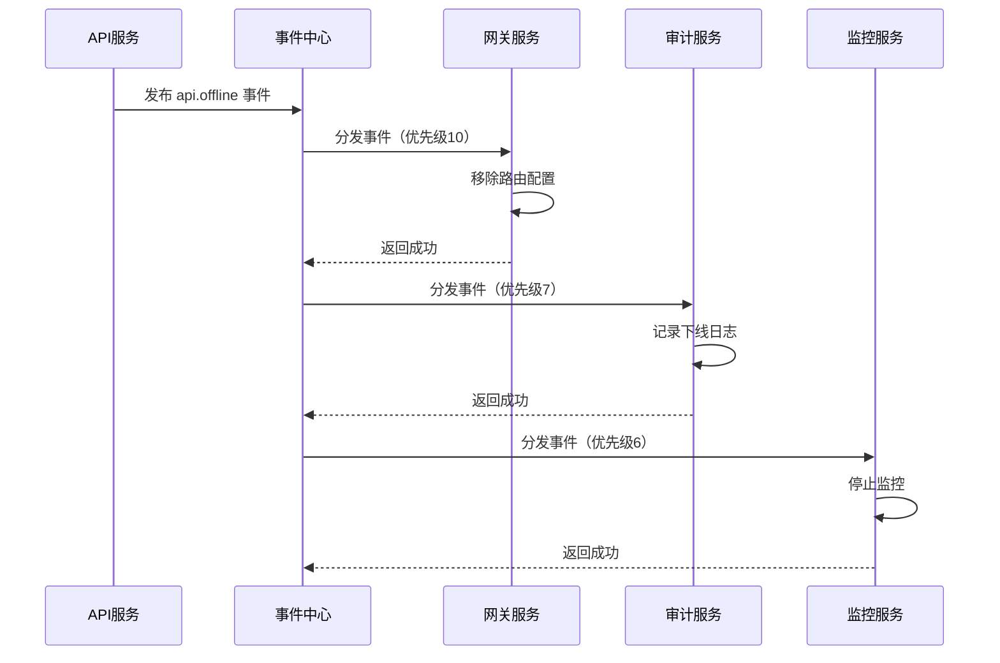

#### 3.2.5 api.deleted - API 删除事件

**事件说明：**
- **触发时机**：API 被永久删除
- **事件数据**：
```json
{
  "apiId": "string",
  "apiPath": "string",
  "deletedBy": "string",
  "deletedAt": "datetime"
}
```

**订阅者规划：**

| 订阅者 | 订阅类型 | 处理逻辑 | 优先级 |
|--------|---------|---------|--------|
| 网关服务 | Webhook | 清理路由配置 | 10 |
| 审计服务 | Webhook | 记录删除日志 | 9 |
| 数据清理服务 | Webhook | 清理 API 相关数据 | 8 |

**事件流转图：**

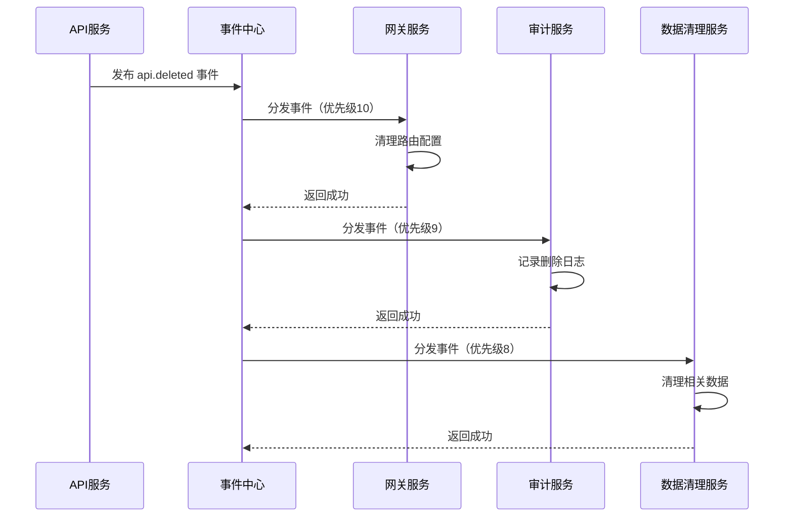

### 3.3 治理服务事件

#### 3.3.1 alert.triggered - 告警触发事件

**事件说明：**
- **触发时机**：监控指标触发告警规则
- **事件数据**：
```json
{
  "alertId": "string",
  "ruleId": "string",
  "ruleName": "string",
  "alertLevel": "WARNING|ERROR|CRITICAL",
  "metric": "string",
  "currentValue": "number",
  "threshold": "number",
  "apiId": "string",
  "apiPath": "string",
  "tenantId": "string",
  "triggeredAt": "datetime",
  "message": "string"
}
```

**订阅者规划：**

| 订阅者 | 订阅类型 | 处理逻辑 | 优先级 |
|--------|---------|---------|--------|
| 邮件通知 | Webhook | 发送告警邮件 | 9 |
| 短信通知 | Webhook | 发送告警短信（仅 CRITICAL） | 9 |
| 钉钉通知 | Webhook | 发送钉钉群消息 | 8 |
| Webhook通知 | Webhook | 调用用户配置的 Webhook | 7 |
| 工单系统 | Webhook | 自动创建工单（仅 CRITICAL） | 6 |

**事件流转图：**

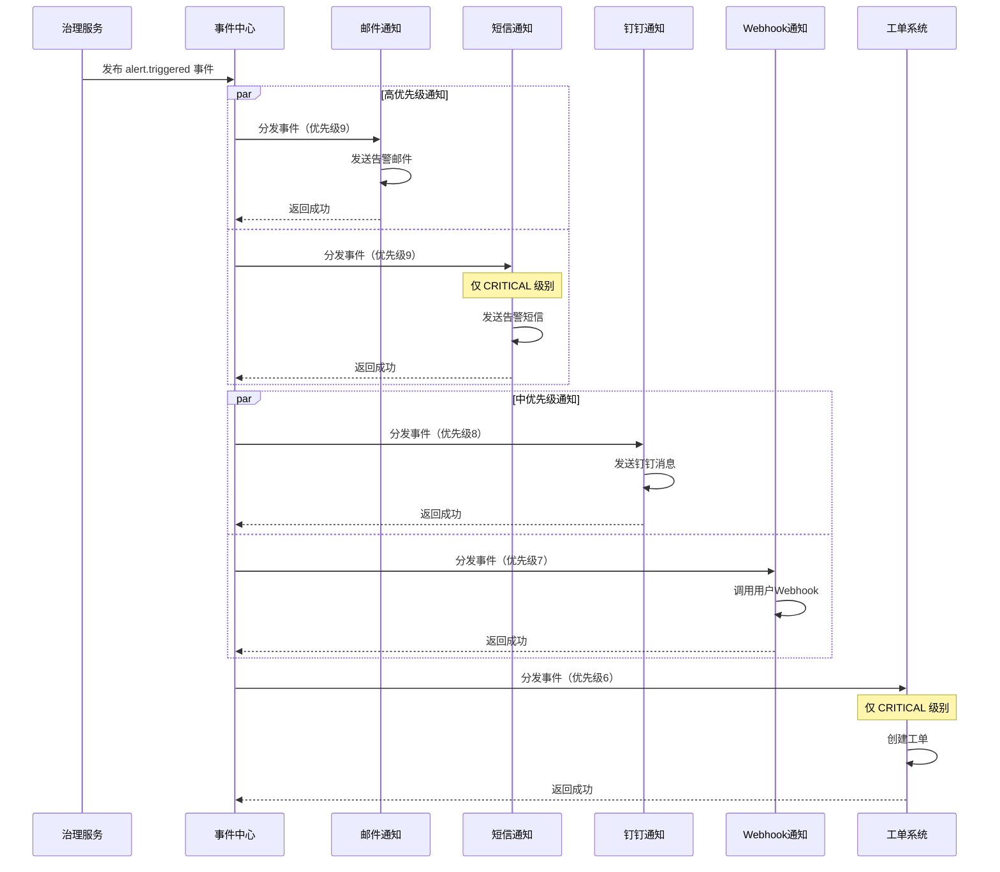

#### 3.3.2 alert.resolved - 告警恢复事件

**事件说明：**
- **触发时机**：告警指标恢复正常
- **事件数据**：
```json
{
  "alertId": "string",
  "ruleId": "string",
  "ruleName": "string",
  "resolvedAt": "datetime",
  "duration": "number"
}
```

**订阅者规划：**

| 订阅者 | 订阅类型 | 处理逻辑 | 优先级 |
|--------|---------|---------|--------|
| 邮件通知 | Webhook | 发送恢复通知 | 7 |
| 钉钉通知 | Webhook | 发送恢复消息 | 7 |
| 工单系统 | Webhook | 自动关闭工单 | 6 |

**事件流转图：**

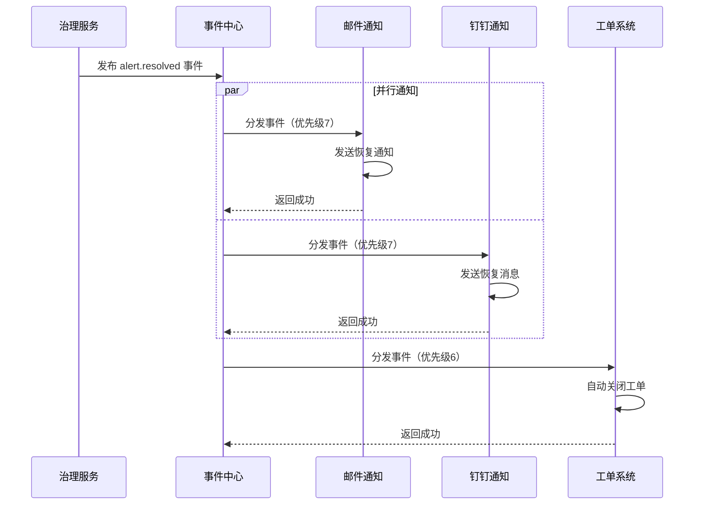

### 3.4 应用服务事件

#### 3.4.1 app.created - 应用创建事件

**事件说明：**
- **触发时机**：新应用被创建
- **事件数据**：
```json
{
  "appId": "string",
  "appName": "string",
  "appKey": "string",
  "tenantId": "string",
  "createdBy": "string",
  "createdAt": "datetime"
}
```

**订阅者规划：**

| 订阅者 | 订阅类型 | 处理逻辑 | 优先级 |
|--------|---------|---------|--------|
| 审计服务 | Webhook | 记录应用创建日志 | 7 |
| 统计服务 | Webhook | 更新应用统计 | 5 |

**事件流转图：**

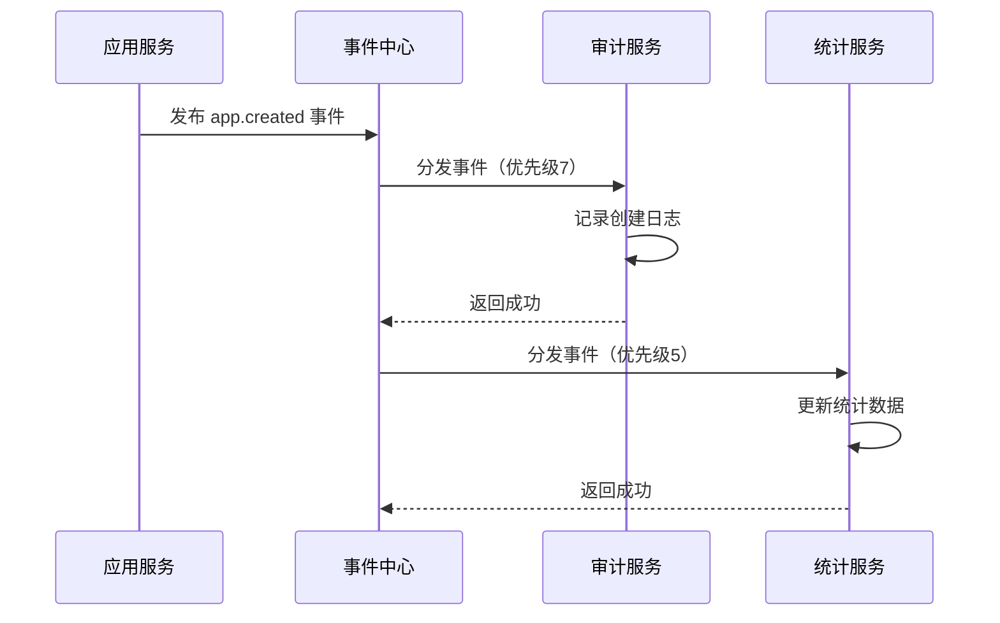

#### 3.4.2 app.key.regenerated - 应用密钥重新生成事件

**事件说明：**
- **触发时机**：应用的 AppKey 或 AppSecret 被重新生成
- **事件数据**：
```json
{
  "appId": "string",
  "appName": "string",
  "regeneratedBy": "string",
  "regeneratedAt": "datetime",
  "reason": "string"
}
```

**订阅者规划：**

| 订阅者 | 订阅类型 | 处理逻辑 | 优先级 |
|--------|---------|---------|--------|
| 通知服务 | Webhook | 发送密钥变更通知 | 9 |
| 审计服务 | Webhook | 记录密钥变更日志 | 8 |
| 网关服务 | Webhook | 刷新应用认证缓存 | 10 |

**事件流转图：**

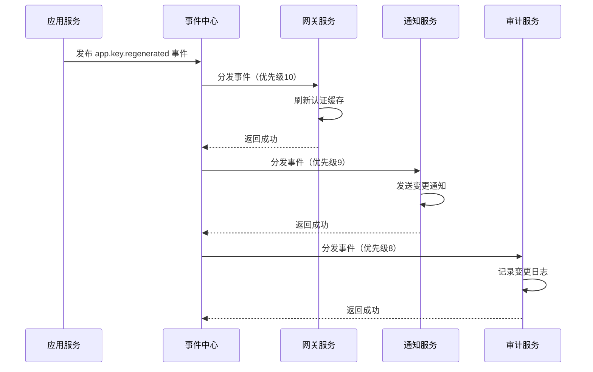

### 3.5 订单/支付事件（预留）

#### 3.5.1 order.created - 订单创建事件

**事件说明：**
- **触发时机**：用户创建订单
- **事件数据**：
```json
{
  "orderId": "string",
  "userId": "string",
  "amount": "number",
  "currency": "string",
  "items": [],
  "createdAt": "datetime"
}
```

**订阅者规划：**

| 订阅者 | 订阅类型 | 处理逻辑 | 优先级 |
|--------|---------|---------|--------|
| 库存服务 | Webhook | 锁定库存 | 10 |
| 通知服务 | Webhook | 发送订单确认 | 7 |
| 统计服务 | Webhook | 更新订单统计 | 5 |

**事件流转图：**

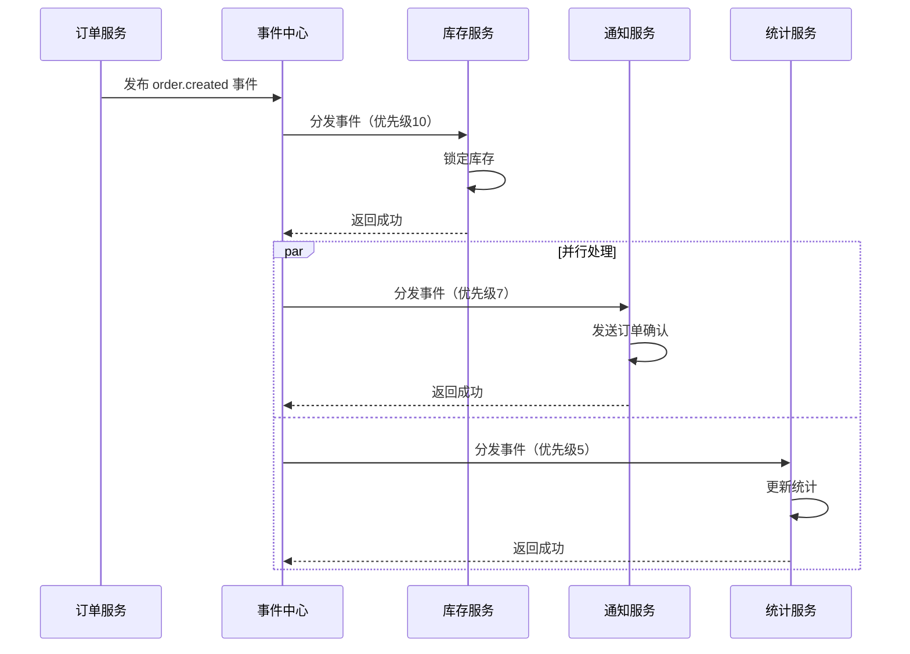

#### 3.5.2 order.paid - 订单支付事件

**事件说明：**
- **触发时机**：订单支付成功
- **事件数据**：
```json
{
  "orderId": "string",
  "userId": "string",
  "amount": "number",
  "paymentMethod": "string",
  "paidAt": "datetime"
}
```

**订阅者规划：**

| 订阅者 | 订阅类型 | 处理逻辑 | 优先级 |
|--------|---------|---------|--------|
| 履约服务 | Webhook | 开始履约流程 | 10 |
| 发票服务 | Webhook | 生成发票 | 8 |
| 通知服务 | Webhook | 发送支付成功通知 | 7 |
| 统计服务 | Webhook | 更新收入统计 | 5 |

**事件流转图：**

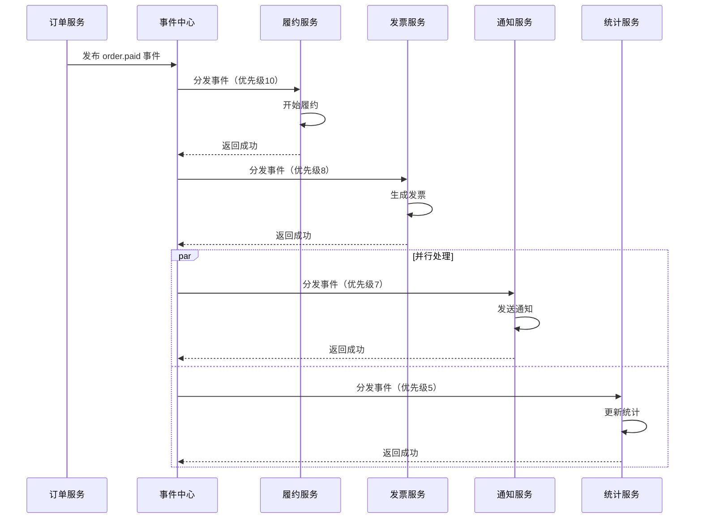

## 4. 实施计划

### 4.1 第一阶段：核心事件（优先级：高）

**时间：2周**

#### 4.1.1 API 生命周期事件
- [ ] api.published - API 发布事件
- [ ] api.updated - API 更新事件
- [ ] api.offline - API 下线事件
- [ ] api.deleted - API 删除事件

**订阅者实现：**
- [ ] 网关服务订阅 API 事件，实现路由自动刷新
- [ ] 审计服务订阅 API 事件，记录操作日志

#### 4.1.2 告警事件
- [ ] alert.triggered - 告警触发事件
- [ ] alert.resolved - 告警恢复事件

**订阅者实现：**
- [ ] 邮件通知订阅告警事件
- [ ] 钉钉通知订阅告警事件

### 4.2 第二阶段：用户事件（优先级：中）

**时间：1周**

#### 4.2.1 用户生命周期事件
- [ ] user.created - 用户创建事件
- [ ] user.updated - 用户更新事件
- [ ] user.deleted - 用户删除事件

**订阅者实现：**
- [ ] 通知服务订阅用户事件
- [ ] 审计服务订阅用户事件
- [ ] 统计服务订阅用户事件

### 4.3 第三阶段：应用事件（优先级：中）

**时间：3天**

#### 4.3.1 应用管理事件
- [ ] app.created - 应用创建事件
- [ ] app.key.regenerated - 密钥重新生成事件

**订阅者实现：**
- [ ] 网关服务订阅应用事件，刷新认证缓存
- [ ] 通知服务订阅密钥变更事件
- [ ] 审计服务订阅应用事件

### 4.4 第四阶段：前端界面（优先级：高）

**时间：2周**

#### 4.4.1 事件管理模块
- [ ] 事件定义列表页面
- [ ] 创建/编辑事件定义页面
- [ ] 事件详情页面（含订阅者列表）
- [ ] 事件统计图表

#### 4.4.2 订阅管理模块
- [ ] 订阅列表页面
- [ ] 创建/编辑订阅页面
- [ ] 订阅详情页面
- [ ] 订阅状态管理（暂停/恢复）

#### 4.4.3 监控追踪模块
- [ ] 事件发布记录列表
- [ ] 事件消费记录列表
- [ ] 事件追踪详情页面
- [ ] 失败事件重试功能

#### 4.4.4 统计分析模块
- [ ] 事件发布量统计图表
- [ ] 事件消费成功率统计
- [ ] 订阅者性能分析
- [ ] 异常事件告警配置

### 4.5 第五阶段：扩展事件（优先级：低）

**时间：根据业务需求**

#### 4.5.1 订单/支付事件（预留）
- [ ] order.created
- [ ] order.paid
- [ ] order.cancelled
- [ ] order.refunded

## 5. 事件定义清单

### 5.1 事件编码规范

```
{资源}.{动作}
```

**示例：**
- user.created
- api.published
- alert.triggered

### 5.2 完整事件清单

| 事件编码 | 事件名称 | 事件类型 | 优先级 | 状态 |
|---------|---------|---------|--------|------|
| user.created | 用户创建 | USER | 高 | 待实施 |
| user.updated | 用户更新 | USER | 中 | 待实施 |
| user.deleted | 用户删除 | USER | 中 | 待实施 |
| api.created | API创建 | API | 中 | 待实施 |
| api.published | API发布 | API | 高 | 待实施 |
| api.updated | API更新 | API | 高 | 待实施 |
| api.offline | API下线 | API | 高 | 待实施 |
| api.deleted | API删除 | API | 中 | 待实施 |
| alert.triggered | 告警触发 | ALERT | 高 | 待实施 |
| alert.resolved | 告警恢复 | ALERT | 高 | 待实施 |
| app.created | 应用创建 | APP | 中 | 待实施 |
| app.key.regenerated | 密钥重新生成 | APP | 中 | 待实施 |
| order.created | 订单创建 | ORDER | 低 | 预留 |
| order.paid | 订单支付 | ORDER | 低 | 预留 |

## 6. 订阅者清单

### 6.1 服务订阅矩阵

| 服务 | 订阅事件 | 处理逻辑 | 实施状态 |
|-----|---------|---------|---------|
| 网关服务 | api.published<br/>api.updated<br/>api.offline<br/>api.deleted<br/>app.key.regenerated | 刷新路由配置<br/>刷新认证缓存 | 待实施 |
| 通知服务 | user.created<br/>user.updated<br/>app.key.regenerated<br/>alert.triggered<br/>alert.resolved | 发送各类通知 | 待实施 |
| 审计服务 | user.*<br/>api.*<br/>app.* | 记录操作日志 | 待实施 |
| 统计服务 | user.*<br/>api.*<br/>order.* | 更新统计数据 | 待实施 |
| 文档服务 | api.created<br/>api.published<br/>api.updated | 生成/更新文档 | 待实施 |
| 监控服务 | api.published<br/>api.offline | 配置/停止监控 | 待实施 |

## 7. 开发任务分解

### 7.1 后端开发任务

#### 7.1.1 事件发布集成（各业务服务）
- [ ] 用户服务集成事件发布
- [ ] API 服务集成事件发布
- [ ] 治理服务集成事件发布
- [ ] 应用服务集成事件发布

#### 7.1.2 事件订阅实现（各订阅服务）
- [ ] 网关服务实现 Webhook 接口
- [ ] 通知服务实现 Webhook 接口
- [ ] 审计服务实现 Webhook 接口
- [ ] 统计服务实现 Webhook 接口
- [ ] 文档服务实现 Webhook 接口
- [ ] 监控服务实现 Webhook 接口

#### 7.1.3 事件中心配置
- [ ] 在事件中心创建所有事件定义
- [ ] 配置所有订阅关系
- [ ] 配置重试策略和优先级

### 7.2 前端开发任务

#### 7.2.1 页面开发
- [ ] 事件定义管理页面（列表/创建/编辑/详情）
- [ ] 事件订阅管理页面（列表/创建/编辑/详情）
- [ ] 事件监控页面（发布记录/消费记录/追踪）
- [ ] 事件统计页面（图表/分析）

#### 7.2.2 组件开发
- [ ] 事件选择器组件
- [ ] 订阅配置表单组件
- [ ] 事件追踪时间线组件
- [ ] 统计图表组件

### 7.3 测试任务

#### 7.3.1 单元测试
- [ ] 事件发布服务测试
- [ ] 事件订阅服务测试
- [ ] 事件消费者测试

#### 7.3.2 集成测试
- [ ] 端到端事件流转测试
- [ ] 失败重试机制测试
- [ ] 性能压测

#### 7.3.3 验收测试
- [ ] 各业务场景验证
- [ ] 前端界面功能验证

## 8. 风险与注意事项

### 8.1 技术风险

#### 8.1.1 消息堆积
- **风险**：Kafka 消息堆积导致消费延迟
- **应对**：
  - 监控 Kafka 消息堆积量
  - 及时扩容消费者实例
  - 优化订阅者处理性能

#### 8.1.2 订阅者故障
- **风险**：订阅者服务故障导致事件处理失败
- **应对**：
  - 配置合理的重试策略
  - 设置告警监控
  - 提供手动重试功能

#### 8.1.3 数据一致性
- **风险**：事件处理失败导致数据不一致
- **应对**：
  - 订阅者实现幂等性
  - 记录完整的处理日志
  - 提供数据修复工具

### 8.2 业务风险

#### 8.2.1 事件定义变更
- **风险**：事件数据结构变更影响订阅者
- **应对**：
  - 制定事件版本管理策略
  - 向后兼容的数据结构设计
  - 提前通知订阅者变更

#### 8.2.2 订阅者性能
- **风险**：慢订阅者影响整体性能
- **应对**：
  - 设置订阅者超时时间
  - 监控订阅者处理耗时
  - 优化慢订阅者代码

## 9. 总结

本文档规划了 IntelliHub 平台事件中心的完整实施方案，包括：

1. **前端界面需求**：需要开发完整的事件管理、订阅管理、监控追踪、统计分析四大模块
2. **事件规划**：定义了 14 个核心事件，涵盖用户、API、告警、应用等业务场景
3. **订阅关系**：规划了 6 个订阅服务，明确了各服务的订阅事件和处理逻辑
4. **实施计划**：分 5 个阶段实施，总计约 5-6 周完成
5. **开发任务**：详细分解了后端、前端、测试任务
6. **风险应对**：识别了技术和业务风险，提出了应对措施

**下一步行动：**
1. 评审本文档，确认事件规划和实施计划
2. 开始第一阶段开发（API 生命周期事件 + 告警事件）
3. 同步启动前端界面开发
4. 按计划逐步推进各阶段实施
