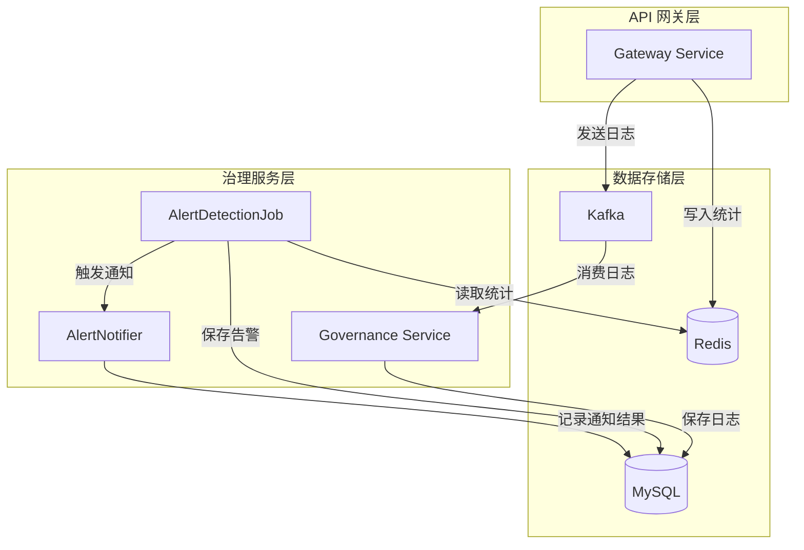
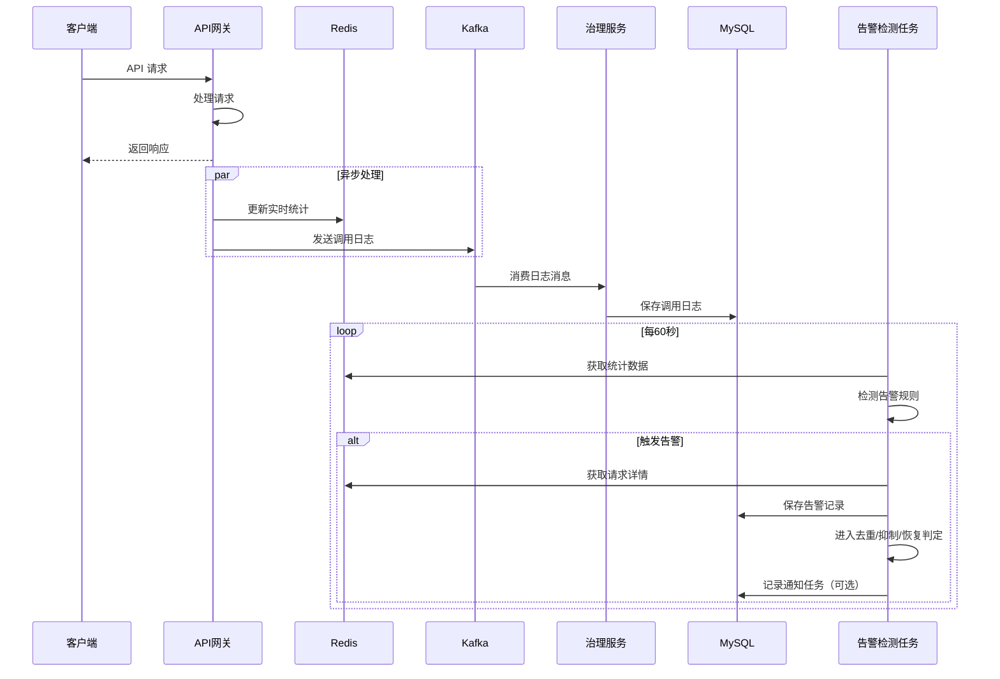
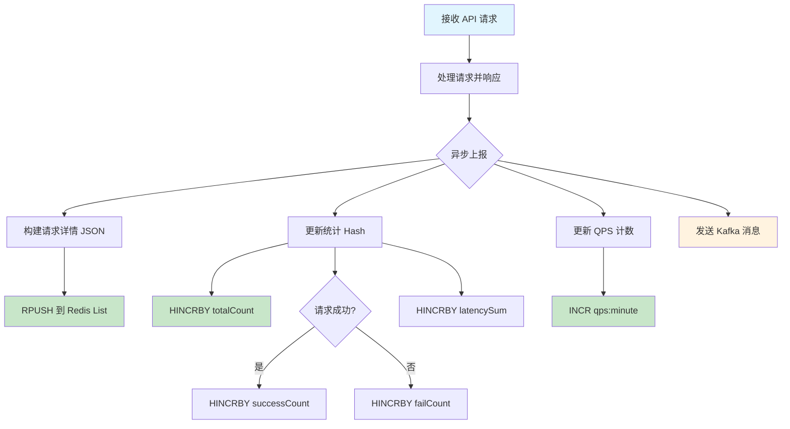
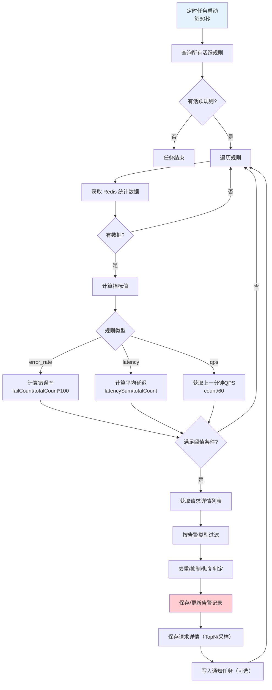
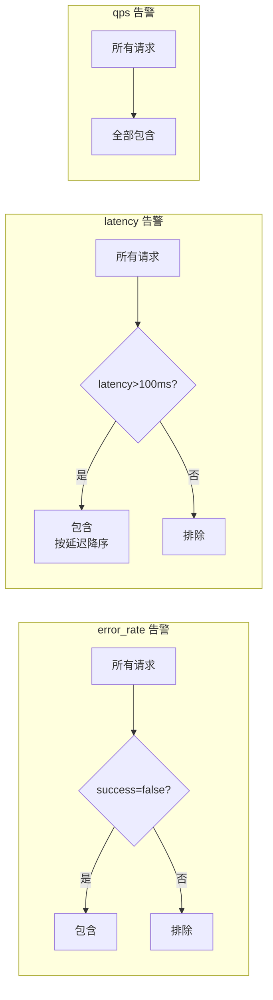
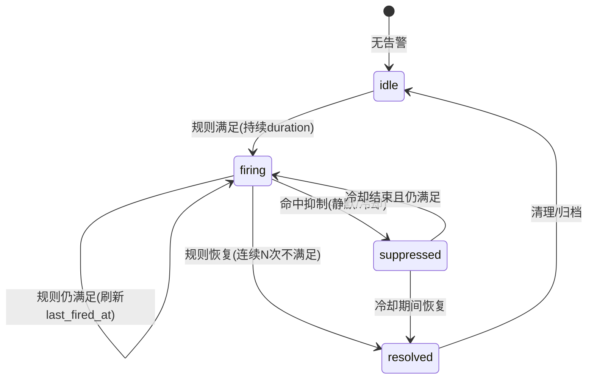
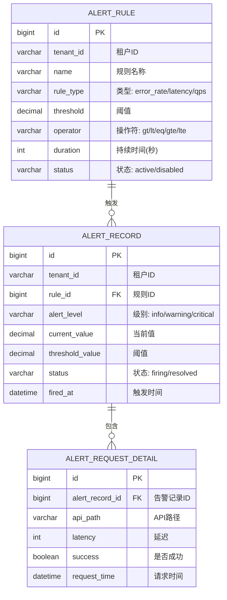
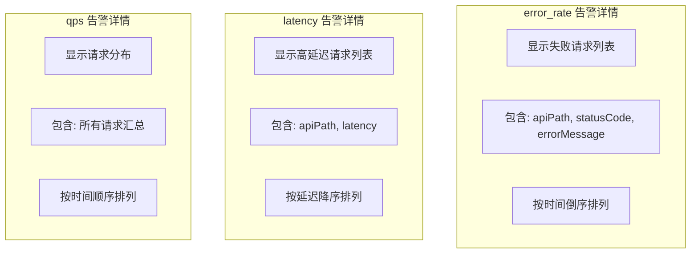
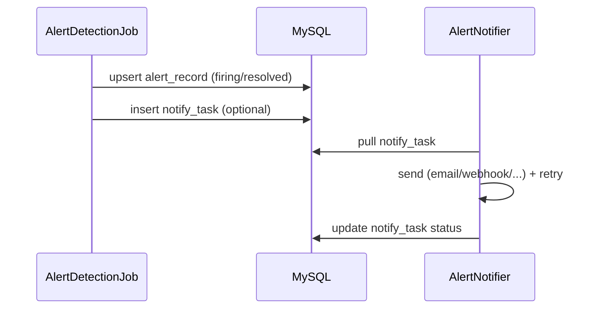
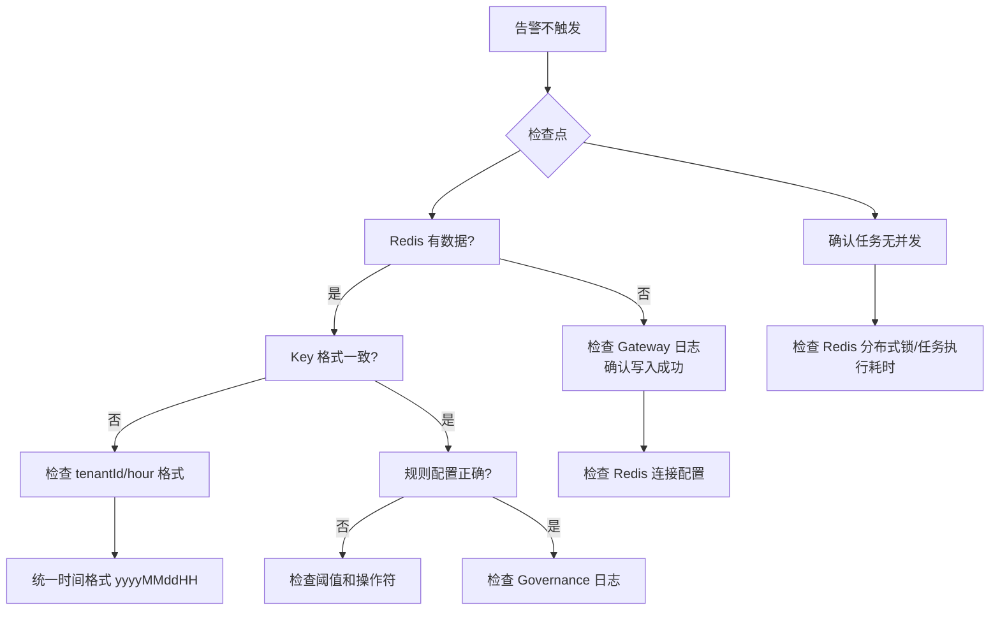

# IntelliHub 告警系统技术流程说明书

## 一、系统概述

IntelliHub 告警系统是一个实时监控和告警平台，用于监控 API 调用的健康状况，当指标超过阈值时自动触发告警并通知相关人员。

### 1.1 核心功能

- **实时统计**: 收集 API 调用的成功率、延迟、QPS 等指标
- **规则管理**: 支持配置多种类型的告警规则
- **告警检测**: 定时检测规则，自动触发告警
- **告警详情**: 记录触发告警的具体请求信息

### 1.2 目标与边界

**目标**：

- **可观测**：明确告警从“指标采集 → 规则评估 → 告警记录 → 通知”的全链路。
- **可控**：支持告警降噪（去重/抑制/恢复），避免“告警风暴”。
- **可运维**：提供排查路径、关键日志、验证命令与演练建议。

**边界**：

- **网关/治理侧**负责指标采集与告警触发；
- **通知渠道（邮件/钉钉/Webhook 等）**作为扩展点，可先落库记录通知结果，后续再接入真实通道。

### 1.3 技术架构



---

## 二、数据流程

### 2.1 整体数据流



### 2.2 Gateway 数据写入流程



---

## 三、Redis 数据结构

### 3.1 Key 设计

| Key 格式 | 类型 | TTL | 用途 |
|---------|------|-----|------|
| `alert:stats:{tenantId}:{hour}` | Hash | 1小时 | 统计汇总 |
| `alert:requests:{tenantId}:{hour}` | List | 1小时 | 请求详情 |
| `alert:qps:{tenantId}:{minute}` | String | 5分钟 | QPS 计数 |

### 3.2 数据结构详情

#### 统计汇总 (Hash)

```
Key: alert:stats:1:2025122614
Fields:
  - totalCount: 1000      # 总请求数
  - successCount: 950     # 成功请求数
  - failCount: 50         # 失败请求数
  - latencySum: 150000    # 延迟总和(ms)
```

#### 请求详情 (List)

```
Key: alert:requests:1:2025122614
Elements: [
  {"requestId":"uuid1","apiPath":"/api/user","success":true,"latency":50,"timestamp":"..."},
  {"requestId":"uuid2","apiPath":"/api/order","success":false,"latency":200,"timestamp":"..."},
  ...
]
```

#### QPS 计数 (String)

```
Key: alert:qps:1:202512261430
Value: "600"  # 该分钟内的请求总数
```

---

## 四、告警检测流程

### 4.1 检测任务流程



### 4.2 指标计算公式

| 指标类型 | 计算公式 | 说明 |
|---------|---------|------|
| **error_rate** | `failCount / totalCount * 100` | 错误率百分比 |
| **latency** | `latencySum / totalCount` | 平均延迟(ms) |
| **qps** | `上一分钟请求数 / 60` | 每秒请求数 |

### 4.3 请求过滤规则



### 4.4 告警状态机与抑制策略（建议实现）

为了避免告警风暴、减少重复通知，告警记录建议引入状态机与降噪策略。



**推荐字段/概念**：

- **fingerprint / dedupKey**：用于同一告警的去重（建议：`tenantId + ruleId + 维度Key`）。
- **cooldownSeconds（冷却期）**：同一 fingerprint 在冷却期内不重复通知，但仍可更新 `current_value`/`last_fired_at`。
- **silence（静默）**：人工静默，直接进入 `suppressed`，只记录不通知。
- **duration（持续时间）**：规则需要持续满足 N 个检测周期后才进入 `firing`（降低瞬时抖动）。

### 4.5 幂等与并发控制（必须说明）

告警检测任务是定时任务，必须避免并发执行导致重复写入。

**建议方案**：

- **分布式锁**：任务启动时用 Redis `SETNX alert:job:lock` 加锁，设置短 TTL（略大于任务周期）。
- **DB 唯一约束**：在 `alert_record` 上增加 `uk_tenant_fingerprint_status`（如：`tenant_id + fingerprint + status=firing`），用“插入失败→更新”实现幂等。
- **通知幂等**：通知任务表使用 `uk_record_channel` 防重复。

---

## 五、告警规则管理

### 5.1 规则配置



### 5.2 规则示例

| 规则名称 | 类型 | 阈值 | 操作符 | 含义 |
|---------|------|------|--------|------|
| 错误率告警 | error_rate | 5 | gt | 错误率 > 5% 时告警 |
| 延迟告警 | latency | 500 | gt | 平均延迟 > 500ms 时告警 |
| QPS告警 | qps | 1000 | gt | QPS > 1000 时告警 |

### 5.3 规则维度与作用范围（补充说明）

规则通常不仅要区分 `tenantId`，还需要区分“作用对象”，否则会出现：任意 API 抖动导致全局告警。

**建议支持的维度**：

- **tenant 全局**：租户级整体错误率/延迟/QPS
- **apiId/apiPath**：针对具体 API 的错误率/延迟
- **appKey/appId**：针对某个调用方应用的错误率/配额

可在规则中加入：`dimension_type`、`dimension_value`，并在 Job 查询 Redis/DB 时按维度聚合。

---

## 六、告警详情展示

### 6.1 API 接口

```
GET /governance/v1/alert/records/{id}/details
```

### 6.2 响应结构

```json
{
  "code": 200,
  "data": {
    "record": {
      "id": 1,
      "tenantId": "1",
      "ruleName": "错误率告警",
      "alertLevel": "warning",
      "currentValue": 8.5,
      "thresholdValue": 5.0,
      "status": "firing",
      "firedAt": "2025-12-26T14:30:00"
    },
    "requestDetails": [
      {
        "apiPath": "/api/order/create",
        "statusCode": 500,
        "success": false,
        "latency": 150,
        "errorMessage": "Database connection failed",
        "requestTime": "2025-12-26T14:29:45"
      }
    ],
    "requestCount": 15
  }
}
```

### 6.3 不同告警类型展示



### 6.4 告警通知（建议补充能力）

告警触发后，推荐将“通知”解耦为独立步骤，避免通知失败影响告警入库。



**通知重试建议**：

- **指数退避**（例如：1m / 5m / 15m）
- 最大重试次数，失败后标记 `dead` 并保留可人工重放
- 通知模板中包含：`ruleName`、`currentValue/threshold`、`timeRange`、`topRequests`、`traceId/requestId`（若有）

---

## 七、服务配置

### 7.1 Gateway 配置

```yaml
spring:
  redis:
    host: 192.168.200.130
    port: 6379
    database: 0  # 必须与 Governance 一致
```

### 7.2 Governance 配置

```yaml
spring:
  redis:
    host: 192.168.200.130
    port: 6379
    database: 0  # 必须与 Gateway 一致
```

### 7.3 关键配置项

| 配置 | 值 | 说明 |
|------|-----|------|
| Redis database | 0 | Gateway 和 Governance 必须一致 |
| 告警检测周期 | 60秒 | AlertDetectionJob 执行频率 |
| 统计数据 TTL | 1小时 | alert:stats 和 alert:requests |
| QPS 数据 TTL | 5分钟 | alert:qps |

---

## 八、故障排查

### 8.1 常见问题



### 8.2 日志关键字

| 日志关键字 | 含义 |
|-----------|------|
| `[Gateway Redis]` | Gateway 写入 Redis |
| `[实时统计]` | Governance 读取统计 |
| `[告警检测]` | 告警检测任务 |
| `[告警触发]` | 告警已触发 |
| `[QPS统计]` | QPS 计算 |

### 8.3 验证命令

```bash
# 查看统计数据
redis-cli HGETALL "alert:stats:1:2025122614"

# 查看请求详情
redis-cli LRANGE "alert:requests:1:2025122614" 0 10

# 查看 QPS 数据
redis-cli GET "alert:qps:1:202512261430"

# 查看所有告警相关 Key
redis-cli KEYS "alert:*"
```

### 8.4 建议的演练与测试清单

- **规则触发**：构造 5xx/超时，验证 `firing` 生成
- **恢复逻辑**：构造恢复流量，验证 `resolved` 生成
- **去重/冷却**：连续触发不应刷屏，只更新告警记录
- **通知重试**：模拟通知失败，验证重试与最终状态
- **任务并发**：模拟多实例，验证分布式锁有效

---

## 九、版本历史

| 版本 | 日期 | 变更内容 |
|------|------|----------|
| 1.0 | 2025-12-26 | 初始版本，完成告警系统重构 |
| 1.1 | 2025-12-26 | QPS 改为固定窗口计算 |
| 1.2 | 2025-12-29 | 补充状态机、抑制策略、通知链路、幂等与并发控制说明 |

---

## 十、附录

### 10.1 相关文件清单

| 服务 | 文件 | 说明 |
|------|------|------|
| common-helper | `RedisKeyConstants.java` | Redis Key 常量定义 |
| Gateway | `CallLogReportService.java` | 统计数据写入 |
| Governance | `StatsService.java` | 统计数据读取 |
| Governance | `AlertDetectionJob.java` | 告警检测任务 |
| Governance | `AlertRecordService.java` | 告警记录管理 |
| Governance | `AlertRecordController.java` | 告警 API |

### 10.2 数据库表

- `alert_rule` - 告警规则表
- `alert_record` - 告警记录表
- `alert_request_detail` - 告警请求详情表
