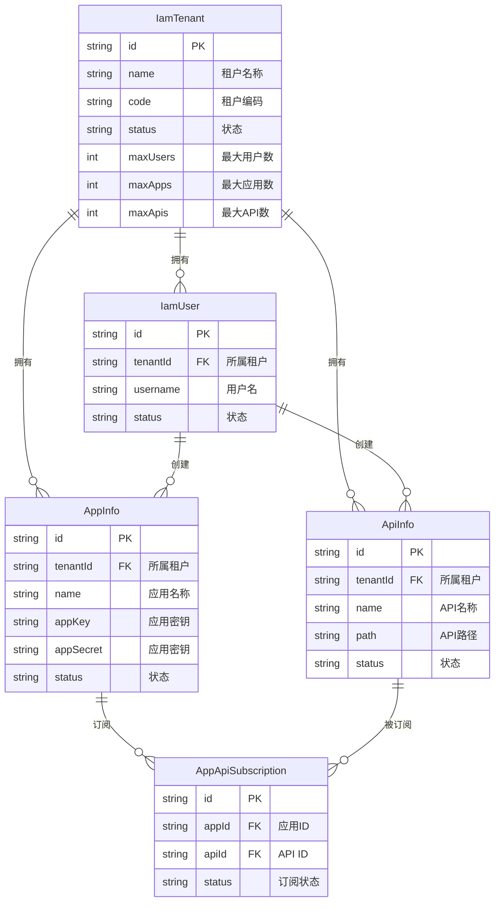
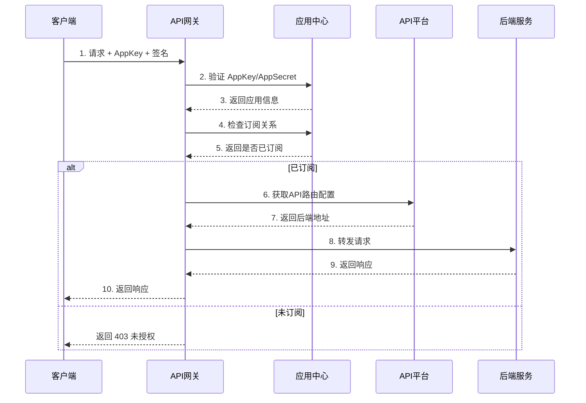

# IntelliHub 实体关系设计文档

## 一、核心实体关系图



## 二、实体说明

### 1. 租户 (IamTenant)

**定义**：系统的顶层隔离单元，代表一个组织/公司/团队。

| 字段 | 说明 |
|------|------|
| id | 租户唯一标识 |
| name | 租户名称 |
| code | 租户编码（唯一） |
| maxUsers | 最大用户数限制 |
| maxApps | 最大应用数限制 |
| maxApis | 最大API数限制 |
| maxCallsPerDay | 每日最大调用次数 |

**作用**：
- 数据隔离：所有业务数据按租户隔离
- 资源限制：控制租户的资源使用上限
- 计费单元：按租户进行计费

---

### 2. 用户 (IamUser)

**定义**：系统的操作者，属于某个租户。

| 字段 | 说明 |
|------|------|
| id | 用户唯一标识 |
| tenantId | 所属租户ID |
| username | 用户名（租户内唯一） |
| password | 密码（加密存储） |
| status | 状态：active/inactive/locked |

**作用**：
- 登录系统，进行管理操作
- 创建和管理 App、API
- 拥有角色和权限

---

### 3. 应用 (AppInfo)

**定义**：API的调用方，代表一个接入系统。

| 字段 | 说明 |
|------|------|
| id | 应用唯一标识 |
| tenantId | 所属租户ID |
| name | 应用名称 |
| code | 应用编码（租户内唯一） |
| appKey | 应用密钥（全局唯一，用于鉴权） |
| appSecret | 应用密钥（用于签名验证） |
| appType | 类型：internal-内部应用, external-外部应用 |
| status | 状态：active/disabled |
| quotaLimit | 调用配额限制 |
| quotaUsed | 已使用配额 |

**作用**：
- 作为 API 调用方的身份标识
- 通过 AppKey/AppSecret 进行认证
- 管理调用配额和限制

---

### 4. API (ApiInfo)

**定义**：服务提供方暴露的接口。

| 字段 | 说明 |
|------|------|
| id | API唯一标识 |
| tenantId | 所属租户ID |
| name | API名称 |
| path | API路径（如 /api/users） |
| method | 请求方法（GET/POST/PUT/DELETE） |
| status | 状态：draft/published/offline |
| authType | 认证类型：none/appkey/signature |

**作用**：
- 定义接口的元信息
- 控制接口的访问权限
- 配置后端转发规则

---

### 5. 订阅关系 (AppApiSubscription)

**定义**：App 与 API 之间的绑定关系。

| 字段 | 说明 |
|------|------|
| id | 订阅唯一标识 |
| appId | 应用ID |
| apiId | API ID |
| apiPath | API路径（冗余字段） |
| status | 状态：active/disabled/expired |
| quotaLimit | 单独配额限制（可覆盖应用配额） |
| expireTime | 过期时间 |

**作用**：
- 控制 App 能访问哪些 API
- 实现细粒度的权限控制
- 支持按 API 设置独立配额

---

## 三、关系说明

### 3.1 租户与其他实体的关系

```
租户 (1) ──────> (N) 用户
租户 (1) ──────> (N) 应用
租户 (1) ──────> (N) API
```

- 一个租户可以有多个用户、应用、API
- 用户、应用、API 都有 `tenantId` 字段，实现数据隔离
- 跨租户数据不可见（除非特殊配置，如 API 市场）

### 3.2 用户与应用/API的关系

```
用户 ──创建──> 应用
用户 ──创建──> API
```

- 用户可以创建和管理应用、API
- 通过 `createdBy` 字段记录创建者

### 3.3 应用与API的订阅关系

```
应用 (N) <──订阅──> (M) API
```

- 多对多关系，通过 `AppApiSubscription` 表实现
- 只有订阅了 API 的应用才能调用该 API
- 订阅可以设置独立的配额和过期时间

---

## 四、API 调用流程



---

## 五、使用场景

### 场景1：内部系统接入

1. **管理员**登录控制台
2. 创建**应用**，获取 AppKey/AppSecret
3. 在 API 市场浏览可用的**API**
4. 为应用**订阅**所需的 API
5. 客户端使用 AppKey 调用 API

### 场景2：开放平台模式

1. **租户A**发布 API 到 API 市场
2. **租户B**在 API 市场发现该 API
3. **租户B**创建应用，订阅**租户A**的 API
4. **租户B**的客户端调用 API

### 场景3：多应用隔离

1. 一个租户创建**多个应用**（开发、测试、生产）
2. 每个应用有独立的 AppKey/AppSecret
3. 为每个应用分配不同的 API 访问权限
4. 通过配额限制控制各应用的调用量

---

## 六、设计要点

### 6.1 数据隔离

| 层级 | 隔离方式 |
|------|---------|
| 租户级 | 所有表都有 `tenantId` 字段 |
| 应用级 | 通过订阅关系控制 API 访问 |
| 用户级 | 通过 RBAC 权限控制操作权限 |

### 6.2 认证鉴权

| 场景 | 方式 |
|------|------|
| 用户登录 | 用户名 + 密码 → JWT Token |
| API 调用 | AppKey + 签名 → 验证 AppSecret |
| 订阅检查 | AppKey → 查找 App → 检查订阅关系 |

### 6.3 配额控制

```
请求 → 检查应用配额 → 检查订阅配额 → 检查租户配额 → 放行/拒绝
```

---

## 七、表结构概览

| 表名 | 所属服务 | 说明 |
|------|---------|------|
| iam_tenant | auth-iam-service | 租户信息 |
| iam_user | auth-iam-service | 用户信息 |
| iam_role | auth-iam-service | 角色信息 |
| iam_permission | auth-iam-service | 权限信息 |
| app_info | app-center-service | 应用信息 |
| app_api_subscription | app-center-service | 订阅关系 |
| api_info | api-platform-service | API信息 |
| api_group | api-platform-service | API分组 |
| api_backend | api-platform-service | API后端配置 |
