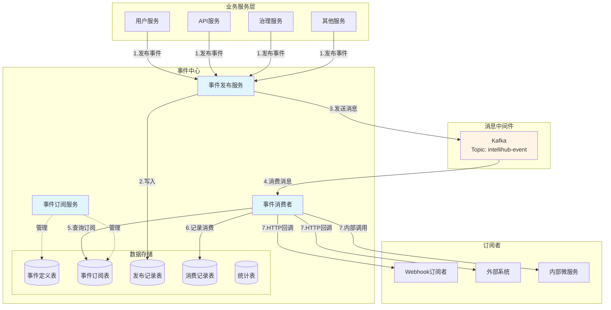
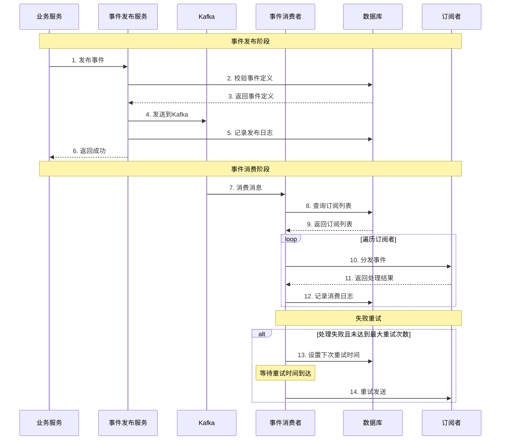
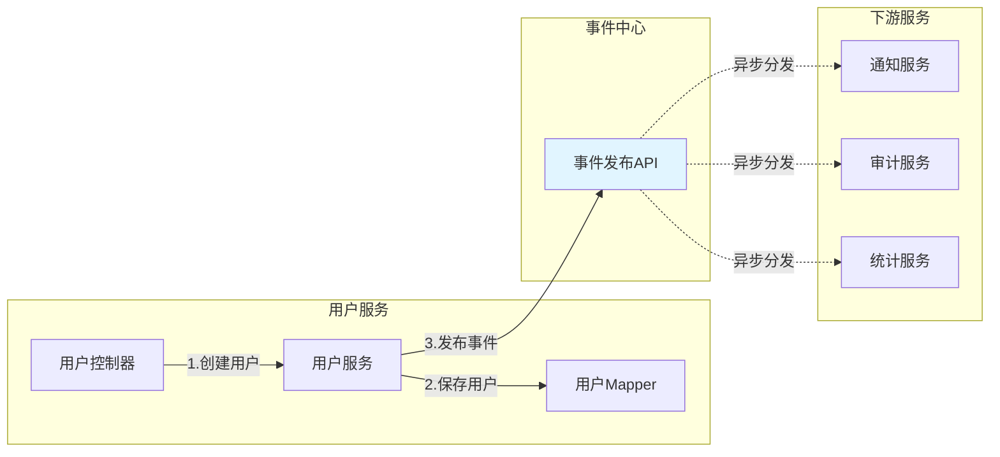
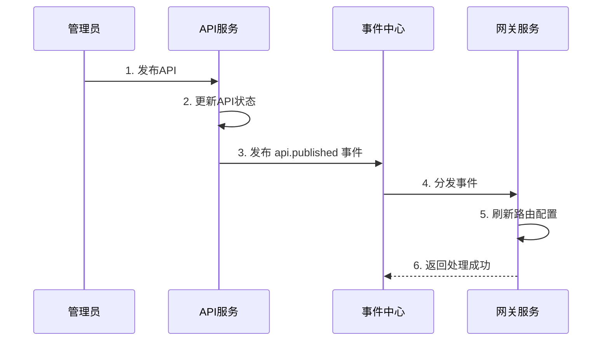

# IntelliHub 事件中心设计文档

## 1. 概述

### 1.1 什么是事件中心

事件中心（Event Center）是 IntelliHub 平台的核心基础设施服务，提供统一的事件发布、订阅和分发能力。它作为微服务架构中的事件总线，负责解耦各个微服务之间的直接依赖，通过事件驱动的方式实现服务间的异步通信。

### 1.2 为什么需要事件中心

在微服务架构中，服务间的通信和协作是一个关键挑战。传统的同步调用方式存在以下问题：

#### 问题 1：服务强耦合
```
用户服务 ──直接调用──> 通知服务
         └──直接调用──> 审计服务
         └──直接调用──> 统计服务
```
- 用户服务需要知道所有下游服务的接口
- 任何一个下游服务故障都会影响用户服务
- 添加新的下游服务需要修改用户服务代码

#### 问题 2：性能瓶颈
- 同步调用会阻塞主流程
- 多个下游服务调用串行执行，响应时间累加
- 下游服务慢会拖累整个系统

#### 问题 3：扩展困难
- 新增业务场景需要修改多处代码
- 难以支持动态订阅和取消订阅
- 无法灵活配置事件处理策略

#### 事件中心的解决方案

```
用户服务 ──发布事件──> 事件中心 ──分发──> 通知服务
                              ├──分发──> 审计服务
                              └──分发──> 统计服务
```

**优势：**
- ✅ **解耦**：发布者和订阅者互不感知，降低服务间耦合
- ✅ **异步**：事件发布立即返回，不阻塞主流程
- ✅ **可靠**：基于 Kafka 的消息队列，保证消息不丢失
- ✅ **灵活**：支持动态订阅，无需修改发布者代码
- ✅ **可追溯**：完整记录事件发布和消费日志

## 2. 核心概念

### 2.1 事件定义（Event Definition）

事件定义描述了系统中可以发布的事件类型，包括：
- **事件编码**：唯一标识事件类型，如 `user.created`、`api.published`
- **事件类型**：业务分类，如用户事件、API事件、订单事件
- **事件描述**：事件的业务含义和触发场景
- **数据模板**：事件携带的数据结构示例

### 2.2 事件订阅（Event Subscription）

事件订阅定义了谁（订阅者）对什么事件（事件编码）感兴趣，以及如何处理：
- **订阅者类型**：
  - `WEBHOOK`：HTTP 回调，适用于外部系统集成
  - `MQ`：消息队列转发，适用于内部服务间通信
  - `SERVICE`：内部服务调用（预留）
- **回调配置**：回调地址、请求方法、请求头等
- **重试策略**：
  - `FIXED`：固定间隔重试（60秒）
  - `EXPONENTIAL`：指数退避重试（60秒、120秒、240秒...）
- **优先级**：订阅者的处理优先级（1-10，数字越大优先级越高）

### 2.3 事件消息（Event Message）

事件消息是事件在系统中流转的标准格式：
```json
{
  "eventId": "abc123def456",           // 事件唯一ID
  "tenantId": "tenant001",             // 租户ID
  "eventCode": "user.created",         // 事件编码
  "source": "user-service",            // 事件源
  "timestamp": "2024-01-15T10:30:00",  // 事件时间
  "data": {                            // 事件数据
    "userId": "12345",
    "username": "zhangsan",
    "email": "zhangsan@example.com"
  }
}
```

## 3. 系统架构

### 3.1 整体架构图



### 3.2 事件流转流程



### 3.3 核心组件说明

#### 3.3.1 事件发布服务（EventPublishService）

**职责：**
- 接收业务服务的事件发布请求
- 校验事件定义是否存在且已激活
- 将事件发送到 Kafka 消息队列
- 记录事件发布日志

**接口：**
```java
// 同步发布
boolean publish(EventMessage eventMessage);

// 异步发布
void publishAsync(EventMessage eventMessage);
```

#### 3.3.2 事件订阅服务（EventSubscriptionService）

**职责：**
- 管理事件订阅的生命周期（创建、更新、删除）
- 支持订阅的暂停和恢复
- 查询事件的订阅列表

**接口：**
```java
// 创建订阅
String createSubscription(EventSubscription subscription);

// 更新订阅
boolean updateSubscription(EventSubscription subscription);

// 删除订阅
boolean deleteSubscription(String subscriptionId);

// 暂停/恢复订阅
boolean pauseSubscription(String subscriptionId);
boolean resumeSubscription(String subscriptionId);
```

#### 3.3.3 事件消费者（EventConsumer）

**职责：**
- 监听 Kafka 消息队列
- 查询事件的所有激活订阅
- 按优先级顺序分发事件给订阅者
- 记录消费日志和处理结果
- 处理失败重试

**支持的订阅类型：**
- **Webhook**：发送 HTTP POST/PUT 请求到订阅者的回调地址
- **MQ**：转发到其他消息队列（如订阅者自己的 Kafka Topic）
- **Service**：内部服务调用（预留扩展）

## 4. 与其他微服务的联动

### 4.1 用户服务集成示例



**代码示例：**

```java
@Service
@RequiredArgsConstructor
public class UserServiceImpl implements UserService {
    
    private final UserMapper userMapper;
    private final EventPublishService eventPublishService;
    
    @Transactional
    public User createUser(UserDTO userDTO) {
        // 1. 保存用户
        User user = new User();
        BeanUtils.copyProperties(userDTO, user);
        userMapper.insert(user);
        
        // 2. 发布用户创建事件
        Map<String, Object> eventData = new HashMap<>();
        eventData.put("userId", user.getId());
        eventData.put("username", user.getUsername());
        eventData.put("email", user.getEmail());
        
        EventMessage eventMessage = new EventMessage(
            user.getTenantId(),
            "user.created",
            "user-service",
            eventData
        );
        
        // 异步发布，不阻塞主流程
        eventPublishService.publishAsync(eventMessage);
        
        return user;
    }
}
```

### 4.2 API 服务集成示例

API 服务在 API 状态变更时发布事件，网关服务订阅这些事件来更新路由配置。



### 4.3 治理服务集成示例

治理服务在检测到告警时发布事件，通知服务订阅告警事件来发送通知。

```mermaid
graph TB
    subgraph "治理服务"
        AR[告警规则引擎]
        AE[告警评估器]
    end
    
    subgraph "事件中心"
        EC[事件中心]
    end
    
    subgraph "通知渠道"
        EM[邮件]
        WH[Webhook]
        DD[钉钉]
    end
    
    AR -->|1.触发告警| AE
    AE -->|2.发布告警事件| EC
    EC -.3.分发.-> EM
    EC -.3.分发.-> WH
    EC -.3.分发.-> DD
    
    style EC fill:#e1f5ff
```

## 5. 典型应用场景

### 5.1 场景一：用户生命周期事件

**事件列表：**
- `user.created` - 用户创建
- `user.updated` - 用户信息更新
- `user.deleted` - 用户删除
- `user.login` - 用户登录
- `user.logout` - 用户登出

**订阅者：**
- **通知服务**：发送欢迎邮件、账号变更通知
- **审计服务**：记录用户操作日志
- **统计服务**：更新用户统计数据
- **推荐服务**：初始化用户画像

### 5.2 场景二：API 生命周期事件

**事件列表：**
- `api.created` - API 创建
- `api.published` - API 发布
- `api.updated` - API 更新
- `api.offline` - API 下线
- `api.deleted` - API 删除

**订阅者：**
- **网关服务**：刷新路由配置
- **文档服务**：更新 API 文档
- **监控服务**：配置监控指标
- **审计服务**：记录 API 变更历史

### 5.3 场景三：告警事件

**事件列表：**
- `alert.triggered` - 告警触发
- `alert.resolved` - 告警恢复
- `alert.acknowledged` - 告警确认

**订阅者：**
- **邮件通知**：发送告警邮件
- **短信通知**：发送告警短信
- **钉钉通知**：发送钉钉群消息
- **Webhook**：调用外部系统接口
- **工单系统**：自动创建工单

## 6. 数据模型

### 6.1 事件定义表（event_definition）

```sql
CREATE TABLE event_definition (
    id VARCHAR(32) PRIMARY KEY,
    tenant_id VARCHAR(32) NOT NULL,
    event_code VARCHAR(100) NOT NULL,
    event_name VARCHAR(200) NOT NULL,
    event_type VARCHAR(50),
    description TEXT,
    data_template TEXT,
    status VARCHAR(20) DEFAULT 'ACTIVE',
    created_at DATETIME,
    updated_at DATETIME,
    UNIQUE KEY uk_tenant_code (tenant_id, event_code)
);
```

### 6.2 事件订阅表（event_subscription）

```sql
CREATE TABLE event_subscription (
    id VARCHAR(32) PRIMARY KEY,
    tenant_id VARCHAR(32) NOT NULL,
    event_code VARCHAR(100) NOT NULL,
    subscriber_name VARCHAR(200) NOT NULL,
    subscriber_type VARCHAR(50) NOT NULL,
    callback_url VARCHAR(500),
    callback_method VARCHAR(10),
    callback_headers TEXT,
    mq_topic VARCHAR(200),
    mq_tag VARCHAR(100),
    retry_strategy VARCHAR(50) DEFAULT 'FIXED',
    max_retry_times INT DEFAULT 3,
    priority INT DEFAULT 5,
    status VARCHAR(20) DEFAULT 'ACTIVE',
    created_at DATETIME,
    updated_at DATETIME,
    INDEX idx_tenant_event (tenant_id, event_code, status)
);
```

### 6.3 事件发布记录表（event_publish_record）

```sql
CREATE TABLE event_publish_record (
    id VARCHAR(32) PRIMARY KEY,
    tenant_id VARCHAR(32) NOT NULL,
    event_code VARCHAR(100) NOT NULL,
    event_id VARCHAR(32) NOT NULL,
    event_data TEXT,
    source VARCHAR(200),
    publish_time DATETIME,
    status VARCHAR(20),
    error_message TEXT,
    created_at DATETIME,
    INDEX idx_tenant_event (tenant_id, event_code),
    INDEX idx_event_id (event_id)
);
```

### 6.4 事件消费记录表（event_consume_record）

```sql
CREATE TABLE event_consume_record (
    id VARCHAR(32) PRIMARY KEY,
    tenant_id VARCHAR(32) NOT NULL,
    subscription_id VARCHAR(32) NOT NULL,
    event_id VARCHAR(32) NOT NULL,
    event_code VARCHAR(100) NOT NULL,
    consume_time DATETIME,
    status VARCHAR(20),
    retry_times INT DEFAULT 0,
    next_retry_time DATETIME,
    response_code INT,
    response_body TEXT,
    error_message TEXT,
    duration_ms BIGINT,
    created_at DATETIME,
    updated_at DATETIME,
    INDEX idx_subscription (subscription_id),
    INDEX idx_event (event_id),
    INDEX idx_retry (status, next_retry_time)
);
```

## 7. API 接口

### 7.1 事件发布 API

#### 同步发布事件
```http
POST /v1/events/publish
Content-Type: application/json

{
  "tenantId": "tenant001",
  "eventCode": "user.created",
  "source": "user-service",
  "data": {
    "userId": "12345",
    "username": "zhangsan"
  }
}
```

#### 异步发布事件
```http
POST /v1/events/publish-async
Content-Type: application/json

{
  "tenantId": "tenant001",
  "eventCode": "api.published",
  "source": "api-service",
  "data": {
    "apiId": "api123",
    "apiPath": "/v1/users"
  }
}
```

### 7.2 事件定义管理 API

#### 创建事件定义
```http
POST /v1/event-definitions/create
Content-Type: application/json

{
  "tenantId": "tenant001",
  "eventCode": "order.created",
  "eventName": "订单创建事件",
  "eventType": "ORDER",
  "description": "用户创建订单时触发",
  "dataTemplate": "{\"orderId\": \"string\", \"amount\": \"number\"}"
}
```

#### 查询事件定义列表
```http
GET /v1/event-definitions/list?tenantId=tenant001&page=1&size=20
```

### 7.3 事件订阅管理 API

#### 创建订阅
```http
POST /v1/event-subscriptions/create
Content-Type: application/json

{
  "tenantId": "tenant001",
  "eventCode": "user.created",
  "subscriberName": "通知服务",
  "subscriberType": "WEBHOOK",
  "callbackUrl": "http://notification-service/webhook/user-created",
  "callbackMethod": "POST",
  "retryStrategy": "EXPONENTIAL",
  "maxRetryTimes": 3,
  "priority": 8
}
```

#### 暂停订阅
```http
POST /v1/event-subscriptions/{id}/pause
```

#### 恢复订阅
```http
POST /v1/event-subscriptions/{id}/resume
```

## 8. 最佳实践

### 8.1 事件命名规范

采用 `资源.动作` 的命名方式：
- ✅ `user.created` - 用户创建
- ✅ `api.published` - API 发布
- ✅ `order.paid` - 订单支付
- ❌ `createUser` - 不推荐使用动词开头
- ❌ `user_created` - 不推荐使用下划线

### 8.2 事件数据设计

**原则：**
- 包含必要的业务标识（如 userId、apiId）
- 避免包含敏感信息（如密码、密钥）
- 保持数据结构稳定，避免频繁变更
- 使用 JSON 格式，便于扩展

**示例：**
```json
{
  "userId": "12345",
  "username": "zhangsan",
  "email": "zhangsan@example.com",
  "createdAt": "2024-01-15T10:30:00"
}
```

### 8.3 订阅者设计

**原则：**
- 订阅者应该是幂等的（多次处理同一事件结果一致）
- 订阅者应该快速返回，避免长时间阻塞
- 订阅者应该有完善的错误处理和日志记录
- 订阅者应该支持重试机制

### 8.4 性能优化

**发布端优化：**
- 使用异步发布，避免阻塞主流程
- 批量发布多个事件时使用批量接口
- 合理设置 Kafka 的 acks 参数（默认为 1）

**消费端优化：**
- 设置合理的消费者并发数
- 使用连接池复用 HTTP 连接
- 对慢订阅者设置超时时间
- 定期清理历史消费记录

## 9. 监控与运维

### 9.1 关键指标

**发布指标：**
- 事件发布成功率
- 事件发布延迟（P50、P95、P99）
- 事件发布失败数

**消费指标：**
- 事件消费成功率
- 事件消费延迟
- 订阅者处理耗时
- 重试次数统计

**系统指标：**
- Kafka 消息堆积量
- 数据库连接池使用率
- 服务 CPU 和内存使用率

### 9.2 告警规则

建议配置以下告警：
- 事件发布失败率 > 5%
- 事件消费延迟 > 5 分钟
- Kafka 消息堆积 > 10000
- 订阅者处理失败率 > 10%

## 10. 未来规划

### 10.1 功能增强

- [ ] 支持事件过滤（订阅者可以配置过滤条件）
- [ ] 支持事件转换（订阅者可以配置数据转换规则）
- [ ] 支持事件编排（多个事件组合成工作流）
- [ ] 支持事件回放（重新处理历史事件）

### 10.2 性能优化

- [ ] 支持事件批量发布
- [ ] 支持订阅者批量消费
- [ ] 引入缓存减少数据库查询
- [ ] 优化消费记录存储策略

### 10.3 可观测性

- [ ] 集成链路追踪（Trace ID 传递）
- [ ] 提供事件流转可视化界面
- [ ] 提供订阅者性能分析报告
- [ ] 提供事件统计大屏

---

## 附录

### A. 常见问题

**Q1: 事件发布失败怎么办？**
A: 事件发布失败会记录到发布记录表，可以通过管理界面查看失败原因，并支持手动重新发布。

**Q2: 订阅者处理失败会重试吗？**
A: 会的。根据订阅配置的重试策略和最大重试次数进行重试，超过最大次数后标记为最终失败。

**Q3: 如何保证事件不丢失？**
A: 通过以下机制保证：
- Kafka 消息持久化
- 发布记录表记录所有事件
- 消费记录表记录处理状态
- 支持失败重试和手动重新处理

**Q4: 如何保证事件顺序？**
A: 使用 tenantId 作为 Kafka 的 partition key，保证同一租户的事件有序。

**Q5: 事件中心的性能如何？**
A: 基于 Kafka 的高性能消息队列，单实例可支持每秒数万次事件发布，水平扩展可支持更高吞吐量。

### B. 参考资料

- [Apache Kafka 官方文档](https://kafka.apache.org/documentation/)
- [事件驱动架构模式](https://martinfowler.com/articles/201701-event-driven.html)
- [微服务架构设计模式](https://microservices.io/patterns/index.html)
