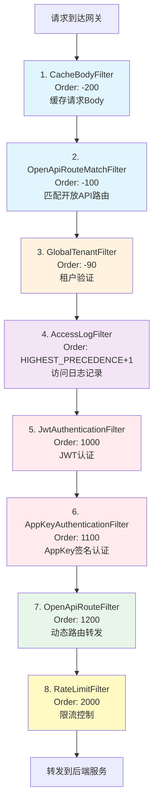
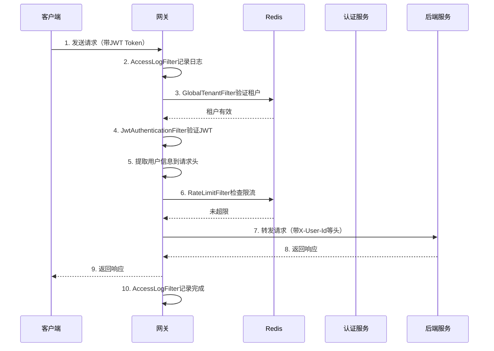
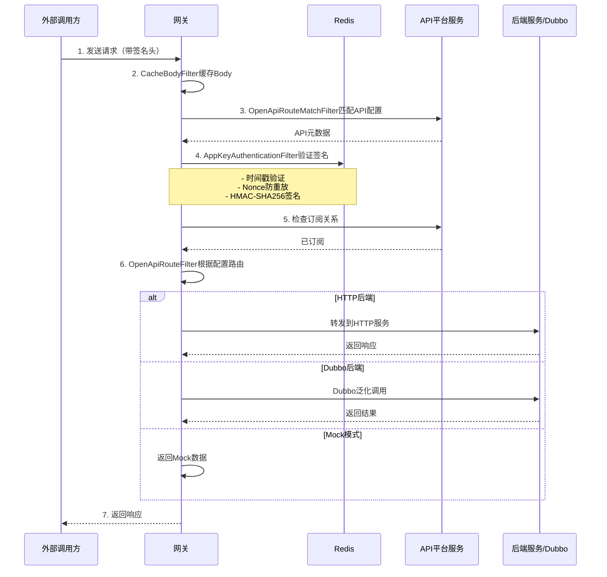

# IntelliHub 网关模块分析报告

## 📋 目录
- [1. 概述](#1-概述)
- [2. 过滤器执行顺序](#2-过滤器执行顺序)
- [3. 核心流程逻辑](#3-核心流程逻辑)
- [4. 问题分析](#4-问题分析)
- [5. 改进建议](#5-改进建议)

---

## 1. 概述

IntelliHub网关服务基于Spring Cloud Gateway构建，作为系统的统一入口，负责请求路由、认证授权、限流、日志记录等核心功能。

### 1.1 技术栈
- **Spring Cloud Gateway**: 基于WebFlux的响应式网关
- **Nacos**: 服务发现与配置中心
- **Redis**: 缓存、限流、Nonce防重放
- **Dubbo**: RPC调用（租户验证、AppKey服务）

### 1.2 主要功能模块
- JWT认证（内部用户）
- AppKey签名认证（开放API）
- 多租户支持
- 限流保护
- 动态路由（开放API）
- 访问日志
- 请求Body缓存

---

## 2. 过滤器执行顺序

网关共有**8个全局过滤器**，按照Order值从小到大执行：



### 2.1 过滤器详细说明

| 顺序 | 过滤器名称 | Order值 | 主要功能 | 备注 |
|------|-----------|---------|----------|------|
| 1 | CacheBodyFilter | -200 | 缓存POST/PUT/PATCH请求Body | 解决Body只能读取一次的问题 |
| 2 | OpenApiRouteMatchFilter | -100 | 匹配开放API路由配置 | 为后续过滤器提供API元数据 |
| 3 | GlobalTenantFilter | -90 | 验证租户有效性（Dubbo调用+Redis缓存） | 白名单路径跳过 |
| 4 | AccessLogFilter | HIGHEST_PRECEDENCE+1 | 记录请求开始和结束日志 | 记录耗时、状态码 |
| 5 | JwtAuthenticationFilter | 1000 | JWT Token验证（内部用户） | 白名单路径跳过 |
| 6 | AppKeyAuthenticationFilter | 1100 | AppKey签名认证（开放API） | 防重放、防篡改、订阅验证 |
| 7 | OpenApiRouteFilter | 1200 | 动态路由转发（HTTP/Dubbo/Mock） | 仅处理开放API |
| 8 | RateLimitFilter | 2000 | 多维度限流（IP、Path、组合） | 滑动窗口算法 |

---

## 3. 核心流程逻辑

### 3.1 内部API请求流程



### 3.2 开放API请求流程



### 3.3 认证流程对比

| 特性 | JWT认证（内部API） | AppKey认证（开放API） |
|------|-------------------|---------------------|
| **适用场景** | Web/移动端用户登录 | 第三方应用调用 |
| **认证方式** | Bearer Token | 签名（AppKey + AppSecret） |
| **请求头** | `Authorization: Bearer {token}` | `X-App-Key`, `X-Timestamp`, `X-Nonce`, `X-Signature` |
| **安全措施** | Token过期、刷新 | 防重放、防篡改、订阅验证 |
| **用户信息传递** | `X-User-Id`, `X-Username`, `X-User-Roles` | `X-App-Id`, `X-Tenant-Id` |
| **白名单** | 登录、注册等公开接口 | 健康检查、文档 |

---

## 4. 问题分析

### 🔴 严重问题

#### 4.1 过滤器执行顺序混乱

**问题描述**：
- `AccessLogFilter`的Order值为`HIGHEST_PRECEDENCE + 1`（约-2147483646），但实际应该在最早执行
- `GlobalTenantFilter`（-90）在`AccessLogFilter`之前执行，不符合设计意图
- 日志显示"Order: HIGHEST_PRECEDENCE+1"，但实际值未明确

**影响**：
- 访问日志可能无法记录所有请求（被前置过滤器拦截）
- 调试困难，执行顺序不直观

**建议**：
```java
// AccessLogFilter应该使用明确的负数
@Override
public int getOrder() {
    return -300;  // 确保在所有业务过滤器之前
}
```

#### 4.2 租户验证逻辑存在降级风险

**问题代码**（GlobalTenantFilter.java:109-111）：
```java
} catch (Exception e) {
    log.error("Dubbo验证租户失败 - tenantId: {}", tenantId, e);
    // 出错时默认允许（降级策略）
    return true;
}
```

**风险**：
- Dubbo服务不可用时，所有租户验证都会通过
- 可能导致未授权的租户访问系统

**建议**：
- 改为失败拒绝策略，或者提供可配置的降级开关
- 增加熔断机制，避免大量Dubbo调用失败

#### 4.3 AppKey认证与JWT认证重复执行

**问题描述**：
- JWT认证（Order: 1000）和AppKey认证（Order: 1100）都是全局过滤器
- 对于开放API请求，JWT认证会先执行（检查白名单才跳过）
- 存在不必要的性能开销

**当前流程**：
```
开放API请求 (/open/xxx)
  -> JwtAuthenticationFilter检查白名单 ✅跳过
  -> AppKeyAuthenticationFilter执行认证 ✅通过
```

**建议**：
- 将AppKey认证改为路由级别过滤器，只在开放API路由上生效
- 或者优化Order顺序，让AppKey认证先执行

#### 4.4 限流过滤器过度复杂

**问题代码**（RateLimitFilter.java:66-87）：
```java
// 并行检查不同维度的限流（嵌套3层）
return rateLimitService.isAllowed(ipKey, limit.getRequests() * 2, limit.getWindow())
    .flatMap(ipAllowed -> {
        if (Boolean.FALSE.equals(ipAllowed)) {
            return handleRateLimit(exchange.getResponse(), "IP级别限流触发");
        }
        return rateLimitService.isAllowed(pathKey, limit.getRequests() * 10, limit.getWindow());
    })
    .flatMap(pathAllowed -> {
        // 再检查组合限流...
    })
```

**问题**：
1. **串行执行**：虽然注释说"并行检查"，但实际是串行的flatMap
2. **硬编码倍数**：`* 2`、`* 10`等倍数关系不可配置
3. **性能问题**：每个请求需要3次Redis调用
4. **逻辑复杂**：IP限流100*2=200次，Path限流100*10=1000次，实际组合限流100次，容易混淆

**建议**：
- 使用`Mono.zip()`实现真正的并行检查
- 将倍数关系配置化
- 简化限流维度，或者改为可选

### 🟡 中等问题

#### 4.5 OpenApiRouteFilter与Spring Cloud Gateway路由机制冲突

**问题描述**：
- `OpenApiRouteFilter`尝试修改`GATEWAY_REQUEST_URL_ATTR`来实现动态路由
- 但请求已经被Spring Cloud Gateway的路由规则匹配（application.yml中的routes配置）
- 可能导致路由不生效或冲突

**当前配置**（application.yml:50-55）：
```yaml
- id: open-api-service
  uri: lb://intelli-api-platform-service
  predicates:
    - Path=/api/open/**,/api/external/**
  filters:
    - StripPrefix=1
```

**冲突点**：
- Gateway已经将`/api/open/**`路由到`intelli-api-platform-service`
- `OpenApiRouteFilter`又想动态修改URI到其他服务
- 两者可能冲突

**建议**：
- 方案1：移除application.yml中的open-api路由配置，完全由OpenApiRouteFilter处理
- 方案2：使用RouteLocator编程式动态路由，而不是过滤器修改URI

#### 4.6 Body缓存可能导致内存问题

**问题代码**（CacheBodyFilter.java:45-56）：
```java
return DataBufferUtils.join(request.getBody())
    .flatMap(dataBuffer -> {
        byte[] bytes = new byte[dataBuffer.readableByteCount()];
        dataBuffer.read(bytes);
        String bodyString = new String(bytes, StandardCharsets.UTF_8);
        exchange.getAttributes().put(ATTR_CACHED_BODY, bodyString);
        // ...
    });
```

**问题**：
- 大文件上传会将整个Body加载到内存
- 没有大小限制检查
- 可能导致OOM

**建议**：
- 添加Body大小限制（如10MB）
- 对于超大请求，跳过缓存或使用磁盘缓存
- 添加监控告警

#### 4.7 Dubbo泛化调用缺少超时和重试配置

**问题位置**：`OpenApiRouteFilter.forwardToDubboBackend()`

**问题**：
- Dubbo泛化调用只在全局配置了5秒超时
- 没有针对不同API的差异化超时配置
- 没有重试策略

**建议**：
- 在API配置中增加`dubboTimeout`字段
- 支持配置重试次数和策略

### 🟢 轻微问题

#### 4.8 日志级别使用不当

**问题**：
- 生产环境可能产生大量DEBUG日志
- 某些INFO日志应该降级为DEBUG

**示例**：
```java
log.info("用户认证成功 - UserId: {}, Username: {}, Path: {}", ...);  // 每个请求都打印
log.info("AppKey认证成功 - AppKey: {}, AppId: {}, ApiId: {}, Path: {}", ...);
```

**建议**：
- 认证成功改为DEBUG级别
- 只在认证失败时使用WARN/ERROR

#### 4.9 硬编码的配置值

**示例**：
- `DEFAULT_TENANT_ID = "default"`（GlobalTenantFilter）
- `NONCE_KEY_PREFIX = "appkey:nonce:"`（AppKeyAuthenticationFilter）
- `TENANT_CACHE_PREFIX = "gateway:tenant:valid:"`（GlobalTenantFilter）

**建议**：
- 移到配置文件或配置类中

#### 4.10 缺少监控指标

**问题**：
- 没有暴露Prometheus指标
- 无法监控限流触发次数、认证失败率等关键指标

**建议**：
- 集成Micrometer
- 添加自定义指标（限流、认证、路由转发等）

---

## 5. 改进建议

### 5.1 短期改进（1-2周）

1. **修复过滤器执行顺序**
   - 统一使用明确的负数Order值
   - 确保执行顺序符合逻辑

2. **修复租户验证降级策略**
   - 改为失败拒绝或可配置降级

3. **简化限流逻辑**
   - 改为真正的并行检查
   - 配置化倍数关系

4. **添加Body大小限制**
   - 防止OOM风险

### 5.2 中期改进（1个月）

1. **优化认证过滤器**
   - 将AppKey认证改为路由级别
   - 减少不必要的执行

2. **重构动态路由机制**
   - 使用RouteLocator替代过滤器修改URI
   - 解决路由冲突问题

3. **增加监控指标**
   - 集成Prometheus
   - 添加Grafana仪表板

### 5.3 长期改进（2-3个月）

1. **引入熔断降级**
   - 集成Sentinel或Resilience4j
   - 保护后端服务

2. **API网关治理平台**
   - 可视化配置限流规则
   - 实时查看路由状态
   - 动态更新配置（无需重启）

3. **分布式追踪**
   - 集成SkyWalking或Zipkin
   - 完整的请求链路追踪

---

## 6. 总结

### 6.1 优点
✅ 功能完善，支持双认证体系  
✅ 使用响应式编程，性能较好  
✅ 支持动态路由和Dubbo泛化调用  
✅ 有基础的防护措施（限流、防重放）

### 6.2 不足
❌ 过滤器执行顺序混乱  
❌ 租户验证降级策略存在安全隐患  
❌ 限流逻辑过度复杂且非并行  
❌ 动态路由与Gateway路由机制冲突  
❌ 缺少监控和链路追踪  
❌ 内存安全问题（Body缓存无限制）

### 6.3 核心建议
1. **立即修复**：过滤器Order、租户验证降级、Body大小限制
2. **重点优化**：限流逻辑、动态路由机制、认证过滤器职责
3. **长期规划**：监控体系、熔断降级、治理平台

---

## 附录

### A. 过滤器Order值参考表

| 组件 | 建议Order值 | 说明 |
|------|------------|------|
| CacheBodyFilter | -300 | 最早执行，缓存Body |
| OpenApiRouteMatchFilter | -200 | 路由匹配 |
| AccessLogFilter | -100 | 日志记录开始 |
| GlobalTenantFilter | 100 | 租户验证 |
| JwtAuthenticationFilter | 200 | JWT认证 |
| AppKeyAuthenticationFilter | 300 | AppKey认证 |
| OpenApiRouteFilter | 400 | 动态路由 |
| RateLimitFilter | 500 | 限流 |

### B. 关键配置项

```yaml
# 建议的配置结构
intellihub:
  gateway:
    # 通用配置
    default-tenant-id: default
    body-size-limit: 10485760  # 10MB
    
    # 认证配置
    auth:
      enabled: true
      secret: ${JWT_SECRET}
      token-expiration: 24
      
    # 租户配置
    tenant:
      cache-ttl: 300  # 5分钟
      fallback-allow: false  # Dubbo失败时拒绝请求
      
    # 限流配置
    rate-limit:
      enabled: true
      parallel-check: true  # 并行检查多个维度
      dimensions:
        - name: ip
          multiplier: 2
        - name: path
          multiplier: 10
        - name: combined
          multiplier: 1
```

---

**文档生成时间**: 2024-12-23  
**分析人员**: AI Assistant  
**版本**: v1.0
