# IntelliHub 项目技术分析报告

> 本文档详细分析IntelliHub项目的技术选型、核心业务流程、架构设计及存在的问题

---

## 📋 目录

1. [项目概述](#1-项目概述)
2. [技术选型分析](#2-技术选型分析)
3. [系统架构设计](#3-系统架构设计)
4. [核心业务流程](#4-核心业务流程)
5. [存在的问题与风险](#5-存在的问题与风险)
6. [优化建议](#6-优化建议)

---

## 1. 项目概述

### 1.1 项目定位

IntelliHub 是一个基于微服务架构的 **API开放平台**，核心功能包括：

- **API管理平台**：允许内部开发者注册、发布、管理API接口
- **统一认证中心**：提供JWT认证、多租户、角色权限管理（RBAC）
- **API网关**：统一流量入口，提供认证、限流、路由转发等能力
- **AIGC服务**：集成AI能力的服务模块
- **应用中心**：应用管理服务

### 1.2 核心业务场景

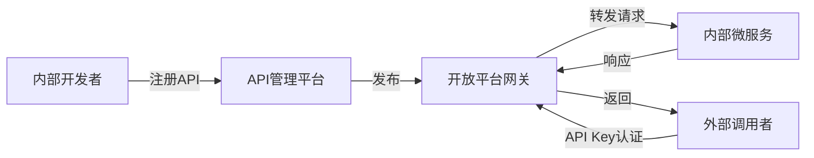

### 1.3 项目模块结构

```
intellihub-parent/
├── intelli-common/                  # 公共组件模块
├── intelli-gateway-service/         # API网关服务（端口：8080）
├── intelli-auth-iam-service/        # 认证授权服务（端口：8081）
├── intelli-api-platform-service/    # API平台管理服务（端口：8082）
├── intelli-aigc-service/            # AIGC服务
├── intelli-app-center-service/      # 应用中心服务
├── intelli-governance-service/      # 治理服务
├── intelli-search-service/          # 搜索服务
├── intelli-event-service/           # 事件服务
└── intelli-log-audit-service/       # 日志审计服务
```

---

## 2. 技术选型分析

### 2.1 核心技术栈

| 技术分类 | 技术选型 | 版本 | 说明 |
|---------|---------|------|------|
| **基础框架** | Spring Boot | 2.7.18 | 核心应用框架 |
| **微服务框架** | Spring Cloud | 2021.0.9 | 微服务治理 |
| **服务治理** | Spring Cloud Alibaba | 2021.0.5.0 | Nacos注册中心/配置中心 |
| **API网关** | Spring Cloud Gateway | 2021.0.9 | 响应式网关 |
| **ORM框架** | MyBatis Plus | 3.5.5 | 数据库操作 |
| **数据库** | MySQL | 8.0.33 | 关系型数据库 |
| **缓存** | Redis | - | 分布式缓存、限流、Session |
| **认证** | JWT (jjwt) | 0.11.5 | Token认证 |
| **密码加密** | BCrypt | - | Spring Security提供 |
| **工具库** | Hutool | 5.8.22 | Java工具类库 |
| **文档** | Swagger | 2.0.2 | API文档 |
| **构建工具** | Maven | - | 多模块项目管理 |
| **JDK版本** | JDK 1.8 | - | Java运行环境 |

### 2.2 技术架构图

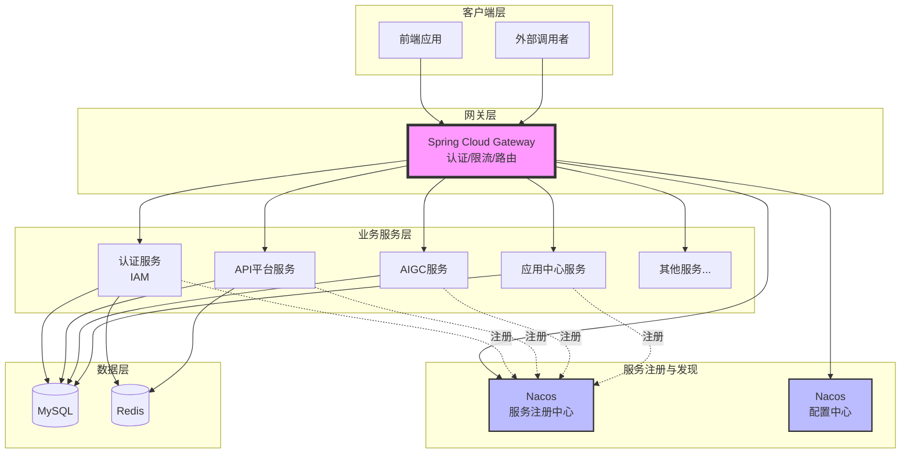

### 2.3 技术选型优势

✅ **Spring Cloud Gateway 响应式网关**
- 基于WebFlux，支持高并发
- 非阻塞I/O，性能优于Zuul

✅ **Nacos 服务治理**
- 服务注册与发现
- 动态配置管理
- 支持命名空间隔离

✅ **MyBatis Plus**
- 自动化CRUD，减少样板代码
- 内置分页插件
- 支持逻辑删除

✅ **JWT 无状态认证**
- 水平扩展友好
- 减少服务端存储压力

---

## 3. 系统架构设计

### 3.1 微服务架构全景图

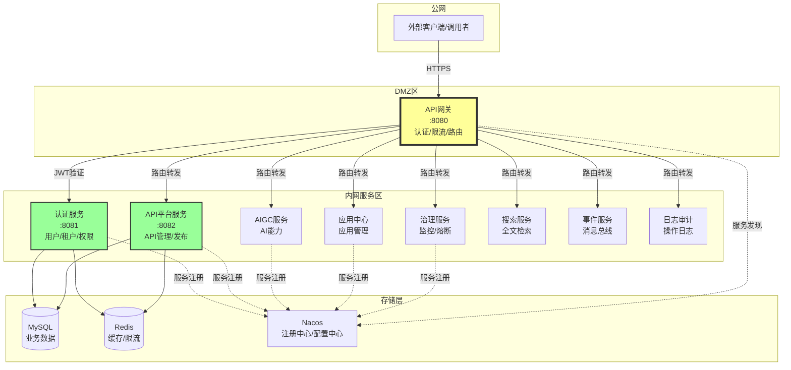

### 3.2 核心模块说明

#### 3.2.1 intelli-gateway-service（API网关）

**核心职责：**
- 统一流量入口
- JWT Token认证
- 限流控制（基于Redis滑动窗口算法）
- 路由转发
- 跨域处理
- 日志记录

**关键过滤器链：**
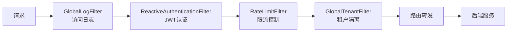

**路由配置示例：**
```yaml
spring:
  cloud:
    gateway:
      routes:
        - id: auth-service
          uri: lb://intelli-auth-iam-service
          predicates:
            - Path=/api/auth/**,/api/iam/**
          filters:
            - StripPrefix=1
```

#### 3.2.2 intelli-auth-iam-service（认证授权服务）

**核心功能：**
- 用户登录/注册
- JWT Token签发与验证
- 多租户管理（Tenant）
- 角色权限管理（RBAC）
- 验证码生成（图形/短信/邮箱）
- 密码加密（BCrypt）

**数据模型：**
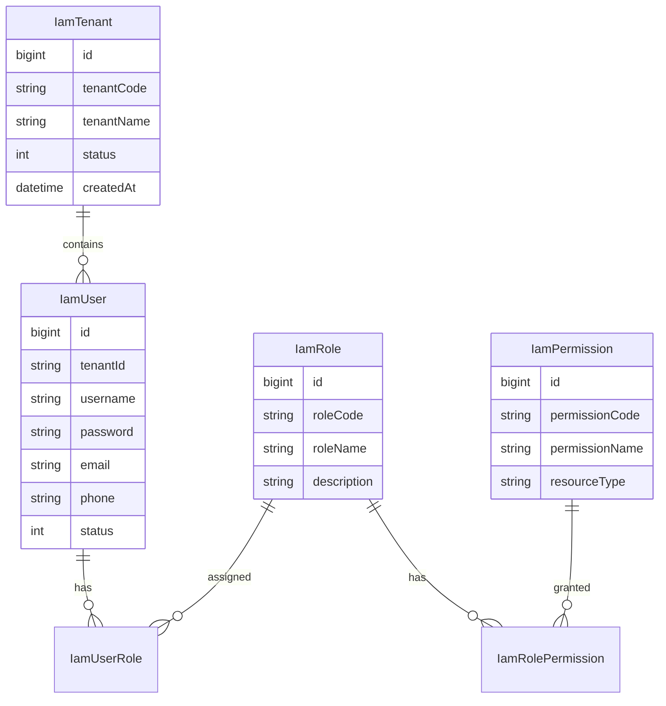

#### 3.2.3 intelli-api-platform-service（API管理平台）

**核心功能：**
- API注册与管理
- API分组管理
- API发布/下线/废弃
- API版本管理
- API调用统计

**API状态流转：**
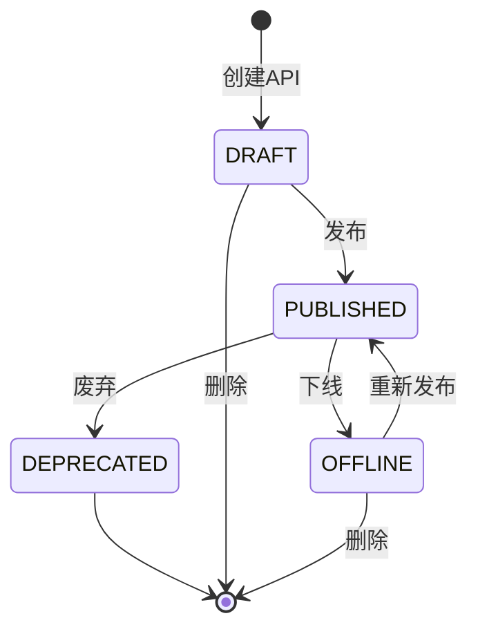

#### 3.2.4 intelli-common（公共组件）

**提供的能力：**
- 统一响应封装（`ApiResponse`）
- 统一异常处理（`BusinessException`）
- 分页工具（`PageData`、`PageWrap`）
- 常量定义（`ResponseStatus`、`RedisKeyConstants`）
- 上下文管理（`TenantContext`）
- 拦截器（`TenantInterceptor`）

---

## 4. 核心业务流程

### 4.1 用户认证流程

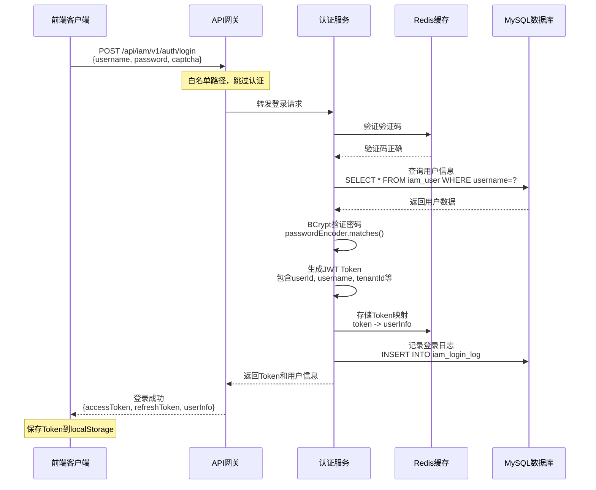

**关键代码逻辑：**

1. **验证码校验**
```java
// AuthService.java
String cachedCaptcha = redisTemplate.opsForValue().get("captcha:" + captchaKey);
if (!captcha.equalsIgnoreCase(cachedCaptcha)) {
    throw new BusinessException(ResponseStatus.CAPTCHA_INCORRECT);
}
```

2. **密码验证**
```java
// BCrypt加密验证
if (!passwordEncoder.matches(request.getPassword(), user.getPassword())) {
    throw new BusinessException(ResponseStatus.ACCOUNT_INCORRECT);
}
```

3. **JWT生成**
```java
// JwtUtil.java
String token = Jwts.builder()
    .setSubject(userId)
    .claim("username", username)
    .claim("tenantId", tenantId)
    .setIssuedAt(new Date())
    .setExpiration(new Date(System.currentTimeMillis() + expiration * 1000))
    .signWith(key, SignatureAlgorithm.HS512)
    .compact();
```

### 4.2 API网关认证流程

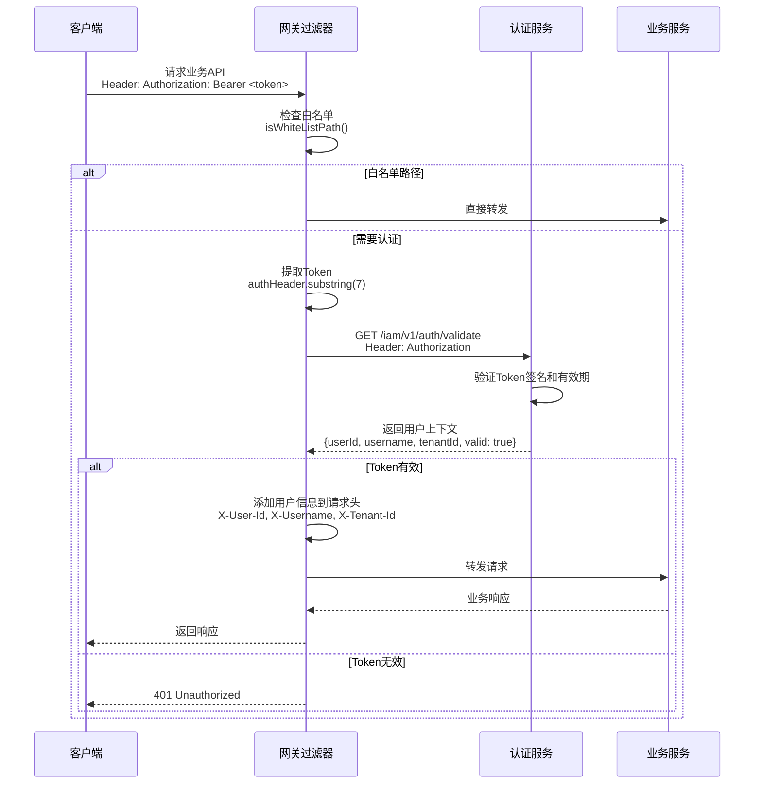

**ReactiveAuthenticationFilter 核心逻辑：**

```java
public Mono<Void> filter(ServerWebExchange exchange, GatewayFilterChain chain) {
    String path = request.getPath().value();
    
    // 1. 白名单检查
    if (isWhiteListPath(path)) {
        return chain.filter(exchange);
    }
    
    // 2. 提取Token
    String authHeader = request.getHeaders().getFirst("Authorization");
    if (authHeader == null || !authHeader.startsWith("Bearer ")) {
        return handleUnauthorized(response, "缺少Authorization头");
    }
    
    // 3. 调用认证服务验证（响应式）
    return validateTokenReactive(authHeader)
        .flatMap(apiResult -> {
            UserContext userContext = apiResult.getData();
            
            // 4. 将用户信息添加到请求头
            ServerHttpRequest modifiedRequest = request.mutate()
                .header("X-User-Id", userContext.getUserId())
                .header("X-Username", userContext.getUsername())
                .header("X-Tenant-Id", userContext.getTenantId())
                .build();
            
            // 5. 继续过滤器链
            return chain.filter(exchange.mutate().request(modifiedRequest).build());
        });
}
```

### 4.3 限流控制流程

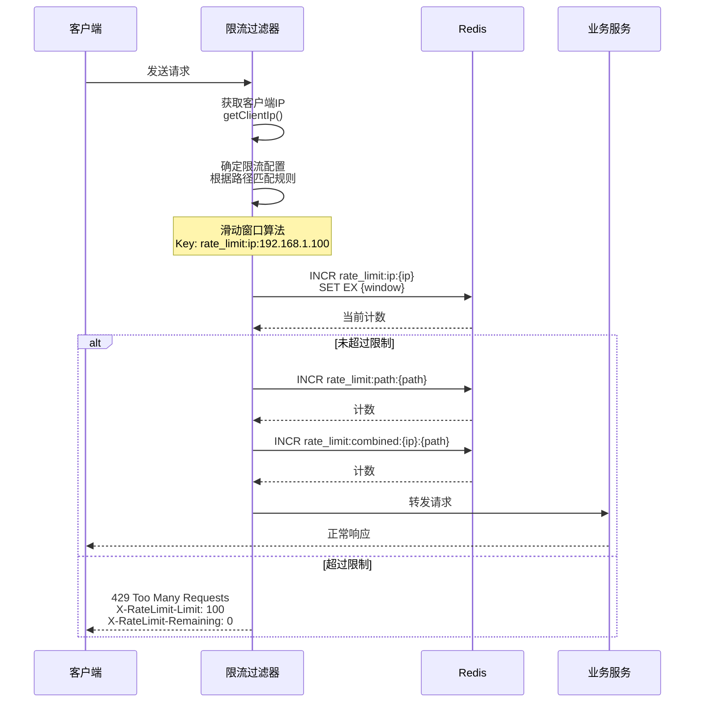

**限流配置：**
```yaml
intellihub:
  gateway:
    rate-limit:
      enabled: true
      algorithm: SLIDING_WINDOW
      default-limit:
        requests: 100  # 每分钟100次
        window: 60
      limits:
        "/api/auth/**":
          requests: 5    # 登录接口更严格
          window: 60
        "/api/search/**":
          requests: 200  # 搜索接口更宽松
          window: 60
```

### 4.4 API注册与调用流程

#### 4.4.1 开发者注册API

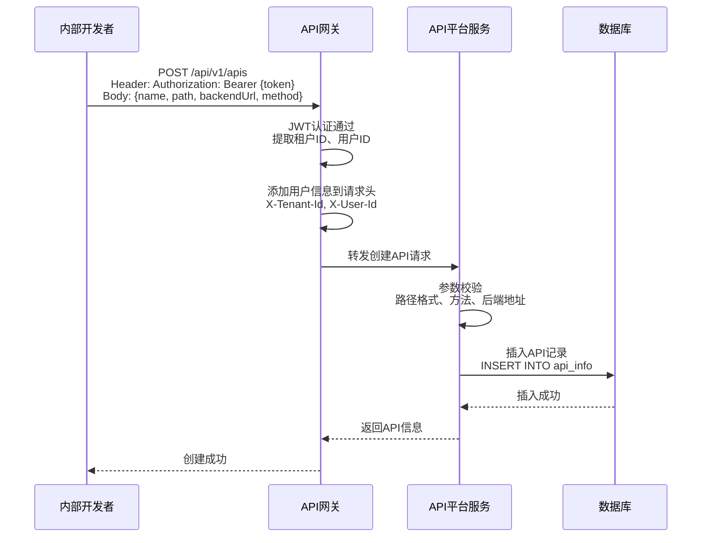

#### 4.4.2 外部调用者调用API（规划中）

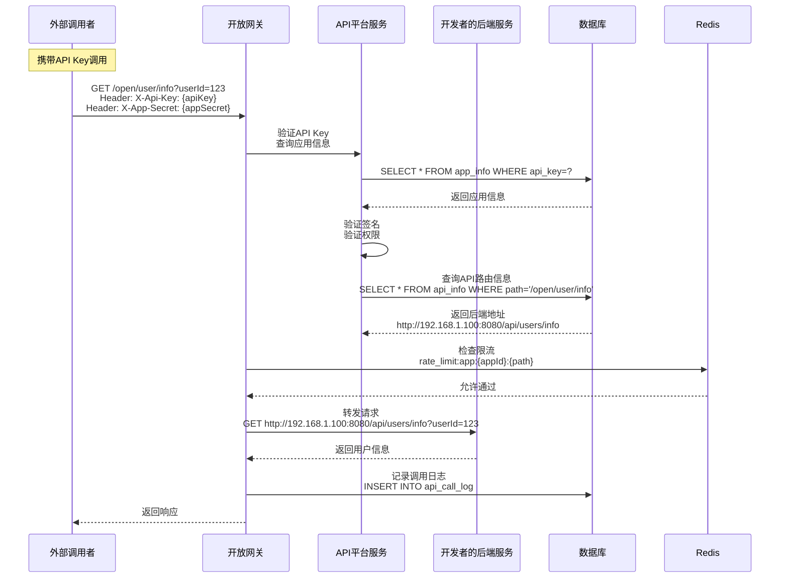

### 4.5 多租户隔离流程

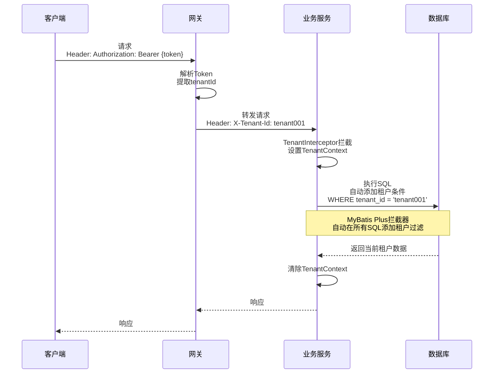

---

## 5. 存在的问题与风险

### 5.1 架构层面

#### ❌ 问题1：服务划分不够清晰

**现象：**
- `intelli-api-platform-service` 与 `intelli-auth-iam-service` 共用同一个数据库（`intellihub_iam`）
- 违反微服务独立数据库原则

**风险：**
- 服务间耦合严重
- 无法独立扩展
- 数据一致性难以保证

**建议：**
```
修改前：
intelli-auth-iam-service    ─┐
                             ├──> intellihub_iam 数据库
intelli-api-platform-service ─┘

修改后：
intelli-auth-iam-service ────> intellihub_iam 数据库
intelli-api-platform-service ─> intellihub_api 数据库
```

#### ❌ 问题2：缺少服务间通信机制

**现象：**
- 网关调用认证服务使用 WebClient（HTTP）
- 缺少服务降级和熔断机制

**风险：**
- 认证服务故障会导致整个系统不可用
- 缺少容错能力

**建议：**
- 引入 **Sentinel** 进行熔断降级
- 使用 **OpenFeign** 替代 WebClient，支持声明式调用
- 实现降级策略（认证服务异常时的应急处理）

#### ❌ 问题3：分布式事务缺失

**场景：**
- 用户注册需要同时：
  1. 在 `iam_user` 表插入用户
  2. 在 `iam_user_role` 表分配默认角色
  3. 发送欢迎邮件

**风险：**
- 数据不一致（用户创建成功但角色分配失败）
- 缺少补偿机制

**建议：**
- 引入 **Seata** 分布式事务框架
- 或采用 **Saga** 模式实现最终一致性

### 5.2 安全层面

#### ⚠️ 问题4：JWT密钥硬编码

**现象：**
```yaml
# application.yml
intellihub:
  auth:
    jwt:
      secret: intellihub-iam-jwt-secret-key-2024-this-is-a-very-long-secret-key...
```

**风险：**
- 密钥泄露风险
- 无法动态轮换密钥

**建议：**
- 将密钥存储到 **Nacos配置中心** 或 **Vault**
- 定期轮换密钥
- 支持多密钥验证（平滑过渡）

#### ⚠️ 问题5：缺少API密钥管理

**现象：**
- 当前只有JWT认证（用于管理后台）
- 缺少开放API的API Key认证机制

**风险：**
- 外部调用者无法安全调用API

**建议：**
- 实现 **API Key + App Secret** 认证
- 实现签名验证机制（防止重放攻击）
- 参考阿里云API网关的认证模式

#### ⚠️ 问题6：缺少XSS和CSRF防护

**现象：**
- 未配置Spring Security的CSRF保护
- 响应头缺少安全配置

**建议：**
```java
// SecurityConfig.java
http
    .headers()
        .contentSecurityPolicy("default-src 'self'")
        .and()
        .xssProtection()
        .and()
    .csrf()
        .csrfTokenRepository(CookieCsrfTokenRepository.withHttpOnlyFalse());
```

### 5.3 性能层面

#### ⚠️ 问题7：缓存策略不完善

**现象：**
- 用户信息每次都查询数据库
- API路由信息未缓存

**影响：**
- 数据库压力大
- 响应时间长

**建议：**
```java
// 使用Redis缓存用户信息
@Cacheable(value = "user", key = "#userId")
public IamUser getUserById(String userId) {
    return userMapper.selectById(userId);
}

// 缓存API路由
@Cacheable(value = "api_route", key = "#path")
public ApiInfo getApiByPath(String path) {
    return apiMapper.selectByPath(path);
}
```

#### ⚠️ 问题8：数据库索引缺失

**风险字段：**
- `iam_user.username`（登录查询）
- `iam_user.email`（邮箱登录）
- `api_info.path`（路由查询）
- `iam_login_log.user_id`（日志查询）

**建议：**
```sql
CREATE INDEX idx_username ON iam_user(username);
CREATE INDEX idx_email ON iam_user(email);
CREATE INDEX idx_path ON api_info(path);
CREATE INDEX idx_user_id ON iam_login_log(user_id);
```

#### ⚠️ 问题9：限流算法可能存在性能瓶颈

**现象：**
- 每个请求需要3次Redis操作（IP、Path、Combined）
- 高并发下Redis压力大

**建议：**
- 使用 **Lua脚本** 原子化执行
- 使用 **Redis管道** 批量操作
- 考虑使用 **本地限流 + 分布式限流** 组合

### 5.4 运维层面

#### ❌ 问题10：缺少监控和链路追踪

**缺失能力：**
- 无分布式链路追踪（如Sleuth + Zipkin）
- 无服务监控（如Prometheus + Grafana）
- 无日志聚合（如ELK）

**影响：**
- 问题排查困难
- 无法定位性能瓶颈

**建议：**
```xml
<!-- 引入Sleuth + Zipkin -->
<dependency>
    <groupId>org.springframework.cloud</groupId>
    <artifactId>spring-cloud-starter-sleuth</artifactId>
</dependency>
<dependency>
    <groupId>org.springframework.cloud</groupId>
    <artifactId>spring-cloud-sleuth-zipkin</artifactId>
</dependency>
```

#### ⚠️ 问题11：日志管理混乱

**现象：**
- 部分服务日志输出到控制台
- 缺少统一日志格式
- 缺少日志级别控制

**建议：**
```yaml
# application.yml
logging:
  level:
    root: INFO
    com.intellihub: DEBUG
  pattern:
    console: "%d{yyyy-MM-dd HH:mm:ss} [%thread] %-5level %logger{36} - %msg%n"
  file:
    name: logs/${spring.application.name}.log
    max-size: 100MB
    max-history: 30
```

#### ❌ 问题12：缺少健康检查

**现象：**
- 部分服务未配置 `/actuator/health`
- 无法实现自动重启

**建议：**
```yaml
management:
  endpoints:
    web:
      exposure:
        include: health,info,metrics
  endpoint:
    health:
      show-details: always
  health:
    redis:
      enabled: true
    db:
      enabled: true
```

### 5.5 代码质量层面

#### ⚠️ 问题13：异常处理不统一

**现象：**
```java
// 部分地方抛出RuntimeException
throw new RuntimeException("用户不存在");

// 部分地方抛出BusinessException
throw new BusinessException(ResponseStatus.USER_NOT_FOUND);
```

**建议：**
- 统一使用 `BusinessException`
- 完善 `GlobalExceptionHandler`

#### ⚠️ 问题14：参数校验不完整

**现象：**
- 部分Controller缺少 `@Valid` 注解
- DTO缺少校验注解（`@NotNull`、`@Size`等）

**建议：**
```java
// DTO定义
public class CreateApiRequest {
    @NotBlank(message = "API名称不能为空")
    @Size(max = 100, message = "API名称长度不能超过100")
    private String name;
    
    @NotBlank(message = "API路径不能为空")
    @Pattern(regexp = "^/.*", message = "路径必须以/开头")
    private String path;
}

// Controller
@PostMapping
public ApiResponse<ApiInfoResponse> createApi(@Valid @RequestBody CreateApiRequest request) {
    // ...
}
```

#### ⚠️ 问题15：部分服务实现缺失

**现象：**
```java
// PermissionService.java
public interface PermissionService {
    // 接口定义为空文件
}
```

**风险：**
- 权限控制功能未实现
- 无法进行细粒度权限管理

---

## 6. 优化建议

### 6.1 短期优化（1-2周）

#### 1️⃣ 完善核心功能
- [ ] 实现 `PermissionService` 权限服务
- [ ] 补充API平台服务的核心业务逻辑
- [ ] 完善参数校验和异常处理

#### 2️⃣ 加强安全性
- [ ] 将JWT密钥迁移到Nacos配置中心
- [ ] 实现API Key认证机制
- [ ] 添加请求签名验证

#### 3️⃣ 性能优化
- [ ] 添加数据库索引
- [ ] 引入Redis缓存用户信息
- [ ] 优化限流逻辑（使用Lua脚本）

### 6.2 中期优化（1个月）

#### 1️⃣ 架构改进
- [ ] 数据库拆分（API平台独立数据库）
- [ ] 引入 Sentinel 实现熔断降级
- [ ] 使用 OpenFeign 替代 WebClient

#### 2️⃣ 可观测性
- [ ] 集成 Sleuth + Zipkin 链路追踪
- [ ] 配置 Prometheus + Grafana 监控
- [ ] 统一日志格式和输出

#### 3️⃣ 开放API网关
- [ ] 实现 OpenApiAuthenticationFilter
- [ ] 开发应用管理模块（AppId/AppSecret）
- [ ] 实现API调用计费统计

### 6.3 长期规划（3个月）

#### 1️⃣ 平台能力增强
- [ ] API市场（API发现、订阅）
- [ ] API测试工具（在线调试）
- [ ] API文档自动生成（Swagger集成）

#### 2️⃣ 高可用架构
- [ ] 引入 Seata 分布式事务
- [ ] 实现服务多活部署
- [ ] 数据库读写分离

#### 3️⃣ 智能化能力
- [ ] 基于AIGC的API推荐
- [ ] 智能API测试用例生成
- [ ] 异常流量检测与告警

---

## 7. 技术债务清单

| 优先级 | 问题描述 | 影响范围 | 预估工时 |
|-------|---------|---------|---------|
| 🔴 P0 | 数据库共用导致服务耦合 | 架构 | 3天 |
| 🔴 P0 | 缺少服务熔断降级 | 稳定性 | 2天 |
| 🔴 P0 | JWT密钥硬编码 | 安全 | 1天 |
| 🟠 P1 | 缺少API Key认证 | 功能 | 5天 |
| 🟠 P1 | 缺少分布式链路追踪 | 运维 | 2天 |
| 🟠 P1 | 缺少缓存策略 | 性能 | 3天 |
| 🟡 P2 | 异常处理不统一 | 代码质量 | 2天 |
| 🟡 P2 | 数据库索引缺失 | 性能 | 1天 |
| 🟢 P3 | 日志管理混乱 | 运维 | 1天 |

---

## 8. 总结

### 8.1 项目亮点

✅ **架构设计合理**
- 采用微服务架构，服务职责清晰
- 使用Spring Cloud全家桶，技术栈成熟稳定

✅ **安全机制完善**
- JWT认证 + BCrypt密码加密
- 多租户隔离
- 限流控制

✅ **扩展性好**
- 基于Nacos的服务注册发现
- 网关统一流量入口
- 支持水平扩展

### 8.2 关键风险

⚠️ **服务间耦合严重**
- 共用数据库
- 缺少熔断降级

⚠️ **可观测性不足**
- 无链路追踪
- 监控缺失

⚠️ **安全性待加强**
- 密钥管理不当
- 缺少API Key认证

### 8.3 下一步行动

1. **立即行动**：修复P0级别问题（数据库拆分、熔断降级、密钥管理）
2. **近期计划**：完善核心功能（API Key认证、链路追踪、缓存）
3. **长期规划**：增强平台能力（API市场、智能推荐）

---

**文档生成时间**：2024年12月22日  
**分析对象**：IntelliHub v1.0.0-SNAPSHOT  
**分析人员**：Qoder AI
